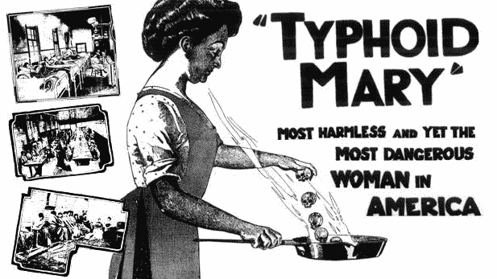
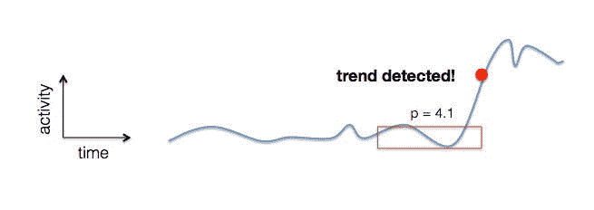

# 网络分析始于一个患病的爱尔兰厨师

> 原文：<https://towardsdatascience.com/network-analytics-started-with-a-diseased-irish-cook-c40424aaa06e?source=collection_archive---------13----------------------->

这是为那些可能在数据科学环境中使用网络的人解释网络原理的系列文章的第三篇。第一篇文章，主要讲图论的起源和图的基本性质，这里可以找到**。**

*1906 年夏天，沃伦一家——一个富裕的纽约大家庭——正在长岛牡蛎湾的度假屋吃晚饭。最令人期待的部分是甜点。在一个炎热的夏天的晚上，桃子超古代龙美尔巴配冰淇淋是一种非常美味、凉爽和提神的食物，孩子们特别喜欢。*

*几天后，其中一个孩子开始生病，出现伤寒的症状。几天后，包括女佣和一名园丁在内的另外五个人开始出现这种疾病的症状。这令人困惑，因为伤寒被认为主要在肮脏和不卫生的环境中传播，通常与穷人有关。伤寒并没有在牡蛎湾爆发。*

*把度假屋租给沃伦斯的房东非常担心。这个特别有声望的租赁物业的运营成本很高，他不能因为传染病而让它闲置。他打电话给地方当局，他们检查了所有常见的嫌疑人，包括人和机器。厕所和自来水都接受了检查，在镇上购买食物的当地人也接受了检查。所有检测结果都不能确定是爆发源。*

*因此，汤普森去纽约市寻找他的伤寒猎人。他在乔治·索普医生身上找到了他——不是医学博士，而是卫生工程师。Soper 对 Warren 家庭的背景情况进行了彻底的研究，他意识到家庭环境最近发生了一个重大变化，这可能会导致新细菌的传播。八月初，他们雇佣了一名新厨师。当他采访沃伦斯，发现厨师的拿手好菜是一道凉菜，桃子超古代龙美尔巴，他变得更加怀疑，因为他知道凉菜更有可能携带活细菌。*

*厨师是一个名叫玛丽·梅伦的爱尔兰移民，却不见踪影——她在家人开始生病后不久就逃走了。Soper 对 Mallon 的历史进行了几个月的调查，发现了她以前做过厨师的七个家庭，每个家庭都导致了伤寒的爆发，总共感染了 22 人。如果马伦确实是伤寒的健康携带者，就需要尽快找到她。*

*在接下来的几年里，玛丽·梅伦——或伤寒玛丽——在媒体和公共卫生运动中广为人知——终于在 1907 年 3 月被索普找到，并被确认为伤寒杆菌的原始健康携带者。在接下来的 30 年里，她大部分时间都处于某种隔离状态，有一段时间，她逃跑了，回去给家人做饭，然后再次被捕，并被隔离。她死于 1938 年，不是死于伤寒而是肺炎。她一生中从未表现出伤寒的任何症状，但尸检显示她胆囊中有大量的杆菌。*

**

# *通过网络传输*

*索普的工作标志着对疾病传播的首次理解。在过去的 50 年中，许多成功的疾病爆发鉴定都集中在对地点和场所的研究上，包括 19 世纪 50 年代在伦敦发现的著名的[大街霍乱爆发](https://en.wikipedia.org/wiki/1854_Broad_Street_cholera_outbreak)。*

*但这是第一次通过人而不是地方成功追踪到疾病。这是理解事物如何通过人际网络流动的开始。在一定程度上，信息以类似于疾病的方式通过人们的网络流动，因此我们使用“病毒式”一词来描述今天快速而广泛的信息传播。这项早期的工作旨在了解疾病在网络中的传播，它代表了我们今天看待信息传播的方式的起源，无论是趋势、谣言还是广告。*

*以最简单的形式考虑信息流，一条信息是否从一个人流向另一个人的问题取决于两个因素:那个人连接的人数，姑且称之为 *k* ，以及信息被传递的概率，姑且称之为 *p* 。在玛丽·梅伦的例子中，当局意识到 p 很难被影响——你将很难改变一个没有受过教育的厨师一生的卫生习惯。所以通过隔离 Mallon 来降低 k 是控制疾病传播的唯一真正的选择。*

*在社交网络中，了解如何操纵 p(T1)和 T2(T3)对于管理营销、广告、新闻或假新闻的传播至关重要。 *p* 可以通过确保话题与个人的已知兴趣有很强的共同性，或者通过与个人明确约定信息将被传递来增加。通过网络中高价个体的工作，k 可以增加(见本系列[上一篇](/graph-theory-helped-the-british-become-less-stinky-de4b439a7784)关于价的更多信息)。*

**

# *谣言和信息传播*

*实际上，我们上面的 *p* 和 *k* 代表了一个趋势和谣言如何在网络中传播的简单模型。一方面，信息是否在两个人之间进行交易既取决于*传递信息的倾向*也取决于*接收信息的兴趣。它还假设我们正在处理的网络图是树，只向下传递信息，在复杂的社会网络中通常不是这样。**

**在社交网络中，可能会发生多种类型的互动。如果 *A* 是收到信息的人的集合， *B* 是没有收到信息的人的集合，有几种情况是可能的。 *A* 可以传给 *A* ， *A* 可以传给 *B.* 在这两种情况下，接受者都可以选择接受或者拒绝——即使他们之前已经选择了，他们也可以改变主意。**

**当比较趋势和谣言的传播与疾病的传播时，另一个很大的区别是，我们更感兴趣的是信息去了哪里，而不是它来自哪里。关于谣言如何在社交网络上传播的研究得出了一些非常有趣的观察结果。**

**像脸书和推特这样的大型网络可能会展示出无标度网络的一些特性。价数或联系数小的人多，联系数大的人少。如果你根据联系的数量来绘制人的图表，你会得到类似上图的东西，有一条渐近真实曲线或一条线性对数曲线。最近的研究[这里](https://arxiv.org/pdf/1801.03400.pdf)表明，虽然我们不能精确地将社交网络与无标度的正式数学定义相匹配，但没有其他数学模型比无标度模型更适合它们。**

**无标度网络存在于许多领域，包括生物化学、技术和金融。在无标度网络中，信息传播与网络的规模直接相关。Twitter 和脸书是规模庞大的网络，但也有数学属性，使它们正好处于信息传播极快的范围内。例如，在 Twitter 上，一条信息只需 8 个信息交换步骤就可以覆盖近 5000 万用户。这些网络的力量是可怕的！**

****

# **预测趋势**

**当你查看你的社交媒体订阅源时，你经常会被告知什么是“趋势”。社交媒体引擎利用对信息传播的研究来设计算法，以自动确定某个主题在网络中的传播速度何时超过其他主题。**

**简单的趋势模型遵循某个统计窗口内的“主题”或“标签”。如上图所示，该窗口显示了网络上大多数主题的预期传输活动。对这些主题的实时跟踪可以揭示出那些活动曲线意外跳出该统计窗口的主题，如果跳跃幅度很大，则被视为“趋势”。例如，上面的红点可以代表网络决定将主题分类为趋势的时间点和活动。**

**然而，这种根据期望窗口跟踪单个趋势的方法会导致错误，并且高度依赖于人类的判断，这在非常大的网络中是不可行的。趋势可能会以不可预测的方式出现，或者在被归类为趋势后很快就会“逆转”，这对于预测者来说可能会很尴尬。**

**2012 年，[麻省理工学院](http://news.mit.edu/2012/predicting-twitter-trending-topics-1101)的一项研究发现了一种全自动预测 Twitter 趋势的方法，比 Twitter 自己预测趋势早两个小时，准确率高达 95%。研究人员使用了一个以前有趋势和没有趋势的主题的数据库，并将任何当前主题的推文活动与该数据库进行了比较，计算了活动曲线之间的距离。那些其距离最接近趋势的先前主题的曲线的曲线本身被预测为趋势。这项研究引出了当今社交网络预测趋势最常用的方法。**

***在本系列的下一篇文章中，我将着眼于以促进高效网络分析的方式捕获数据的数据系统，以及这是如何实现许多令人着迷的发现的。这里读一下***。****

**最初我是一名纯粹的数学家，后来我成为了一名心理计量学家和数据科学家。我热衷于将所有这些学科的严谨性应用到复杂的人的问题上。我也是一个编码极客和日本 RPG 的超级粉丝。在 [*LinkedIn*](https://www.linkedin.com/in/keith-mcnulty/) *或*[*Twitter*](https://twitter.com/dr_keithmcnulty)*上找我。***