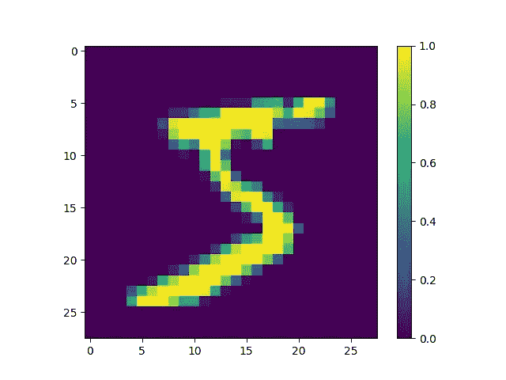
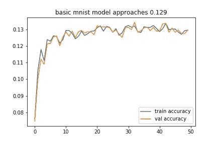

# 软件工程师的神经网络 2:小批量训练和验证

> 原文：<https://towardsdatascience.com/neural-network-for-software-engineers-2-mini-batch-training-and-validation-46ee0a1269a0?source=collection_archive---------13----------------------->

在我们之前的帖子[软件工程师的神经网络 1](https://medium.com/@leetandata/neural-network-introduction-for-software-engineers-1611d382c6aa) 中，我们了解并实现了一些关于使用多层感知器的基本特性，并在 Python/Numpy 中实现了这些特性。

现在让我们看看如何将它应用到一个简单的现实世界问题中。让我们来看一下手写数字图像的分类。

首先，让我们浏览一下重要的，让我们导入数据，这些数据已经分成一个训练集和一个测试数据集，前者可以用来优化我们的网络，后者可以用来验证我们的性能。

接下来，我们将使用与上一篇博文几乎相同的代码，但这次我们将在训练集上进行训练，在测试集上进行验证，并绘制两条性能曲线。

另请注意，这次我们将执行小批量更新，而不是完整培训批量更新。这样，我们可以通过只查看数据集的一小部分来更快地执行更新。随机与小批量与全批量梯度下降是另一个主题，如果需要，我可以写另一篇博文来描述。

请注意，训练和验证的准确性仍然很糟糕，没有接近 100%。在这个系统真正工作之前，我们仍然有一些关键的改进要实现，但我们至少演示了如何将一个普通的神经网络应用到现实世界的问题中，以及通过 NumPy 矩阵数学理解的所有部分。

在这篇文章之后，我们将:

*   思考我们的数据的意义，并构建我们的模型以一种深思熟虑的方式来表示它。(链接到卷积后)
*   以一种有意义的方式思考我们的损失函数，建立我们的损失函数，给我们一个有意义的梯度。(房价亏损帖链接)
*   像上面那样思考我们想要什么，但是使用 Tensorflow 这样的神经网络 API 来实现。哇，太简单了！(链接 Tensorflow 房价贴)