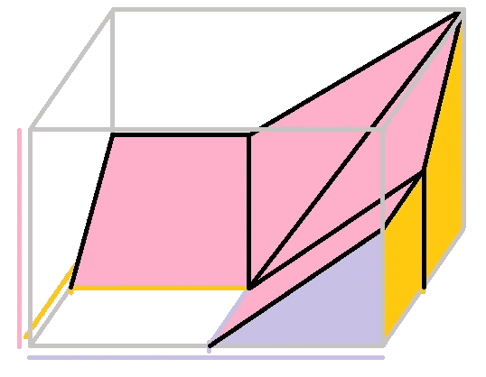

# 神经网络:ReLU 的替代方案

> 原文：<https://towardsdatascience.com/neural-networks-an-alternative-to-relu-2e75ddaef95c?source=collection_archive---------11----------------------->

ReLU activation, two neurons

上面是两个神经元(*紫色*和*橙色*)的激活(*粉色*)图，使用了一个常用的激活函数:整流线性单元，或 ReLU。当每个神经元的总输入增加时，ReLU 也会增加其激活——前提是输入超过某个阈值。这导致峰值出现在输入空间的*一角*，如上图右上角所示。添加更多的 ReLU 神经元将增加立方体的维度，然而*模式*仍然存在:神经元的激活总是在一个远处的角落达到峰值，沿着相邻的边有倾斜的侧翼。因为峰值只能出现在一个*单个拐角*，所以这些神经网络的表达能力是有限的。我提供一个替代方案: ***反射线性单元*** 。(RefLU？)

**反射线性单元**

*整流*线性单元仍有几个优点。它们易于计算，非常适合专门的硬件架构，如谷歌的 TPU。它们是非线性的，形成了清晰的行为边界，这是单一直线所不能做到的。而且，它们创造了一个持久的梯度(至少在它们的右侧)，这将它们与激活功能区分开来，激活功能*逐渐变细*——例如，s 形函数和逻辑函数。随着这些激活逐渐减少，它们的斜率几乎是水平的，因此梯度下降几乎不会试图修改神经元，学习进展缓慢。ReLUs 的右半部分具有恒定的正斜率，因此它在所有这些点接收到来自梯度下降的相同强度的信号*。*

Rectified Linear Units, with various synapse weights causing different tilts

然而，经过整流的线性单元*可能会遭受“死亡神经元”的困扰:当它们接收到强烈的负信号时，它们的倾斜度会下降到零，之后没有任何东西能够刺激神经元。没有新的梯度信号通过它们，因为它们是平的，所以神经元的损失永远不会被纠正。经常被引用的斯坦福课程笔记解释说“你的网络中有多达 40%可能是‘死的’。”*

Reflected Linear Units, with various peak positions and tilts

*反射的*线性单位分享了 ReLUs 的好处:它们易于计算，是非线性的，并且不会逐渐变细。此外，他们不受“死亡”的影响。无论任何一半的斜率是正还是负，RefLU 仍然起作用。只有双方奇迹般地更新到*恰好*零斜率，那一个神经元才会死亡。RefLUs 提供了其他好处，我可以在一些细节之后解释这些好处…

**倾斜线条**

RefLU 由在中间某处相交的两条线段组成。你可能会把这些线条想象成一束激光，从一面看不见的镜子上反射回来。天真的是，他们都在倾斜，在他们的接触点形成一个高峰。此 RefLU 的变量比 ReLU 多；虽然 ReLU 仅指定其右半部分的*斜率*，但 RefLU 必须指定左右半部分的*斜率，以及它们相交的*高度*和*距离*。*

这四个变量都接收梯度下降信号，以小步长更新，试图匹配数据要求的激活的*曲线。虽然陡峭的拱形可能不完全符合数据所需的形状，但是 RefLU 激活的总和可以在输入空间内的任何位置形成组合峰值。那是远远优于 ReLUs 的，ReLUs 只能在单个*角*形成一个峰值。而且，虽然大多数表面可以由分散在各处的峰的集合来近似，允许多个 RefLUs 构建他们需要的景观，但是 ReLUs 的角峰只能创建更陡的角。反射线性单位可以采用数据所需的形状。*

**稀疏激活**

通过将反射的线性单元初始化为倾斜的峰值，网络在学习阶段的行为被修改。除了 RefLU 之外，只有 sinc 和高斯分布包括其激活函数的右下侧。在操作过程中，这意味着变得*过于兴奋的神经元*实际上会关闭！这导致了一种完全不同的激活模式:当许多神经元在一个簇中放电时，它们会在下一层的一些神经元中重叠太多，导致这些神经元中的一些变得安静，而不是所有的都变成不和谐的一致。

通过让一些兴奋簇中的神经元安静下来，网络的活动朝着稀疏的方向调整。没有癫痫发作的“是”。每个图像或声音都是用最少的活跃神经元进行分类的，只对最相关的信息进行编码。这在网络中留下了更多的“空间”来学习多种任务和丰富的分类，稀疏性将相似分类的输入推得更近。通过这种方式，用 RefLU 激活功能构建的网络将表现得更像人脑，具有自己稀疏而有意义的活动。

**否定之肯定**

此外，RefLU 不是一个简化的 sinc 函数，sinc 和高斯函数在其两侧降至零，而 RefLU 实际上降至负值区域。这使得 RefLU 成为*显著不同的*激活功能。通常，对于一个神经元来说，要从积极的兴奋性信号转换为消极的抑制性信号，其*突触权重*必须从积极的变为消极的。在中间，神经元的权重为零，“杀死”它。并且，当权重*接近*零时，整个激活功能被压扁。

相反，RefLUs 可以为某些输入电平*产生强负输出，而为其他电平*产生强正输出。功能没有被压扁。它可以起到双重作用，同时兴奋和抑制更多的神经元*，分享 arctan 激活功能的这种强度。虽然 arctan 仅在输入电平为*低时产生负信号，但* RefLUs 是*唯一能够为*高和低输入变为负的*。**

*RefLUs 不需要*在两端*变为负；梯度下降可以从向下的斜坡向向上的斜坡平滑地倾斜任一侧，在这种情况下，神经元作为现有激活函数的近似来操作。*

*我希望这一分析能够激发研究人员将 RefLU 与它的哥哥 ReLU 进行比较，看看这些潜在的好处在哪里提高了性能。特别是，网络可能受益最大，它必须学习和联系许多任务，解释神经元活动，并避免死亡的神经元。在这些概念的基础上，可能还有其他更高级的激活功能；重要的一点是，我们还没有挖掘出神经网络新花样的源泉。我们应该继续假设和实验，因为智力是我们面临的最大问题。我希望有些人会受到启发继续寻找！*