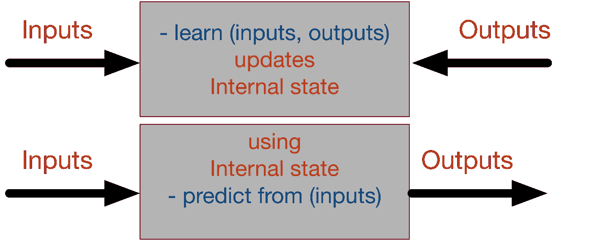
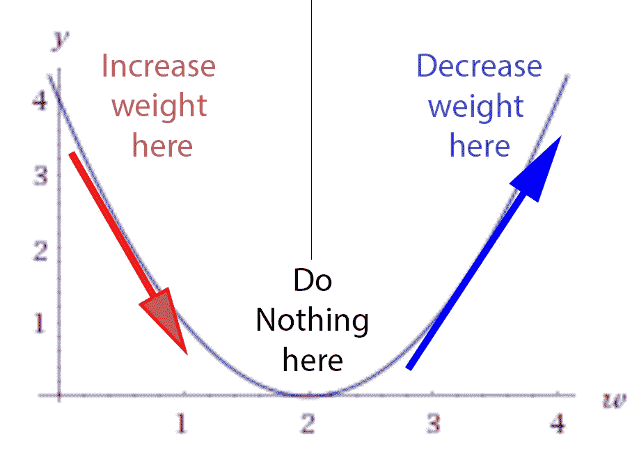
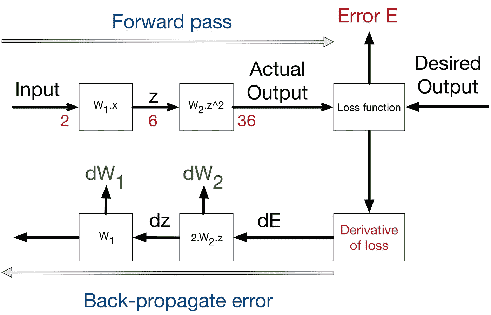
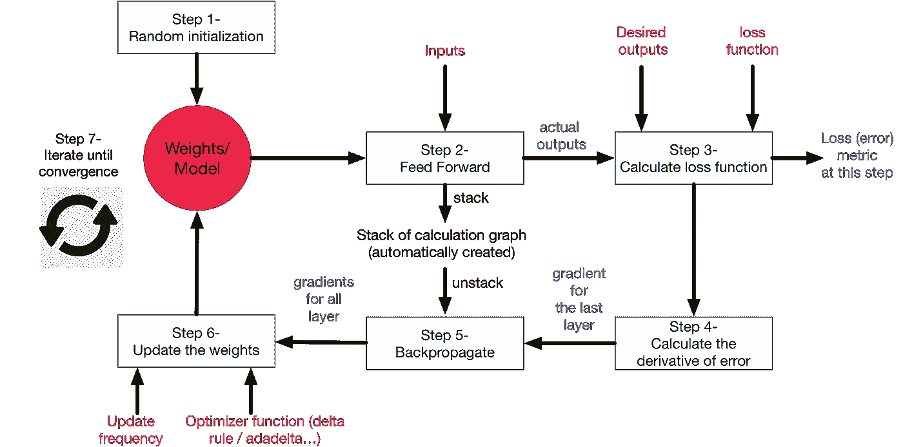

# 神经网络和反向传播以简单的方式解释

> 原文：<https://towardsdatascience.com/neural-networks-and-back-propagation-explained-in-a-simple-way-c6ee791499fa?source=collection_archive---------9----------------------->


任何复杂的系统都可以用一种简单的方式抽象出来，或者至少可以分解成基本的抽象组件。复杂是由几个简单的层次累积而成的。这篇文章的目的，是解释神经网络如何以最简单的抽象方式工作。我们将尝试将 NN 中的机器学习机制简化为其基本的抽象组件。与其他解释神经网络的帖子不同，我们将尝试使用尽可能少的数学方程和编程代码，并只关注抽象的概念。

在最高和最简单的抽象表示中，监督神经网络可以表示为具有如下两种学习和预测方法的黑盒:



Neural network as a black box

学习过程接受输入和期望输出，并相应地更新其内部状态，以便计算出的输出尽可能接近期望输出。预测过程接受输入，并根据其过去的“*训练经验*”使用内部状态生成最可能的输出。这就是为什么机器学习有时被称为**模型拟合**。

为了实现这一点，我们将把学习过程分解为几个组成部分:

# 一个简单的数字例子

从神经网络和监督学习开始的最简单的例子是简单地从一个输入和一个输出以及它们之间的线性关系开始。监督神经网络的目标是尝试在所有可能的线性函数中搜索最适合数据的函数。以下面的数据集为例:

```
+--------+-----------------+
| Input  |  Desired output |
+--------+-----------------+
|     0  |               0 |
|     1  |               2 |
|     2  |               4 |
|     3  |               6 |
|     4  |               8 |
+--------+-----------------+
```

对于这个例子来说，**输出= 2 x 输入**似乎非常明显，但是对于大多数真实数据集来说，情况并非如此(其中输入和输出之间的关系是高度非线性的)。

## 步骤 1-模型初始化

学习的第一步，是从某个地方开始:最初的假设。就像遗传算法和进化论一样，神经网络可以从任何地方开始。因此，模型的**随机初始化**是常见的做法。背后的理性是，无论我们从哪里开始，如果我们足够坚持，并通过一个迭代学习过程，我们可以达到伪理想模型。

为了打个比方，举一个一生中从未踢过足球的人为例。他第一次试着投篮时，他可以随意投篮。同样，对于我们的数值案例研究，让我们考虑下面的随机初始化:**(模型 1): y=3.x** 。这里的数字**T33**是随机生成的。另一种随机初始化可以是:**(模型 2): y=5.x** ，或者**(模型 3): y=0，5.x** 。
我们稍后将探索，通过学习过程，所有这些模型如何能够收敛到理想解 **(y=2.x)** (我们正在努力寻找)。

在本例中，我们将探索通用形式 *y=W.x* 的哪个模型最适合当前数据集。其中 **W** 被称为网络的*权重*，并且可以被随机初始化。这些类型的模型被简单地称为前馈线性层。

## 步骤 2-向前传播

在随机初始化模型之后，自然要做的一步是检查它的性能。
我们从现有的输入开始，通过网络层传递它们，并向前计算模型的实际输出。

```
+--------+------------------------------------+
| Input  |  Actual output of model 1 (y= 3.x) |
+--------+------------------------------------+
|     0  |                                  0 |
|     1  |                                  3 |
|     2  |                                  6 |
|     3  |                                  9 |
|     4  |                                 12 |
+--------+------------------------------------+
```

这一步被称为前向传播，因为计算流程从输入- >通过神经网络- >以自然的**前向**方向进行。

## 第 3 步-损失函数

在这个阶段，一方面，我们有随机初始化的神经网络的实际输出。
另一方面，我们有我们希望网络**学习**的期望输出。让我们把它们都放在同一个表中。

```
+--------+-----------------+-----------------+
| Input  |  Actual output  |  Desired output |
+--------+-----------------+-----------------+
|     0  |              0  |               0 |
|     1  |              3  |               2 |
|     2  |              6  |               4 |
|     3  |              9  |               6 |
|     4  |              12 |               8 |
+--------+-----------------+-----------------+
```

如果我们将此与我们的足球运动员第一次射门进行比较，实际输出将是球的最终位置，期望输出将是球进入球门。开始时，我们的玩家只是随意射击。假设球大部分时间都在球门的右侧。他可以从中学到的是，下次训练时，他需要更多地向左侧投篮。

为了能够概括任何问题，我们定义了我们所说的:**损失函数**。基本上，它是一个性能指标，衡量神经网络如何达到其目标，产生尽可能接近期望值的输出。

最直观的损失函数简单来说就是*损失=(期望输出—实际输出)*。然而，当网络下冲时，该损失函数返回正值(预测<期望输出)，当网络过冲时，该损失函数返回负值(预测>期望输出)。如果我们希望损失函数反映性能上的**绝对误差**，不管它是过冲还是欠冲，我们可以将其定义为:
*损失=绝对值(期望-实际)*。

如果我们回到足球运动员的例子，如果我们的新手把球射向球门右侧 10 米或左侧 10 米，我们认为，在这两种情况下，无论方向如何(右或左)，他都没有击中目标 10 米。
在这种情况下我们将向表中添加一个新列- > *绝对误差*。

然而，有几种情况会导致相同的总误差:例如，许多小误差或几个大误差会精确地累加到相同的总误差。因为我们希望预测在任何情况下都有效，所以最好是分布许多小误差，而不是几个大误差。
为了鼓励神经网络收敛到这种情况，我们可以将损失函数定义为绝对误差的**平方和**(这是神经网络中最著名的损失函数)。这样，小错误比大错误要少得多！(2 的平方是 4，但 10 的平方是 100！因此，10 的错误比 2 的错误多罚 25 倍——不仅仅是 5 倍！)

我们的表格如下:

```
+--------+----------+-----------+------------------+---------------+
| Input  |  actual  |  Desired  |  Absolute Error  |  Square Error |
+--------+----------+-----------+------------------+---------------+
| 0      |       0  |        0  |               0  |             0 |
| 1      |       3  |        2  |               1  |             1 |
| 2      |       6  |        4  |               2  |             4 |
| 3      |       9  |        6  |               3  |             9 |
| 4      |      12  |        8  |               4  |            16 |
| Total: |        - |         - |               10 |            30 |
+--------+----------+-----------+------------------+---------------+
```

请注意，如果我们只考虑第一个输入 0，我们可以说网络正确预测了结果！然而，在我们的足球运动员类比中，这只是初学者的运气，他也能设法从第一次射门就得分。我们关心的是最小化整个数据集的总误差(误差平方和的总和！).

> 总的来说，损失函数是一个误差度量，它给出了如果我们用由我们训练的神经网络模型生成的实际输出来代替真正的期望输出，我们损失多少精度的指标。所以才叫**亏**！

简单地说，机器学习的目标变成最小化损失函数(尽可能接近 0)。
我们现在可以将我们的机器学习问题转化为一个优化过程，目的是最小化这个损失函数。

## 第四步-差异化

显然，我们可以使用任何优化技术来修改神经网络的内部权重，以最小化我们之前定义的总损失函数。这些技术可以包括遗传算法或贪婪搜索或甚至简单的强力搜索:
在我们简单的数字示例中，仅使用一个权重参数来优化 **W** ，我们可以搜索从-1000.0 到+1000.0 的步长 0.001，其中 **W** 在数据集上具有最小的误差平方和。

如果模型只有很少的参数，并且我们不太关心精度，这可能行得通。然而，如果我们在一个 600x400 输入的数组上训练神经网络(像在图像处理中)，我们可以很容易地达到有数百万个权重的模型进行优化，暴力甚至是不可想象的，因为这纯粹是浪费计算资源！

幸运的是，数学中有一个强大的概念可以指导我们如何优化称为微分的权重。基本上它处理的是损失函数的导数。在数学中，函数在某一点的导数给出了该函数在该点改变其值的速率或速度。

为了看到导数的效果，我们可以问自己以下问题:如果我们用某个小值 **δW** 改变神经网络的内部权重，总误差会变化多少？为了简单起见，将考虑δW=0.0001。实际上它应该小得多！。

当重量 **W** 变化很小时，让我们重新计算误差平方和:

```
+--------+----------+-------+-----------+------------+---------+
| Input  |  Output  |  W=3  |  rmse(3)  |  W=3.0001  |   rmse  |
+--------+----------+-------+-----------+------------+---------+
| 0      |       0  |    0  |        0  |         0  |       0 |
| 1      |       2  |    3  |        1  |    3.0001  |  1.0002 |
| 2      |       4  |    6  |        4  |    6.0002  |  4.0008 |
| 3      |       6  |    9  |        9  |    9.0003  |  9.0018 |
| 4      |       8  |   12  |       16  |   12.0004  | 16.0032 |
| Total: |        - |     - |       30  |         -  |  30.006 |
+--------+----------+-------+-----------+------------+---------+
```

现在我们可以从这个表中看到，如果我们将 **W** 从 3 增加到 3.0001，误差的平方和将从 30 增加到 30.006。因为我们知道最适合这个模型的函数是 **y=2.x** ，将权重从 3 增加到 3.0001 显然会产生更多一点的误差(因为我们离直观的正确权重 2 更远了)。3.0001 > 3 > 2 因此误差更高)
但是我们真正关心的是误差相对于重量变化的变化率**。
基本上，这里的比率是重量每增加 0.0001，总误差增加 0.006->即比率为 0.006/0.0001 = 60x！
它在两个方向上都起作用，所以基本上如果我们将权重减少 0.0001，我们也应该能够将总误差减少 0.006！
这里是证明，如果你再次运行计算，在 **W=2.9999** 你会得到误差 **29.994** 。我们设法减少了总误差！**

我们可以通过直接计算损失函数的导数来猜测这个比率。使用数学导数的好处是计算起来更快更精确(浮点精度问题更少)。

这是我们损失函数的样子:

*   如果 w=2，我们的损失为 0，因为神经网络的实际输出将完全符合训练集。
*   如果 w <2, we have a positive loss function, but the derivative is negative, meaning that an increase of weight will decrease the loss function.
*   At w=2, the loss is 0 and the derivative is 0, we reached a perfect model, nothing is needed.
*   If w> 2，损失再次为正，但导数也为正，这意味着重量的任何增加都会使损失增加更多！！



如果我们随机初始化网络，我们会在这条曲线上放置任意一个随机点(假设 **w=3** )。学习过程实际上是这样说的:

-让我们检查导数。
——如果是正数，意味着如果我们增加权重，误差会增加，那么我们应该减少权重。
-如果是负数，意味着如果我们增加权重，误差会减小，那么我们应该增加权重。如果是 0，我们什么都不做，我们到达我们的稳定点。

一个简单的问题是，我们正在设计一个类似重力的过程。无论我们在这个误差函数曲线上的什么地方随机初始化球，都有一种力场驱使球回到地面 0 的最低能级。


## 步骤 5-反向传播

在这个例子中，我们在神经网络的输入和输出之间只使用了一层。在许多情况下，为了达到神经网络功能的更多变化，需要更多的层。当然，我们总是可以创建一个复杂的函数来表示网络各层的组成。例如，如果第 1 层执行:3.x 以生成隐藏输出 z，而第 2 层执行:z 以生成最终输出，则组成的网络将执行(3.x) = 9.x 然而，在大多数情况下，组合函数是非常困难的。另外，对于每个组合，必须计算该组合的专用导数(这根本不可扩展，并且非常容易出错)。


为了解决这个问题，幸运的是，导数是可分解的，因此可以反向传播。
我们有误差的起点，即损失函数，我们知道如何对它求导，如果我们知道如何从合成中对每个函数求导，我们就可以将误差从终点传播回起点。让我们考虑一下简单的线性例子:我们将输入乘以 3 倍得到一个隐藏层，然后我们将隐藏层(中间层)乘以 2 倍得到输出。

输入-> 3.x -> 2.x ->输出。

输入上的 0.001δ变化将在第一层后转换为 0.003δ变化，然后转换为输出上的 0.006δ变化。
如果我们将两种功能合二为一，情况会是怎样:

输入-> 6.x ->输出。

类似地，输出端的误差 0.006 可以反向传播到中间隐藏级的误差 0.003，然后到输入端的误差 0.001。
如果我们创建一个**可微分**函数或层的库，其中对于每个函数，我们知道如何向前传播(通过直接应用函数)和如何向后传播(通过知道函数的导数)，我们可以组成任何复杂的神经网络。我们只需要在正向传递期间保存一个函数调用及其参数的堆栈，以便知道使用这些函数的导数反向传递错误的方法。这可以通过函数调用来实现。这种技术被称为自动微分，只要求每个函数都有其导数的实现。在以后的博客文章中，我们将解释如何通过在矩阵上实现基本的数学运算来加速自动微分。

现在，任何层都可以将其结果转发给许多其他层，在这种情况下，为了进行反向传播，我们对来自所有目标层的增量求和。这样我们的计算栈就可以变成[一个复杂的计算图](https://cdn.thenewstack.io/media/2015/11/tensorflow-1.png)。

该图显示了错误的反向传播过程，遵循以下模式:
输入- >前向调用- >损失函数- >导数- >错误的反向传播。在每一个阶段，我们得到这个阶段的权重的增量。



Diagram of Forward and Backward paths


Cool animation for the forward and backward paths

## 第 6 步-体重更新

如前所述，导数就是误差相对于重量变化的变化率。在前面给出的数字示例中，这个速率是 60x。这意味着 1 个单位的重量变化导致 60 个单位的误差变化。
由于我们知道误差目前为 30 个单位，通过外推比率，为了将误差减少到 0，我们需要将权重减少 0.5 个单位。
然而，对于现实生活中的问题，我们不应该以如此大的幅度更新权重。由于存在许多非线性，任何大的权重变化都会导致混乱的行为。我们不应该忘记，在我们计算导数的时候，导数只是局部的。

因此，权重更新的一般规则是 [delta 规则](http://www.cs.stir.ac.uk/courses/ITNP4B/lectures/kms/3-DeltaRule.pdf):

> 新权重=旧权重-导数率*学习率

学习率作为一个常数(通常非常小)被引入，以便迫使权重非常平滑和缓慢地更新(以避免大步和混乱的行为)。

为了验证这个等式:

*   如果导数率为正，这意味着权重的增加将增加误差，因此新的权重应该更小。
*   如果导数率为负，这意味着增加权重会降低误差，因此我们需要增加权重。
*   如果导数为 0，说明我们处于稳定的最小值。因此，不需要更新权重->我们达到了稳定状态。

现在有几种权重更新方法。这些方法通常被称为**优化器**。德尔塔法则是最简单和直观的，但是它也有一些缺点。[这篇出色的博文](http://ruder.io/optimizing-gradient-descent/)展示了更新权重的不同方法。

在这里给出的数值例子中，我们只有 5 个输入/输出训练集。实际上，我们可能有数百万个条目。之前，我们讨论了在整个数据集上最小化误差成本函数(损失函数)。这被称为批量学习，对于大数据来说可能非常慢。相反，我们可以做的是在每一次**批量训练中更新权重，假设数据集被随机打乱。这被称为小批量梯度下降。如果 **N=1** ，我们称这种情况为完全在线学习或随机梯度下降，因为我们在观察到每个输入输出后更新权重！
任何优化器都可以使用这三种模式(全在线/小批量/全批量)。**

## 步骤 7-迭代直到收敛

因为我们一次用一个小的增量步长来更新权重，所以需要多次迭代来学习。这非常类似于遗传算法，在每一代之后，我们应用一个小的突变率，适者生存。
在神经网络中，每次迭代后，梯度下降力朝着越来越小的全局损失函数更新权重。
相似之处在于，delta 规则充当变异算子，损失函数充当适应度函数来最小化。
区别在于，在遗传算法中，变异是盲目的。有些突变是不好的，有些是好的，但是好的有更高的几率存活下来。然而，神经网络中的权重更新更智能，因为它们由误差上的递减梯度力来引导。

需要多少次迭代才能收敛？

*   这取决于我们应用的学习率有多强。高学习率意味着更快的学习，但是具有更高的[不稳定性](https://abhishek-choudhary.blogspot.lu/2014/05/machine-learning-3-gradient-descent.html)。
*   这也取决于网络的元参数(有多少层，非线性函数有多复杂)。变量越多，收敛时间越长，但能达到的精度越高。
*   这取决于优化方法的使用，一些权重更新规则被证明比其他规则更快。


*   这取决于网络的随机初始化。也许运气好的话，你会用**W=1.99**初始化网络，而你离最优解只有一步之遥。
*   这取决于训练集的质量。如果输入和输出彼此之间没有相关性，神经网络就不会变魔术，也无法学习随机相关性。

# 总体情况

总结一下，神经网络的学习过程是这样的:



Neural networks step-by-step

在我们的 GreyCat 中，一个全功能神经网络的不同构建模块在这里实现[。](https://github.com/datathings/greycat/tree/master/plugins/ml/src/main/java/greycat/ml/neuralnet)

***如果您还有任何问题，请不吝赐教或联系我:***[***【assaad.moawad@datathings.com***](mailto:assaad.moawad@datathings.com)

如果你有任何想法，我会很乐意回复你，改进这篇文章，或者与你合作。

*如果喜欢阅读，请关注我们:* [*脸书*](https://www.facebook.com/datathingslu/) *，* [*推特*](https://twitter.com/DataThingsLu) *，*[*Linkedin*](https://www.linkedin.com/company/datathings)

*原载于 2018 年 2 月 1 日 medium.com*[](https://medium.com/datathings/neural-networks-and-backpropagation-explained-in-a-simple-way-f540a3611f5e)**。**