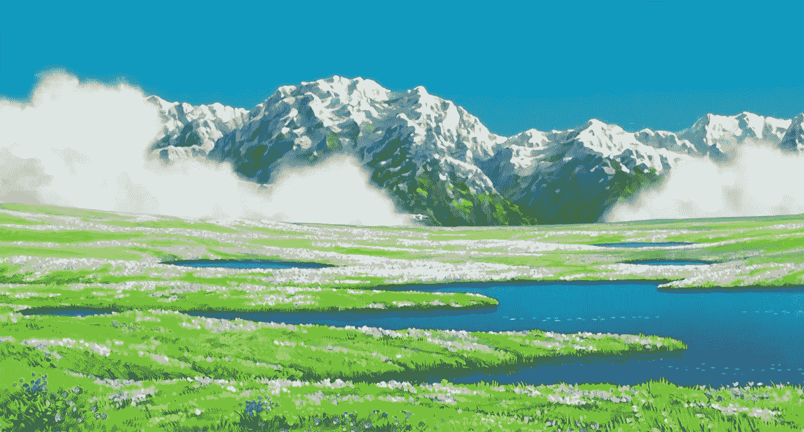
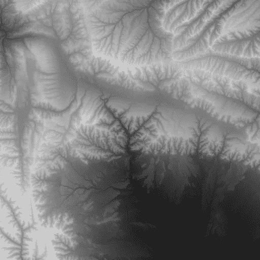
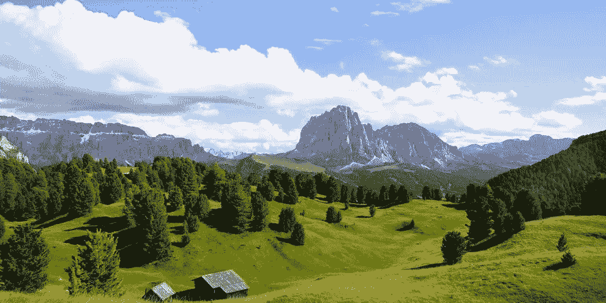
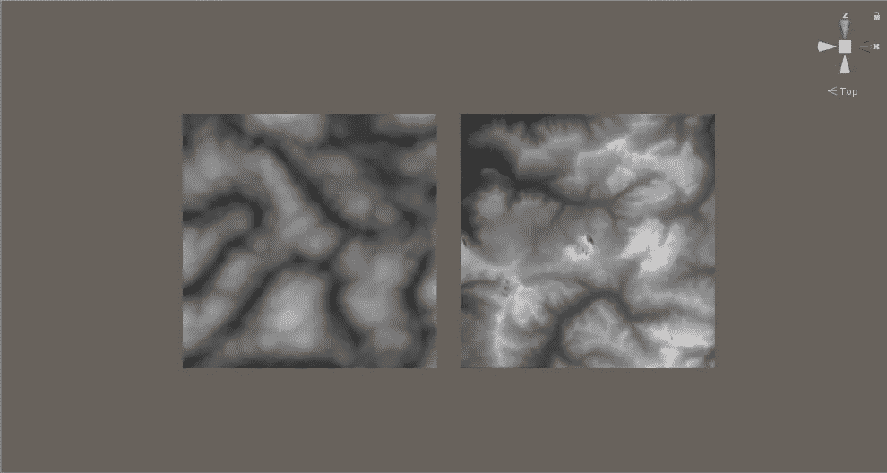
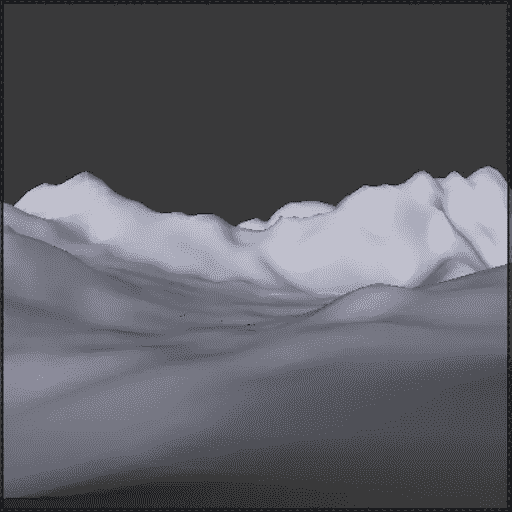
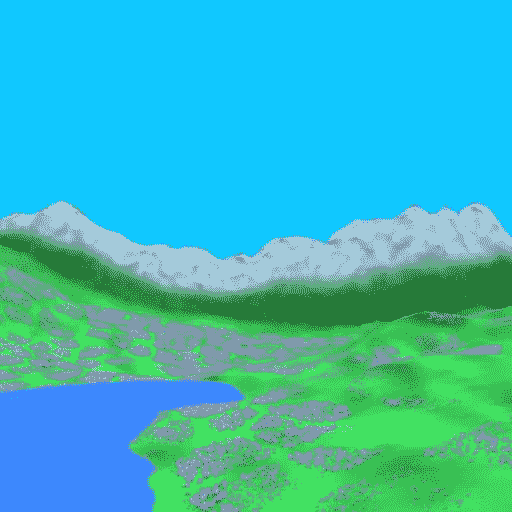
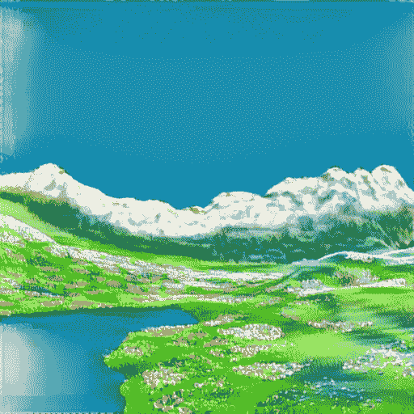
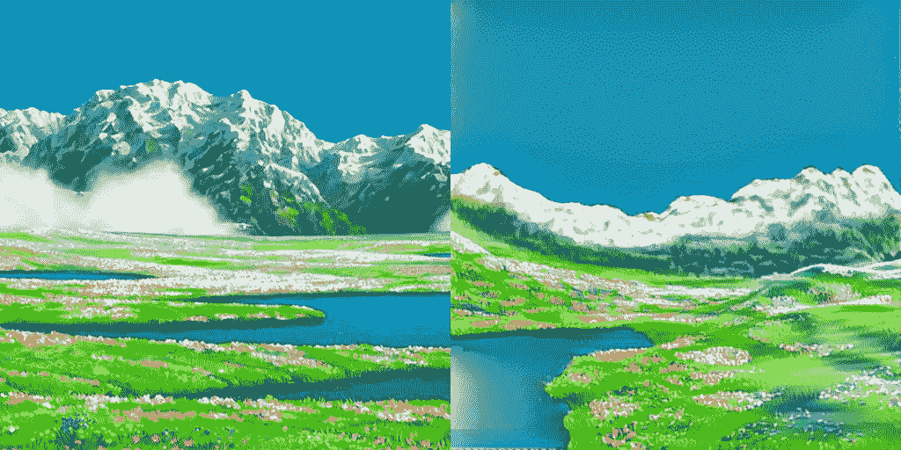

# 神经网络和 3D 程序内容生成的未来

> 原文：<https://towardsdatascience.com/neural-networks-and-the-future-of-3d-procedural-content-generation-a2132487d44a?source=collection_archive---------2----------------------->

Light field landscape generated with the help of style transfer

作为全球制作机构 MediaMonks 的一名创意技术专家，人们总是问我关于人工智能、人工智能、神经网络等方面的问题。它们是什么？他们能做什么？我们如何使用它们？

这篇文章是我将写的探索人工智能、创造力和 3D 内容相遇的空间系列的第一篇。

在我看来，人工智能将是人类有史以来创造的最伟大的创造性工具。目前人工智能的愿景包括数百万失业工人，甚至是一场天启。但是，如果我们的未来涉及将我们的创造过程与人工智能交织在一起，而不是被它取代，那会怎样？

为了开始展望未来，我从一个简单的问题开始:我如何使用神经网络来帮助程序化地创建 3D 景观？例如，想象一下，你站在一个虚拟空间里，说“计算机，让这个空间看起来像吉卜力工作室的风景。”

Landscape from Howl’s Moving Castle

我们如何着手做这样的事情？由于我对机器学习相对较新，我的第一直觉是使用风格转移。

风格转移使用深度卷积神经网络的训练过滤器来优化两个输入图像之间的风格和内容损失，这两个输入图像是内容图像(您的自拍)和风格图像(梵高的画)。

我知道这听起来很专业，所以让我们这么说吧。深度卷积神经网络最近在图像分类方面非常成功。你给它一张照片，比如说一张狗的照片，神经网络就能分辨出这是一只狗。

机器理解图像内容的能力非常强大，因为这意味着它可以理解构成图像的所有细节。它知道狗有下垂的耳朵和尖尖的脸，而猫有尖尖的耳朵和扁平的脸。简单来说，风格转移网络所做的就是获取两幅图像之间的细节，并将它们组合起来。

那么，我们如何将它用于 3D 内容生成呢？3D 程序内容生成中的一个常见问题是地形生成。许多游戏将各种形式的噪波结合起来，以灰度高度图的形式创建山脉、丘陵和平原。大概是这样的:

Height map generated by noise.

然后这些高度图被用来移动平面中的顶点，从而创建山丘、山谷和山脉。这些在 3D 渲染时看起来相当不错，但它们比不上真实的东西。

Height map taken from actual elevation data of the earth.

即使我们可以用简单的旧数学方法生成好看而复杂的地形，但仍然很难模拟所有创造真实地形的过程，如板块构造和侵蚀。

但这正是神经网络的用武之地。有了风格转移的力量，就不用了。我们只需要创建我们想要的大致形状，然后神经网络会添加所有看起来真实的细节。

所以回到 Ghibli 用例，我必须找到真实世界的海拔数据，看起来像图像中的地形。对我来说，它看起来像在阿尔卑斯山的某个地方。通过谷歌图片搜索“阿尔卑斯山”,我看到了这张图片:

原来是 Val Gardena，意大利白云石山脉的一个山谷。知道了这些，我去了一个网站，在那里你可以下载地球的海拔数据。我搜索了 Val Gardena，下载了这张身高图:

也许将来你可以自动化这整个过程，但是现在手动在网上搜索就可以了。

现在是开始建造一切的时候了。使用 Unity，我编写了噪声着色器，它允许我实时调整噪声生成。经过大量实验后，我发现当生成的噪声与期望的输出有一些相似之处时，会出现最佳结果:

Procedural noise on the left, real terrain data on the left.

终于到了使用风格转移的时候了。经过大量的谷歌和 Youtube 搜索，我决定使用 Siraj Raval 的 Youtube 频道[的](https://www.youtube.com/channel/UCWN3xxRkmTPmbKwht9FuE5A)[视频](https://www.youtube.com/watch?v=Oex0eWoU7AQ&t=13s)中的[实现](https://github.com/llSourcell/How-to-Generate-Art-Demo)。如果你想学机器学习，我怎么推荐他的频道都不为过！他杀了它！

下面是样式传递输出的样子:

Style transfer output on the left, real terrain on the right. Both are planes whose vertices are being displaced by the height map texture.

很酷吧？可能有成百上千的事情可以优化它，但对我来说已经足够好了。现在是时候将一个虚拟相机放到生成的地形中，并使用原始的 Ghibli 图像作为样式图像，相机渲染作为内容图像。就像噪声一样，我认为如果内容图像与样式图像有相似之处会更好。因此，我在 Blender 中导入了高度图，以便做一些非常简单的纹理绘制。

The height map in blender. Full height map terrain on left, and zoomed in height map terrain on right.

我选择了一个类似吉卜力图像的相机位置和角度:

A simple Blender render.

之后我画了一些非常简单的纹理，给它一个天空的颜色，并为花添加了一个简单的粒子系统。

An obviously very quick and dirty render.

这就是酷的地方。是时候通过风格转换运行简单的 Blender render 了，看看结果如何。在花了很多时间调整超级参数后，我得到了这个:

The final output of the whole process.

这是与输入图像的最终对比:

显然远不及吉卜力工作室的原声大师，但对于一台无脑机器来说也不错。

但是从这里去哪里呢？理想情况下，你会希望实时完成整个过程，但即使我的虚拟现实电脑上有 GPU 支持的神经网络，风格转换过程也需要大约 4 分钟。显然，这对于实时 3D 图形来说还远远不够快。你可以尝试使用[快速风格转换](https://github.com/lengstrom/fast-style-transfer)，它可以在不到一秒的时间内输出图像，但我不喜欢它在我的图像中产生的伪像。那么，我们如何利用这张静止图像，制作出 3D 的实时渲染的东西呢？

答案是光场！

光场早在 1996 年就被演示过了！但随着虚拟现实的兴起，它们越来越受欢迎，并被像 [OTOY](https://home.otoy.com/render/light-fields/) 这样的公司推广。光场只是一个花哨的术语，指的是由一系列相机拍摄的一系列图像。它们看起来像这样:

该阵列捕获给定体积内的每条光线，从而能够合成新的摄像机角度。看原视频[这里](https://www.youtube.com/watch?v=dMcZpeGOBPI)。这些对于实时图形非常有用，因为你可以预先渲染一切。这样你可以获得实时图形的自由，但具有预渲染场景的图像质量。

现在是时候创建我自己的风格传递光场和光场渲染器了。我基本上在 Unity 中重新实现了 Andrew Lowndes 的 WebGl 光场渲染器。

通过用 python 编写一些 blender 脚本，我能够输出一个 8×8 的图像网格，这些图像分别通过样式传输网络发送。然后它们被缝合在一起成为一个统一的图像。下面是生成的样式传递光场:

Downsized because the original is 8192 × 8192!

这里有一个光场渲染器的视频！

正如你所看到的，通过完全预渲染多个相机视图，我们可以创建一个光场渲染器，它提供了传统渲染系统的许多功能。但它也允许我们现在使用生成神经网络来创建 3D 内容！

但是这篇文章的标题是“神经网络和 3D 程序内容生成的未来”这真的是未来程序化内容的创作方式吗？就这样吗？大概不会。有很多优化工作要做，也许其他的生成算法，比如 GANN 的算法，会更适合这种类型的任务。

这篇文章展示的是神经网络可以从根本上改变我们生成 3D 内容的方式。我选择了光场，因为目前我的 GPU 速度不够快，无法以 60 FPS 的速度进行风格转换或任何其他生成网络。但是如果我们真的到了那一步，完全有可能看到生成神经网络成为标准光栅化方法的替代渲染管线。通过这种方式，神经网络可以根据用户的实时反馈实时生成游戏的每一帧。

但是对于创作者和最终用户来说，它也潜在地允许更强大的创作方法。想象一下玩《战争机器》,然后告诉电脑“保留游戏性、故事和 3d 模型，但让它看起来像塞尔达:野性的呼吸。”这就是创造或玩未来游戏体验的方式，因为计算机现在知道事物“看起来”是什么样子，并且可以让其他事物也“看起来”像它们。

就像我之前说的，计算机理解图像的能力，虽然可能没有《她》中的萨曼莎或《2001》中的哈尔那么令人印象深刻，但仍然是一件非常强大的事情。这是最近的一项创新，仍然有许多可能性有待发现！