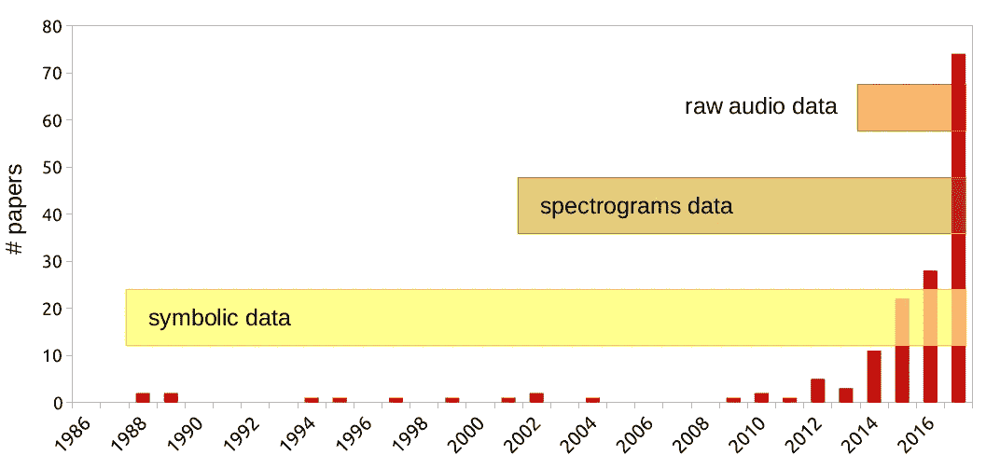

# 音乐神经网络:历史之旅

> 原文：<https://towardsdatascience.com/neural-networks-for-music-a-journey-through-its-history-91f93c3459fb?source=collection_archive---------5----------------------->

从刘易斯和托德在 80 年代写的开创性论文到当前 GANs 作曲家的浪潮之间发生了许多事情。在这段旅程中，连接主义者的工作在人工智能冬天被遗忘，非常有影响力的名字(如 Schmidhuber 或 ng)贡献了开创性的出版物，与此同时，研究人员取得了大量令人敬畏的进展。

我们不会浏览音乐神经网络领域的每一篇论文，也不会钻研技术细节，但我们会涵盖我们认为有助于塑造音乐人工智能当前状态的里程碑——这是一个很好的借口，可以表扬这些决定关注一个除了酷以外什么也不是的信号的疯狂研究人员。开始吧！

**首字母缩略词**
**AI** —人工智能
**CNN** —卷积神经网络
**GAN** —生成对抗网络
**LSTM** —长时短时记忆(一种递归神经网络)
**—MIDI**—乐器数字接口(一种类似乐谱的符号化音乐表示)
**MLP** —多层感知器

# 连接主义者对算法组合感兴趣

几百万年前，在一颗大的小行星撞击地球后，一个漫长的冬天开始了。在这场灾难中，地球上的物种突然大量灭绝。

足够幸运的是，在人工智能的冬天，应用于音乐的神经网络有着不同的信念。这一时期导致了一系列关于[算法组合](https://ccrma.stanford.edu/~blackrse/algorithm.html)的虚假工作，这些工作维持了该领域从 1988 年到 2009 年的相关性。这就是所谓的连接主义者对神经网络和机器学习的贡献。

然而，这些早期作品对大多数当代研究者来说几乎是未知的。

第一波工作是由刘易斯和托德在 1988 年发起的，他们提出了使用神经网络进行自动音乐创作。

一方面，刘易斯将多层感知器用于他的算法作曲方法，称为“精炼创造”。这在本质上是基于和 DeepDream 相同的想法:利用渐变来创造艺术。

另一方面，托德使用约旦自动回归神经网络(RNN)来顺序生成音乐——这一原则在这么多年后仍然有效。这些年来，许多人一直在使用同样的想法，其中包括:Eck 和 Schmidhuber，他们提出将 LSTMs 用于算法合成。或者，考虑一个更近的工作， [Wavenet 模型(它“能够”生成音乐)](https://deepmind.com/blog/wavenet-generative-model-raw-audio/)也利用了同样的因果原理。

看看 Todd 和 Lewis 在 80 年代为算法合成引入的旧的连接主义思想今天仍然有效。但是，如果他们的原则是正确的，为什么他们没有成功？嗯，用刘易斯的话来说:“很难计算很多东西。”一个[深度学习工作站](https://www.exxactcorp.com/Deep-Learning-NVIDIA-GPU-Solutions)中的一个[现代 GPU](https://www.exxactcorp.com/NVIDIA-900-1G150-2530-000-E1847353) 可能具有大约 110 tflops 的理论性能，而一个 [VAX-11/780](https://en.wikipedia.org/wiki/VAX) (他在 1988 年用于工作的工作站)只有 0.1 mflops。

但是让我们回过头来讨论一下 Eck 和 Schmidhuber 的工作。在他们的论文*寻找音乐中的时间结构:LSTM 的布鲁斯即兴创作*中，他们试图解决算法作曲曾经(现在仍然)面临的一个主要问题:缺乏整体一致性或结构。

为了应对这一挑战，他们提出了使用 lst ms——据说它比香草-RNNs 更好地学习更长的时间依赖性。注意，作为这个实验的结果，音乐是 LSTMs 的早期应用之一！

LSTM 创作的音乐听起来怎么样？它能产生一种结构合理的蓝调吗？[自己判断！](http://jordipons.me/media/lstm_blues.mp3)

# 让我们处理底层数据！

在 2009 年之前(请记住，直到 2006 年，辛顿和他的同事们还没有找到一种用深度信念网络训练深度神经网络的系统方法)，大多数作品都是在解决算法音乐创作的问题。他们大多试图通过无线网络来做到这一点。

但是有一个例外。

早在 2002 年，Marolt 和他的同事们使用了一种多层感知器(在光谱图之上操作！)用于音符开始检测的任务。这是第一次有人以非符号的形式处理音乐。这开启了一个新的研究时代:一个种族开始第一个以端到端的学习方式解决任何任务。这意味着学习一个映射系统(或函数)，能够直接从原始音频中解决一个任务，而不是使用工程功能(如频谱图)或符号音乐表示(如 MIDI 乐谱)来解决它。

2009 年，人工智能冬天结束了，第一批深度学习作品开始影响音乐和音频人工智能领域。

人们开始用深度学习分类器处理更复杂的问题(如音乐音频标记或和弦识别)。

根据 Hinton 基于用深度信念网络预训练深度神经网络的方法，Lee 和他的同事(其中包括吴恩达)建立了第一个用于音乐流派分类的深度卷积神经网络。这是一项基础性工作，为一代深度学习研究人员奠定了基础，他们花了很大精力设计更好的模型，以从音乐频谱图中识别高级(语义)概念。

然而，并不是每个人都满意使用基于声谱图的模型。大约在 2014 年，Dieleman 和他的同事们开始探索一个雄心勃勃的研究方向，这个方向向世界展示了音乐音频的端到端学习。在这项工作中，他们探索了直接处理波形以完成音乐音频标记任务的想法——这取得了一定程度的成功，因为基于频谱图的模型仍然优于基于波形的模型。当时，不仅模型不够成熟，而且与现在一些公司可以获得的大量数据相比，训练数据也很匮乏。例如，最近在 [Pandora Radio](https://en.wikipedia.org/wiki/Pandora_Radio) 进行的一项研究表明，如果有足够的训练数据，基于波形的模型可以优于基于频谱图的模型。

另一项具有历史意义的工作来自 Humphrey 和 Bello (2012 年)，他们当时提出使用深度神经网络进行和弦识别。他们说服乐存与人合著了《*深度学习音乐宣言》*——实际(略有不同)标题见参考资料！在这篇文章中，他们向音乐技术研究人员解释说，从数据中学习(分层)表示并不是一个坏主意——有趣的是，他们认为社区已经在利用深层(分层)表示了！

# 因此..下一步是什么？

概括地说，这个领域可以分为两个主要的研究领域:音乐信息检索，旨在设计能够识别音乐信号中存在的语义的模型；和算法作曲，目标是通过计算生成新的吸引人的音乐作品。

这两个领域目前都在蓬勃发展，研究团体稳步前进！

例如，在音乐信息检索领域:尽管目前的深度神经网络已经取得了相当大的成功，但最近的工作仍然在通过改进定义这些模型的架构来推动可能的边界。

但是实际的研究人员不仅仅打算改进这种模型的性能。他们也在研究如何增加它的可解释性，或者如何减少它的计算量。

此外，如前所述，人们对设计能够直接处理各种任务波形的架构非常感兴趣。然而，研究人员尚未成功设计出一种通用策略，使基于波形的模型能够解决广泛的问题——这将允许端到端分类器的广泛适用性。

另一组研究人员也在探索科学的边缘，以改进算法合成方法。记得在 80 年代(Todd 和 Lewis)和 21 世纪初(Eck 和 Schmidhuber)，使用了相当简单的自回归神经网络。但现在是现代生成模型的时候了，比如 GANs(生成对抗网络)或 VAEs(可变自动编码器)。

足够有趣的是:这些现代生成模型不仅被用于以符号格式创作新颖的乐谱，而且像 [WaveGAN](https://github.com/chrisdonahue/wavegan) 或 Wavenet 这样的模型可以成为探索新颖的鼓空间或直接在波形域中呈现新歌的工具(与创作新颖的 MIDI 乐谱相反)。

神经网络现在是使能工具(和新颖的方法！)这些都是以前达不到的。像音乐源分离或音乐转录(被认为是音乐技术专家的圣杯)这样的任务现在从深度学习的角度重新审视。现在是时候重新定义什么是可能的，什么是不可能的，简单地将音乐神经网络领域分为两个领域是过于短视的。新一代研究人员目前正在寻找创新的方法来将这些片段组合在一起，尝试新的任务，并将神经网络用作创造力的工具——这可以导致人类与音乐互动的新方法。

你想成为塑造未来的人之一吗？

# **参考文献**

***如果你不是一个有上进心的学者***
跳过这一节这篇文章是基于我几个月前准备的[教程演示文稿](http://www.jordipons.me/media/UPC-2018.pdf)。

刘易斯和托德 80 年代的论文:

*   Todd，1988 —“音乐应用的顺序网络设计”*发表在《联结主义模型暑期学校学报》上。*
*   Lewis，1988—“[精化创造:梯度下降学习网络的创造性范式](https://ieeexplore.ieee.org/document/23933/)”*国际神经网络会议*。

第一次有人用 LSTMs 做音乐:

*   Eck & Schmidhuber，2002—寻找音乐中的时间结构:用 LSTM 递归网络进行蓝调即兴创作，IEEE 信号处理神经网络研讨会*。*

*第一次有人用神经网络处理光谱图:*

*   *Marolt 等，2002 —“用于钢琴音乐中音符开始检测的[神经网络](https://www.researchgate.net/profile/Matija_Marolt/publication/2473)”*国际计算机音乐会议(ICMC)* 。*

*第一次有人用神经网络构建了一个音乐流派分类器——基于 Hinton 的深度信念网络进行无监督预训练:*

*   *Lee 等人，2009—“[使用卷积深度信念网络的无监督特征学习音频分类](https://papers.nips.cc/paper/3674-unsupervised-feature-learning-for-audio-classification-using-convolutional-deep-belief-networks.pdf)”*《神经信息处理系统(NIPS)进展》*。*
*   *Hinton 等人，2006—“[一种深度信念网的快速学习算法](https://www.mitpressjournals.org/doi/abs/10.1162/neco.2006.18.7.1527)”*神经计算，18(7)，1527–1554*。*

*第一次有人建立了端到端的音乐分类器:*

*   *Dieleman & Schrauwen，2014 年。[音乐音频的端到端学习](https://ieeexplore.ieee.org/document/6854950/)*IEEE 国际声学、语音和信号处理会议(ICASSP)* 。*

*最近在 Pandora Radio 进行的研究显示了大规模端到端学习的潜力:*

*   *Pons 等人，2018—“[音乐音频标注规模的端到端学习](https://arxiv.org/pdf/1711.02520.pdf)”*在国际音乐信息检索学会会议(ISMIR)* 。*

*Humphrey 和 Bello (2012)在和弦识别方面做了一些工作，并撰写了《音乐深度学习宣言:*

*   *Humphrey & Bello，2012—“[用卷积神经网络](https://ieeexplore.ieee.org/abstract/document/6406762/)重新思考自动和弦识别”*在国际机器学习与应用会议(ICMLA)* 上。*
*   *Humphrey 等人，2012 年。[超越特征设计:音乐信息学中的深度架构和自动特征学习](http://citeseerx.ist.psu.edu/viewdoc/download?doi=10.1.1.294.2304&rep=rep1&type=pdf)*国际音乐信息检索学会会议(ISMIR)* 。*

*要了解有关如何改进当前架构的更多讨论，请访问:*

*   *Choi 等人，2016 年。[使用深度卷积神经网络的自动标记](https://arxiv.org/pdf/1606.00298.pdf)*在国际音乐信息检索学会会议(ISMIR)* 上。*
*   *庞斯等人，2016 年。"[音乐激励的卷积神经网络实验](https://repositori.upf.edu/bitstream/handle/10230/27038/serra_CBMI16_expe.pdf?sequence=1&isAllowed=y) " *基于内容的多媒体索引国际研讨会(CBMI)* 。*
*   *Lee 等人，2017 年。[利用原始波形进行音乐自动标注的样本级深度卷积神经网络](https://arxiv.org/pdf/1703.01789.pdf)*国际声音与音乐计算大会(SMC)* 。*

*算法组合的一些现代生成模型(基本上是 GANs 和 VAEs):*

*   *杨等，2017—“[midit:一种用于符号域音乐生成的卷积生成对抗网络](https://arxiv.org/pdf/1703.10847.pdf)”*国际音乐信息检索学会会议(ISMIR)* 。*
*   *Roberts 等人，2018—“[学习音乐中长时结构的分层潜向量模型](https://arxiv.org/pdf/1803.05428.pdf)”*arXiv*。*

*还有一些直接合成音乐音频的作品(waveGAN 和 Wavenet，基本都是):*

*   *Donahue 等人，2018—*ICLR 研讨会*中的“[用生成对抗网络](https://arxiv.org/pdf/1802.04208.pdf)合成音频”。*
*   *Van Den Oord 等人，2016—“[wave net:原始音频的生成模型](https://arxiv.org/pdf/1609.03499.pdf)”*arXiv*。*
*   *Dieleman 等人，2018—“[现实音乐生成的挑战:模拟大规模原始音频](https://arxiv.org/pdf/1806.10474.pdf)”*arXiv*。*
*   *Engel 等人，2017 —“用 Wavenet 自动编码器进行音符的[神经音频合成](https://arxiv.org/pdf/1704.01279.pdf)”*在国际机器学习会议(ICML)* 。*

***鸣谢**
与[Exxact](https://www.exxactcorp.com/Deep-Learning-NVIDIA-GPU-Solutions)([@ Exxact corp](https://twitter.com/Exxactcorp))合作撰写的帖子。非常感谢 JP Lewis 和 Peter M. Todd 回复电子邮件，感谢 Yann Bayle 维护这份(字面上的)[棒极了的](https://github.com/ybayle/awesome-deep-learning-music)应用于音乐的深度学习论文列表。*