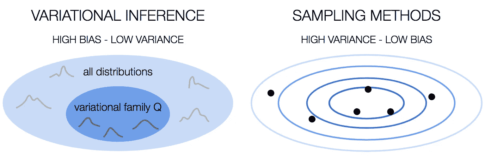
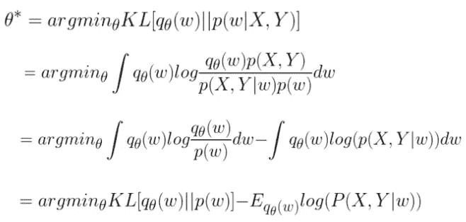

# 贝叶斯视角下的神经网络

> 原文：<https://towardsdatascience.com/neural-networks-from-a-bayesian-perspective-ad8cacc7588e?source=collection_archive---------4----------------------->

无论从从业者的角度还是对于许多不同机器学习应用程序的最终用户来说，理解模型不知道什么都是很重要的。在我们之前的博客文章中，我们讨论了不同类型的不确定性。我们解释了如何使用它来解释和调试我们的模型。

在这篇文章中，我们将讨论在深度神经网络中获得不确定性的不同方法。让我们从贝叶斯的角度来看神经网络。

# 贝叶斯学习 101

贝叶斯统计允许我们根据证据(数据)和我们对世界的先验知识得出结论。这常常与只考虑证据的频率主义统计形成对比。先验知识捕获了我们对哪个模型生成了数据的信念，或者那个模型的权重是什么。我们可以使用模型权重的*先验分布* p(w)来表示这种信念。

随着我们收集更多的数据，我们更新先验分布，并使用贝叶斯法则将其转化为*后验分布*，这一过程称为*贝叶斯更新*:

这个等式引入了贝叶斯学习中的另一个关键角色——可能性*，定义为 p(y|x，w)。这一项表示在给定模型权重 *w* 的情况下，数据的可能性有多大。*

# *贝叶斯视角下的神经网络*

*神经网络的目标是估计可能性 p(y|x，w)。即使你没有明确地这样做，也是如此，例如[当你最小化 MSE](https://www.jessicayung.com/mse-as-maximum-likelihood) 时。*

*为了找到最佳的模型权重，我们可以使用*最大似然估计* (MLE):*

**

*或者，我们可以使用我们的先验知识，表示为权重的先验分布，并最大化后验分布。这种方法被称为*最大先验估计* (MAP) **:***

**

*代表我们的先验的项 *logP(w)* 充当正则化项。选择均值为 0 的高斯分布作为先验，你将得到 L2 正则化的数学等价。*

*既然我们开始将神经网络视为概率性生物，我们就可以开始享受乐趣了。首先，谁说我们必须在训练过程结束时输出一组权重？如果我们不学习模型的权重，而是学习权重的分布，会怎么样？这将允许我们估计权重的不确定性。那么我们该怎么做呢？*

# *一旦你去贝叶斯，你永远不会回来*

*我们再次从权重的先验分布开始，目的是找到它们的后验分布。这一次，我们将对所有可能的权重进行平均，而不是直接优化网络的权重(称为边缘化)。*

*在推断时，我们不是采用最大化后验分布(或最大似然法，如果我们使用最大似然法)的单一权重集，而是考虑所有可能的权重，按其概率进行加权。这通过使用积分来实现:*

**

**x* 是我们要推断 *y* 的数据点， *X* ， *Y* 是训练数据。第一项 p(y|x，w)是我们良好的旧可能性，第二项 p(w|X，Y)是给定数据时模型权重的后验概率。*

*我们可以把它想象成一个由每个模型的概率加权的模型集合。事实上，这相当于无限数量的神经网络的集合，具有相同的架构，但具有不同的权重。*

# *我们到了吗？*

*啊，问题就在这里！事实证明，这个积分在大多数情况下是难以处理的。这是因为后验概率无法通过分析来评估。*

*这个问题不是贝叶斯神经网络独有的。在贝叶斯学习的许多情况下，你会遇到这个问题，多年来已经开发了许多克服这个问题的方法。我们可以把这些方法分为两类:变分推断法和抽样法。*

**

## *蒙特卡罗抽样*

*我们有麻烦了。后验分布是难以处理的。如果我们不用计算真实分布的积分，而是用从中抽取的样本的平均值来逼近它，会怎么样？一种方法是[马尔可夫链蒙特卡罗](/a-zero-math-introduction-to-markov-chain-monte-carlo-methods-dcba889e0c50)——你用期望的分布作为它的平衡分布来构造一个马尔可夫链。*

## *变分推理*

*另一种解决方案是用来自易处理族的不同分布来近似真实的难处理分布。为了测量两个分布的相似性，我们可以使用 KL 散度:*

**

*设 *q* 是由θ参数化的变分分布。我们希望找到最小化 KL 散度的θ值:*

**

*看看我们得到的:第一项是变分分布和先验分布之间的 KL 散度。第二项是关于 *q* θ的可能性。因此，我们在寻找能够最好地解释数据的 *q* θ，但另一方面，它又尽可能接近先验分布。这只是将正则化引入神经网络的另一种方式！*

*现在我们有了 qθ，我们可以用它来做预测:*

**

*以上提法来自 deep mind2015 年的一部[作品。类似的想法由](http://proceedings.mlr.press/v37/blundell15.html)[格雷夫斯](http://proceedings.mlr.press/v37/blundell15.html)于 2011 年提出，并追溯到[辛顿和范坎普](http://www.cs.toronto.edu/~fritz/absps/colt93.pdf)于 1993 年提出。NIPS 贝叶斯深度学习研讨会上的[主题演讲](https://www.youtube.com/watch?v=FD8l2vPU5FY)非常好地概述了这些想法多年来是如何演变的。*

*好吧，但是如果我们不想从零开始训练一个模型呢？如果我们有一个训练好的模型，我们想从这个模型中得到不确定性估计，该怎么办？我们能做到吗？*

*事实证明，如果我们在训练中使用辍学，我们实际上可以。*

**

*Professional data scientists contemplating the uncertainty of their model — an illustration*

## *辍学是一种不确定性*

*[辍学](http://jmlr.org/papers/v15/srivastava14a.html)是一种经常使用的做法。在训练时，你随机抽取节点样本，并删除它们，也就是说，将它们的输出设置为 0。动机呢？您不希望过度依赖特定的节点，这可能意味着过度适应。*

*在 2016 年， [Gal 和 Ghahramani](http://proceedings.mlr.press/v48/gal16.pdf) 表明，如果你也在推理时应用 dropout，你可以很容易地得到一个不确定性估计量:*

1.  *多次推断 y|x，每次采样一组不同的节点以排除。*
2.  *对预测值进行平均，得到最终的预测值 E(y|x)。*
3.  *计算预测的样本方差。*

*就是这样！你得到了方差的估计！这种方法背后的[直觉](http://www.cs.ox.ac.uk/people/yarin.gal/website/blog_3d801aa532c1ce.html)是，训练过程可以被认为是同时训练 2^m 不同的模型——其中 m 是网络中的节点数量:每个没有被遗漏的节点子集定义了一个新的模型。所有模型都共享它们没有丢失的节点的权重。在每一批中，这些模型的随机抽样集被训练。*

*训练结束后，你手中就有了一套模型。如果你如上所述在推理时使用这个集合，你就得到这个集合的不确定性。*

# *抽样方法与变分推断*

*就[偏差-方差权衡](https://en.wikipedia.org/wiki/Bias%E2%80%93variance_tradeoff)而言，变分推断有很高的偏差，因为我们选择了分布族。这是我们正在做的一个强有力的假设，和任何强有力的假设一样，它会引入偏见。然而，它很稳定，方差很小。*

*另一方面，抽样方法具有较低的偏差，因为我们不对分布进行假设。这是以高方差为代价的，因为结果取决于我们抽取的样本。*

# *最后的想法*

*能够估计模型的不确定性是一个热门话题。在医疗辅助和自动驾驶汽车等高风险应用中，了解这一点非常重要。这也是一个很有价值的工具，可以了解哪些数据有利于模型，因此我们可以去获取它。*

*在这篇文章中，我们介绍了一些获得模型不确定性估计的方法。还有更多的方法，所以如果你对此感到非常不确定，继续寻找更多的数据🙂*

*在下一篇文章中，我们将向您展示如何在推荐系统中使用不确定性，特别是如何应对[探索-开发挑战](https://en.wikipedia.org/wiki/Multi-armed_bandit)。敬请关注。*

**这是与我们在今年 KDD 会议的研讨会上提交的论文相关的系列文章的第二篇:* [*深度密度网络和推荐系统中的不确定性*](https://arxiv.org/abs/1711.02487) *。**

**第一篇帖子可以在* [*这里找到*](https://engineering.taboola.com/using-uncertainty-interpret-model) *。**

*这是一个与 [Inbar Naor](https://medium.com/u/5d840e4443e4?source=post_page-----ad8cacc7588e--------------------------------) 的联合帖子。最初发表于[engineering.taboola.com](https://engineering.taboola.com/neural-networks-bayesian-perspective)*