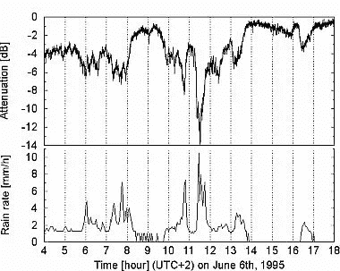
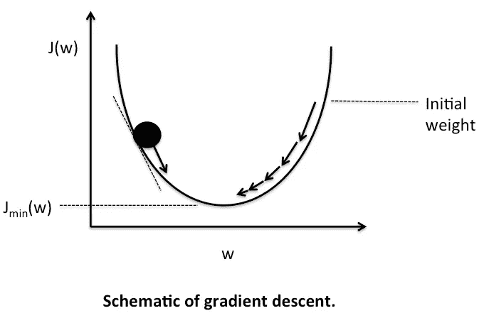

# 神经网络捏造数字

> 原文：<https://towardsdatascience.com/neural-networks-fudging-the-numbers-7588963db24a?source=collection_archive---------20----------------------->

## 为什么我们仍然需要数据科学家？

监督神经网络的全部目的是找到能够成功地将一些输入映射到一些输出的某个模型的最佳参数。虽然神经网络可以令人印象深刻，甚至[到神奇的极限](https://medium.com/datathings/the-magic-of-lstm-neural-networks-6775e8b540cd)，但学习机制本身背后真的没有什么神奇之处。它通常包括指定一个**损失函数**作为**，一个惩罚指标**和一个**优化器**尽力减少损失。在之前的博客文章中，我们详细解释了所有这些概念，神经网络的一般机制和每个特定齿轮的细节。

假设我们正试图通过检查卫星信号的接收功率来预测室外的降雨量。正如我们所料，我们通常在非雨天有最强的卫星信号，在大雨天信号最差。神经网络的目标是找到将卫星信号映射到降雨量的传递函数。

Rain rate vs satellite attenuation ([source here](https://www.dlr.de/kn/en/desktopdefault.aspx/tabid-2200/3248_read-4976/))

假设神经网络的第一次随机初始化创建了模型 rain=2。也就是说，不管卫星接收能力如何，我们预测外面的降雨量为每小时 2 毫米。这个模型与我们说的(rain=5)或(rain=30)模型相比有多好？

自然地，通过查看当前曲线，我们可以说(rain=30)是最差的模型，因为在我们的数据集中，降雨量从未达到 30 的水平！而 rain=2 却在很多时候莫名其妙的正确！笼统地说，如何衡量一个模型有多差？

损失函数是度量神经网络在特定数据集上的性能的指标。他们对神经网络在学习任务中的当前状态进行分级。

最著名的损失函数是**误差平方和**。它对误差的平方进行求和(误差是神经网络的预测和数据集的实际输出之间的差异)。误差越大，损失越大(以平方的方式！10 个单位的差异产生 100 个单位的损失)。

如果神经网络正确预测了所有输出，则误差平方(预测-实际)为零。**完全没有损失，我们可以用这个神经网络代替整个数据集**。基本上我们已经找到了一种无损压缩数据集的方法(这就是为什么它被称为损失函数！)

好，现在我们的第一个模型总共亏损 1000，我们能找到一个亏损 800 或 400 或 100 或 0 的更好的模型吗？(请注意，由于过度拟合问题，0 损耗可能[不理想！)](https://machinelearningmastery.com/overfitting-and-underfitting-with-machine-learning-algorithms/)

[梯度下降技术](http://ruder.io/optimizing-gradient-descent/index.html)如 **sgd、** **rmsprop、adagrad** 帮助神经网络在损失周围导航。通常他们会给神经网络指明方向以减少损失。把优化者想象成财务顾问。他们看着你的开销，告诉你:在这里你可以做得更好，在这里你可以花得更少，在这里你可以节省更多，在这里你可以减少你的损失！

优化器通过遵循**损失函数的梯度来减少损失。**数学上，这涉及计算损失函数的导数，并遵循最负斜率。因为目标是最小化损失，跟踪最负的导数就像跟踪最陡的下坡路。我们可以期待最快到达底部！

好吧，到目前为止，机器学习看起来很容易。**我们只需要定义一个损失函数，然后优化器就来了！什么会出错？为什么我们甚至需要雇佣数据科学家？**

> 当你选择用一个指标来管理的时候，你就邀请你的经理来欺骗和操纵它。

想象一下，一家公司根据员工在办公室工作的时间对他们进行评级。当员工意识到这一点时，她可以用许多方式作弊。她可以早点来办公室，一整天什么都不做，晚点下班，然后赢得本月最佳员工奖！当科学家以他们发表的论文数量来评价时，他们有巨大的动机在尽可能多的会议上发表尽可能多的论文，同时重复相同的想法。更不用说学生为了得到更高的分数而在考试中作弊的无数方式了。 [*《关于不诚实的诚实真相:我们如何欺骗所有人——尤其是我们自己》*](https://www.goodreads.com/book/show/13426114-the-honest-truth-about-dishonesty) 是一本关于欺骗话题的优秀书籍。

Let’s play the number game!

这与我们的神经网络示例有什么关系？例如，如果我们认为我们的数据库是倾斜的:99%的时间不下雨，神经网络**可以在所有时间**懒洋洋地收敛到输出 rain=0。通过这样做，神经网络节省了 99%的损失！这就像一家金融公司逃避了 99%的税收，只缴纳了 1%的小额罚款。这里有一些其他机器学习的有趣例子[懒洋洋地收敛到令人惊讶的解决方案](https://techcrunch.com/2018/11/13/how-machine-learning-systems-sometimes-surprise-us/)。

我们可以说，如果被测量的对象不知道他们正在被测量或如何被测量，那么一个度量标准会更好。但是优化器正是通过遵循损失函数的梯度来工作的，如果我们不定义损失函数，我们就无法优化！有什么解决办法？

[(Photo credits here)](https://www.kdnuggets.com/2018/02/cartoon-valentine-machine-learning.html)

只有深刻理解这个数字游戏、深度学习的机制及其背后的数学，数据科学家才能摆脱优化器玩这个游戏的陷阱！**这是一份侦探工作！**

> 当事情进展顺利时，我们不需要侦探。但是当一个模型没有收敛，或者收敛到一个懒解的时候，只有有深度理解和知识的人才能解决深度学习的问题。

这是在这种情况下我们可以做的事情的非详尽列表:

*   花更多的时间与领域专家一起更好地理解问题。能不能提取出更好更相关的特征？
*   检查数据集，我们能得到更多的数据吗？我们能减少偏见吗？我们能减少功能的数量吗？特征是独立的吗？我们能否尝试[过滤、转换、预处理或减少偏斜或偏差](https://medium.com/@TheDataGyan/day-8-data-transformation-skewness-normalization-and-much-more-4c144d370e55)。
*   检查模型是否太简单或太复杂。尝试不同的神经网络模型和架构。试图用一个简单的前馈层(y=ax+b)和一个线性激活来学习一个二次或高度非线性的函数显然是不合适的！
*   调整损失函数本身。当一个指标不起作用时，我们可以尝试另一个指标！例如，我们可以将“99x”乘数加到损失平方和上。这可能会阻碍优化器收敛到惰性解决方案 y=0。我们可以自定义损失函数来适应我们的需要(根据问题)！我们不仅仅局限于现有的标准损失函数(平方和和对数损失)！
*   尝试不同的优化器，不同的学习率，不同的正则化率。
*   提高自己的知识。例如，看看这个有趣的帖子:[“关于深度学习的深层误解”](/deep-misconceptions-about-deep-learning-f26c41faceec)
*   作为最后的手段，我们可以尝试元学习。元学习是一种探索几种各有不同配置的神经网络结构的技术。从这个意义上来说，**可以看作是机器学习的蛮力**。缺点是在计算能力方面显然是非常昂贵的！

*原载于 2018 年 10 月 29 日*[*【medium.com*](https://medium.com/datathings/neural-networks-fudging-the-numbers-4b2889cfd416)*。*