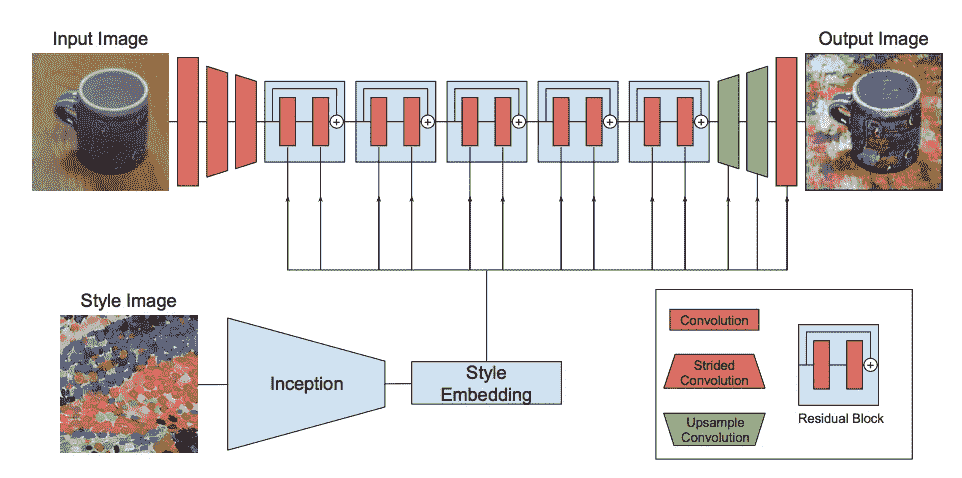

# 神经类型转移:在数据扩充中的应用

> 原文：<https://towardsdatascience.com/neural-style-transfer-applications-data-augmentation-43d1dc1aeecc?source=collection_archive---------9----------------------->

Different Styles of a Coffee Cup

神经风格转移是一个非常令人兴奋的深度学习应用。由卷积神经网络模型中的一系列卷积层创建的表示可以被解构，使得内容和风格可以分离。这种分离形成了 gram 矩阵，该矩阵可以用作生成器网络的损失函数(从随机向量映射到高度 x 宽度 x 颜色通道输出图像)。这个模型可以用来做一些事情，比如将文森特·范·高夫的艺术风格转化为一张普通的照片。

在我对数据扩充方法的研究中，(寻找人为地将数据添加到小数据集以形成大数据集的方法)，我一直对风格转移如何作为数据扩充方法起作用感兴趣。

风格转移是一种有趣的增强技术。它有点类似于颜色变换，但是，它能够传递纹理和其他各种扭曲，这是经典的颜色过滤器或仿射变换所无法实现的。

有一篇非常有趣的论文，对用于数据扩充的样式转移进行了实验，题目是:

# [风格扩充:通过风格随机化的数据扩充](https://arxiv.org/abs/1809.05375)

作者:菲利普·杰克森、达勒姆大学的阿米尔·阿塔普尔-阿巴戈韦、斯蒂芬·邦纳、托比·布雷肯和博古斯瓦夫·奥巴拉。

本文将风格增强总结为一种“随机化纹理、对比度和颜色，同时保留形状和语义内容”的方法。

> “基于图像的数据扩充的最普遍形式包括几何失真，例如随机裁剪、缩放、旋转、翻转、线性强度缩放和弹性变形。虽然这些在教导模型的旋转和比例不变性方面是成功的，但是颜色、纹理和复杂的光照变化呢？”

这是一个非常有前景的数据增强转换，尽管有各种各样的平移不变性和失真，我们仍然希望学习图像的语义内容。因此，我们应用一系列保留标签的转换来提高数据集的质量。

有趣的是，本文讨论的实验实际上并不是从一组风格图像中抽取风格样本，而是多元正态分布。我发现这有点令人困惑，我将坚持用一组不同风格的图片来做我自己的实验。

原始的神经类型转移算法需要大量的计算，因此不是数据扩充的好解决方案。然而，一种称为**快速神经风格转移**的新风格转移算法的开发极大地加快了进行风格转移所需的时间，“只需通过风格转移网络进行一次正向传递，该网络由风格嵌入参数化。”

此外，本文还重点研究了迁移学习中的领域适应任务。这就是从大型网络中学到的低级特征转化为新问题的地方。这个想法是，风格增强将有助于这个大型网络学习更好的迁移学习功能。根据该论文，“我们的方法通过增加数据将更多的变化引入源域，这可以增强模型的整体鲁棒性，从而更好地推广到许多潜在的目标域，而不需要来自它们的数据”。

# **结论**

总之，我强烈推荐你亲自看看这篇[论文](https://arxiv.org/abs/1809.05375)，“风格增强:通过风格随机化的数据增强”！风格转移增强是一种非常令人兴奋的数据增强技术，用于学习更多样的不变性和领域转移。我很高兴能尝试一下，看看这是如何发展的。感谢阅读！

# [CShorten](https://medium.com/@connorshorten300)

Connor Shorten 是佛罗里达大西洋大学计算机科学专业的学生。对计算机视觉、深度学习和软件工程感兴趣。