# NeuralFunk -将深度学习与声音设计相结合

> 原文：<https://towardsdatascience.com/neuralfunk-combining-deep-learning-with-sound-design-91935759d628?source=collection_archive---------2----------------------->

## 完全用神经网络产生的样本制作轨迹

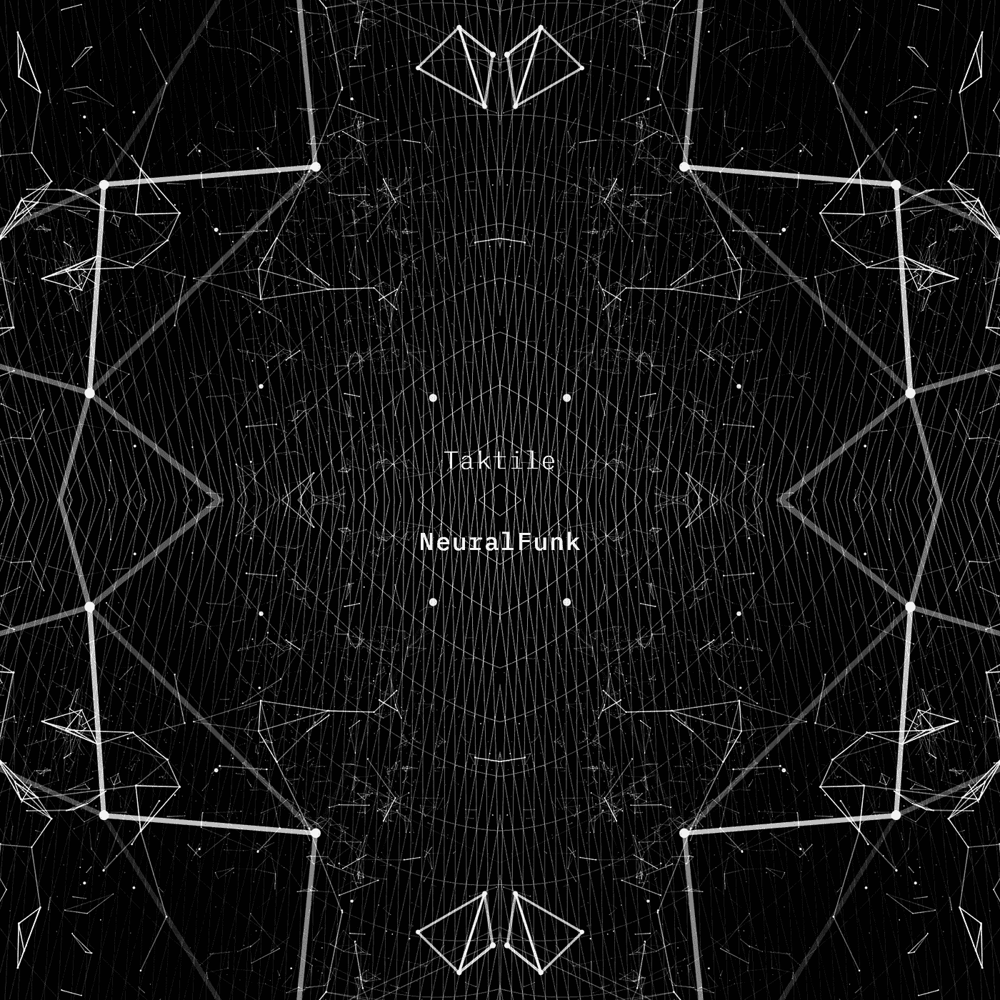

Cover for NeuralFunk, designed by [Nuevo.Studio](http://nuevo.studio)

很长一段时间以来，我一直想把我对音乐的热情与我在人工智能领域的工作结合起来。但我一直拖着。我觉得在尝试让深度学习参与这个过程之前，我需要首先提高我的音乐制作技能。

但后来在 9 月中旬，我看到在今年的*神经信息处理系统* ( *NIPS* )会议上，将有另一个关于 [*机器学习促进创意和设计*](http://nips4creativity.com) 的研讨会，这可以说是人工智能社区每年最大的事件。艺术品和音乐的提交截止日期是 10 月底。

那件事，以及与 Nao Tokui 在同一时间喝了几杯啤酒的聊天，激励着我最终振作起来，停止使用借口，开始做一些事情。我有大约一个月的时间在研讨会的最后期限前完成一些事情。

结果是 ***NeuralFunk*** ，一个完全基于样本的轨迹，其中所有的样本都是由深度神经网络生成的。

它并没有像我最初打算的那样变成一首典型的 Neurofunk 曲目，而是发展成了一首相当独特的曲目。黑暗、混乱、疲惫，几乎让听者窒息，没有时间休息和呼吸。NeuralFunk 就像它产生的方式一样是实验性的。

【更新:NeuralFunk，以及我的另一首作品[被 NIPS 工作室接受，你现在也可以在 Spotify](http://www.aiartonline.com/design/max-frenzel-2/) 上听它和我的其他歌曲[。]](https://open.spotify.com/artist/5gsjQSovh7BPRlqb3GL3yU?si=mm_d-SRFRCes6fgwD2NnAw)

接下来我想告诉你这个项目是如何产生的，从深度学习和音乐制作的角度。

如果你只对其中一个方面感兴趣，可以跳过其他部分。我还将分享一些代码和生成的示例的链接。

但是在讨论任何细节之前，我想对为此做出贡献的人们表示衷心的感谢。 [Alvaro](http://nuevo.studio) 设计封面图片，[Makoto](https://www.google.com/url?sa=t&rct=j&q=&esrc=s&source=web&cd=1&cad=rja&uact=8&ved=2ahUKEwjZzemF8JneAhUGfXAKHQ3BCN4QFjAAegQICBAB&url=https%3A%2F%2Fopen.spotify.com%2Fartist%2F4CBavfYzjrTvV7xCIq6WQu&usg=AOvVaw0YoMsHu7AscEkrzo8F81OH)与我分享他的样本库， [Nao](https://medium.com/u/d9ccd9d1c0fe?source=post_page-----91935759d628--------------------------------) 在几个场合激励我开始这个项目，最后最重要的是 [*D.A.V.E.*](https://www.digitalandvinylexpert.com) 与我在赛道上的合作(但稍后会有更多)。谢谢你们，你们太棒了！

# 神经机能障碍的起源

我最初进入电子音乐制作是通过[手指打鼓](https://www.instagram.com/p/BnvYsyjBat-/?taken-by=mffrenzel)，这仍然是我主要如何定义自己作为一个制作人。所以我最初把深度学习和音乐结合起来的想法其实很不一样。

我不打算制作完整的音轨，甚至不打算制作任何音频。相反，我在考虑现场表演的有趣想法。具体来说，我正在考虑一个系统，它可以确定音频样本之间的相似性，这样我就可以自动将声音替换为其他相似的声音。

举个简单的例子:我可能有一个特殊的军鼓声音，但我想用一个相似但略有不同的声音来代替它。

在一个更具实验性的环境中，我可能想记录我的观众或某个场所的随机声音场景，然后自动从中提取声音来替换我正在使用的实际样本。这样，我就可以从一首完全基于精心制作和人工挑选的样本的曲目逐渐转变为更加有机和随机的曲目，甚至可能与观众互动，这仍然可以保持其原始的声音特征。

除了是一个很酷的性能工具，寻找相似样品的好方法也可以在生产过程中有很大帮助。几乎每个生产者都知道，在不断增长的库中找到完全正确的样本是多么痛苦和耗时的过程，这些样本通常分布在许多随机的目录和嵌套的子目录中。

一年多以前，当我把这个想法告诉 [*Makoto*](https://open.spotify.com/artist/4CBavfYzjrTvV7xCIq6WQu) 的时候，他非常友好地把他的大规模样本库给了我，让我去玩。然而在那个时候，我并没有走得很远。在摆弄了一会儿之后，我又回到了我的老借口上，首先专注于音乐制作本身。

但是现在我终于有了一个很好的理由快速完成一些事情:NIPS 研讨会的最后期限。

然而，我认为我最初的想法是不可能实现的，因为我只有一个月的时间来完成这个项目。深度学习部分不会是一个问题，但为现场表演开发后端和制定一个有趣的例程将需要更多的时间，特别是因为我还没有太多关于 [*Max for Live*](https://www.ableton.com/en/live/max-for-live/) (或任何其他可以为此工作的开发环境)的经验。

相反，我决定制作一首歌曲。

我的主要流派是鼓和贝斯。而 Neurofunk 的亚属，鉴于它的名字也是曲目名称的灵感，看起来就像一个完美的匹配。

Neurofunk 通常是鼓和低音的一个黑暗和侵略性的分支。除此之外，它的特点是非常精细和复杂的声音设计，尤其是低音线。最近有一个很好的例子，看看*文档一* 中的“[*LSD”*中 0:44 左右开始的低音。对于更“传统”的神经放克，请查看由 *InsideInfo 和*](https://youtu.be/F8cq83rkeGQ)mef jus*提供的 [*脉动*。](https://youtu.be/0tg2F9QESiE)*

这种复杂的声音设计似乎也符合我使用神经网络的意图。然而，大多数 Neurofunk 制作人严重依赖复杂的波表或 FM 合成来精心塑造他们的声音。完全基于样本可能具有挑战性。此外，Neurofunk 往往非常精确和尖锐。我不确定神经网络方法会给我的声音带来这两种属性。

尽管如此，我还是准备迎接挑战。此外，样本只是起点。

虽然我给自己设置了限制，即每个声音都必须来自神经网络生成的样本，但我没有对可以对它们使用的效果或后期处理设置任何限制，给我留下了很多自由来塑造声音。

在这方面，我认为 *NeuralFunk* 不同于大多数其他人工智能辅助音乐生成的方法。

在许多情况下，人们要么像在 [*中演奏 RNN*](https://magenta.tensorflow.org/performance-rnn) ，让 AI 模型通过 MIDI 生成音符序列，要么使用深度学习来合成特定的乐器，像 [*NSynth*](https://magenta.tensorflow.org/nsynth) 。

通过深度学习合成所有的声音，然后从中产生一首歌曲，这是我迄今为止从未遇到过的事情，尽管如果我是第一个这样做的人，我会感到非常惊讶。虽然这可能是第一首以这种方式创作的鼓与贝斯音轨。

结果显然不是 AI 做的音乐。但它是使用人工智能作为声音设计和探索创造性表达新方法的工具制作的音乐。

# 深度学习阶段

有了这个非常粗略的想法，下一步就是要弄清楚使用什么样的网络来实际生成样本。

还不太确定我想把这个带向什么方向，我再次从[脑](https://medium.com/u/d9ccd9d1c0fe?source=post_page-----91935759d628--------------------------------)那里得到了一些灵感。他有一个 iPython 笔记本，用于根据声谱图进行声音分类。我对声音分类不感兴趣，但我认为一些预处理可能会有用，所以我开始尝试一下，将我库中的一些样本转换成光谱图。

这就是项目 *NeuralFunk* 真正开始的时候，9 月 21 日有了这个*阿门突破*的声谱图。

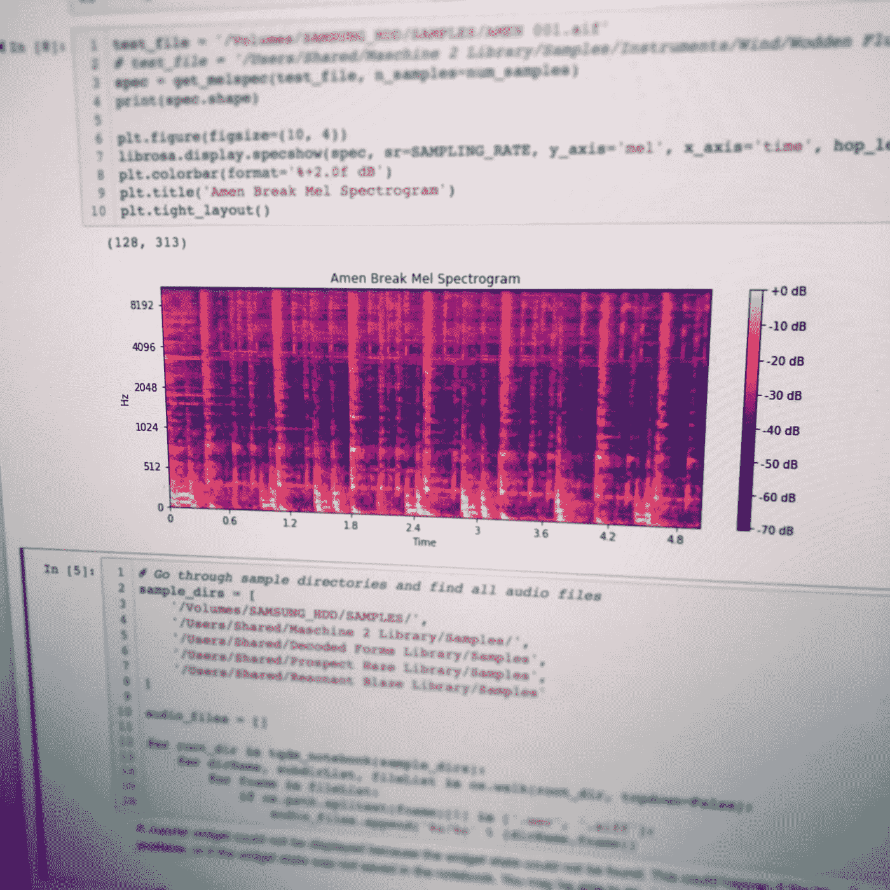

在那之后，我决定从实际的神经网络开始，一个好的(也是很明显的)地方是使用一个基本的 [*WaveNet*](https://deepmind.com/blog/wavenet-generative-model-raw-audio/) ，在我的样本库上训练它，看看会有什么结果。

我从收集不同样本目录中的所有样本开始。主要是 Makoto 的样片，还有我的 Maschine 2 库，还有资料片 [*共振火焰*](https://www.native-instruments.com/en/products/komplete/expansions/resonant-blaze/)[*前景阴霾*](https://www.native-instruments.com/en/products/komplete/expansions/prospect-haze/)[*解码形态*](https://www.native-instruments.com/en/products/komplete/expansions/decoded-forms/) (顺便强烈推荐)。我真的很感谢 Native Instruments，因为他们将样本直接作为 wav 文件提供，而不是深埋在软件中。

然后，我将它们全部转换为 16kHz，并对任何超过 10 秒的部分进行了修整。有一些较长的循环和完整的轨道和茎，但我决定忽略这些，除了他们的开始。

最后，我得到了大约 62，000 个样本(尽管我很久以后才发现，我本可以得到更多的样本，因为我的自动搜索只寻找与。wav”和”。aiff”，漏掉了很多变奏像“的。WAV“，”。aif”等)。

接下来，我采用了 Wavenet 的 TensorFlow 实现，并简单地根据该数据对其进行了训练。考虑到数据的巨大差异，我并不期待惊人的结果，但这是一个开始，值得一试。事实上，我最终得到了一些有趣的结果。尽管正如预期的那样，它主要只是(不完全是随机的)噪音。

为了让 Wavenet 有更好的机会了解它应该生成什么数据，我决定添加一个条件网络。

除了音频文件本身，我还为每个文件的前三秒创建并保存了一个声谱图。我最初的计划是添加一个完整的卷积编码器网络，它将与 Wavenet 端到端地进行训练，将频谱图作为附加输入，并将其压缩为条件向量。

不幸的是，至少在我的快速实验中，这被证明是一项太难的任务，Wavenet 只是在频谱编码器可以学习任何有用的东西之前学会了忽略条件向量。这似乎是太强大的解码器阻止编码器学习的许多情况之一。也许通过一些更好的参数调整，这个过程可以工作。但我没有时间进行大范围的参数搜索。

然而，在摆弄 Wavenet 的同时，我仍然没有放弃寻找样本之间相似性的最初想法。我的想法是，我可以使用 Wavenet 来生成大量的随机样本，然后使用相似性搜索来找到与我喜欢的特定参考声音接近的声音。

所以为了让相似性搜索起作用，我还写了一个变分自动编码器(VAE ),它是在相同的光谱图上训练的。我可以简单地通过比较潜在空间中的距离，使用得到的嵌入来进行相似性搜索。

但是这个模型实际上允许我做更多的事情。

我可以使用 VAE 嵌入作为波网的条件向量，而不是用波网端到端地训练编码器，这样会得到更好的结果。Wavenet 现在清楚地利用了条件信息，它的输出具有它所依赖的声音的许多特征。

但除此之外，我可以使用 VAE 解码器本身来重建频谱图，然后使用 Griffin-Lim 算法来映射回音频。

任何关注过我在 AI 上的文章或者看过我演讲的人都知道我真的很喜欢 VAEs。他们可能是我最喜欢的一类模特。从信息论的角度来看，它们不仅在概念上很漂亮，非常优雅，而且用途极其广泛。

在这里，单个模型允许我创建嵌入，我可以用它来调节另一个模型，使我能够进行高级语义搜索，以及实际上自己生成新的声音。

它也很容易训练，只需要几个小时我的 iMac 的 CPU 就可以收敛。这个模型本身也很简单。这实际上是我第一次从零开始写一个反进化网络，所以我很快就把它拼凑了起来，但它似乎很有效。

鉴于时间短暂，我并不真正关心优化。一旦事情有了转机，我就继续前进。我做的任何事情都不严谨。我甚至没有费心将我的数据分成单独的测试或验证集。

我给 VAE 添加的唯一一个稍微花哨的东西是一些正常化流动层的 T2。再说一次，我的实验并不严谨，但是增加几个流动层似乎可以从质量上得到更好的结果。

我做了 64 维的嵌入(没有原因，只是选择了这个数字作为我的第一个测试，它有点工作，我从来没有尝试过其他任何东西)。但是使用 TSNE，我可以把维度减少到二维来可视化。

原始样本没有任何类别标签，所以我使用文件名提取了一些近似的标签，在名称中查找类似“kick”和“sfx”的单词。结果出乎意料的好。这是我选择的八个类别之一的所有样本的可视化。

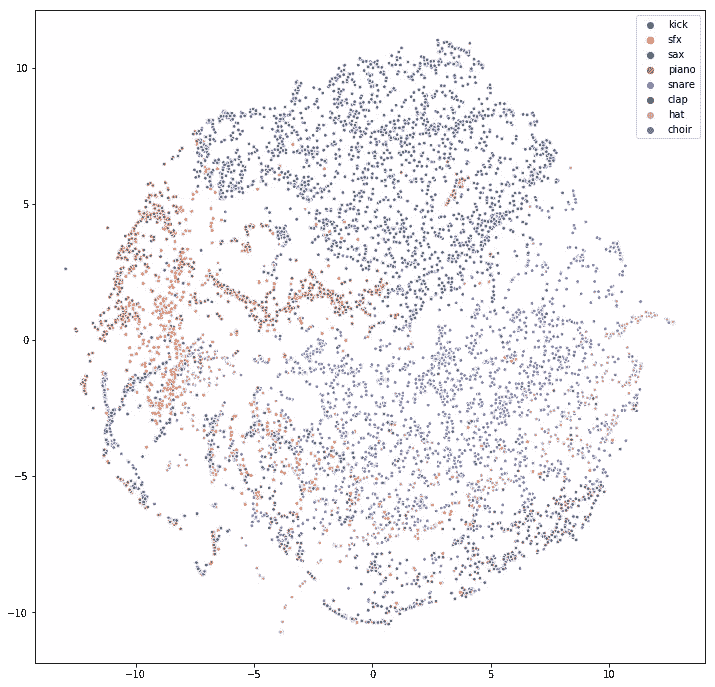

实际上，我很惊讶这些簇的效果有多好，以及哪些簇与哪些簇相邻(比如拍手、帽子、军鼓过渡)。

我做了另一个可视化，包括所有的样本(也就是文件名中没有匹配标签的样本)。

结果不是很好，但这可能部分是因为我没有时间或耐心摆弄 TSNE 参数，只是拿了我得到的第一个结果；)

更深入地研究一下细节，甚至直接在二维空间进行嵌入，可能会带来一些有趣的见解，但我会把这些留到以后再说。

VAE 的所有代码，以及一些预处理和其他随机位[可以在这里找到](https://github.com/maxfrenzel/SpectrogramVAE)。

但是如果你对代码感兴趣，请注意。这不是真的要分享。它非常粗糙，评论很差(如果有的话)，很多东西都硬编码到我的音频处理参数和目录结构中。我可能会在某个时候着手处理这个问题，但是现在要意识到它相当的混乱。

我没有分享我的 Wavenet 代码，因为我尝试的所有更复杂的东西实际上都不工作，而且工作的东西实际上只是对[原始实现](https://github.com/ibab/tensorflow-wavenet)的一个小修改，它允许直接读取和馈入预先计算的嵌入向量。npy”文件，并使用它们进行调节。

# 样本生成阶段

所有的模型都准备好了，我可以开始制作一些声音了。

首先是 VAE 和格里芬-林的组合。本质上，它给了我三种发声的方法。

最简单的方法是对声谱图进行编码，再次解码，然后重建音频。这个古钢琴样本就是一个例子。我们可以看到，基频得到了很好的保留，但许多其他细节发生了变化。

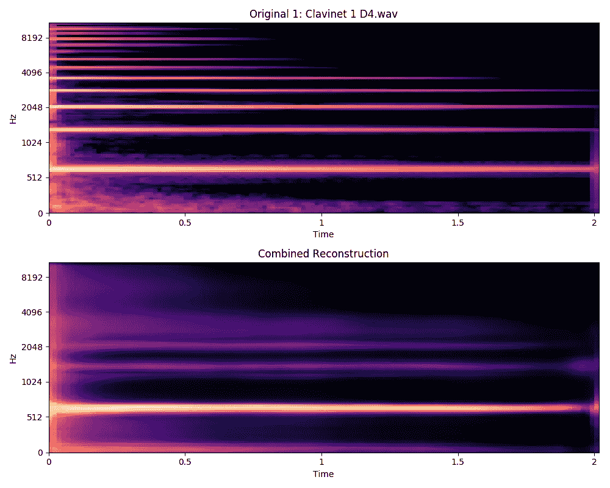

这个哔哔声是另一个很好的例子。同样，基本频率和整体轮廓被保留，但很多更好的细节被改变或丢失。

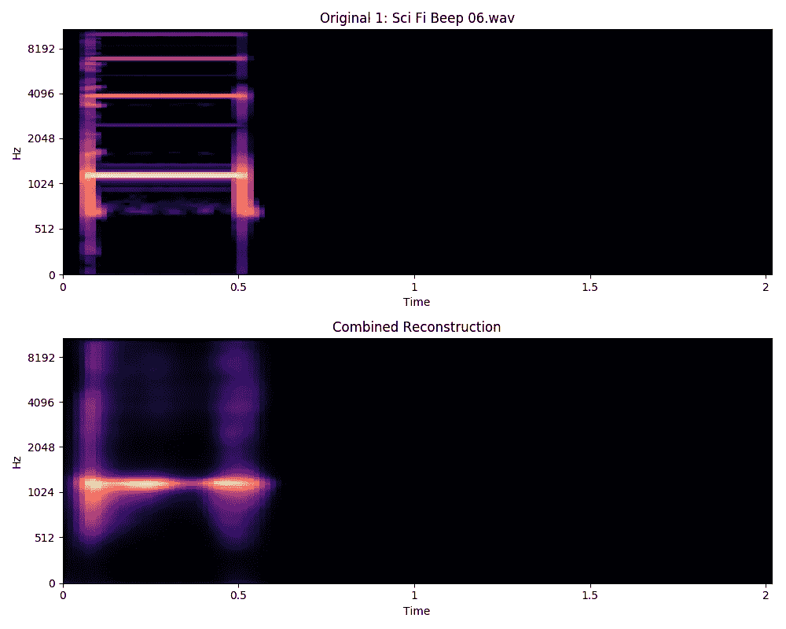

第二种方法是实际上结合两个或更多的嵌入，然后解码产生的潜在代码。一个很好的例子，实际上最终形成了一个主要的旋律元素，就是底鼓和声乐音符的结合。

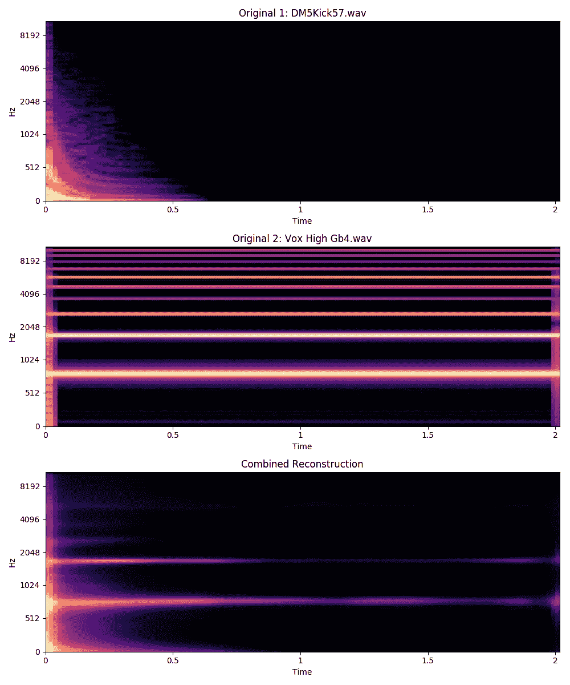

结果是一个相当不错的和声，但在开始时，踢声增加了一些有趣的 subby 攻击，产生了一个不错的 stabby synth 声音。

这是另一个例子，结合三个不同的输入。

生成的样本是一个踢音，就像其中一个输入一样，但是有很多来自踩镲和 tabla 的有趣字符。

最后，我也可以不需要任何输入，直接从潜在空间简单取样。这导致了许多有趣的结果。

其中一些是清晰可辨的声音类型，而另一些则更加随意和实验性，但作为声音效果仍然有用。

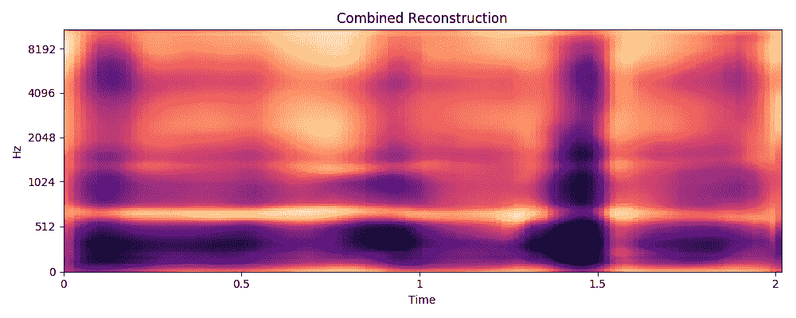

我想说的是，在这一点上，我遵循了一个非常清晰和深思熟虑的产生和设计声音的过程。但是考虑到时间有限，我实际做的是编写一个脚本，从 0 到 3 之间随机选择一个数字，然后从我的库中随机选择这么多输入样本，嵌入它们(或者如果输入样本的数量为零，则从潜在空间中采样一个嵌入)，组合它们，并生成最终的音频。

这样我产生了几千个半随机样本。

我做的最后一件小事是，记录我说“Taktile”(我的艺术家名字)和“NeuralFunk”，然后通过 VAE 解码器和 Wavenet 运行这两个样本，以获得基于每个样本的两个样本。

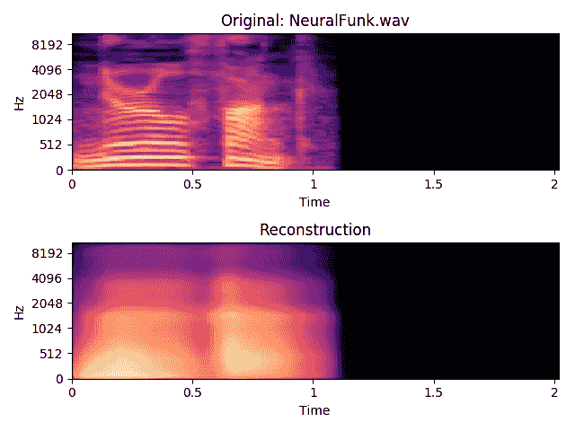

结果并不真正像人声，但它们作为声音效果进入了轨道(例如，第一次下降时的 techy 声音实际上是“Taktile”样本之一)。

我对 Wavenet 采用了几乎完全相同的方法。

在 0 和 3 之间选择一个随机数，随机选择预先计算的条件嵌入的数量(或从高斯分布中随机采样一个)并将它们组合成一个条件向量，然后让 Wavenet 为每个生成 32，000 个样本(2 秒)。

我又一次用这种方法产生了几百个随机的声音片段。

有趣的是，Wavenet 似乎理解条件反射的一般声音特征，但不理解时间信息。由于它不仅训练了单镜头，还训练了完整的循环和节拍，所以它产生了一些非常有趣的输出。

例如，给定一个单一的打击乐声音作为条件，结果有时实际上是由相似类型的打击乐声音组成的完整节拍(例如，如果条件是在小军鼓上，则是小军鼓节拍)。

如果我继续从事这项工作，我可能想尝试的一件事是，不要对整个频谱图进行编码并将其用作全局条件，而是对单个时间片进行编码，然后将其作为局部条件馈入 Wavenet，以便对声音的时间方面进行更多控制。

但是现在，我仍然有很多有趣的样本可以玩。

对于这两个网络来说，似乎很难产生的一件事是崩溃、打开的踩镲声和其他类似铙钹的声音。我没有特意尝试产生这些，但在我的随机样本中，我没有发现令人信服的钹音。

但我想，鉴于其复杂的声音特征，钹一直是对合成器更具挑战性的声音之一。也许这可以成为未来实验的另一个有趣的方向。Wavenet 在这方面似乎更有前景，因为 VAE 解码器(至少我的 hacky 版本)的升级洗去了所需的更精细的细节。

您可以[在这里](https://www.dropbox.com/s/vo5s1iq5eqyxxcm/Generated%20Samples.zip?dl=0)下载所有样本。zip 文件中有两个目录，分别对应于 Wavenet 和 VAE 样本。

对于 VAE，以“random”开头的文件名是基于我的库中随机样本的文件。那些以“sampled”开头的直接从潜在空间采样的代码中解码。对于每个音频文件，我还包括一个输出频谱图的 png，以及输入频谱图(如果有任何输入)。

Wavenet 目录包含对应于四个不同模型的四个子目录。“generated_1”和“generated_2”是无条件模型，而“generated_emb2”和“generated_emb_big2”是条件模型(末尾的数字是指我用来训练它们的批量)。

对于有条件的文件，文件名包含作为条件的原始文件。例如“generated_emb_big2”中的“emb 2 _ 13727—StylusBD08 023 _ 9519—Kick JunkieXL 3 . wav”是以“stylusbd 08 023”和“Kick JunkieXL 3”两个文件为条件的(其他数字指的是我自己的内部索引系统)。这个特殊的文件实际上是一个很好的例子，其中两个简单的踢音的组合，都是一个镜头，导致一个完整的基于踢的节拍。

你可以随意使用这些样本。如果你因此想出了一些很酷的东西，我很想听听！

# 生产阶段

生成了成千上万个样本后，终于到了开始制作并把它们变成类似音乐的东西的时候了。

事实上，我也在这个月搬到了一个新公寓。虽然因此损失了相当多的时间，但我至少享受到了在一个崭新的(最初)整洁的工作环境中工作的快乐。

虽然我最近开始更多地进入 Ableton Live，但我决定在 Native Instrument 的 Maschine 中做这个项目，因为这仍然是我迄今为止最舒适和熟悉的 DAW。我只是非常偶尔地切换到生活，因为它的惊人的扭曲工具。

最初的生产阶段相当痛苦。即使我有我的 VAE 作为一个相似性搜索工具，它目前的版本有很多缺点，使它对这项任务相当无用。例如，它只考虑样本的开始。但是特别是在 Wavenet 的情况下，文件中常常隐藏着一些有趣的部分。

出于这个原因，我实际上不得不手动浏览所有的样本，找到有趣的声音。这花了我整整两个晚上的时间，每个晚上花几个小时来检查所有的声音，并把我发现的有趣的声音按照声音类型粗略排序，即打击乐、旋律、无人机、SFX 和低音。然后，我进一步检查了鼓组，并根据鼓的声音类型对每个样本进行了颜色编码，例如，红色代表鼓脚，绿色代表小军鼓，等等。

最后，我把所有的踢腿，陷阱和帽子复制到不同的组，这样我可以在以后一起处理它们。

最后，我有了 20 多个不同的组，每个组有 16 个样本，总共有 320 多个我认为有趣的样本。

但是这还不是乏味的预处理的结束…正如我提到的，有趣的声音通常不在样本的开始。我必须进去分离出我真正想要的部分。

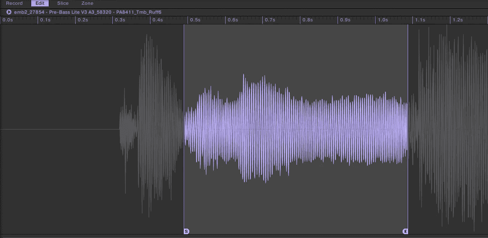

即使是简单的鼓声，看起来是从样本的开头开始的，它们也经常会有一些令人讨厌的伪像，我不得不去掉几毫秒。

接下来是非常粗糙的造型。我是想让声音一次性播放(也就是说，一旦被触发就一直播放)还是 ADSR(当声音不再播放时就逐渐消失)？如果是 ADSR，我必须设置攻击、衰减、持续和释放参数。

此外，相当多的样本，尤其是 VAE 产生的样本，有一些令人不快的高频噪声，因此我应用了一些低通滤波器来消除这些噪声。

最后，为了以一致的调子写这首曲子，在这种情况下(主要是)F 小调，我必须通过单独改变音高来调整旋律样本。

有了这些，几个小时后，基本的准备和预处理终于完成了，我可以开始做音乐了。

我做的第一件事就是布置了一个 [*阿门破*](https://en.wikipedia.org/wiki/Amen_break) 。我想这么做是因为作为一名鼓手和低音制作人，这是用新声音演奏时最自然的事情。但我也想重新采样，这样我就可以把它切碎，然后作为早餐。

结果是一个相当好听的阿门休息(除了最后一个蹩脚的响钹)。对于附带的图像，我认为这将是一个很好的触摸运行原来的“*阿门，兄弟”*封面通过*deep dream*；)

[点击此处](https://www.instagram.com/p/Bo9ATWbhCbQ/)或下图收听。不幸的是，Instagram 嵌入似乎不起作用，所以我只是链接到它。

[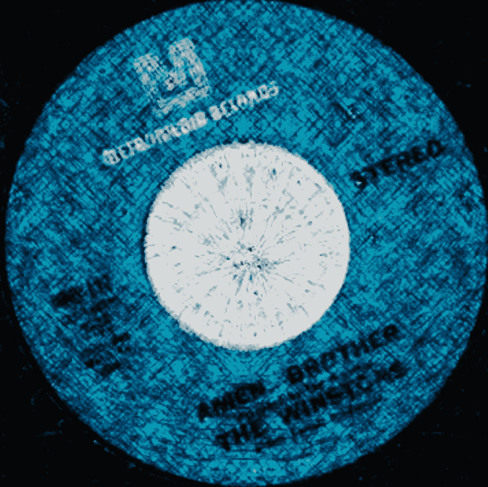](https://www.instagram.com/p/Bo9ATWbhCbQ/)

接下来，我在周一请了一天假，完全专注于这个项目。我早早起床，精神饱满，冲了杯咖啡，坐在办公桌前。然后…

没什么！不管我做了什么，听起来都很糟糕。我试图开始放下一些鼓，但没有得到任何东西听起来很好。然后我想也许可以从一些旋律开始。或者低音。但是无论我从哪里开始，我就是不能得到任何像样的东西。

我早期尝试更多的声音设计，给样本添加滤镜、效果和调制，听起来也很糟糕。

那天中午左右，我感到完全失去了动力，认为这个项目注定要失败。我决定去散步。

我之前已经提到过步行的创造力。这里再次证明了这一点。当我大约一小时后回来，再次坐在我的办公桌前时，神奇的事情发生了。我完全进入了状态，一切似乎都自然而然地走到了一起。

到了晚上，我并没有真正意识到已经过了很长时间，我已经完成了很多声音设计，并且对音轨有了大致的感觉。我还准备了后来成为引子的大部分内容。

在接下来的几天里，我做了很多微调，并在介绍中加入了额外的元素。但是每当我试图超越它时，我又感到被卡住了。

幸运的是，当我告诉我的好友 [D.A.V.E.](https://www.digitalandvinylexpert.com) 这个项目的时候，他立刻表示愿意合作。

D.A.V.E .不仅是一个了不起的 DJ 和制作人，他还是一个很棒的老师，他在这首歌上给了我很多帮助。我强烈推荐看看他的东西，他有一些非常酷的教程和其他东西在不久的将来会出现(我们两个之间甚至可能会有更多的合作)。

 [## 数字和黑胶唱片专家

### D.A.V.E .是 DJ 兼导师。在所有平台和软件上工作。D.A.V.E 教授 DJ 表演的所有方面和…

www.digitalandvinylexpert.com](https://www.digitalandvinylexpert.com) 

因此，在这一点上，已经形成了对赛道的总体想法和感觉，但在其他方面陷入了困境，我将它交给了 D.A.V.E .他立即投入其中，并在第二天向我发送了他的一些想法和想法。

在他加入之前，我特别纠结于介绍之后的结尾。他建议尝试在中场休息时做，几乎给它一种陷阱的感觉，并奠定了一些节拍，我后来建立了。

他还想出了一些 synth 部分，老实说，第一次听我真的觉得有点烦人，但后来我完全喜欢上了，经过一些修改，变成了我最喜欢的元素之一。

这是合作的一个很酷的地方。即使你不总是完全喜欢或同意你的合作者所做的，它也会给你新的想法，帮助你摆脱困境。你可以修改它，让它成为你自己的，最后想出一些你自己做梦也想不到的很酷的东西。

在接下来的几天里，我们来来回回地更新项目。事实上，我们在完全不同的时区(D.A.V.E .在伦敦，我在东京),这对协调工作很有帮助。晚上(我的时间)下班后，我们会通个电话，讨论一下想法，然后我会在赛道上工作几个小时。晚上结束的时候，我会把我最新的版本发给他，第二天早上我起床的时候，他已经给我回复了一些新的想法。

最终，在大约一周的时间里，NeuralFunk 长成现在的样子。这根本不是我在开始这个项目时设想的那种 Neurofunk 曲目，但无论如何它总是意味着在实验方面。

下面是(几乎)最终安排在机械。这绝对是我做过的分组和图案最不同的 Maschine 项目。我糟糕的(或者更确切地说，几乎不存在的)命名方案也无助于这个项目的发展。

有很多事情我想改变或改进，特别是低音和其他低频元素相当混乱，但没有时间了。

所以最后我决定就此结束，尽情享受，尽情享受。要看我现场即兴创作的视频，请点击这里或下面的图片。

[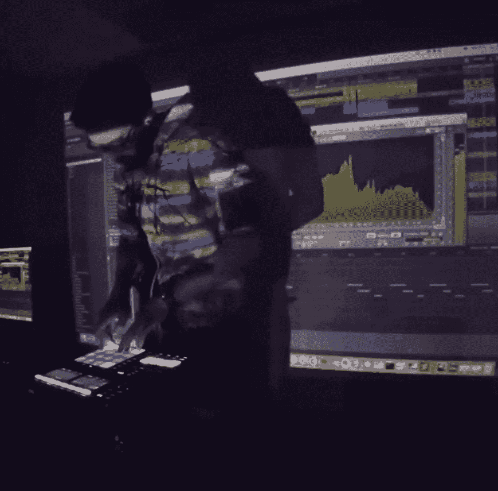](https://www.instagram.com/p/BpUHNzihncV)

总的来说，我认为这个项目非常有趣。老实说，我唯一完全满意的部分是引言，如果有更多的时间，我可能会删除很多东西并重新制作，但考虑到时间限制以及样本本身的实验性质，我认为结果并不太坏。

顺便说一下，这篇文章也是如此。我想尽可能快地把它写下来，并在 NIPS 研讨会的最后期限之前基本上与轨道一起发布，所以它没有经过太多的编辑，并达到我通常写作的目标质量。很抱歉。如果你坚持到这里，谢谢你忍受我的长篇大论！

从现在开始，我可以把它带向很多方向。其中一些我已经在上面提到过了，还有更多的我想到了。

例如，我想改进 VAE 的编码器/解码器架构，从像对待任何其他图像一样对待频谱图的简单(解)卷积网络，到考虑沿两个轴的不同信息的东西。

我还在考虑回到我最初的想法，将相似性搜索(甚至可能是样本生成)集成到一些有趣的现场表演工具中。

但首先，我需要休息一下，补上一些睡眠！

顺便说一下，如果你对我更多的音乐感兴趣，也可以看看我上一首歌，它是用更传统的方式制作的！；)

你觉得这个项目怎么样？知道我下一步该做什么吗？我也很想知道你是否尝试过类似的事情，或者把我的一些想法或样本用在你自己的音乐中。

发挥创造力！