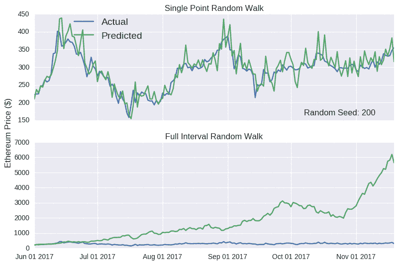
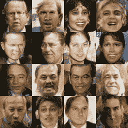
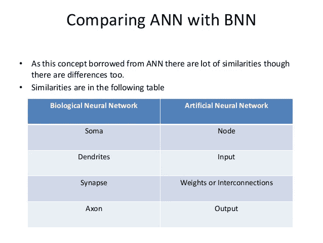
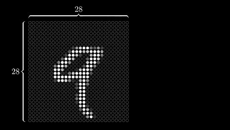
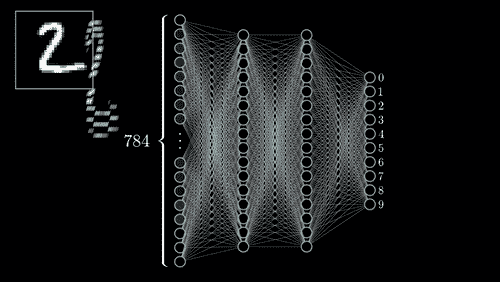
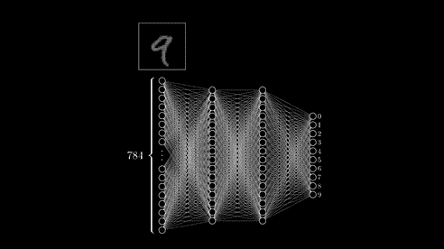
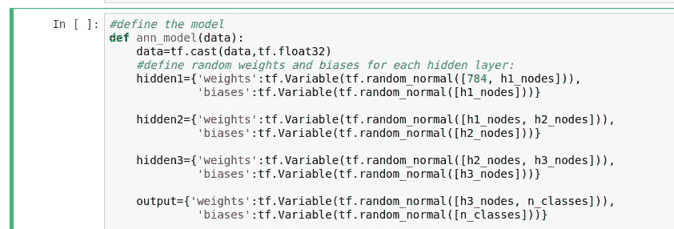
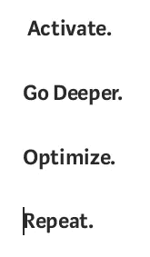
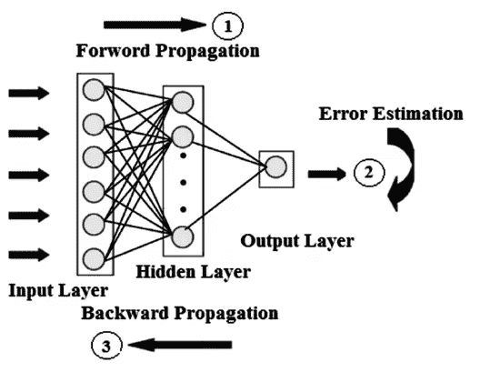

# 简化的神经网络！

> 原文：<https://towardsdatascience.com/neuralnetworks-implementation-d55cc6fc2f62?source=collection_archive---------7----------------------->

courtesy- [here](https://bitsdroid.com/artificial-neural-network-ann/)

你等了多久才实现你的第一个人工神经网络，却找不到正确的资源和简单的解释？嗯，在这里。在阅读这篇文章之前，我建议你先了解一下我上一篇文章[中的神经网络，这样接下来的解释就很容易理解了。](https://medium.com/getting-started-with-neural-networks/getting-started-with-neural-networks-d98a6e470fae)

在深入研究神经网络之前，我想讨论一下神经网络的一般应用，以便回答这个问题- ***在现实生活中，我在哪里可以找到适用的神经网络？***

courtesy- [here](https://memegenerator.net/instance/66443036/x-x-everywhere-neural-networks-neural-networks-everywhere)

## **现实生活中的应用:**

courtesy- [here](https://www.google.com/search?q=machine+learning+stock+prediction+gif&client=ubuntu&hs=Nov&channel=fs&source=lnms&tbm=isch&sa=X&ved=0ahUKEwid3pjW5KvcAhWLsY8KHVfhAHYQ_AUICigB&biw=1301&bih=670#imgrc=rlQu5Ze7HsMIyM:)

1.  你在哪里听说过预测股票市场价格的机器吗？是的，太酷了，不是吗？由于神经网络确实擅长处理复杂数据并帮助分析这些数据，因此**股票预测**是神经网络无缝工作的应用之一。此类预测型应用，如资产评估、员工工作表现等。大量使用神经网络。
2.  在图像处理和计算机视觉的应用中，神经网络比传统的灰度转换方法有更好的优势，这是最重要的。图像到文本、图像恢复、图像压缩、模式识别或者最著名的所有对象检测和面部识别，仅仅是几个主要的例子。

courtesy- [here](https://github.com/torch/torch.github.io/blob/master/blog/_posts/2015-11-13-gan.md)

3.**生成对抗网络(** GAN)是神经网络可以自己生成图像的另一个应用。这对于精确的图像生成和两幅图像的合并是非常有益的。这是神经网络的最新应用，并被广泛研究。

4.语音识别、天气预测、指纹识别、**手写识别等。还有其他使用神经网络的小规模应用吗？**

5.**医疗诊断**是一种可以利用神经网络进行重大改进的应用。

你能猜出神经网络在你日常生活中的应用吗？

它被你几乎每天使用的手机和应用程序所使用。这就是——手机摄像头中的**自动面部识别**是卷积神经网络最常用的例子，脸书的自动面部识别和谷歌照片应用程序中的照片都是基于这些卷积神经网络的典范。这里的应用程序列表可以是无止境的。

现在我们知道神经网络是一个大奖！我相信你现在可能对了解神经网络更感兴趣。

***如何着手这个博客……***

我想阐述一个正常的人工神经网络背后的理论概念和逻辑，以及实际的实现，这实际上加深了我们对理论的理解。因此，我把整个博客分成了实际实现的部分，它背后的理论和用来实现它的逻辑。它都是一个连续流程的实现的一部分，但只是为了更好地理解和关联而对部分进行了区分。

***你知道神经网络的想法实际上是怎么产生的吗？***

它的灵感来自于我们人类自己的生物神经网络！该工作完全类似于一层又一层神经元的有效工作，以形成生物神经网络。对于人工神经网络来说，流程和操作质量都是从生物神经网络模拟的，因为我们需要建模的基本原理是模拟人脑从示例中学习的功能，正如我在以前的 [**博客**](https://medium.com/getting-started-with-neural-networks/getting-started-with-neural-networks-d98a6e470fae) **中提到的。**

***我们就这样开始……***

我们使用 Tensorflow 库中从 0 到 9 分类手写数字的最著名的 MNIST 数据集来用 Python 实现 ANN 模型。

***前提:***

Tensorflow 是 Python 中用于神经网络实现的最有效和最有用的库。我更喜欢用 Jupyter 笔记本来实现。但是你可以使用任何你选择的 IDE——Spyder，Sublime Text 3 等等。

在开始程序之前，我们需要安装 Tensorflow。安装非常容易，可以从[这里](https://www.tensorflow.org/install/)安装。普通台式机可以下载 CPU 版本。

完整的代码和输出截图可以在我的 github [这里](https://github.com/ditsme/Machine-Learning/tree/master/Neural%20Networks)找到。随意叉！

# 理论和术语:

为了理解这一点，我们需要在这里介绍 4 个基本术语:

1.  **感知器**:它只不过是一个简单的层神经网络，受一个生物神经元的启发，如下图所示。

courtesy-[https://towardsdatascience.com/from-fiction-to-reality-a-beginners-guide-to-artificial-neural-networks-d0411777571b](/from-fiction-to-reality-a-beginners-guide-to-artificial-neural-networks-d0411777571b)

**2。** **输入:**输入无非是我们要馈给网络的数据。通常定义为 x1，x2，…xn。每个输入都是用于确定输出的样本或独立变量。输入可以是任何形式——文本、图像或整个视频。这里我们有手写数字的图像作为输入。

**3。输出:**输出是为激发激活的相应神经元生成的。

**4。** **激活功能:**输入信号经过激活功能后，可以进一步被其他层处理或者直接产生输出。激活功能本质上可以被称为用于处理输入以获得输出的处理单元。它用于根据激活功能的类型将输出映射为 0 到 1 或-1 到 1。有各种类型的激活函数，包括 s 形函数、阶跃函数、指数函数等。

输入象征着生物神经元的树突，树突是神经元将信息从一个神经元传输到另一个神经元的接收器。类似地，根据所定义的功能，其他相似之处如下。

courtesy- [here](https://www.slideshare.net/MohdArafatShaikh/artificial-neural-network-80825958)

# **实现:**

Import Dependencies

接下来，我们导入我们的依赖项 Tensorflow 和 MNIST 数据，我们将使用这些数据提前进行训练。

Read data

接下来，我们读取数据集并保存到变量“mnist ”,指定 path 作为第一个参数，one_hot 作为 TRUE。现在你可能会想什么是热点。

# **应用中使用的逻辑:**

对于输入:

本质上，在人工神经网络模型实现中，神经元只不过是保存数值的占位符，就像这里一样，我们在神经元中存储了从 0(黑色)到 1(白色)的灰度值。

这些神经元共同形成黑白图像输入。

courtesy-[https://gfycat.com/gifs/tag/neural+networks](https://gfycat.com/gifs/tag/neural+networks)

对于输出:

One_hot 设置为 true，以便在我们获得相应的输出时激活输出节点。

例如，这里我们有 10 个可能结果的总数，因为我们有 0-9 个数字要识别。因此，对于作为输入提供的任何输入图像，对应于由我们的模型识别的每个输出的 10 个神经元中的任何一个都将被点亮。举个例子，

对于数字 0=[1 0 0 0 0 0 0 0 0 0]，

对于数字 1 =[0 1 0 0 0 0 0 0 0 0 0 0]等等…

其中该阵列包含相应输出神经元的一组二进制值。

所以我们得出结论，

***神经网络的第一层总是输入层，而最后一层总是输出层。***

# **理论和术语:**

那么处理实际发生的中间层呢？

这些层只不过是**隐藏层。这是所有魔法的开始！**

人工神经网络是受生物神经网络的启发，生物神经网络由多个神经元组成，它们同时工作并协调为我们的身体执行各种任务。因此，为了更好的性能，我们在人工神经网络中也有多层神经元。我们越深入越好，但是对于一个小的数据集来说，这将是一个问题。

***那么如何决定要使用的隐藏层数呢？***

可以有任意多的隐藏层，但这也取决于数据集的大小。虽然随着网络变得更深，隐藏层的数量越多越好，但对于较小的数据集，这将降低而不是提高精度。

# 实施:

我们为我们的模型选择了 3 个隐藏层，500，600，300 分别是该层中的节点总数。

Defining total number of nodes in hidden layers

Defining variables

稍后，我们定义输出类的总数、批量大小和张量(占位符),以变量的形式定义输入 x 和输出 y。

# **应用中使用的逻辑:**

***处理隐藏图层:***

类似于生物神经元，在 ANN 中，具有特定灰度值的 784 个输入神经元仅触发(触发)下一个隐藏层中的特定神经元，这又会触发下一个隐藏层中的一些模式，并最终触发输出层中的特定模式。网络选择最亮的神经元作为最终输出。

courtesy- [here](https://gfycat.com/gifs/tag/neural+networks)

本质上，隐藏层的作用是将数字分成单独的环和线，形成数字。例如，下面我们看到 9 有一个环和一条线，它们组合在一起形成数字。因此，在不同的层产生特定的图案，这不同于为具有 2 个循环的 8 产生的图案。因此，我们需要更深的网络来识别具有不同特征和巨大图像的更大数据集的关键模式。

courtesy- [here](https://gfycat.com/gifs/tag/neural+networks)

简而言之:

## **像素— >边缘— >图案— >数字**

# 理论和术语:

现在，我们如何让我们的模型只激发特定模式的特定神经元？

答案是通过使用“权重”和“偏见”。

**5。权重:**权重不过是生物神经元中的轴突。我们在图像中看到的轴突用于将信息从一个神经元传递到另一个神经元。它只不过是连接环节。这是一个非常重要的信息，因为权重决定了要传递的信号的激发和抑制。简单地说，它遵循奖惩方式，即兴奋引起一个神经元激活另一个神经元，反之则抑制。这与神经网络中信息的生物传递是一样的。

**6。偏置:**它可以被视为一个开关，这个开关总是打开的，也就是说它的值总是 1。基本的想法是，人类神经元接受一堆输入并将它们“相加”在一起。如果输入的总和大于某个阈值，那么该神经元将“触发”(产生一个输出到其他神经元)。这个阈值本质上与偏差是一回事。因此，通过这种方式，人工神经网络中的偏差有助于复制真实的人类神经元的行为。

# 实施:

因此，我们首先为每个隐藏层和输出层定义随机权重和偏差，以确定该层的神经元总数。

Define weights and biases

定义完所有变量后，我们开始使用权重和偏差定义模型和各层的功能。

Activation function

# 应用中使用的逻辑:

对于该层中的给定模式，我们分配某些正权重来激励/激发神经元，分配负权重来抑制/停止激发神经元。

为了以数学方式计算这些值，我们将输入乘以整个图层的相应权重，最后将其与偏差相加:

***加权总和=(权重*输入)+偏差***

然后，我们将这个加权和馈送给被称为“RELU”的激活函数，该激活函数被称为整流线性单元。激活的阈值简单地为零。

它计算函数 *f* ( *x* )=max(0， *x* )。这是深度学习中最常用的激活功能，因为它大大加速了训练部分。

# 理论和术语:

***那么“深度学习”这里的学习部分到底在哪里呢？***

如果你还记得，我们最初初始化了随机权重和偏差，因为我们在开始时没有意识到它们。

我们的最终目标是最小化预测输出时引起的误差。因此，学习特别意味着以误差最小化的方式来确定这些权重和偏差。这是由优化器完成的。

这里，我们使用 **Adam Optimizer** 优化我们的模型，以最小化成本。Adam Optimizer 使用随机梯度方法来优化我们的模型。使用不同的方法还有各种其他的优化器。

# 实施:

定义模型后的最后一部分是定义模型应该如何训练。

我们预测每个输入 x 的输出，然后通过将预测值与数据集中标记的正确值 y 进行比较来确定模型的成本/误差。

Prediction of output

我们定义用于循环的会话，直到达到总的历元数。我们一起批量训练输入并运行优化器。

最后，我们使用“正确的”变量来对照期望值检查预测输出的 one_hot 值。

最后通过计算和打印模型的精度来验证模型的有效性。

最后一行是用输入 x 和输出 y 调用训练函数来启动训练。

# 应用中使用的逻辑:

***我们的模型自己训练多长时间？***

该模型保持训练，直到误差达到预定义的阈值，或者通过定义所需的总时期(循环)。

我们可以调整许多参数，如隐藏层数、节点数或使用的优化器等。检查并降低错误率。

本质上，神经网络的工作可以概括为:

Summarizing the process

courtesy- [here](/random-initialization-for-neural-networks-a-thing-of-the-past-bfcdd806bf9e)

唷！这对初学者来说有点难，不是吗？

我知道开始时的感觉:/

但是相信我，一旦我们在练习后彻底掌握了它，一切都会变得很简单。如有任何疑问，请在下面评论。让我知道你对这篇文章的看法，以及你希望我接下来发表的任何话题。