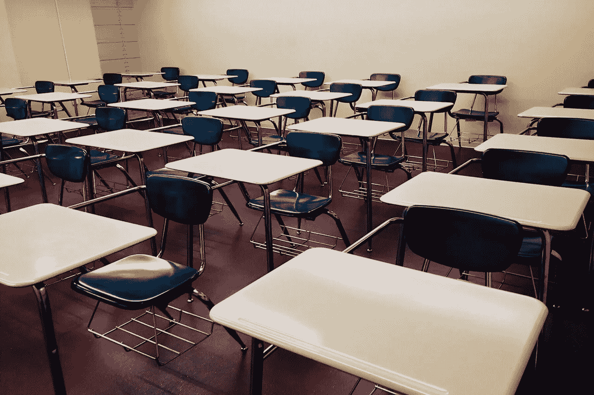

# 新的试点研究表明，机器学习可以预测暴力学生

> 原文：<https://towardsdatascience.com/new-pilot-study-shows-machine-learning-can-predict-violent-students-359b9ec823ce?source=collection_archive---------5----------------------->

在暴力事件或悲剧发生后，你经常会听到许多关于潜在预防措施的猜测。

以枪击事件为例，人们通常会谈论袭击的迹象或前奏。这本来是可以避免的吗？那些接近攻击者的人看到了他们应该报告的什么？

很多人分享他们对这件事的看法，但这并不一定能揭示现实情况。甚至有可能找到一种可靠的方法来防止这些悲剧吗？

最近的一项研究可能会提供一些答案和一些希望。

## 有可能预测青少年的暴力行为吗？

当一个孩子遇到麻烦并表现出暴力或攻击的迹象时，[很明显，他们需要支持](https://www.aacap.org/AACAP/AACAP/Families_and_Youth/Facts_for_Families/Facts_for_Families_Pages/Understanding_Violent_Behavior_In_Children_and_Adolescents_55.aspx)，那些接近他们的人或心理健康专家可能会提供支持。

在任何人获得帮助之前——成年人也是如此——必须有人注意到潜在的问题。不幸的是，这些问题并不总是显而易见。这是一件很容易被忽略的事情，即使是对需要帮助的孩子的父母来说。

那么，答案是什么？我们如何识别或知道某人何时需要帮助？现代技术似乎可以提供一个解决方案。

来自辛辛那提儿童医院医疗中心的研究人员发现，机器学习可以准确地确定校园暴力的风险。

他们发表在 T4 精神病学季刊杂志上的研究指出，这可能和一组儿童精神病学家甚至法医精神病学家一样准确——如果不是更准确的话。

## **机器学习有什么帮助？**

首先值得注意的是，这项研究仅仅表明预测攻击性是可能的。这并不能证明机器学习技术可以防止校园暴力。

需要进一步的研究来确定这一点，但是解决这个问题是研究小组的“下一个目标”

然而，研究人员得出结论，他们可以为问题行为提供更准确的方法，这本身就是一个巨大的发现。

“以前的暴力行为、冲动、学校问题和消极态度与对他人的风险相关，”医学博士德鲁·巴兹曼说。巴兹曼是这项研究的主要作者，也是辛辛那提儿童医院医学中心的儿童法医精神病学家。

这项研究涉及来自 74 所美国学校的 103 名青少年学生，他们表现出行为变化和攻击性。包括在内的许多学生是从精神病门诊或住院诊所和急诊科招募的。

研究小组根据他们开发的风险等级量表将参与者分为两组。他们通过使用从录音中转录的评估来做到这一点。

在直接采访后，研究人员评估了两组人表现出暴力行为的可能性。他们使用机器学习算法分析了他们获得的信息，该算法实现了 91.02%的预测准确率。

当他们还包括参与者的人口统计和社会经济数据时，准确率上升到 91.45%。

合著者赵毅·尼博士是辛辛那提儿童医院生物医学信息学领域的计算科学家，他证实了该系统的准确性。

[倪说](http://neurosciencenews.com/ai-school-violence-8946/)“仅基于参与者访谈的机器学习算法，在评估风险水平方面几乎与我们研究团队的全面评估一样准确，包括从家长和学校收集信息，审查可用的记录，并在我们开发的两个量表上评分。

## **这在现实世界中意味着什么？**

根据这项研究，机器学习可以预测暴力。但是这对公共安全的未来意味着什么呢？有可能完全防止暴力袭击吗？

真实的答案是我们还不知道。研究人员将进行进一步的研究，看看他们的技术是否有助于完全防止暴力。我们需要等待，然后才能得出任何结论，但这项初步研究表明，机器学习在这一领域可能是有用的。

至于机器学习行业，这项研究提供了证据，表明这是现代社会的另一个领域，这项令人生畏的技术可以改善。

这些发现将进一步支持该行业，并有助于引入该技术的新用途。例如，如果事实证明你可以使用机器学习工具来防止校园枪击事件，那么你可以预测并潜在地阻止哪些其他暴力事件？

时间会证明一切，但很可能不久的将来，机器学习会让我们的生活变得更安全、更美好。

*图片由* [*Pixabay*](https://www.pexels.com/photo/chairs-classroom-college-desks-289740/) 组成