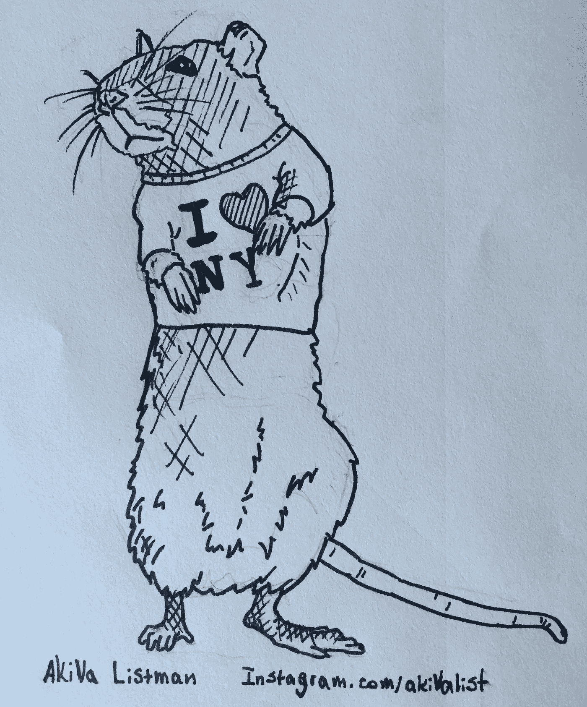

# 纽约人应该学会与老鼠相处，因为它们不会离开:数据可视化。

> 原文：<https://towardsdatascience.com/new-yorkers-should-learn-to-get-along-with-rats-because-theyre-not-leaving-a-data-visualization-db4ca516762b?source=collection_archive---------5----------------------->

一个风和日丽的夜晚，我和丈夫在华盛顿广场公园散步时，注意到一对微笑的年轻游客夫妇带着一个小女孩向我们走来。女孩很可爱，直到她开始尖叫。她一边爬上父亲的身体，一边尖叫着指着一只从公园长椅下跑出来的大老鼠。父母停下了脚步，老鼠也一样。

More rats or more complaints? Probably both: 98,273 rat complaints to NYC 311 from 1/2010 through 7/2017.

我以为老鼠会继续跑，因为只差一只脚就可以到达一个可爱的安全花坛了，但是它纹丝不动。为了帮忙，我跺着脚，朝老鼠走去，这应该能让它立刻动起来。但是那只老鼠坚持住了，直到我靠近得不舒服，它才最终让我们都走了。

18 世纪，老鼠乘坐英国船只来到纽约，然后开始大量繁殖。虽然它们会对健康和 T2 的财产造成威胁，但纽约市喜欢谈论它的老鼠，有时甚至会吹嘘它们。还有[披萨鼠](https://www.youtube.com/watch?v=UPXUG8q4jKU)，他英勇地检索了一份普通的切片，有近 1000 万的浏览量；[雪鼠](http://nypost.com/2016/01/25/snow-rat-is-nycs-new-rodent-hero/)，被暴风雪挡不住的人；[自动扶梯鼠](http://nypost.com/2016/12/19/rodent-on-escalator-perfectly-sums-up-rush-hour-rat-race/)，其无休止的无处可逃很容易理解，以及[垃圾鼠](http://nypost.com/2017/06/20/rat-caught-dragging-trash-bag-across-sidewalk/)，其拖着一整袋垃圾穿过人行道。

纽约的居民区一直在为最糟糕的老鼠问题而竞争。[华盛顿高地/因伍德](http://www.nydailynews.com/new-york/manhattan/rats-run-droves-washington-heights-inwood-highest-infestation-rate-manhattan-article-1.1055420)的老鼠最多，或者可能是[上西区](http://gothamist.com/2014/09/06/upper_west_side_rats.php)或者是[上西区，特别是靠近中央公园](http://nypost.com/2014/08/30/aww-rats-residents-near-central-park-complain-about-rodents/)的地方。不，[上东区](http://nypost.com/2014/02/18/half-of-upper-east-side-restaurants-are-rat-infested-study/)。还是东，但是真的[东哈林](http://East Harlem https://www.dnainfo.com/new-york/20150128/east-harlem/health-department-fights-east-harlem-rat-infestation)。或者[哈林，但是绑了 Flatbush](http://www.amny.com/news/nyc-rat-complaints-up-most-reports-in-flatbush-harlem-1.12085819) 。获胜的地区在任何时候都不快乐。尽管由于老鼠在医学研究中的重要性，它是第三个被测序的哺乳动物，但它并不被人类视为邻居。

老鼠似乎在四处活动，热点地区随着季节和城市努力对抗老鼠数量激增而潮起潮落。纽约市的 311 系统接受电话或在线投诉以及关于任何非紧急事件的问题，有一个[啮齿类](http://www1.nyc.gov/nyc-resources/service/2374/rodent-complaint)和老鼠子类别的分类报告。

利用纽约市 311 从 2010 年 1 月到 2017 年 7 月的数据，结合美国人口普查数据，我估计纽约市各区和邮政编码的老鼠报告数量为每 10，000 名居民 311 例。**根据纽约市 311 系统从 2010 年 1 月到 2017 年 7 月记录的 98，273 次老鼠目击事件，b** ehold，下面是 gif 地图，它的美丽掩盖了它背后的痛苦。一些拉链似乎比其他拉链的鼠患情况更严重，并且有一个周期性的模式(在上面的图表中更容易看到),当春天到来时，投诉增加，夏天达到高峰，然后在秋天减少。

这告诉我们当地老鼠数量的多少？混淆数据的因素是，随着时间和空间的推移，居民或多或少可能会报告看到老鼠。自纽约市 311 系统于 2003 年启动以来，随着该系统总体使用量的增加，各主题的投诉和问题平均有所增加。网络(2009 年)、文本(2011 年)和电话应用(2013 年)311 选项让纽约人越来越容易点击和抱怨任何让他们感动的东西。

老鼠一年到头都在繁殖。然而，天气变好后，纽约人会花更多的时间在户外，所以春天和夏天可能会有更多在公园和 T2 游乐场遭遇老鼠的报道。当人们觉得他们没有被倾听时，他们可能会重复报告老鼠，直到他们看到结果，产生一个尖峰。在有很多公寓、合作公寓或配有管理员和门卫的昂贵租赁房的社区，居住者更有可能让有人在现场回应他们的室内鼠患投诉。居民可能会在城市的单户住宅区对付自己的害虫。但是，如果除了 311 之外没有人听投诉，密集的无门卫建筑或无回应房东的社区可能会显示更高的老鼠报告率。此外，垃圾容器的类型(或缺少垃圾容器)因住所类型而异。一大堆暴露在外的垃圾袋等着被捡起来[(曼哈顿)](http://www.downtownexpress.com/2016/08/16/talking-trash-downtowners-demand-city-kick-residential-garbage-off-the-curb/)比被车道隔开的密封罐能喂更多的老鼠[(皇后区)](https://www.google.com/maps/@40.7408813,-73.7086681,3a,75y,329.16h,89.81t/data=!3m6!1e1!3m4!1skgQ-QpF43rJpsvbBh0Ihmg!2e0!7i13312!8i6656)。

为了了解它们的起源、行为和在城市中的迁移模式，福特汉姆大学的科学家们研究了纽约老鼠的群体遗传学。更好的是，纽约市的动物生物学家，[博比·科里甘](https://twitter.com/rodentologist?lang=en)，是[害虫管理专业名人堂](https://pmphalloffame.net/inductees/class-of-2008/robert-corrigan/)的成员，倡导人类和老鼠共存的科学方法，并经营[啮齿动物学院](http://www1.nyc.gov/site/doh/health/health-topics/rodent-academy.page)。市长们制定了一系列策略来对抗老鼠，包括捕鼠器、垃圾控制和生育控制。最近，一项耗资 3200 万美元的多管齐下的计划宣布实施，包括使用干冰来减少老鼠数量。与此同时，老鼠仍然可以向当局告密。这不会有什么坏处。

**数据操作，图表和地图 gif 均在** [**R**](https://www.r-project.org) **中完成。数据操作和数据可视化的代码可以在我的** [**GitHub 库**](https://github.com/JListman/NYC_311_animated_map) **中找到。**

## 感谢您的阅读。

我欢迎反馈——您可以“鼓掌”表示赞同，或者如果您有具体的回应或问题，请在此给我发消息。我也有兴趣听听你想在未来的帖子中涉及哪些主题。

**阅读更多关于我的作品**[**【jenny-listman.netlify.com】**](https://jenny-listman.netlify.com)**。欢迎随时通过 Twitter**[**@ jblistman**](https://twitter.com/jblistman)**或**[**LinkedIn**](https://www.linkedin.com/in/jenniferlistman/)**联系我。**

数据和图像来源:

1.  纽约市 311 系统的老鼠报告是从纽约市公开数据下载的。在纽约市开放数据上使用了一个过滤器来识别“描述符”=“发现老鼠”[https://Data . cityofnewyork . us/Social-Services/311-Service-Requests-from-2010-to-Present/er m2-nwe 9/Data](https://data.cityofnewyork.us/Social-Services/311-Service-Requests-from-2010-to-Present/erm2-nwe9/data)的条目。在 R 中，数据被过滤以移除 2017 年 8 月的条目，因为该月不完整。
2.  由 Ari Lamstein 从 R 包*choropethryzip*版本 1.5.0 中导入每个纽约市邮政编码的人口规模，并且是对 2012 年人口的估计。[https://github.com/arilamstein/choroplethrZip](https://github.com/arilamstein/choroplethrZip)。这些数据基于美国社区调查(ACS) 5 年的估计。他们是由邮政编码列表区，而不是邮政编码。邮编与 ZCTA 的关系可以在美国人口普查网站上找到。[https://www.census.gov/geo/reference/zctas.html](https://www.census.gov/geo/reference/zctas.html)。
3.  纽约老鼠图，由[阿基瓦·利斯曼](https://www.akivalistmanart.com)提供。 [@akivalistman](https://www.instagram.com/akivalistman/)