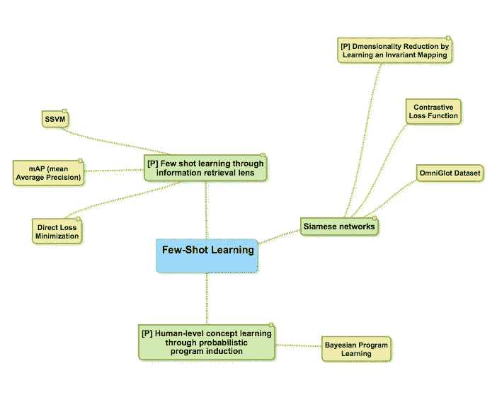

# 新手深度学习指南

> 原文：<https://towardsdatascience.com/newbies-guide-to-deep-learning-6bf601c5a98e?source=collection_archive---------1----------------------->

## 当开始 DL 时，慢慢地走

已经有相当多的人问过我如何开始机器学习和深度学习。在这里，我整理了一份我第一次学习机器学习时使用的资源和选择的路径的列表。我会继续更新这篇文章，因为我找到了更多有用的资源。

## 免费课程

从吴恩达在 Coursera 上的机器学习课程开始。这将教会你机器学习的诀窍，并稍微提高你的线性代数技能。确保你完成了所有的作业，在你完成课程后，你将掌握机器学习的概念，例如；线性回归、逻辑回归、SVM、神经网络和 K-均值聚类。在学习本课程的同时，你还有机会建立一个玩具推荐系统。这会让你大开眼界，让你更有信心进一步进入人工智能和深度学习的领域。但是请注意，还有很多其他重要的概念，本课程无法涵盖。所以，学完这门课后，准备拓宽你的知识面。如果你在完成 ng 博士的课程后非常兴奋，你应该看看[他的其他课程](https://www.coursera.org/specializations/deep-learning)，这些课程是 Coursera 上深度学习专业化的一部分。

[Fast.ai](http://www.fast.ai/) 提供关于深度学习的免费在线课程，他们在课程中提供两个部分:

*   深度学习第 1 部分:[程序员实用深度学习](http://course.fast.ai/)
*   深度学习第二部分:[程序员的前沿深度学习](http://course.fast.ai/part2.html)

在那些课程之后，你可能已经准备好处理辛顿的用于机器学习的神经网络了。与前面提到的课程相比，Hinton 的课程相对更难，因为讲课内容相当枯燥，而且包含更多的数学概念。如果你觉得你还不能掌握这门课程，不要气馁！把它放一会儿，做数学部分(在下一节描述)，然后回来。这次你一定能攻克这门课程！记住，决心，决心，是的，更多的决心。

## 数学

深度学习肯定需要你对线性代数、微分学、向量微积分有很强的掌握，这只是其中的几个例子。如果你想快速温习一些初等线性代数并开始编码，强烈推荐 Andrej Karpathy 的[黑客神经网络指南](http://karpathy.github.io/neuralnets/)。我发现 [hadrienj 在深度学习书籍上的笔记](https://github.com/hadrienj/deepLearningBook-Notes)非常有用，可以实际了解底层数学概念如何使用 Python (Numpy)工作。如果你喜欢从视频中学习， [3blue1brown](https://www.youtube.com/channel/UCYO_jab_esuFRV4b17AJtAw) 有一个最直观的视频，介绍[线性代数](https://www.youtube.com/playlist?list=PLZHQObOWTQDPD3MizzM2xVFitgF8hE_ab)、[微积分](https://www.youtube.com/playlist?list=PLZHQObOWTQDMsr9K-rj53DwVRMYO3t5Yr)、[神经网络](https://www.youtube.com/playlist?list=PLZHQObOWTQDNU6R1_67000Dx_ZCJB-3pi)和其他有趣的数学主题。在一个基于非卷积的问题上实现你自己的基于 CPU 的反向传播算法也是开始真正理解反向传播如何工作的好地方。

## 变得严肃

如果你想把你的机器学习知识提高一个档次，并准备认真对待(我指的是研究生水平的认真对待)，那么就投入到加州理工学院教授亚塞尔·阿布-穆斯塔法的[从数据中学习](http://www.work.caltech.edu/telecourse.html)吧。做好计算的准备。这可能有点挑战性，但一旦你经历了这一切并完成了你的工作，这绝对是值得的。我相信教科书很难捕捉深度学习的当前状态，因为该领域正在以非常快的速度发展。但是最重要的教科书应该是古德费勒、本吉奥和库维尔的深度学习书籍。它可以在网上免费获得，所以你也可以一章一章地下载，一章一章地学习课本。

## 报纸，报纸，报纸，该死的，我再也追不上了

是的，深度学习的知识主要来自论文，这些论文的出版速度非常快。Reddit 是一个很好的起点。订阅 [/r/machinelearning](https://www.reddit.com/r/MachineLearning/) 和 [/r/deeplearning](https://www.reddit.com/r/deeplearning/) 。不过，我发现机器学习 subreddit 更有用。 [ArxivSanity](http://www.arxiv-sanity.com/) 是查阅与你要找的论文相关的论文的好地方。深度学习看论文的时候有一点很重要，就是做好文献综述。做一篇好的文献综述会让你对事物的发展有一个很好的认识。解决做文献综述的一个方法是安装[谷歌学术 Chrome 扩展](https://chrome.google.com/webstore/detail/google-scholar-button/ldipcbpaocekfooobnbcddclnhejkcpn)并搜索你想要查找的论文。您可以通过“相关文章”和“引用者”来跟踪之前的工作以及基于该论文的新工作。阅读论文时要养成的一个好习惯是画出论文中概念的思维导图。

I drew this mind map when I read a paper on few-shot learning [1]— drawn with [SimpleMind Lite](https://simplemind.eu/)

思维导图的优势在于，它是一种跟踪论文中出现的概念之间关系的好方法。我发现思维导图对于跟踪相关文献以及它们与我正在阅读的论文之间的关系非常有用。思维导图让我对论文有一个清晰的了解，也是我阅读论文后的一个很好的总结。

我发现 Twitter 对于跟踪机器学习和深度学习研究非常有用。你可以从追随 ML/DL 领域的知名人士开始，然后从那里扩展开来。正如我通常转发关于对抗性机器学习和自动驾驶汽车的研究一样，你也可以在 twitter 上关注[我，并将其视为你的供稿。你可以做的是查看我转发的人，查看他们的推文，关注他们圈子里的其他研究人员。一旦你提供了足够的数据，Twitter 还会推荐优秀的人来关注，也就是说，关注了足够多的 ML/DL 研究人员(ML FTW！).](https://twitter.com/ark_aung)

## 卡格尔

我不能强调 [Kaggle](https://www.kaggle.com/) 有多有用。我强烈建议尝试一下 Kaggle 比赛，即使你进入前 100 名的机会很小。Kaggle 比赛的价值在于社区。阅读内核并从中吸取好的实践。阅读评论并参与讨论。在那里你会学到很多东西。您将学习人们如何进行探索性数据分析，以及他们如何处理各种缺失数据、扭曲数据等情况。您还将了解人们如何决定为什么选择某些型号而不是其他型号。Kaggle 比赛中有很多知识。

## 灵感

[机器学习的可视化介绍](http://www.r2d3.us/visual-intro-to-machine-learning-part-1/)是直观掌握统计学习技术如何用于识别数据中模式的好方法。

谷歌的[种子库](http://tools.google.com/seedbank/)是获得灵感的绝佳资源！看看例子，跟着文献走。

distilt . pub 是一个交互式学习一些 DL 概念的好地方。我希望蒸馏有比现在更多的文章。

## 冰山一角

除非你把自己学到的东西付诸实践，否则什么都不重要。ML 和 DL 听起来很神奇，直到你自己实现了整个管道。整个流程包括数据源、数据收集、数据质量评估、数据清洗、数据注释、数据预处理、构建工作流、构建模型、调整模型、评估模型、部署模型和重复模型。这些步骤只是整个 ML/DL 流程中的一些步骤。那些做过全面 DL 工作的人知道尽可能简化整个开发操作是多么重要。不仅整个数据源、收集、注释、清理和评估步骤至少占整个项目的 60%,而且它们可能是项目中最昂贵的部分之一(除了耗电的 GPU！).

总而言之，ML/DL 领域是一个成长中的领域，你必须保持你的耳朵、眼睛和头脑的开阔。不要仅仅因为一篇论文/博客/教程/个人/YouTube 视频说某个新技术在特定数据集上表现很好，就跳到这个新技术上。我见过许多闪亮的新技术来得快去得也快。始终意识到区分信号和噪声是非常重要的！

*这篇文章是活生生的事。您的反馈对我很重要。请对我应该添加哪些资源以及您在学习 ML/DL 时发现哪些资源最有帮助发表评论。非常感谢你的阅读！*

[1] Triantafillou，e .，Zemel，r .，& Urtasun，R. (2017 年)。通过信息检索镜头进行少量学习。在*神经信息处理系统的进展*(第 2255-2265 页)。