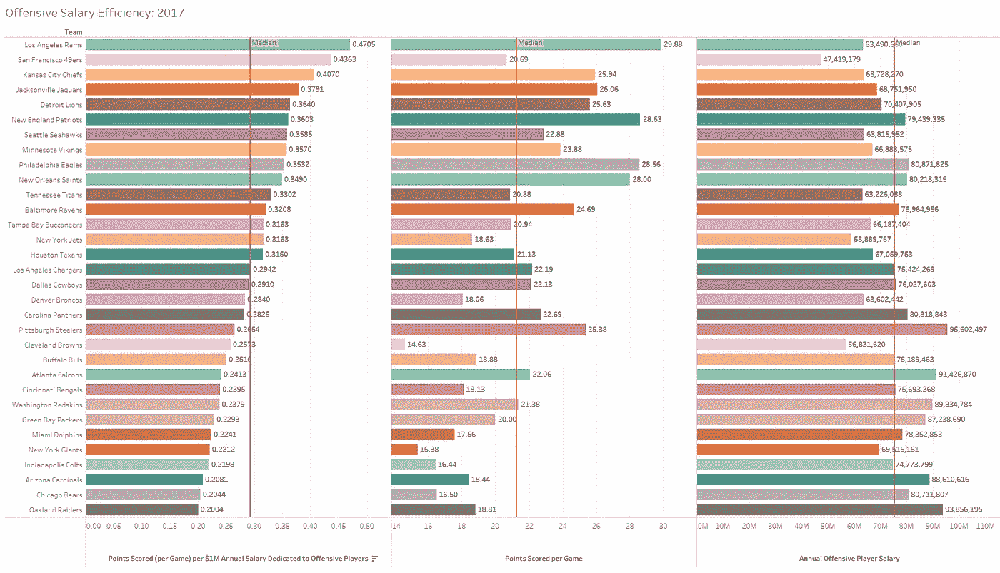

# NFL 球队进攻位置支出与赛季成功

> 原文：<https://towardsdatascience.com/nfl-team-offensive-positional-spending-vs-in-season-success-1bc2859d321?source=collection_archive---------8----------------------->

被标记的[数据新闻](http://dwpeterson.com/tag/data-journalism/)、[数据故事](http://dwpeterson.com/tag/data-stories/)、[数据可视化](http://dwpeterson.com/tag/data-vizualization/)

甚至在 3 月 14 日正式的 NFL 自由球员时期开始之前，就已经有了大量的签约。球队渴望在他们最弱的位置升级他们的名单，目标是更强大的 2018 年运动，甚至是长期的成功。虽然最好的球员倾向于获得更高的合同，但支付最高工资的球队并不总是获得最高的成功。即使下赛季有 1.77 亿美元的上限，球队也支付不起每个人的工资。有影响力的玩家的明智支出仍然是必要的。在下面的报告中，我将分析和报告 2017/2018 赛季球队承诺支付给进攻球员的工资，并了解这种财务承诺与进攻生产之间的关联。

以下是该报告的一些关键要点:
*·洛杉矶公羊队是全美橄榄球联盟中进攻最高效的球队，每场比赛得分最高，同时也是五种最便宜的进攻之一。奥克兰突击者队的进攻严重不足，尽管拥有第二高薪的进攻人员，但场均仅得 18 分。*
*【当根据输赢记录组织球队时，最成功的球队比输赢记录差的球队在跑卫和紧逼端上花费的进攻预算比例更高，而最差的球队比输赢记录好的球队在进攻线员和外接手上花费的比例更高。*
 **2017/2018 赛季 NFL 球队分配给进攻人员散点图:分配的薪资($) vs 场均得分**

这种可视化着眼于最近一个赛季，并试图回答以下问题:在进攻上花费最多的球队是否得到了最高分的回报？答案并不总是如此。正如你所看到的，图表沿着 x 轴划分了进攻总工资(根据[OverTheCap.com](https://overthecap.com/positional-spending))和每场比赛的平均得分。
低收入&低产出球队:这些球队在进攻支出上低于联盟平均水平，这导致得分低于联盟平均水平，这并不奇怪。这个象限主要由没有接近季后赛席位的球队(丹佛野马队、印第安纳波利斯小马队和克利夫兰·布朗队)组成，但像水牛比尔队和田纳西泰坦队这样的季后赛球队找到了进入季后赛的方法，因为强大的防守表现弥补了令人印象深刻的进攻支出和生产。
工资低但产量高:这个象限由在进攻球员上花费不足(相对于 NFL 球队的平均水平)但场均得分高于中值的球队组成。洛杉矶公羊队以一种巨大的方式完成了任务，在得分上领先联盟，尽管在进攻上的花费比一般球队少得多。
高收入&高产:这个群体是另一个理论上有意义的群体。在进攻上花费更多的球队获得更高的进攻输出。超级碗的参与者，新英格兰爱国者队和费城老鹰队都属于这一组。
高薪但生产不足:为表现不佳的球员超支的球队。这是一个零成员进入季后赛的象限，并且是最近几个赛季令人失望的季后赛球队(绿湾包装工队和奥克兰突击者队)的头条。

**2017/2018 NFL 赛季:进攻人员每百万美元花费的得分**

这从另一个角度审视了球队在进攻球员上花费预算的效率。这里的新指标在左边的第一列，它简单地除以本赛季每场比赛的平均得分，再除以每支球队的进攻预算(表示为每百万美元分配给进攻人员的得分(每场比赛)。如前所述，洛杉矶公羊队在得分上领先 NFL(每场比赛近 30 分)，同时在进攻上的支出明显低于平均水平(6350 万美元)。公羊队在支出效率方面领先联盟，每场比赛在进攻人员上花费 100 万美元，可以得到 0.47 分。薪资效率第二高的进攻是旧金山 49 人队，每 100 万美元的支出平均每场得 0.44 分，仅 20.69 分，低于场均得分的中位数，但在所有 NFL 球队中，进攻支出最少。这里要注意的是吉米·加罗波洛是在新秀年的最后一年年中被带来的，只首发了少数几场比赛。虽然像我一样的 Niner 球迷希望整个赛季的 Jimmy G 能够大幅提高球队的得分，但他今年早些时候签署的创纪录协议意味着旧金山将不再是足球界最便宜的进攻之一。与此相反的是奥克兰突击者队，他们令人失望的低迷表现导致每场比赛每百万进攻人员的花费只有 0.2 分(不到公羊队 0.47 分的一半)。

**球队进攻工资分配到各个进攻位置的比例(近 5 个赛季)**

为了这个可视化，我按照[胜场数](https://en.wikipedia.org/wiki/NFL_win%E2%80%93loss_records)(0–4 胜，5–8 胜，9–12 胜，13–16 胜)将每支球队的过去五个赛季分成四个象限。对于每个象限，这里分析了每个队分配到每个位置的进攻预算的百分比。当看进攻人员时，最成功的球队(13-16 胜)在跑卫和紧逼端的支出上领先所有象限(分别占进攻人员工资的 11.22%和 12.37%)，而这些球队在外接手支出上落后于所有其他象限。过去 5 年中最差的球队在分配给进攻线球员和外接手的工资上领先所有象限(分别为 38.2%和 22.7%)，同时是唯一一个将进攻工资的 20%以下花费在四分卫上的象限(17.5%)。一年赢 5 到 8 场比赛的球队在四分卫身上花的钱最多(进攻工资的 22.65%)。

**%的工资总额分配给职位(5 年)**

根据过去 5 年的胜利，再次将 NFL 球队划分到相同的象限，这看起来是球队在每个位置上的花费占当年 NFL 总工资帽的比例。从广义上来说，更多的钱导致更多的胜利:13 到 16 个赛季的球队在进攻人员上花费了 NFL 工资帽的 49%(比联盟中位数高出 11.5%)。然而，在研究具体的职位时，结果却不尽相同。是的，当谈到进攻线手(+29.5%)、跑锋(+51.8%)、紧逼端(+61.9%)和外接球手(+19.7%)时，最成功的球队确实比联盟的其他球队花费得多。然而，这个象限在四分卫上的花费比联盟中位数少 9.4%。胜场数在 5-8 场的球队实际上在四分卫上花费最多(比联盟中位数多 19.5%)。

总之，虽然每个球员和每份合同都是独一无二的，但可以肯定的是，为最昂贵的球员花钱将意味着更多的胜利。从最后的图表中可以看出，在进攻球员上花费最多的球队确实有最好的胜率，但在四分卫上的花费比那些错过季后赛的球队少。

*感谢您阅读我最新的数据帖子。作为一名产品营销和数据分析专业人士，我对数据支持的讲故事充满热情。这些数据新闻帖子是我将真实数据与我个人的不同兴趣整合起来的方式，这些兴趣包括从旅行和娱乐到经济和社会问题的任何事情。
如果您有任何评论、故事想法或预期的数据项目，请随时发送电子邮件至 dwpwriting <至> gmail < dot > com 或通过* [*LinkedIn*](https://www.linkedin.com/in/davidwpeterson/) *联系我。*

*原载于 2018 年 3 月 14 日*[*dwpeterson.com*](http://dwpeterson.com/2018/03/14/nfl-offensive-salary/)*。*