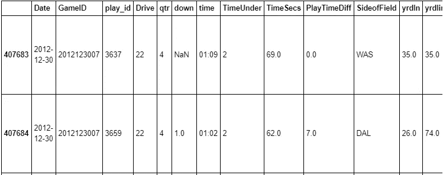
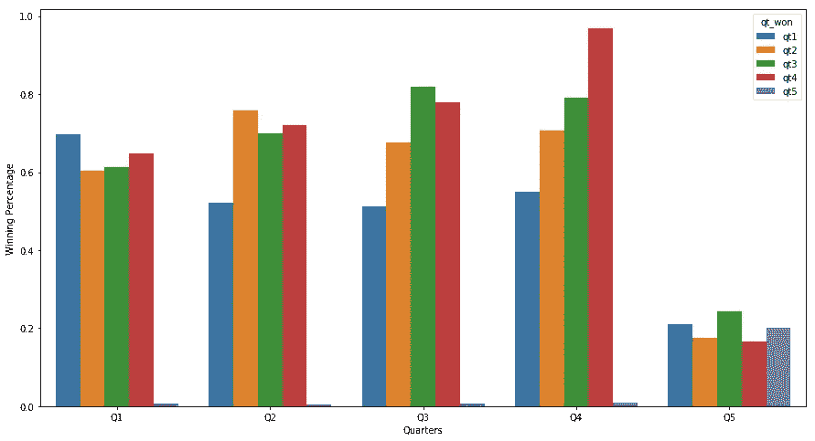
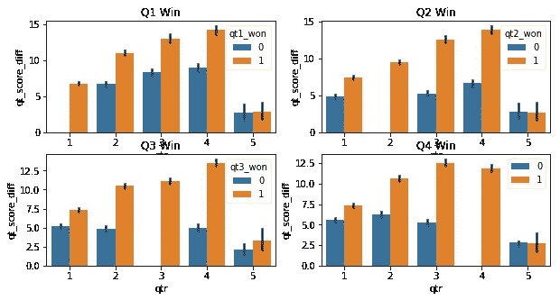
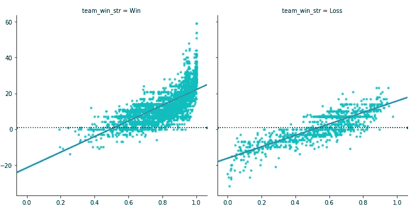
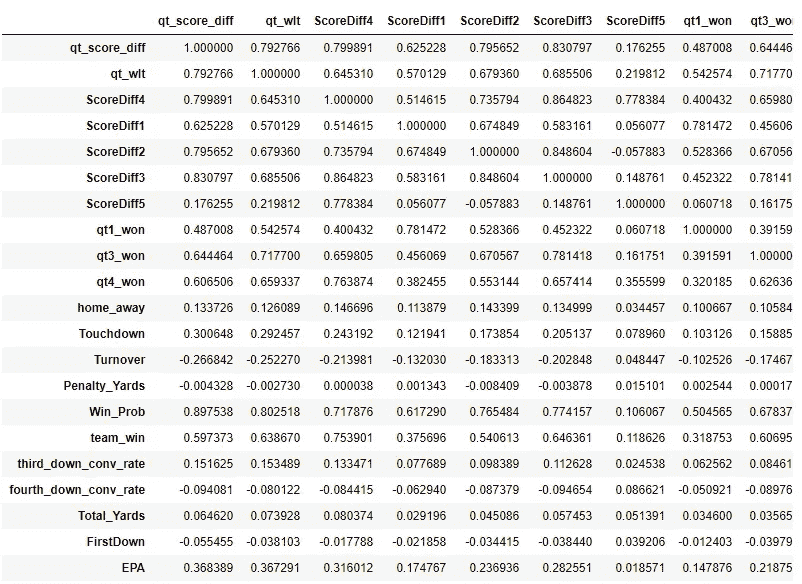
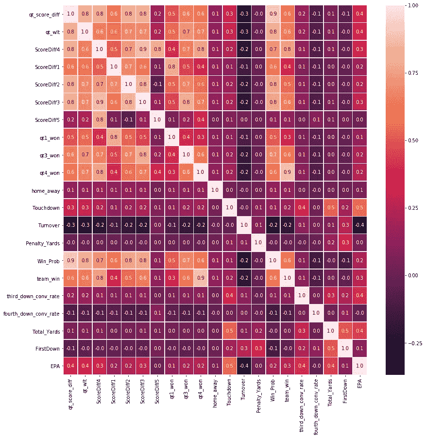
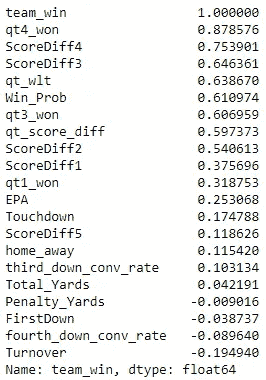
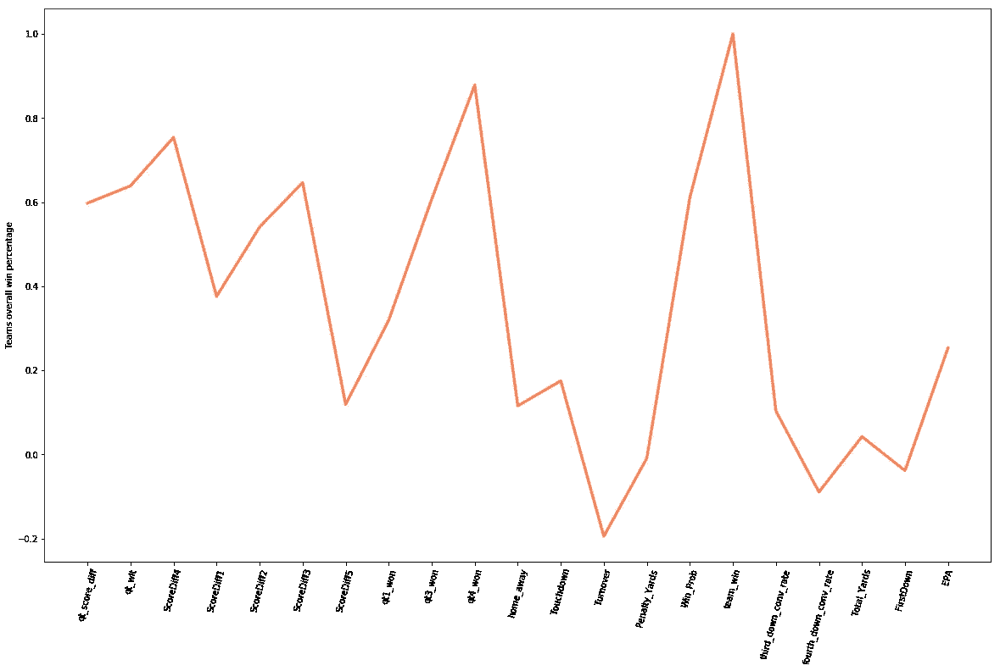
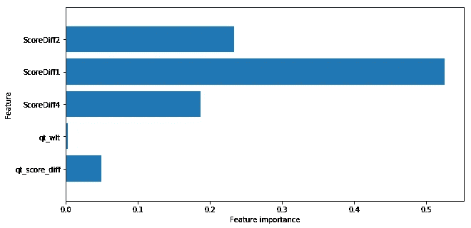

# NFL——在 NFL 中赢得第一节真的重要吗？

> 原文：<https://towardsdatascience.com/nfl-which-quarters-correlate-most-with-winning-87f23024c44a?source=collection_archive---------3----------------------->

## 座右铭:坚强地开始。建立小的胜利。每个季度都要赢。


[Bill Maher — Irritable Bowl Syndrome](https://www.youtube.com/watch?v=bNbMPz5CPY8); Directed and Animated by Fraser Davidson

# 背景

人们会认为阿尔·帕西诺关于足球的方法论在[任何给定的周日](https://www.youtube.com/watch?v=f1yWSePMqsk)都是正确的，那就是:*足球是一寸一寸赢得的*。但是特定的英寸有关系吗？在这种情况下，我们指的是 NFL 比赛中的四或五节。如果一个队每个季度都赢了，显然他们赢得了比赛。有道理，但是，第一节的胜利与游戏结束时的胜利有关联吗？如果一个团队在比赛开始时打得太努力，会不会导致过早过度，从而在真正重要的最后*英寸*处留下有限的凶猛？球队真的能等那么久才全力以赴吗？或者说提前获胜实际上是为赢得整场比赛定下了基调？幸运的是，有现成的数据来满足我们的渴望！

# 概观

在本帖中，我们将通过使用 NFL 数据集解决一个完整的机器学习问题。我们的目标如下:

> 使用提供的 NFL 数据，开发一个模型来评估和预测在第一季度获胜的球队与在整个赛季中获胜的球队之间的相关性。

首先，让我们回顾一下开发此解决方案的基本方法。这是一个**监督回归机器学习任务**。这意味着我们已经获得了一组具有各种目标的数据(在这种情况下是每个季度的分数)，我们希望训练一个可以学习将功能映射到目标的模型。

我们将使用来自[NFL scrapr-data repository](https://github.com/ryurko/nflscrapR-data)的 NFL 数据集，我们的核心数据集是 [nfl_season_pbp_dataset](https://github.com/ryurko/nflscrapR-data/tree/master/data/season_play_by_play) 。你也可以直接从我的 [GitHub 库](https://github.com/naivelogic/NFL-smarter-football/blob/master/nfl_team_stats.csv)下载这个数据集。注意:在我们的评估中只使用了常规赛的数据。

**重点提醒:**数据科学保持头脑清醒的一个定律: ***相关性不代表因果关系*** 。这是一个常用的统计阶段，用来强调两个变量之间的**相关性**并不意味着一个**导致另一个**。

说到这里，让我们开始吧！这里是我的 [github 笔记本](https://github.com/naivelogic/NFL-smarter-football/blob/master/NFL%20Best%20Quarter-Winning%20Correlation.ipynb)的链接，了解更多细节&解释。

# 数据导入和分析

```
import pandas as pd  # data manipultion librabry
import numpy as np # numerical computation library# Display up to 120 columns of a data frame
pd.set_option('display.max_columns', 120)# Data Visualization
import seaborn as sns
import matplotlib.pyplot as plt 
%matplotlib inline
from matplotlib import style# Internal ipython tool for setting figure size
from IPython.core.pylabtools import figsize
```

## 数据接收

```
# Data Imports
nfl_df = pd.read_csv('nfl_season_pbp.csv')
nfl_df.shape
nfl_df.tail()
```



Figure 1 — Core NFL Play by Play Dataset

为了理解按季度关联分数差异的目的，我们需要评估分数和其他特征如何影响整个游戏。现在，我们将假设各个季节基本上是相互独立的(我们可以用我们天真的能力来更新我们的假设)。因此，对一个特定游戏的预测仅仅是基于单个游戏的总体数据。因此，对于每个游戏，可以帮助我们解决问题的关键栏包括:

*   GameID:指定游戏的 ID
*   季度:游戏的四分之一
*   posteam:进攻的队伍
*   ScoreDiff:进攻队和防守队的得分之差(offensive.score — def.score)
*   ydstogo:第一次进攻的距离
*   码。获得:游戏中获得的码数
*   触地得分:二分制:如果比赛的结果是得分，则为 1，否则为 0
*   No_Score_Prob:半场内没有得分的概率
*   EPA:考虑到比赛结果，增加了控球队的预期分数
*   拥有球权的队伍获胜的概率增加了

## 按季度关联所有游戏

接下来，让我们从高水平上看一下每个季度所有比赛的得分差异的相关性。

```
fig, ax = plt.subplots(figsize=(8,6), dpi = 72)ax.set_title("Average Score Difference by Quarter", fontsize = 18)
ax.set_xlabel('Quarters', fontsize = 15)
ax.set_ylabel('Game Score Differnece (Absolute)', fontsize=15)
plt.xticks(fontsize = 13)
plt.yticks(fontsize = 13)nfl_df.groupby(by=['qtr']).AbsScoreDiff.mean().plot(kind='bar', alpha = 0.9, rot=0)
plt.show()
```


Figure 2 — Average Game Score by Quarters

在这里，我们可以看到从第一季度到第四季度的得分差异有显著的分布。然而，有趣的是，我们可以看到输赢的分布。是时候讨论一些数据了。

# 数据处理和处理

如上所述，我们将添加输赢游戏指标。在数据集中，有显示每场比赛得分的列，但是，因为这是一场场比赛的数据，所以没有总的赢/输列。因此，我们将简单地通过列`season`、`GameID`获取数据的子集，指示每个主客场球队的独特比赛。然后我们创建一个新的`win_loss_df`来表示哪支球队赢得或输掉了他们的比赛，然后合并新的列，这样我们就可以在季度级别上表示它。

```
def lastplay(df):
    # last row of data frame based on groupby filter
    if np.isnan(df.iloc[-1].Home_WP_pre) == False:
        return df.iloc[-1] 
    # last row of data frame second to last row if NA on last
    elif np.isnan(df.iloc[-2].Home_WP_pre) == False:
        return df.iloc[-2]win_loss_df = nfl_df.groupby('GameID').apply(lastplay).groupby(by=['Season','GameID','HomeTeam','AwayTeam']).agg({'Home_WP_pre':lambda x: int(round(x)),                                                                 'Away_WP_pre':lambda x: int(round(x))}).reset_index()win_loss_df = win_loss_df[['GameID','HomeTeam','AwayTeam','Home_WP_pre', 'Away_WP_pre']].rename(columns={'Home_WP_pre':'home_win',                                                                    'Away_WP_pre':'away_win'})
```

接下来，我们将把`win_loss_df`合并到`NFL`中，并使用 lambda 逻辑为 offesne (posteam)上的每个团队设置输赢。我们还将指定两个营业额列(`InterceptionThrown`、`Fumble`)，我们希望将其合并为每场比赛的总营业额。

```
nfl_df = nfl_df.merge(win_loss_df, on=['GameID','HomeTeam','AwayTeam'], how='left')# Create a Team_Win column to indicate a win loss
nfl_df['team_win'] = nfl_df.apply(lambda x: x.home_win if x.HomeTeam == x.posteam else x.away_win, axis=1)# Create a column for total turnovers for potential features
tunrover_list = ['InterceptionThrown', 'Fumble']
nfl_df['Turnover'] = nfl_df[tunrover_list].sum(axis=1)
```

现在我们已经知道了输赢，我们选择了一手牌，这手牌充满了对评估早期得分差异和赢得比赛/赛季之间的相关性最有影响的列(很快将被称为特征)。为此，我们将利用 groupby 函数。

```
nfl = nfl_df.groupby(by=['Season','GameID','qtr','HomeTeam','AwayTeam','posteam']).agg({'team_win':'mean','Win_Prob':'mean','Yards.Gained':'sum','Penalty.Yards':'sum','Touchdown':'sum','Turnover':'sum','FirstDown':'count','EPA':'mean','FirstDown':'sum',}).reset_index().rename(columns={'Yards.Gained':'Total_Yards','Penalty.Yards':'Penalty_Yards'})
nfl.tail(3)
```


Figure 3 — Initial NFL data frame (without box score and categories)

# 创建盒子分数和类别

接下来，我们将创建一个显示游戏分数和个人游戏成就的方块分数。当回顾初始数据集时，我们被提供了每场比赛的分数以及这些分数的累积。为了恰当地理解每个季度(qt)获胜球队的分布以及该季度对游戏和赛季的影响，我们首先必须有一个列来计算每个季度的总得分，并二进制表示哪个队在该季度获胜。

首先，我们首先创建一个函数来获取季度末的每个分数。下面的函数由一个数据框调用，该数据框是按季度和从进攻队(控球队)和防守队取得最后得分的队的子集。

使用 lambda 逻辑为每个进攻队设定输赢

```
def scores_per_qt(df):
    # last row of data frame based on groupby filter
    if np.isnan(df.iloc[-1].DefTeamScore) == False:
        return df.iloc[-1] 
   # last row of data frame second to last row if NA on last
   elif np.isnan(df.iloc[-2].DefTeamScore) == False:
        return df.iloc[-2] # last row of data frame
```

创建一个进攻得分表，用来计算每个队每个季度的总得分。

```
offensive_score_df = nfl_df.groupby(['GameID','qtr','posteam']).apply(scores_per_qt).groupby(by=['Season','GameID','qtr','posteam']).agg({'PosTeamScore':'mean',                                                                  'DefTeamScore':'mean'}).reset_index()
```

根据防守球队创建防守得分和进攻得分表。我们这样做是因为，在数据集中有这样的情况，控球队在本节结束时的防守得分不包括在上面的进攻得分表中。

```
defensive_score_df = nfl_df.groupby(['GameID','qtr','DefensiveTeam','posteam']).apply(scores_per_qt)[['DefTeamScore','PosTeamScore']].reset_index().rename(columns={'DefensiveTeam':'posteam','posteam':'PosDefTeam'})
```

合并进攻得分表和防守得分表，然后创建一个列来显示每个队在进攻和防守方面的最高得分，以准确捕捉季度末的得分。

```
score_df = offensive_score_df.merge(defensive_score_df, on=['GameID','qtr','posteam'], how='left')
score_df['PosTeamScore']=score_df[['PosTeamScore_x', 'DefTeamScore_y']].max(axis=1)
score_df['DefTeamScore']=score_df[['DefTeamScore_x', 'PosTeamScore_y']].max(axis=1)
score_df = score_df[['Season','GameID','qtr','posteam','PosTeamScore','DefTeamScore']]
```

为`score_df`创建特征，以指示每个季度的得分以及每个季度得分的差异。

```
score_df['qt_score_diff'] = score_df.PosTeamScore - score_df.DefTeamScore
score_df['qt_score_cumdiff'] = score_df.groupby(['posteam'])['PosTeamScore'].apply(lambda x: x.diff()) 
score_df['Pos_qt_score'] = np.where(score_df.qtr == 1, score_df.PosTeamScore, score_df.qt_score_cumdiff)
score_df = score_df.drop(['qt_score_cumdiff'], axis=1)
```

转置`score_df`并指出每支控球球队在比赛中的得分差异，然后与 score_df 合并。将`nfl`数据框与`score_df`合并。

```
# create df2 to indicate the ScoreDiff
df2 = pd.pivot_table(score_df, index = ['GameID','posteam'], columns = ['qtr'], values = 'qt_score_diff').reset_index()
df2 = df2.rename(columns= {1:'ScoreDiff1', 2:'ScoreDiff2', 3:'ScoreDiff3', 4:'ScoreDiff4', 5:'ScoreDiff5'})
score_df = score_df.merge(df2, on=['GameID','posteam'], how='left')nfl = nfl.merge(score_df, on=['Season','GameID','posteam','qtr'], how='left')
```


Figure 4 — New pbp_df that represents the data used for correlation assessment

# 勘探数据分析

为了更好地理解数据集中的模式，我们开始使用各种图形模型进行探索。我们将首先使用`winners_of_quarters`函数创建一个新的数据框，显示一支球队在过去 8 个赛季中实际赢得给定季度的总次数。

```
def winner_of_quarters(df):
    Score_Diff =['ScoreDiff1','ScoreDiff2','ScoreDiff3','ScoreDiff4','ScoreDiff5']
    winner = []
    for score in Score_Diff:
        qt_winner = []
        qt_winner = df[df[score] > 0].groupby(by='team_win_str']).agg({'qt1_won':lambda x: x.sum()/ df['qt1_won'].sum(),'qt2_won':lambda x: x.sum()/ df['qt2_won'].sum(),'qt3_won':lambda x: x.sum()/ df['qt3_won'].sum(),'qt4_won':lambda x: x.sum()/ df['qt4_won'].sum(),'qt5_won':lambda x: x.sum()/ df['qt5_won'].sum()}).reset_index().rename(columns ={ 'team_win_str':'qtr','qt1_won':'Q1','qt2_won':'Q2','qt3_won':'Q3','qt4_won':'Q4','qt5_won':'Q5'})
        qt_winner = qt_winner.T.reset_index()
        qt_winner.columns = qt_winner.iloc[0]
        qt_winner = qt_winner.rename(columns=qt_winner.iloc[0]).drop(qt_winner.index[0])
        qt_winner['qt_won'] = 'qt' + score[-1:]
        winner.append(qt_winner)
    dfs = pd.concat(winner)
    return dfsqt_win_df = winner_of_quarters(nfl)# Create plot
fig = plt.figure(figsize=(15,8))
ax = sns.barplot(x="qtr", y="Win", hue="qt_won", data=qt_win_df);
ax.set(xlabel='Quarters', ylabel = 'Winning Percentage')
plt.show()
```



Figure 5 — Winning Percentage by Quarter for Winning Teams

上面的柱状图让我们得以一窥在一场游戏的长期运行中赢得某个特定的季度是否重要。图例显示了一个团队赢得的季度的颜色以及他们赢得其他季度的胜率，从中我们可以观察到几个关键趋势。要解读这张图表，最好先看一个例子:让我们来辨别第一季度的赢家。第一季度(Q1)的蓝色条代表所有赢得第一季度(69.7%)的球队。每个随后的蓝条表示当一个队赢得第一节时，该队赢得第二节的 52%，赢得第三节的 51%，赢得第四节的 55%，如果比赛进入加时赛，赢得加时赛的 16%。

## 季度得分差异(价差)

接下来，我们来看看季度价差。我们可以看到团队之间的差距很大…这也可能是动力的一个标志。这表明，赢得早的团队通常会保持领先。听起来，当一个获胜的团队定下基调时，他们通常会保持领先优势。

```
fig, axes = plt.subplots(nrows=2, ncols=2, figsize=(10,5))
ax = sns.barplot(x="qtr", y="qt_score_diff", hue="qt1_won", data=nfl[nfl.qt_wlt==1], ax=axes[0][0]);
ax.set_title('Q1 Win')
ax = sns.barplot(x="qtr", y="qt_score_diff", hue="qt2_won", data=nfl[nfl.qt_wlt==1], ax=axes[0][1]);
ax.set_title('Q2 Win')
ax = sns.barplot(x="qtr", y="qt_score_diff", hue="qt3_won", data=nfl[nfl.qt_wlt==1], ax=axes[1][0]);
ax.set_title('Q3 Win')
ax = sns.barplot(x="qtr", y="qt_score_diff", hue="qt4_won", data=nfl[nfl.qt_wlt==1], ax=axes[1][1]);
ax.set_title('Q4 Win')
ax.legend()
```



Figure 6 — Quarter Score Difference

如果球队以触地得分(6 分)或更多赢得第一节比赛，胜率。

```
g = sns.lmplot('Win_Prob', 'qt_score_diff', col='team_win_str', data=nfl[(nfl.ScoreDiff1 >= 7)],
               markers=".", scatter_kws=dict(color='c'))
g.map(plt.axhline, y=1, color="k", ls=":");
```



Figure 7 — Top Teams (Top) and Bottom Team (Bottom) winning 1st quarter Statisitcs

# 特征工程和选择

## 按季度创建与得分差异相关的潜在特征列表

在特征分析中，我们的目标是理解数据模式，开发主题假设，以及进行反复试验来确定与我们的目标最佳相关的相似特征选择操作符。

## 皮尔逊相关系数

为了了解第一季度的胜利是否与赢得的比赛相关，或者上半年获得的第一次总得分或第三次得分效率是否对赢得第一季度或比赛起着重要作用，我们需要衡量这些变量之间的关系。这就是皮尔森相关系数发挥作用的地方。这里有一本关于它如何工作的入门书。根据定义，相关性是多个值之间的依赖性的度量。使用皮尔逊相关系数，我们将提供一个变量列表，并测试我们的假设，即在第一和第二季度获胜与赢得比赛之间是否有直接关系。皮尔逊将提供一个介于`-1`和`+1`之间的回溯数字。这个度量的意义是这些变量为正的强度程度(接近于`+1`)。)，负相关(接近`–1`)或不相关(接近`0`)。请记住:相关性并不意味着因果关系。

下面，我们将利用皮尔逊相关系数和几列数据来确定 nfl 数据中的某些属性是否与确定哪个季度高度相关

```
potentialFeatures = ['qt_score_diff','qt_wlt','ScoreDiff4','ScoreDiff1','ScoreDiff2','ScoreDiff3','ScoreDiff5', 'qt1_won','qt3_won', 'qt4_won', 'home_away',
'Touchdown','Turnover','Penalty_Yards','Win_Prob','team_win','third_down_conv_rate','fourth_down_conv_rate','Total_Yards','FirstDown','EPA']
nfl_corr = nfl[potentialFeatures].corr()
f,ax = plt.subplots(figsize=(14, 14))
sns.heatmap(nfl_corr, annot=True, linewidths=.5, fmt= '.1f',ax=ax)
nfl_corr
```



Figure 8 — Potential Feature Correlation Matrix



Figure 9 — Potential Feature Correlation Matrix — Heat Map

选择热门功能并创建一个列表，其中包含人员在“team_win”与列中每一列之间的相关性。

```
nfl_corr['team_win'].sort_values(ascending=False)
```



Figure 10 — Top Potential Features

我们确保所选特征的数量和所计算的相关性是相同的(例如，在这种情况下是 21)。接下来的几个单元格显示了一些代码行，它们使用 pandas 绘图函数来创建这些相关值和列名的 2D 图

```
# create a list containing Pearson's correlation between 'team_win' with each column in cols
correlations = [nfl['team_win'].corr(nfl[f]) for f in potentialFeatures]
len(potentialFeatures), len(correlations)# create a function for plotting a dataframe with string columns and numeric valuesdef plot_dataframe(df, y_label):
    color='coral'
    fig = plt.gcf()
    fig.set_size_inches(20,12)
    plt.ylabel(y_label)

    ax = df.correlation.plot(linewidth=3.3, color=color)
    ax.set_xticks(df.index)
    ax.set_xticklabels(df.attributes, rotation=75); #Notice the ; (remove it and see what happens !)
    plt.show()# create a dataframe suing cols and correlationsdf5 = pd.DataFrame({'attributes': potentialFeatures, 'correlation': correlations})# lets plot above dataframe using the function we createdplot_dataframe(df5, 'Teams overall win percentage')
df5
```



Figure 11 — Team Overall Winning Percentage correlated with ‘team_win’

# 构建机器学习模型

现在我们将训练几个机器学习模型，并比较它们的结果。创建要素数据框并删除不必要的要素。

```
# y includes our labels (wins and losses) and x includes our features
y = nfl.team_win_str
X = nfl[potentialFeatures].drop('team_win', axis=1)# change NAN to 0
where_are_NaNs = np.isnan(X)
X[where_are_NaNs] = 0
```

使用 sklearn 包及其相关的预处理实用程序来规范化数据。

```
from sklearn import preprocessingx = X[['qt_score_diff','ScoreDiff1','ScoreDiff2','ScoreDiff3','ScoreDiff5', 'qt3_won', 'qt4_won','EPA',
        'home_away','qt_wlt']].values #returns a numpy array
min_max_scaler = preprocessing.MinMaxScaler()
x_scaled = min_max_scaler.fit_transform(x)
X = pd.DataFrame(x_scaled)from sklearn.model_selection import train_test_split
from sklearn.ensemble import RandomForestClassifier
from sklearn.metrics import f1_score,confusion_matrix
from sklearn.metrics import accuracy_score# split data train 70 % and test 30 %
X_train, X_test, y_train, y_test = train_test_split(X, y, test_size=0.3, random_state=42)#random forest classifier with n_estimators=10 (default)
clf_rf = RandomForestClassifier(random_state=43)      
clr_rf = clf_rf.fit(X_train,y_train)ac = accuracy_score(y_test,clf_rf.predict(X_test))
print("Accuracy on training set: {:.3f}".format(accuracy_score(y_train,clf_rf.predict(X_train))))
print("Accuracy on test set: {:.3f}".format(accuracy_score(y_test,clf_rf.predict(X_test))))
print('Accuracy is: ',ac)cm = confusion_matrix(y_test,clf_rf.predict(X_test))
sns.heatmap(cm,annot=True,fmt="d")
```


Figure 13 — Confusion matrix on Random Forest Classifier

准确率为 94.8%，从混淆矩阵中可以看出，我们做了一些错误的预测。现在让我们看看其他特征选择方法，以找到更好的结果。

## 支持向量机

```
from sklearn.svm import SVC
svc = SVC()
svc.fit(X_train, y_train)
print("Accuracy on training set: {:.3f}".format(accuracy_score(y_train, svc.predict(X_train))))
print("Accuracy on test set: {:.3f}".format(accuracy_score(y_test, svc.predict(X_test))))**Accuracy on training set: 0.938
Accuracy on test set: 0.938**
```

与随机森林相比，SVM 的精确度较低。

## 逻辑回归

```
from sklearn.linear_model import LogisticRegression
logreg = LogisticRegression()
logreg.fit(X_train, y_train)
Y_pred = logreg.predict(X_test)print("Accuracy on training set: {:.3f}".format(accuracy_score(y_train,logreg.predict(X_train))))
print("Accuracy on test set: {:.3f}".format(accuracy_score(y_test,logreg.predict(X_test))))**Accuracy on training set: 0.938
Accuracy on test set: 0.939**
```

与随机森林相比，逻辑回归的准确性较低。看来我们要随机森林了。

## 基于精度、召回率和特征重要性的随机森林模型评估

为了评估我们的模型，我们将利用精度和召回来更好地理解模型性能。从高层次来看，精度是正面预测的性能度量，而召回是数据集的整个正面部分的性能度量。

```
from sklearn.metrics import classification_report
print(classification_report(y_test,clf_rf_2.predict(x_test_2)))
```


Figure 14 — Precision and Recall Score for Random Forest

通过选择随机森林，我们可以计算模型使用的每个特征属性的相对重要性。这些重要性值用于理解所选特征的等级。下面我们列出了 5 大特点。

```
def plot_feature_importances(model):
    plt.figure(figsize=(10,5))
    n_features = len(model.feature_importances_)
    plt.barh(range(n_features), model.feature_importances_, align='center')
    plt.yticks(np.arange(n_features), feature_labels)
    plt.xlabel("Feature importance")
    plt.ylabel("Feature")
    plt.ylim(-1, n_features)plot_feature_importances(clf_rf_2)
```



Figure 15 — Feature Importance from Random Forest

根据我们的随机森林模型，上面显示了影响一个团队是否获胜的最重要的特征，并且看起来第一季度的得分差异在相关性和预测中起着重要作用。

最后，我们每个季度单独运行模型，并生成功能性能和功能重要性分数。


Figure 16 — Feature Performance and Importance based on discrete quarter perdictions

有趣的是，随着季度的进展，我们可以看到第一次得分的重要性降低，相反，qt_score_diff 增加，这是季度得分的点差。

# 摘要

这是一个有趣的分析，这篇文章并不是要得出第一季度的胜利不重要的结论，但是正如我们所看到的，在第一季度的胜利和整个赛季的胜利之间有很强的相关性。

创建这篇文章的源代码可以在[这里](https://github.com/naivelogic/NFL-smarter-football/blob/master/NFL%20Best%20Quarter-Winning%20Correlation.ipynb)找到。如果您有任何问题或反馈，请告诉我。