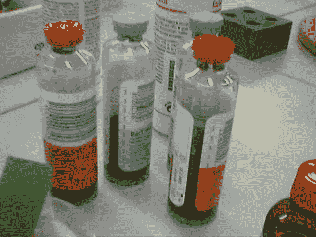

# NHS 实验室需要数据科学

> 原文：<https://towardsdatascience.com/nhs-laboratories-need-data-science-c93f7983302c?source=collection_archive---------6----------------------->

Photo by [Ousa Chea](https://unsplash.com/@cheaousa?utm_source=medium&utm_medium=referral) on [Unsplash](https://unsplash.com?utm_source=medium&utm_medium=referral)

当你感觉不舒服，你去看你的家庭医生，或者当你感觉非常不舒服，你发现自己躺在医院的病床上，你可能会发现临床工作人员收集你的体液，并把它们送到一些神秘的地方进行分析。大批技术人员、科学家和临床工作人员占据了样本的目的地。利用新老技术，生物医学科学家(像我一样)开始生成反映取样时你的状况的数据。我的背景是传染病诊断学，所以我的任务是培养和研究占据你样本的致病(“有害”)细菌。首要目标是确定感染的原因，并告知临床医生哪些抗生素能有效杀死“细菌”。

我和许多其他人一样，认为在这个过程中产生的数据量是天文数字，但目前还没有得到充分重视。该数据的主要用途是为临床医生生成报告，以建议疾病的诊断和治疗。除此之外，这些数据并没有被大量使用，而是闲置在庞大的数据库中。英国公共卫生部做了大量工作来提供人口健康的概况，但仍有大量数据没有超出其主要目的。我认为这是由于一线缺乏数据科学专业知识。

# 我们在谈论多少数据？

皇家病理学家学会很好地总结了 NHS 病理服务的重要性:

*   英格兰有 105 家医院提供病理服务
*   每年处理超过 10 亿次测试，总计花费 22 亿美元
*   英国最大的病理学服务机构 Barts NHS Trust 每年进行 2600 万次检测

为了说明仅在医学微生物学领域就产生了多少数据，让我们考虑一个实验室和一种样本类型。牛津大学医院微生物实验室每年处理超过 [60 万份独特的样本](https://www.ouh.nhs.uk/microbiology/default.aspx)。被称为血液培养的样本将占据这 600k 样本中的一小部分。

血液样本被放入血液培养瓶中(见下文),然后在专门的机器上培养，以寻找细菌生长的迹象。当在瓶中检测到生长时，将其取出并进一步分析(将血液涂在各种生长培养基上用于鉴定和抗生素敏感性测试)。血液培养的目的是检测血液感染(菌血症)，这是一种严重的疾病，表明细菌已经渗入循环系统，可能导致严重的后果，如心内膜炎或败血症。幸运的生物医学科学家预计每天会有 4 到 5 个阳性血液培养，但实际上更有可能是每天 10 到 20 个阳性。

By Strolch1983 — Own work, CC BY-SA 3.0, [https://commons.wikimedia.org/w/index.php?curid=792954](https://commons.wikimedia.org/w/index.php?curid=792954)

对于单一阳性血培养，将收集/生成以下数据:

*   与患者相关的人口统计信息(年龄、性别、位置等)
*   描述患者状况的临床细节
*   唯一标识符，将该样本数据与在该患者身上收集的所有其他样本相关联
*   孵化数据；显示细菌指标随时间变化的时间序列数据
*   细菌在各种生长介质上生长的图像(仅在采用自动读数技术的实验室中，如 Kiestra/Copan WASP，这种技术越来越受欢迎)
*   [MALDI-TOF 质谱](https://en.wikipedia.org/wiki/Matrix-assisted_laser_desorption/ionization)产生的光谱数据；用于细菌鉴定
*   细菌分离物的生化特征(15+化学相互作用)；用于初始细菌鉴定或在 MALDI-TOF 不可用/不可靠时广泛使用
*   细菌基因组数据；偶尔需要对细菌分离株进行基因分型(通常是为了控制感染)，但预计细菌分离株的基因分型分析将成为规范
*   抗菌药物敏感性数据；这是与细菌分离物对过多抗生素的敏感性相关的数据

因此，像血液培养这样的样本可能会产生数十甚至数百个数据点，并生成不同格式的数据(图像、光谱、分类和数字)。现在，请记住，这种类型的分析已经进行了几十年，并且在过去的 15 年中(至少)这些数据一直以数字形式存储。毫无疑问，NHS 实验室产生了难以想象的大量数据。

# 数据科学能为 NHS 实验室做什么？

任何 NHS 实验室的主要关注点是提供一个成本有效但准确的测试结果，可以就病人的情况向临床医生提出建议。然而，围绕这一主要目标有一系列活动，每一项活动对其执行都至关重要。为了运行一个现代化的实验室，必须考虑 IT 基础设施、自动化分析平台、质量控制措施、库存控制和消耗品的使用，以及员工的管理和培训。数据科学的技术不仅可以应用于主要目标，而且还可以帮助承担保持船只漂浮的任务。

## 提高质量和收回控制权

实验室要想通过 UKAS 检测,就必须证明用于生成测试结果的技术和自动化平台是经过验证的，并以符合 ISO 标准的方式进行控制。随着工作量的增加和测试复杂性的增加，在人员短缺和预算削减的背景下，达到这些标准从未像今天这样困难。值得称赞的是，英国国家医疗服务体系的病理学服务仍然能够提供高质量的服务。

在分析测试质量或验证新程序时，需要依赖小样本和经典的统计推断，因为无法获得进行多变量数学建模所需的专业知识和工具。在某些情况下，趋势分析是由质量保证软件自动进行的，但更多情况下，这只是查看变化，并在值超过阈值时通知科学家。可用于质量指标预测建模的大型数据集很少使用。

在这一领域有一些令人兴奋的进展，有文献描述了使用[统计指导协议和机器学习来检测分析前错误](https://academic.oup.com/ajcp/article/138/3/406/1766596?searchresult=1#117426179)。让生物医学科学家非常沮丧的是，在样本到达实验室之前，分析中的错误往往是不可避免的。在同一份杂志中，你可以找到通过使用人工神经网络实现[测试验证自动化的例子，在不影响患者安全的情况下显著减少了工作量。](https://academic.oup.com/ajcp/article/146/2/227/1731226?searchresult=1)

最重要的是，通过利用本地数据、拥有技术能力更强的员工(具备编程和构建小型定制解决方案的知识)以及获得实验室性能的“鸟瞰图”，可以更容易地识别和解决瓶颈和低效问题。

## 机器人会阅读！

Photo by [Rock'n Roll Monkey](https://unsplash.com/@rocknrollmonkey?utm_source=medium&utm_medium=referral) on [Unsplash](https://unsplash.com?utm_source=medium&utm_medium=referral)

差不多了。近年来，自然语言处理(NLP)取得了很大进展，特别是随着深度学习和递归神经网络的发展。从[提高识别术后并发症的灵敏度](https://jamanetwork.com/journals/jama/fullarticle/1108490)，到利用电子病历的[表现型分类算法](https://www.bmj.com/content/350/bmj.h1885)，NLP 在整个医学界都显示出了前景。

NLP 在实验室里会有很大的好处。许多样本处理和加工依赖于临床工作人员提供的书面描述。对这一数据的解释仍然依赖于生物医学家，因为[有很多 c](https://www.theguardian.com/science/2018/feb/09/safety-blunders-expose-uk-lab-staff-to-potentially-lethal-diseases) 丢失电话。

如果 NLP 可以在样本进入实验室之前用于评估样本的安全性，或者在报告发送给临床医生之前用于评估报告的质量，会怎么样？工作人员不可能手工完成的任务，但可以由带老花镜的机器人自动完成。

## 实验室结果+机器学习=未来！

机器学习可以帮助实现提供病理学服务的根本目标——预测是什么导致了患者的疾病！

无论是将细胞类型分类为癌性或非癌性，使用多维数据将患者状态的生化描述归因于已知疾病，还是预测一种分离的病原体是否会对选择的药物敏感，机器学习都是这项工作的理想工具。

研究界和私营企业已经显示出一些希望:

*   [深度学习应用于从宏基因组数据预测抗生素耐药性](https://microbiomejournal.biomedcentral.com/articles/10.1186/s40168-018-0401-z)；可能会改变我们检查病人的方式
*   [组成神经网络可用于读取革兰氏染色](http://jcm.asm.org/content/56/3/e01521-17.full.pdf+html?sid=d52c1bd5-7c32-4ddc-86b2-5136b186ab30)，这是目前用于诊断菌血症原因的费力方法
*   [使用高维数据集准确预测生化分析结果](https://academic.oup.com/ajcp/article/145/6/778/2836697)
*   [通过分析前列腺癌或乳腺癌证据的图像数据，使用深度学习技术减少临床病理学家的工作量](https://www.nature.com/articles/srep26286)
*   [预测革兰氏阴性菌血症患者的死亡率](http://aac.asm.org/content/60/2/838.full.pdf+html?sid=d449fbf3-1a99-40c5-a8f9-6406fcca54f4)
*   [利用现成的实验室血液检测结果对血液疾病进行分类](https://www.nature.com/articles/s41598-017-18564-8)
*   使用机器学习技术的自动图像分析正在迅速进入医学微生物实验室的工作流程，提供了替代费力的培养物阅读。工作示例包括[现象矩阵](http://www.copanusa.com/products/automation/phenomatrix-microbiology-ai/)和 [APAS 独立](http://cleverculturesystems.com/)

# 数据科学如何与当前实践融合？

正如你所看到的，有大量的例子表明数据科学和机器学习的预测能力可以用来改革 NHS 的病理学服务。认为私营企业将在这项事业中发挥关键作用似乎是完全合理的，但我想提出的论点是，NHS 实验室应该专注于发展自己的数据科学团队。

就目前的情况来看,“数据科学家”的角色在 NHS 实验室中并不存在。事实上，很难找到专门的 it 人员，更不用说分析师/数据科学专家了。NHS 实验室的职业结构非常僵化。对我来说，这似乎很可笑；这是一个产生大量有价值数据的服务，但是手头没有从这个资源中获利的技能。NHS 迫切希望通过提高效率来节省开支，利用其数据可能有助于实现这一目标。

世界正在改变，我们正在进入应用机器学习和自动化的复兴。随着分子技术的发展和自动化程度的提高，对生物医学科学家手动分析临床标本的需求将会下降。生物医学科学家转移到更具分析性的角色似乎是很自然的，他们操纵实验室中产生的数据并为研究做出贡献。

然而，对生物医学科学家的培训几乎没有跟上。对使用 whatuni.com 的英国大学的快速回顾(按就业率排名)显示，在提供生物医学学士学位的 9 所顶级大学中，只有 2 所提供基本统计分析以外的培训，即 R/Python 编程和高级生物信息学技术。在这两所大学里，培训都是最后一年选修课的一部分。

令人沮丧的是，这些 NHS 实验室被聪明而热情的科学家占据，在正确的指导下，他们可以采用所需的技术来利用手头的数据资源。大多数生物医学科学家在晋升到高级职位之前都会攻读硕士学位，但是很少考虑数据科学硕士学位。我认为，就目前学习数据科学和编程的情况来看，硕士学位可能并不是启动这一进程的必要条件。有了 DataCamp、DataQuest 和 Udacity 等平台，生物医学科学家可以按照自己的节奏学习，只需要时间和互联网接入。

一旦掌握了这些技能，就可以开始在当地应用，帮助提高服务质量和效率。我也看到了增加病理学实验室参与当前研究的机会。生物医学科学家比任何人都更了解 NHS 实验室生成的数据，并且将是准备大型病理学数据集进行研究的数据争论的完美匹配。尽管这些年来数据访问有所改善，随着标准化实践和基础设施的改善(例如 SNOMED、HL7、NLMC 和 NHS number ),局部细微差别几乎是不可避免的，尤其是在对历史数据进行回顾性分析时。

因此，展望未来，我认为我们现在需要的是专注于建立一种鼓励我们的生物医学科学家参与数据科学的文化。在 NHS 实验室内设立分析职位需要支持和更大的灵活性，并有可能利用在线数据科学培训服务和远程学习。但最重要的是，我们需要积极主动的管理，专注于发展我们所处的范式转变所需的基础设施和法律框架。从长远来看，机器学习在病理学中的应用可能需要专门的数据工程师和大型数据仓库项目，但一个具有成本效益的起点将是准备好我们现有的员工；他们已经具备了理解我们想要利用的数据所必需的特定领域的知识。

至于我在这里所讨论的法律和伦理上的分歧，我故意把它遗漏了。我想在另一篇文章中解决这个问题。政府中的许多人已经将 NHS 数据视为[‘金矿’](https://tech.newstatesman.com/guest-opinion/ai-nhs-data)，但是随着剑桥分析公司(Cambridge Analytica)和像[乳房筛查丑闻](https://www.bbc.co.uk/news/health-43973652)这样的灾难仍然记忆犹新，我们必须尽我们所能确保患者的安全和隐私是绝对的优先事项。