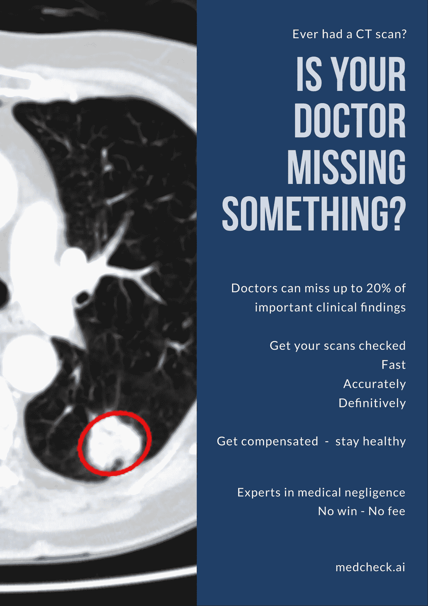

# ML 街上的噩梦:人工智能在放射学中的黑暗潜力

> 原文：<https://towardsdatascience.com/nightmare-on-ml-street-the-dark-potential-of-ai-in-radiology-71074e70da91?source=collection_archive---------0----------------------->

> 如果放射学人工智能被用来对付我们，而不是帮助我们，会怎么样？

我们都听说过摇滚明星企业家和天才学者之间的重大哲学争论和辩论——但我们有没有停下来想想放射学人工智能革命将如何在我们自己的地盘上展开？

今年在 RSNA，我向所有与之交谈的人提出了同样的问题:如果放射学人工智能落入坏人之手会怎样？从[人群用脚投票](https://twitter.com/mraguy/status/935268385134346240)挤满每一场关于人工智能的讲座的方式来看，放射科医生肯定似乎非常清楚这个行业即将发生的地震式转变——但我想知道是否有人在考虑潜在的副作用，即将这样一项颠覆性技术投入临床领域的意外后果？

虽然我对算法增强在放射实践中的前景和潜力感到非常兴奋，但我也对更多恶意方利用它获取掠夺性经济利益感到有点紧张。这就是我所说的“曼梯·里街的噩梦”场景…

幸运的是，这个广告是假的(我伪造的)，但我想以绝对清晰的方式描绘可能会发生的法医噩梦。

让我们先假设几件事:

1.  放射学人工智能算法达到了被临床验证为超人的程度。我认为这几乎是确定的，只要给足够的时间。我们还没到那一步——毕竟，还没有一个随机对照试验或 III 期研究证明这一点——但这些都将到来。大量早期证据表明，如果在足够高质量的标注数据上进行训练，算法在寻找特定事物方面确实比放射科医生更准确。
2.  医疗过失诉讼允许对病历进行回顾性分析，包括影像学研究。这就是目前的情况，也是“没有胜利，就没有费用”的律师事务所的谋生之道，他们掠夺那些感到他们的治疗没有达到他们期望的不满的病人。在法庭上，这些公司只需排除合理怀疑，证明一名医生根据他们的执业守则玩忽职守和表现不佳。这是通过简单地引入一个专家证人来确认一个错误。在放射科，这是非常容易的，因为放射科医生，远远超过任何其他专业，拍下他们的错误。
3.  放射学报告是一份书面的、数字签名的和可追溯的文档，它将放射科医师与他们的意见绑定在一起。一旦写好(除非进行了修改并传达了变化),该报告就成为患者护理记录中不可改变的一部分，并成为整个诊断过程的一部分。如果最终诊断是错误的，甚至完全被忽略，那么就有图片和书面证据来证明发生了医疗错误。

[31%的美国放射学家](http://pubs.rsna.org/doi/full/10.1148/radiol.12111119)在其职业生涯中经历过医疗事故索赔，其中“漏诊”是最常见的。乳腺癌高居榜首，紧随其后的是漏诊骨折和肺癌。甚至[最近出现了诉讼增加的趋势](http://www.modernhealthcare.com/article/20121011/INFO/310119992)，部分原因是工作量的不可阻挡的增长和对效率的推动，以及医疗保健提供商的整合，最终导致质量明显下降。

然而，为了开始一个医疗事故案件，病人必须找到律师事务所，并要求提供医疗记录作为证据。实质上，是否启动法律程序是患者的自由裁量权。

这就是我开始关注放射学人工智能的地方。想象一下，一家律师事务所开始以今天事故追逐者的方式直接向消费者做广告。毕竟，病人被允许要求一份他们的成像和报告的副本，并且可以自由地与他们选择的人分享。如果一家律师事务所能够说服用户交出他们的护理记录和图像，以获得使用人工智能的“免费”检查服务，我们可能会开始看到越来越多的回溯性临床错误被发现。

让我们举个例子:

史密斯先生在网上看到一个不赢不付费服务的广告，以检查他的扫描报告是否正确。他从医疗服务提供商那里下载了他的医疗记录，包括胸部 CT，并上传到律师事务所的服务器上。几秒钟后，算法在 T10/11 发现一个 5 毫米的肺结节和轻度变性，这两个发现都没有包括在原始报告中。该网站建议咨询律师，然后律师建议他们起诉医疗事故。史密斯先生说，想起来了，他的背部有些疼痛，现在他担心自己得了肺癌。他做了一次重复的 CT 扫描，结节现在是 8 毫米。诉讼进入审判阶段，最初的报告放射科医生被叫来，一名专家证人同意该算法，是的，显然有一个肺结节和一些脊柱退化。法官敲了敲他的锤子，结果，几百万美元被支付了。

到目前为止，没有什么特别的问题。一个遗漏的发现被证实了，诉讼成功了。与今天的情况相比，这里唯一的不同是涉及到了一个算法。

(希望没有人错过这个诊断…)

这才是真正可怕的地方…

如果有足够多的患者经历这一过程，这家掠夺性的律师事务所可能会对医疗保健提供商提起集体诉讼。这是一个全新层次的法律程序。理论上，集体诉讼允许起诉方要求获得全部病历，甚至可能与他们所代表的病人无关。这可以以病人安全的名义进行，声称整个放射科都不适合执业，因此在那里接受治疗的每个人都有知情权。

法官可以裁定允许对医院的整个扫描回溯性分析——一次分析数十万张图像。放射学人工智能算法可以在几个小时内轻松处理这些数据，并有可能发现数百万未报告的肺结节。支付的法律后果和规模是惊天动地的，是职业生涯的终结和职业生涯的毁灭。

我真诚地希望我们永远不要陷入这种境地。

有些人会说这是绝对不允许的。使用以前没有的新工具进行回顾性检查是不公平和不道德的——我同意这一点。然而，我担心的是恶意的第三方使用放射学人工智能只是为了找到错误和失误，然后使用人类专家证人来确认它们。以这种方式，在法庭上，这是人对人，就像今天进行的医疗事故诉讼一样。唯一不同的是，人工智能被用来以前所未有的规模揭露这些案件。

我所强调的完全是理论上的，尽管并非完全不可能。人工智能有可能极大地改善放射工作流程并增加放射学家。如果在正确的环境下用在正确的人手里，它将彻底改变这个领域。然而，如果它落入坏人之手，被用来对付我们，我们将面临一个真正可怕的未来，这只会损害我们的职业和我们照顾病人的能力。

> 现在有趣的伦理问题是——作为放射科医生，我们是想保护自己免受追溯算法的交叉检查，还是有义务给我们的病人提供尽可能最好的护理，即使这意味着找到我们以前所有的错误？

无论你的观点如何，看看放射学人工智能的前景如何发展将会很有趣。我希望这场噩梦不会把我们从实现我们既定目标的梦想中唤醒！

如果你和我一样对放射学人工智能的未来感到兴奋，并想讨论这些想法，请保持联系。我在推特@drhughharvey

如果你喜欢这篇文章，点击推荐并分享它会很有帮助。

*关于作者:*

*哈维博士是一名委员会认证的放射科医生和临床学者，在英国国民医疗服务体系和欧洲领先的癌症研究机构 ICR 接受过培训，在那里他两次获得年度科学作家奖。他曾在 Babylon Health 工作，领导监管事务团队，在人工智能支持的分诊服务中获得了世界第一的 CE 标记，现在是顾问放射科医生，皇家放射学家学会信息学委员会成员，以及人工智能初创公司的顾问，包括 Kheiron Medical。*