# [ NIPS 2011 /吴恩达 Tensorflow 中带交互代码的稀疏滤波一瞥

> 原文：<https://towardsdatascience.com/nips-2011-andrew-ng-first-glance-of-sparse-filtering-in-tensorflow-with-interactive-code-659c4e84658e?source=collection_archive---------6----------------------->

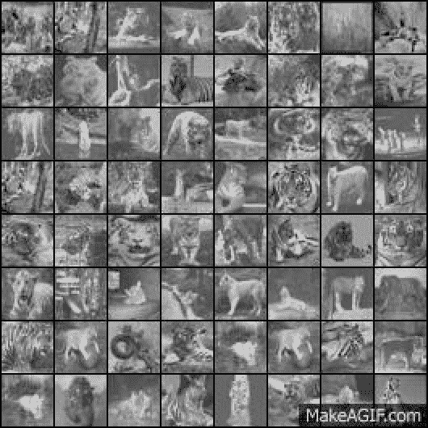

GIF from this [website](https://giphy.com/gifs/coding-fKsSCtWQ6MR7q)

【Neil Bruce 博士，( [Google scholar Page](https://scholar.google.com/citations?user=Gnezf-4AAAAJ&hl=en) )我的导师推荐我阅读这篇论文，我真的很想获得对稀疏滤波更实际的理解。(所以才发这个帖子。)

在这篇文章中，我将首先看到不同降维技术的效果，包括…

*1。* [*主成分分析*](http://scikit-learn.org/stable/modules/generated/sklearn.decomposition.PCA.html) *2。* [*独立成分分析。*](http://scikit-learn.org/stable/modules/generated/sklearn.decomposition.FastICA.html) *3。* [*线性判别分析*](http://scikit-learn.org/stable/modules/generated/sklearn.discriminant_analysis.LinearDiscriminantAnalysis.html#sklearn.discriminant_analysis.LinearDiscriminantAnalysis.fit_transform) *4。*[*t-分布随机邻居嵌入。*](http://scikit-learn.org/stable/modules/generated/sklearn.manifold.TSNE.html) *5。* [*因素分析*](http://scikit-learn.org/stable/modules/generated/sklearn.decomposition.FactorAnalysis.html#examples-using-sklearn-decomposition-factoranalysis) *6。* [*稀疏过滤*](https://papers.nips.cc/paper/4334-sparse-filtering)

> **请注意这篇帖子是为了我对稀疏滤波的理解。**

**降维**

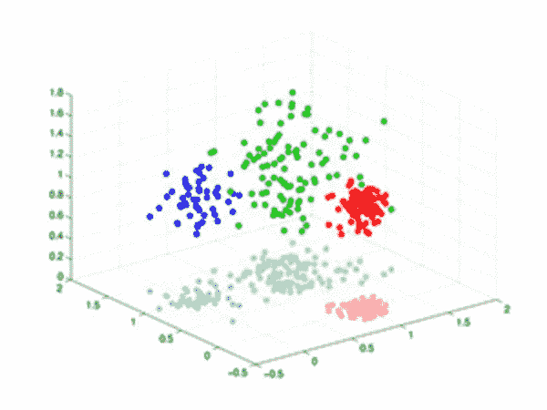

Image from this [website](http://bigdata.csail.mit.edu/node/277)

在继续之前，我想简单回顾一下降维的效果。但是请注意，这些算法背后的数学不在本文讨论范围之内，但是如果有人感兴趣，我会在下面链接一些好的资源。

Video from [StatQuest with Josh Starmer](https://www.youtube.com/channel/UCtYLUTtgS3k1Fg4y5tAhLbw)

Video from [StatQuest with Josh Starmer](https://www.youtube.com/channel/UCtYLUTtgS3k1Fg4y5tAhLbw)

Video from [StatQuest with Josh Starmer](https://www.youtube.com/channel/UCtYLUTtgS3k1Fg4y5tAhLbw)

如果你想知道 LDA 和 PCA 的区别，请[点击这里](https://www.quora.com/What-is-the-difference-between-LDA-and-PCA-for-dimension-reduction)或[点击这里](https://www.youtube.com/watch?v=e4woe8GRjEI)。

**示例:清晰分离的数据**

简单地说，我们有上面的数据点，不同的颜色代表不同的类别，每个数据点有 3 个轴(X，Y，Z)。现在让我们先来看看每个分解算法是如何分解这些数据的。(作为开始，我们将只把维数减少 1 倍。)

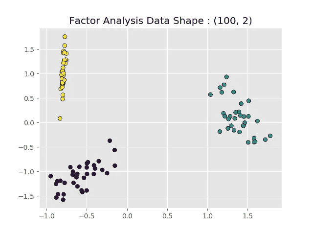

Different decomposition algorithm to reduce the dimension to 2

他们都做得很好，将相同的类聚集在一起，现在让我们看看何时将维度减少到 1。(删除二维)。

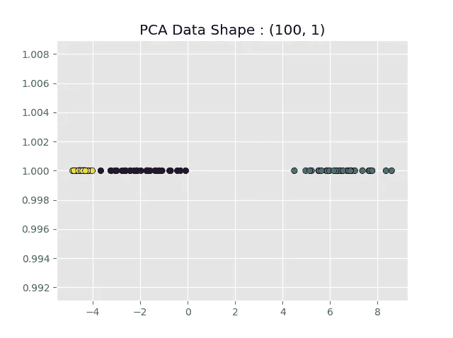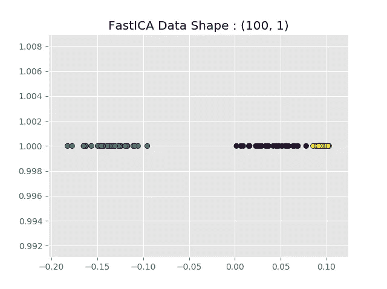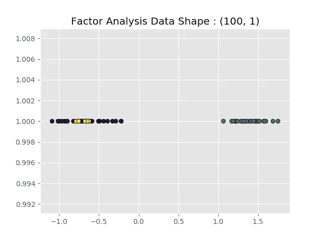

同样，当原始数据彼此明显分离时，我们可以看到大多数算法在降低维度方面做得很好，同时对每个类进行聚类。(虽然这里那里有一些离群值。)

**示例:没有清晰分离的数据**

现在为了让事情变得更难，让我们来看一个没有从每个类中明确分离的例子。

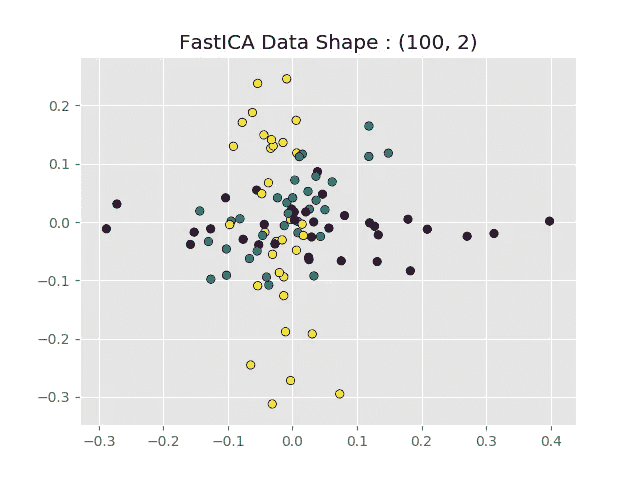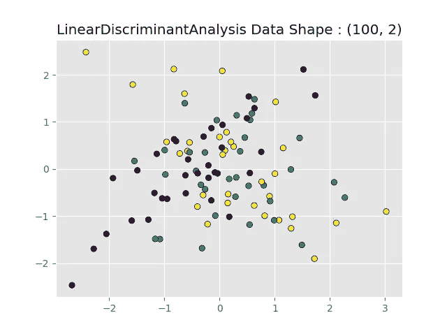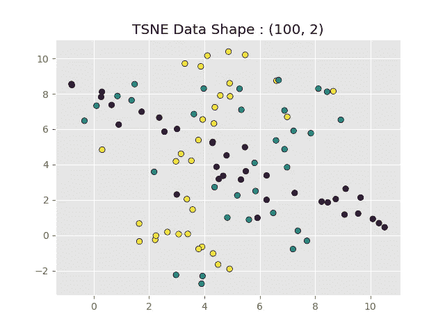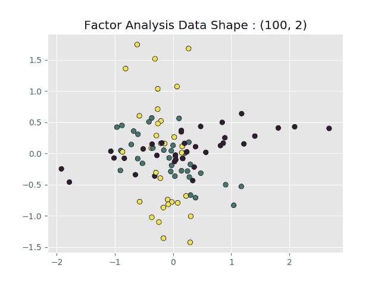

从表面上看，大多数算法只是移除了 Z(深度)轴，最后让我们来看看将维度减少到 1 的情况。

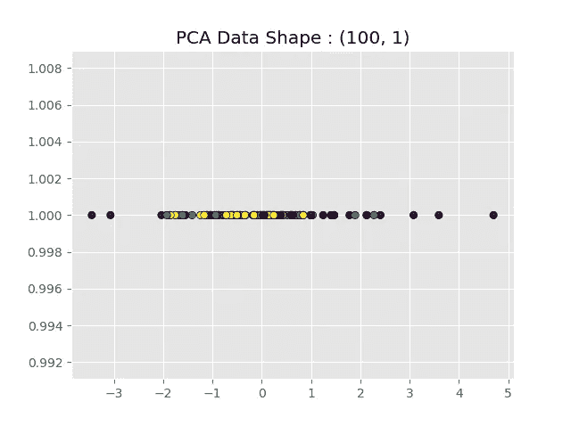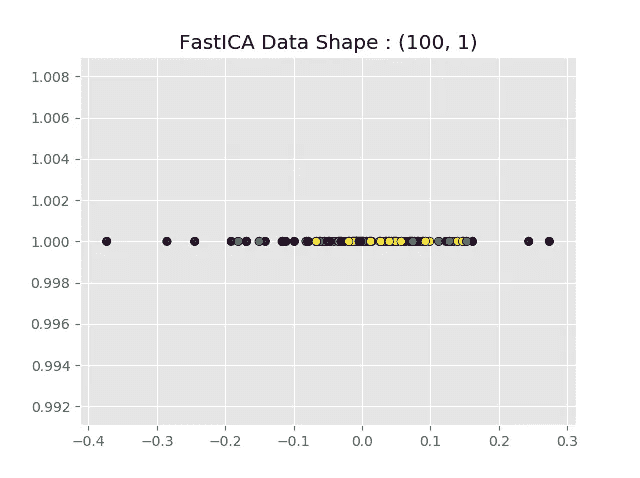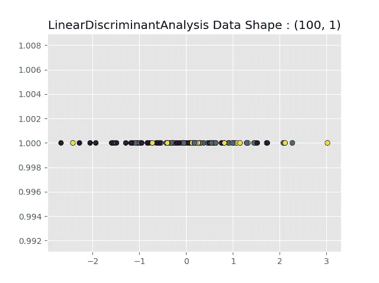

从一瞥中，我们可以注意到一个模式，当与紫色点相比时，黄色点更倾向于聚集(t-SNE 或 LDA 不是这种情况)。然而，我们得到的是一个非常有趣的结果。

**特征分布的理想性质**

在继续之前，我想介绍一下特征分布的一些期望的性质。(我个人认为这个话题很重要)

**每个示例的稀疏特征(总体稀疏)** →矩阵中的每个元素(或每个示例)应该仅由少数(非零)特征来表示。

**跨示例的稀疏特征(生命周期稀疏)** →每个特征应该允许我们区分不同的示例。(换句话说，特征应该足够有效，让我们能够区分不同的例子。)

**活动分布均匀(高度分散)** →对于每个示例，活动特征的数量应与其他示例相似。

**稀疏滤波**

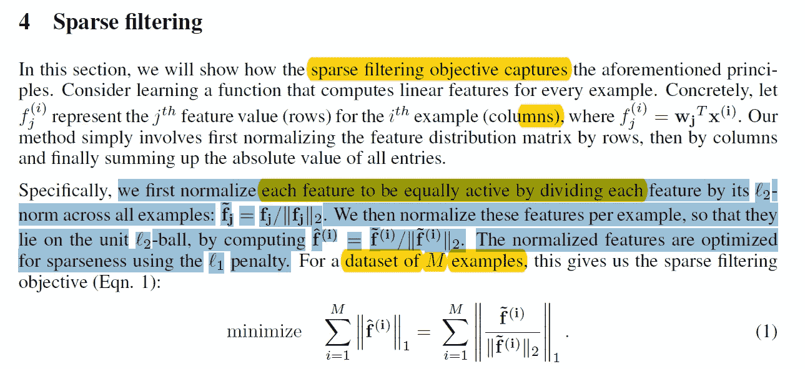

**蓝线** →稀疏滤波算法

稀疏过滤的主要思想非常简单，通过无监督的方式学习数据的新特征(更紧凑的表示)。我们实现这一点的方法是简单地对矩阵的所有例子取 [L2 范数](http://mathworld.wolfram.com/L2-Norm.html)并执行归一化。然后我们再次规范化这些例子，但是这次是每个例子。最后，我们通过 [L1 罚函数](http://www.statisticshowto.com/regularization/)最小化特征的总和。关于这个方法为什么有效的更多理论理由[请点击这里。](https://arxiv.org/abs/1603.08831)

如上所述，对于这个实验，我们也将遵循论文的原始作者所做的，将软绝对函数作为我们的激活函数。对于 Numpy 实现，我们将使用[有限内存 BFGS 优化](https://en.wikipedia.org/wiki/Limited-memory_BFGS)算法，对于 tensorflow，我们将使用 Adam 优化器。

**结果:稀疏滤波(Numpy)**

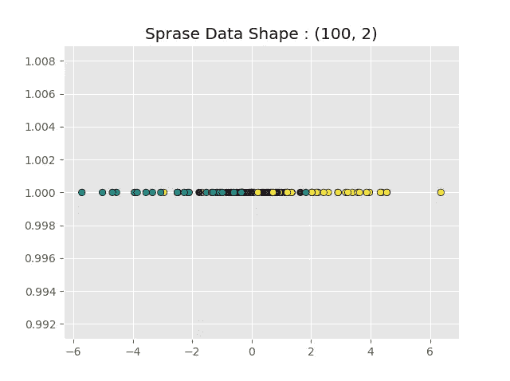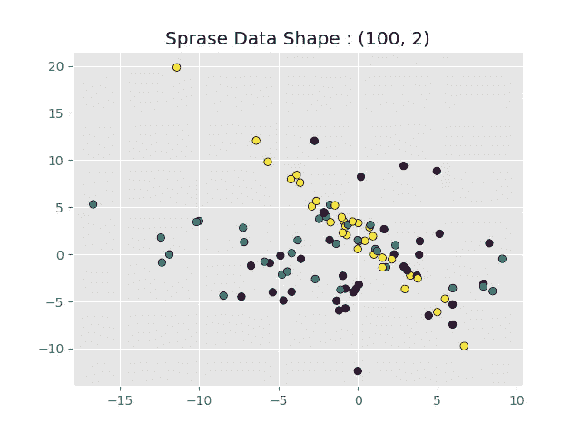

**左上/右下** →清除分色数据 2D // 1D
**左下/右下** →不清除分色数据 2D // 1D

从 [subramgo](https://github.com/subramgo) 中取代码，我们可以观察稀疏滤波是如何降维的。总的来说，它在聚类相似的类方面做得很好，但是，对于具有明显分离的数据的 1D 归约，我们可以观察到它不能清楚地将每个类聚类到不同的 x 轴点。

**结果:稀疏滤波(张量流)**

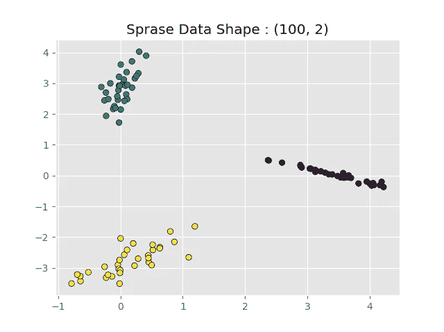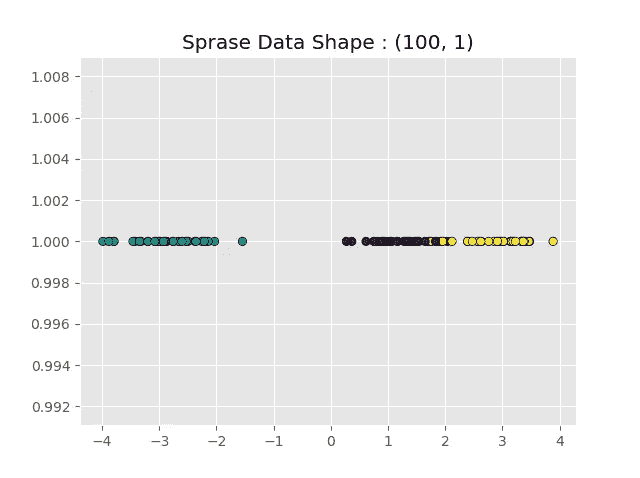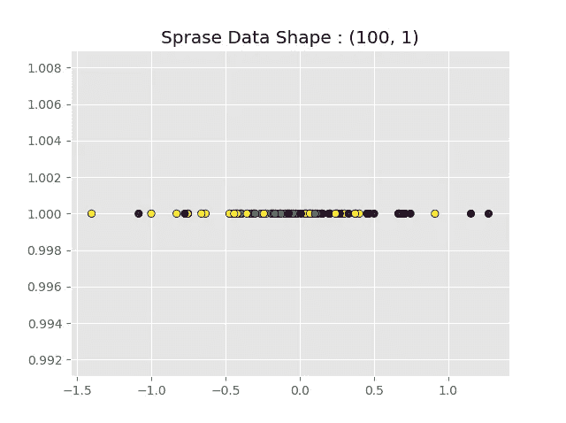

**左上/右下** →清除分色数据 2D // 1D
左下/右下 →不清除分色数据 2D//1D

既然我喜欢 tensorflow，我就直接复制了 Numpy 实现的代码。然而，与 Numpy 实现的一个区别是，我们将使用 Adam Optimizer。(而不是[有限内存 BFGS](https://en.wikipedia.org/wiki/Limited-memory_BFGS) )。).

令人惊讶的是，(我个人认为)，它比 Numpy 版本做得更好。特别是当我们看一下清晰分离数据的 1D 缩减时。此外，对于没有明确分离的数据，我们可以观察到大多数绿色圆圈聚集在一起，而其他紫色和黄色圆圈更加分散。

**互动码**

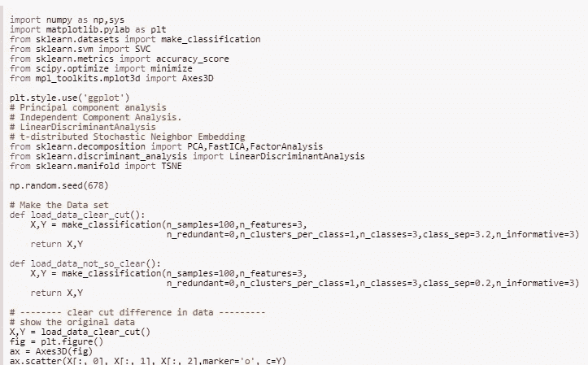

对于 Google Colab，你需要一个 Google 帐户来查看代码，而且你不能在 Google Colab 中运行只读脚本，所以在你的操场上复制一份。最后，我永远不会请求允许访问你在 Google Drive 上的文件，仅供参考。编码快乐！同样为了透明，我在 github 上上传了所有的训练日志。

要访问 PCA、LDA、ICA 等的代码… [请点击此处。](https://colab.research.google.com/drive/1rP7VW9XigXnSgj0ECOvOVswKOEeDwPRt)
访问 Numpy 的代码[稀疏点击这里](https://colab.research.google.com/drive/1YSI_OIWy3Lsst2SGl03AD4IR892wzSEl)，[训练日志点击这里。](https://github.com/JaeDukSeo/Daily-Neural-Network-Practice-2/blob/master/Understanding_Concepts/Sparse/sparse_np.txt)
访问 [tensorflow 稀疏代码点击此处，](https://colab.research.google.com/drive/1Jz0jhV5ozYzokgIHVywY3j98By-Uysq0) [训练日志点击此处。](https://github.com/JaeDukSeo/Daily-Neural-Network-Practice-2/blob/master/Understanding_Concepts/Sparse/sparse.txt)

**最后的话**

我为这篇文章缺乏结构而道歉。

如果发现任何错误，请发电子邮件到 jae.duk.seo@gmail.com 给我，如果你想看我所有写作的列表，请在这里查看我的网站。

同时，在我的推特上关注我[这里](https://twitter.com/JaeDukSeo)，访问[我的网站](https://jaedukseo.me/)，或者我的 [Youtube 频道](https://www.youtube.com/c/JaeDukSeo)了解更多内容。我还实现了[广残网，请点击这里查看博文 pos](https://medium.com/@SeoJaeDuk/wide-residual-networks-with-interactive-code-5e190f8f25ec) t。

**参考**

1.  Ngiam，j .、Chen，z .、Bhaskar，s .、Koh，p .、和 Ng，A. (2011 年)。稀疏过滤。Papers.nips.cc 于 2018 年 6 月 12 日检索，来自[https://papers.nips.cc/paper/4334-sparse-filtering](https://papers.nips.cc/paper/4334-sparse-filtering)
2.  , (2018).[在线]可在:[https://www.linkedin.com/in/neil-bruce-19292417/](https://www.linkedin.com/in/neil-bruce-19292417/)【2018 年 6 月 12 日访问】。
3.  [在线]可在:[https://scholar.google.com/citations?user=Gnezf-4AAAAJ&HL = en](https://scholar.google.com/citations?user=Gnezf-4AAAAJ&hl=en)【2018 年 6 月 12 日访问】。
4.  控制图形美学-seaborn 0 . 8 . 1 文档。(2018).Seaborn.pydata.org。检索于 2018 年 6 月 12 日，来自 https://seaborn.pydata.org/tutorial/aesthetics.html
5.  分区，L. (2018)。LDA 作为划分之前或之后的维度缩减。交叉验证。检索于 2018 年 6 月 12 日，来自[https://stats . stack exchange . com/questions/305691/LDA-as-the-dimension-reduction-before-or-after-partitioning](https://stats.stackexchange.com/questions/305691/lda-as-the-dimension-reduction-before-or-after-partitioning)
6.  sk learn . decomposition . PCA—sci kit—学习 0.19.1 文档。(2018).Scikit-learn.org。检索于 2018 年 6 月 12 日，来自[http://sci kit-learn . org/stable/modules/generated/sk learn . decomposition . PCA . html](http://scikit-learn.org/stable/modules/generated/sklearn.decomposition.PCA.html)
7.  sk learn . decomposition . fa stica—sci kit—学习 0.19.1 文档。(2018).Scikit-learn.org。检索于 2018 年 6 月 12 日，来自[http://sci kit-learn . org/stable/modules/generated/sk learn . decomposition . fa stica . html](http://scikit-learn.org/stable/modules/generated/sklearn.decomposition.FastICA.html)
8.  Python？，H. (2018)。如何用 Python 制作 3D 散点图？。堆栈溢出。检索于 2018 年 6 月 12 日，来自[https://stack overflow . com/questions/1985856/how-to-make-a-3d-scatter-plot-in-python](https://stackoverflow.com/questions/1985856/how-to-make-a-3d-scatter-plot-in-python)
9.  k 均值聚类和低秩近似的降维。(2018).Bigdata.csail.mit.edu。检索于 2018 年 6 月 12 日，来自[http://bigdata.csail.mit.edu/node/277](http://bigdata.csail.mit.edu/node/277)
10.  sklearn.discriminant _ analysis。线性判别分析-sci kit-学习 0.19.1 文档。(2018).Scikit-learn.org。检索于 2018 年 6 月 12 日，来自[http://sci kit-learn . org/stable/modules/generated/sk learn . discriminant _ analysis。lineardiscriminantanalysis . html # sk learn . discriminant _ analysis。linear discriminant analysis . fit _ transform](http://scikit-learn.org/stable/modules/generated/sklearn.discriminant_analysis.LinearDiscriminantAnalysis.html#sklearn.discriminant_analysis.LinearDiscriminantAnalysis.fit_transform)
11.  sk learn . manifold . tsne—sci kit-learn 0 . 19 . 1 文档。(2018).Scikit-learn.org。检索于 2018 年 6 月 12 日，来自[http://sci kit-learn . org/stable/modules/generated/sk learn . manifold . tsne . html](http://scikit-learn.org/stable/modules/generated/sklearn.manifold.TSNE.html)
12.  sk learn . decomposition . factor analysis-sci kit-learn 0 . 19 . 1 文档。(2018).Scikit-learn.org。检索于 2018 年 6 月 12 日，来自[http://sci kit-learn . org/stable/modules/generated/sk learn . decomposition . factor analysis . html # examples-using-sk learn-decomposition-factor analysis](http://scikit-learn.org/stable/modules/generated/sklearn.decomposition.FactorAnalysis.html#examples-using-sklearn-decomposition-factoranalysis)
13.  StatQuest:主成分分析(PCA)解释清楚(2015)。(2018).YouTube。检索于 2018 年 6 月 12 日，来自 https://www.youtube.com/watch?v=_UVHneBUBW0
14.  StatQuest: t-SNE，解释清楚。(2018).YouTube。检索于 2018 年 6 月 12 日，来自[https://www.youtube.com/watch?v=NEaUSP4YerM](https://www.youtube.com/watch?v=NEaUSP4YerM)
15.  StatQuest:线性判别分析(LDA)解释清楚..(2018).YouTube。检索于 2018 年 6 月 12 日，发自[https://www.youtube.com/watch?v=azXCzI57Yfc&LC = z 221 ubiy 3 qzoizzubacd p 431 wog 0 fwhls 5 iiwovere 5 w 03 c 010 c](https://www.youtube.com/watch?v=azXCzI57Yfc&lc=z221ubiy3qzoizzubacdp431wog0fwhls5iiwovere5w03c010c.1528837997136780)
16.  sk learn . datasets . make _ classification-sci kit-learn 0 . 19 . 1 文档。(2018).Scikit-learn.org。检索于 2018 年 6 月 12 日，来自[http://sci kit-learn . org/stable/modules/generated/sk learn . datasets . make _ classification . html](http://scikit-learn.org/stable/modules/generated/sklearn.datasets.make_classification.html)
17.  尺寸，S. (2018)。sk learn LDA-分析不会生成 2 维。堆栈溢出。检索于 2018 年 6 月 12 日，来自[https://stack overflow . com/questions/49955592/sk learn-LDA-analysis-wont-generate-2-dimensions](https://stackoverflow.com/questions/49955592/sklearn-lda-analysis-wont-generate-2-dimensions)
18.  主成分分析与独立成分分析继续-佐治亚理工学院-机器学习。(2018).YouTube。检索于 2018 年 6 月 12 日，来自[https://www.youtube.com/watch?v=e4woe8GRjEI](https://www.youtube.com/watch?v=e4woe8GRjEI)
19.  你的参考书目:Anon，(2018)。[在线]可从以下网址获取:[https://www . quora . com/What-is-the-difference-than-the-LDA-and-PCA-for-dimension-reduction](https://www.quora.com/What-is-the-difference-between-LDA-and-PCA-for-dimension-reduction)【2018 年 6 月 12 日获取】。
20.  subramgo/SparseFiltering。(2018).GitHub。检索于 2018 年 6 月 13 日，来自 https://github.com/subramgo/SparseFiltering
21.  过滤，U. (2014)。无监督特征学习-稀疏过滤。Vaillab.blogspot.com。检索于 2018 年 6 月 13 日，来自[http://vail lab . blogspot . com/2014/08/unsupervised-feature-learning-sparse . html](http://vaillab.blogspot.com/2014/08/unsupervised-feature-learning-sparse.html)
22.  Metzen，J. (2018 年)。基于稀疏滤波的无监督特征学习。Jmetzen.github.io .检索于 2018 年 6 月 13 日，来自[http://jmetzen.github.io/2014-09-14/sparse_filtering.html](http://jmetzen.github.io/2014-09-14/sparse_filtering.html)
23.  资料 D. (2018)。禁用 Tensorflow 调试信息。堆栈溢出。检索于 2018 年 6 月 13 日，来自[https://stack overflow . com/questions/35911252/disable-tensor flow-debugging-information](https://stackoverflow.com/questions/35911252/disable-tensorflow-debugging-information)
24.  tensorflow？，W. (2018)。tensorflow 中 numpy.newaxis 的替代品是什么？。堆栈溢出。检索于 2018 年 6 月 13 日，来自[https://stack overflow . com/questions/42344090/what-the-alternative-of-numpy-newaxis-in-tensor flow](https://stackoverflow.com/questions/42344090/what-is-the-alternative-of-numpy-newaxis-in-tensorflow)
25.  类，P. (2018)。Python 调用类中的函数。堆栈溢出。检索于 2018 年 6 月 13 日，来自[https://stack overflow . com/questions/5615648/python-call-function-within-class](https://stackoverflow.com/questions/5615648/python-call-function-within-class)
26.  (TensorFlow)？，D. (2018)。GradientDescentOptimizer 和 AdamOptimizer (TensorFlow)的区别？。交叉验证。检索于 2018 年 6 月 13 日，来自[https://stats . stack exchange . com/questions/184448/difference-between-gradientdescentoptimizer-and-adamoptimizer-tensor flow](https://stats.stackexchange.com/questions/184448/difference-between-gradientdescentoptimizer-and-adamoptimizer-tensorflow)
27.  导入多个张量流模型(图表)Breta Hajek。(2017).布雷塔·哈杰克。检索于 2018 年 6 月 13 日，来自[https://bretahajek . com/2017/04/importing-multiple-tensor flow-models-graphs/](https://bretahajek.com/2017/04/importing-multiple-tensorflow-models-graphs/)
28.  TensorFlow，W. (2018)。在 TensorFlow 中使用多个图形。堆栈溢出。检索于 2018 年 6 月 13 日，来自[https://stack overflow . com/questions/35955144/working-with-multiple-graphs-in-tensor flow](https://stackoverflow.com/questions/35955144/working-with-multiple-graphs-in-tensorflow)
29.  TensorFlow，W. (2018)。在 TensorFlow 中使用多个图形。堆栈溢出。检索于 2018 年 6 月 13 日，来自[https://stack overflow . com/questions/35955144/working-with-multiple-graphs-in-tensor flow](https://stackoverflow.com/questions/35955144/working-with-multiple-graphs-in-tensorflow)
30.  有限记忆 BFGS。(2018).En.wikipedia.org。检索于 2018 年 6 月 13 日，来自[https://en.wikipedia.org/wiki/Limited-memory_BFGS](https://en.wikipedia.org/wiki/Limited-memory_BFGS)
31.  正规化:简单的定义，L1 和 L2 处罚。(2016).统计学如何？检索于 2018 年 6 月 13 日，来自[http://www.statisticshowto.com/regularization/](http://www.statisticshowto.com/regularization/)
32.  L -Norm —来自 Wolfram MathWorld。(2018).Mathworld.wolfram.com。检索于 2018 年 6 月 13 日，来自[http://mathworld.wolfram.com/L2-Norm.html](http://mathworld.wolfram.com/L2-Norm.html)
33.  Zennaro，f .，& Chen，K. (2016)。理解稀疏滤波:理论观点。Arxiv.org。检索于 2018 年 6 月 13 日，来自[https://arxiv.org/abs/1603.08831](https://arxiv.org/abs/1603.08831)