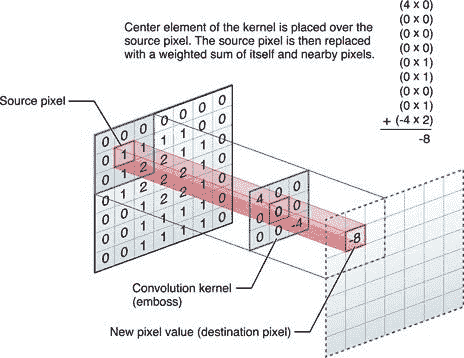
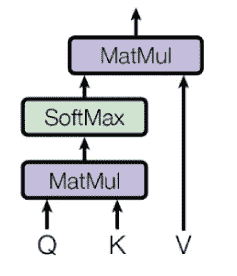
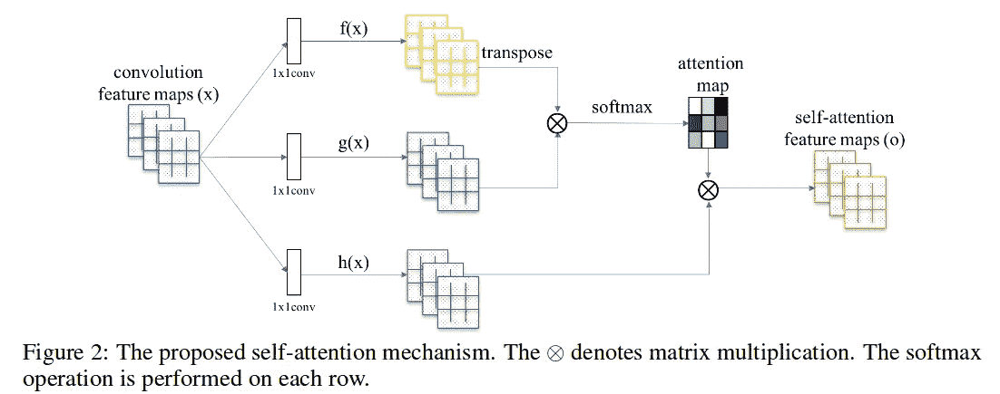
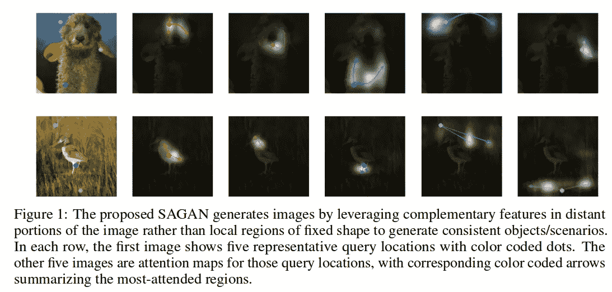
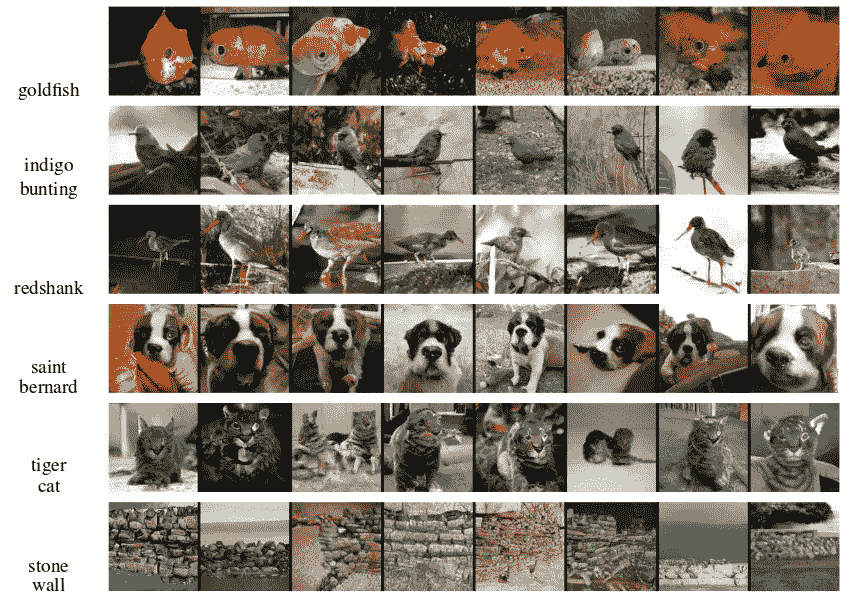

# 不仅仅是另一张 GAN 纸——SAGAN

> 原文：<https://towardsdatascience.com/not-just-another-gan-paper-sagan-96e649f01a6b?source=collection_archive---------1----------------------->

今天我要讨论一篇最近的论文，这篇论文是我读的，并提交给了我的一些朋友。我发现这篇论文的想法非常简单，我觉得像我这样对生成性敌对网络知之甚少的人都能理解。

这是一篇由 GANfather，Ian Goodfellow 和其他几位伟大的研究人员最近发表的论文。论文题目为 [**自我关注生成对抗网络**](https://arxiv.org/abs/1805.08318) 或简称**萨根**。

GANs 生成的大部分好的图像结果都是利用了一个叫做卷积神经网络(CNN)的怪物。像所有的怪物一样，这一个也有一些弱点，我们将进一步讨论。我们见过的大多数 GAN 生成的好图像都是单个类或很少几个类。下图仅在名人面孔数据集上进行训练。

Source: (YouTube) Progressive growing of GANs

## 问题是

卷积 gan(以后简称为 CGANs)在学习 Imagenet 等多类数据集的图像分布时存在困难。研究人员观察到，当在多类数据集上训练时，这些 CGANs 在建模一些图像类时比其他图像类有困难。他们观察到，CGANs 可以很容易地生成像海洋、天空等更简单几何图形的图像。但是对于像狗、马等一些特殊几何形状的图像却失败了。CGAN 能够生成狗的毛皮纹理，但无法生成独特的腿。

## 为什么会出现这个问题？

这个问题的出现是因为卷积是一种局部运算，其感受野取决于核的空间大小。在卷积运算中，左上角的输出不可能与右下角的输出有任何关系。在下图中，我们可以看到输出" *-8"* 是由图像左上角的像素计算的，它与图像中的任何其他部分都没有关系。类似地，当计算卷积输出的任何部分时，除了图像中计算输出的小的局部区域之外，它与任何其他部分无关。

Source: [Quora answer by](https://www.quora.com/Where-and-how-exactly-does-the-convolution-operator-come-in-in-convolutional-neural-networks) [Abhishek Shivkumar](https://www.quora.com/profile/Abhishek-Shivkumar)

你会问，难道我们不能把空间尺寸做得更大，这样它就能捕捉到更多的图像吗？是啊！当然我们可以，但这会降低较小过滤器的计算效率，并使操作变慢。那么你会再次问，难道我们不能用更小的滤光器制作更深的 CGAN，以便后面的层具有更大的感受野吗？是啊！我们可以，但是要有足够大的感受野需要太多的层，太多的层意味着太多的参数。因此，这将使 GAN 训练更加不稳定。

## 自我关注 GANs

保持计算效率并同时拥有大的感受域的解决方案是**自我关注。**它通过利用 NLP 中著名的“注意力”机制，帮助在效率和远程依赖性(=大感受野)之间建立平衡。

## 这是什么关注？

这是最容易理解的事情之一。假设有 3 个人，分别叫*查询*、*键*和*值*。注意是当*查询*和*键*决定*值*可以对外界说多少话。在深度学习中，每样东西都是一个向量，所以这三个人实际上是三个向量。查询和键以这样的方式相乘，使得它们创建了另一个概率向量，该向量决定向下一层公开多少值。是的，这就是注意力的全部。

Source: [Attention is all you need paper](https://arxiv.org/abs/1706.03762)

让我们用图表来理解它。这个图表是不言自明的。Q(查询)和 K(密钥)经过矩阵乘法，然后通过 softmax，soft max 将结果向量转换为概率分布，最后乘以 V(值)。

那这个**自我关注**是什么东西？在自我关注中，查询、键和值都是相同的。

## 模型

如果你理解了上面的部分，那么理解这是小菜一碟。这是本文提出的自我关注层。在下图的左边，我们得到了之前卷积层的特征图。假设它的维度为(512 x 7x 7)，其中 512 是通道的数量，7 是空间维度。我们首先将特征图分别通过三个 1x1 卷积。我们将三个滤波器命名为 *f，g* 和 *h.*

Source: SAGAN paper

1x1 卷积的作用是减少图像中的通道数量。实际上，1×1 滤波器是一个维度(前一层中的通道数×1×1)。所以 *f* 和 *g* 有 64 个这样的滤波器，所以滤波器的维数变成(64 x 512 x 1 x1)。T4 h T5 有 512 个这样的过滤器。在图像通过之后，我们得到三个维度的特征图(64×7×7)、(64×7×7)和(512×7×7)。猜猜这三样东西是什么我们的查询，键和值对。为了对完整的图像进行自我关注，我们拉平了最后两个维度，维度变成了(64×49)、(64×49)和(512×49)。现在我们可以对它进行自我关注了。我们转置查询并将其与键相乘，然后对所有行取 softmax。于是我们得到了一个形状(49×49)的输出注意图。然后，我们将价值向量与注意力图进行矩阵相乘，输出的形状为(512 x 49)。论文提出的最后一点是，将最终输出乘以一个可学习的比例参数，并将输入作为残差连接添加回去。假设 *x* 是图像， *o* 是输出，我们将 O 乘以一个参数 *y.* 最后的输出 O 变成， ***O=y*o+x*** *。*最初，该论文建议将标度参数初始化为零，使得输出在开始时是简单的旧卷积。他们用零初始化 *y* ，因为他们希望他们的网络依赖于本地邻域中的线索——因为这样更容易，然后网络将逐渐学会给 *y* 参数赋值，并使用自我关注。

**这一层有助于网络从图像的遥远部分捕捉细微的细节，记住，它不能代替卷积，而是卷积运算的补充。**

Source: SAGAN paper

使用的损失函数只是对抗性损失的铰链版本。该论文没有解释任何关于这个特定损失函数的特定用途。

这里 ***z*** 是潜在向量，图像将从该潜在向量生成，并且 **x 和 y** 是来自数据的真实图像。发生器损耗说明了通过愚弄鉴别器来创建越来越真实的图像，而另一方面，鉴别器试图在区分真实和虚假图像方面变得更好。

## 报纸上的一些细节

他们在生成器和鉴别器中都使用了这种自我关注层

**b)** 他们对发生器和鉴别器中的权重进行了频谱归一化，而不像之前的论文只对鉴别器权重进行了归一化。他们将谱范数设置为 1，以限制权重的 Lipschitz 常数。**这只是用来控制梯度**。这个光谱归一化的想法是由[宫藤等人首先提出的。艾尔。](https://arxiv.org/abs/1802.05957)

他们使用了一个双时标更新规则(TTUR ),该规则简单地对鉴别器和生成器使用不同的学习速率。

**d)** 本文中使用的指标是初始得分(IS，越高越好)和 frech et-初始距离(FID，越低越好)。

## 结果

本文通过实验解释了谱归一化和 TTUR 如何帮助 GAN 更好地收敛。相同的图片如下所示。

Source: SAGAN Paper

我们可以看到，在所有三种情况下，评估指标都是 IS 和 FID。当谱范数仅在鉴别器权重上时，训练非常不稳定。即使我们对生成器和鉴别器都应用谱范数，分数也会在大约 200k 迭代时偏离。但是有了 TTUR 就不会这样了。

这篇论文最好的部分是它的结果，它远远超过了以前的最先进水平。

Source: SAGAN paper

最后让我们看看自我关注的 GANs 生成的图像。

Source: SAGAN Paper

非常感谢你读到这里。如果你喜欢这篇文章，请留下一些掌声。我希望它对你有用。请阅读这篇文章以了解更多的细节，相信我，这是一篇容易读懂的文章。

> 这是我的第二篇博客，所以请原谅我可能犯的任何错误。我很乐意接受对我任何错误的建设性批评。我会写更多，所以请订阅或关注我的推特。我展示的幻灯片的链接是这里的。想要了解类似的研究论文解释，请订阅 Youtube 上的 Crazymuse AI 频道。任何其他建议都可以通过 twitter 或电子邮件联系我。