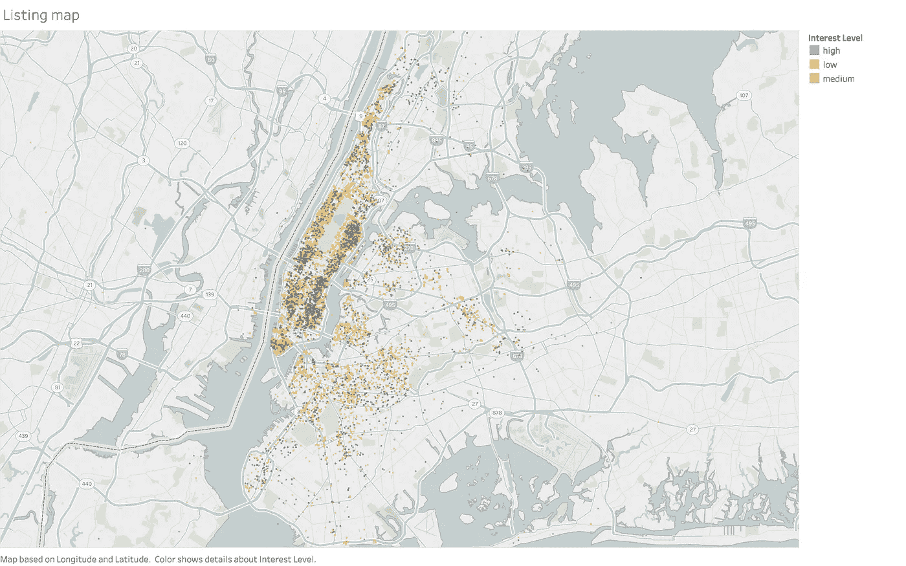
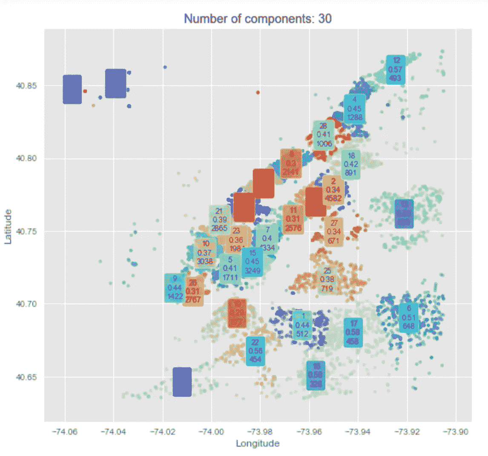
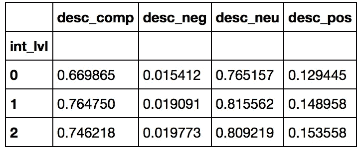
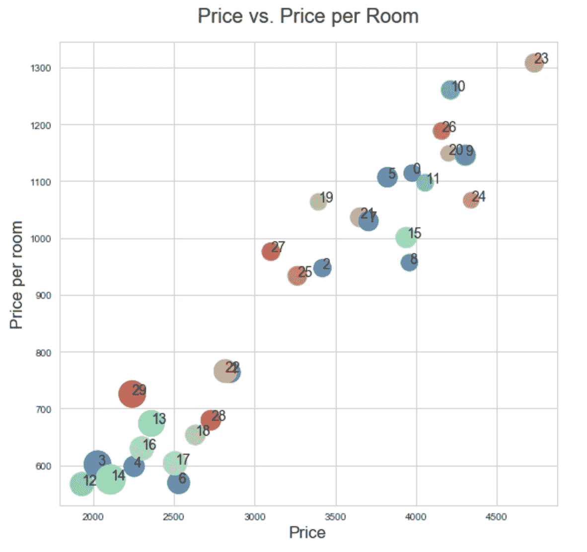
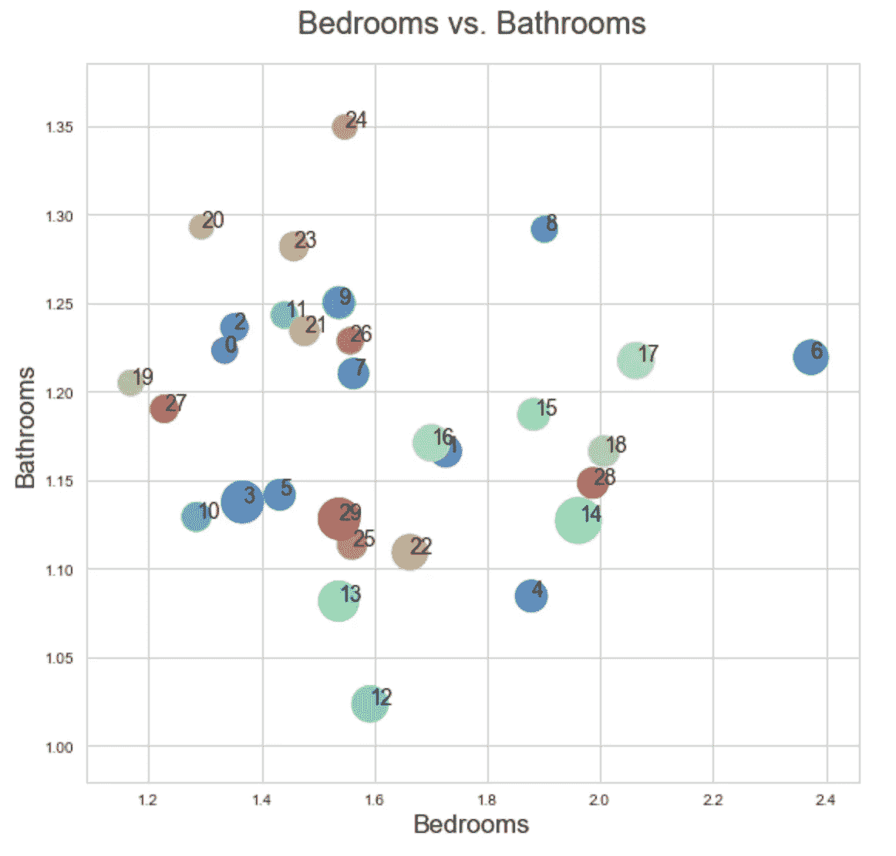
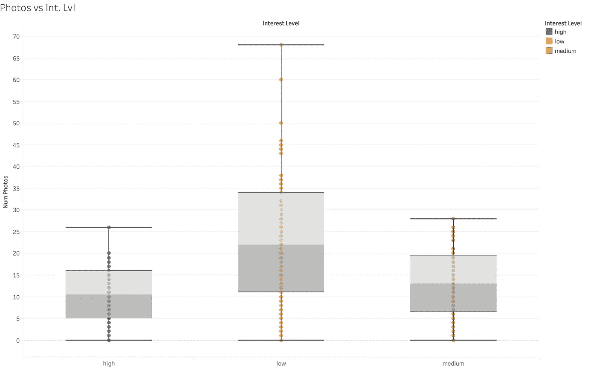

# 不是位置，不是位置，不是位置

> 原文：<https://towardsdatascience.com/not-location-not-location-not-location-c09f7cac24e4?source=collection_archive---------7----------------------->

纽约人痴迷于几样东西:他们孩子的学校，新餐馆，但没有什么比房地产更重要的了。作为一个被收养的纽约人，我不禁惊叹于纽约市房地产市场的永恒娱乐奇观。

对于本周的项目，kaggle 在菜单上，特别是两个适马连接:租赁列表查询挑战。我最近试图建立一个关于纽约房地产销售的数据集；不幸的是，大多数房地产网站设置的验证码障碍使得这一努力毫无结果。

这项比赛由两家适马和 RentHop(两家适马风险投资公司的投资组合公司，是两家适马投资公司的子公司)共同主办，旨在鼓励利用现实世界数据解决日常问题的创造力。

# 目标

这些数据包括 2016 年 4 月至 6 月期间创建的纽约市及其周边的 49，000 行火车集和 74，000 行租赁房源测试集。目标是一个三级变量，“兴趣水平”:

*   “低”:列车组的 69.5%，
*   “中等”:22.7%
*   “高”:7.8%

RentHop 没有定义分类的标准。挑战在于预测测试集中每个列表的每个兴趣水平的概率。竞赛的衡量标准是预测的多类对数损失。

Listing map (made on Tableau)

# 高利息的理由

除了建立一个模型的基本任务，这个模型将与竞赛紧密相关，但大多数读者对此不感兴趣，还可以确定是什么使一个列表吸引了很高的兴趣。如果我是一名房地产经纪人，我肯定会想知道哪些功能对找房子的人来说很重要，这样我就可以寻找满足这些需求的公寓或发布房源，并吸引客流量。

在我看来，纽约的租房者可以分为两大类:

*   家庭:他们主要是受好学校的需要和附近的驱动；
*   刚毕业的大学生:刚到纽约，他们主要受价格驱动。

我知道纽约有很多租房者不符合这两个类别中的任何一个(持有愤怒的笔记！)，但考虑到数据集中的房源所涵盖的时间段(4 月至 6 月)，我认为它们可能涵盖了一些潜在的租房者，并解释了我们的发现。

# 簇

在选择公寓时，大多数纽约市居民倾向于将他们的搜索限制在一个特定的社区，原因有很多:因为它很安静，或者有好学校或美食，或者方便上班通勤。由于猎人似乎专注于他们选择的区域，我开始根据纬度和经度对数据进行聚类。基于视力测试，我选择了 30 组。

正如你在下面看到的(很抱歉是第二张纽约市地图……)，他们很好地识别了纽约市的自然社区，并强化了这样一个想法，即公寓搜索者将他们的搜索限制在他们感兴趣的城市部分。

RentHop listings in 30 NYC clusters

有三个数字与每个聚类相关联:它的数字(由聚类算法 KMeans 确定)、该聚类的平均兴趣水平分数(0 表示低兴趣水平，1 表示中兴趣水平，2 表示高兴趣水平-整个数据集的平均值为 0.38)以及该聚类中的列表数量。

有趣的是，离曼哈顿中心越远，分数越高，那里的上市密度越低。换句话说，当选择较少时，兴趣水平较高。

另一个有趣的观察结果是，两个较高的聚类分数是地图西北角的两个:通过选择，我决定在 40.85 纬度/-74.04 经度点周围随机分配位置异常值。我认为对纬度和经度坐标的不重视也会反映在列表的总体水平上，这就是我决定将它们放在一起的原因。看来我错了…

计算了一些聚类平均值(价格、每间房间的价格、每间卧室的价格等等)，我在下面展示了这些平均值，以帮助可视化。在项目的模型构建部分，它们被用于将每个列表与其聚类平均值进行比较，以获得将列表定位在其聚类中的八个特征。

同样的特征然后被设计成与建筑平均值相关。毕竟，在找公寓的时候，你可能会想把一个房源和它最近的邻居进行比较(还有什么比上下两层楼更近呢？)

# 自然语言处理

我期待自然语言处理对描述和特性有所帮助。这是一个小小的挑战，因为没有一个通用的方法来命名一个特定的公寓功能，每个上市代理都有自己的命名风格。

经过几次尝试后，它是一个计数矢量器，列出了大多数与豪华公寓相关的功能，证明是该领域的最佳贡献者。这有点违背直觉，因为目标是确定利息水平，而不是高价。

# 情感分析

另一项功能工程任务是在列表描述中使用 NLTK Vader 情感分析器。以下是每个兴趣水平组的平均综合、负面、中性和正面情绪得分。

Sentiment Analysis averages per Interest Level

如上所述，一方是低兴趣，另一方是中兴趣和高兴趣，这两者之间有细微的差别，但总的来说，这三个群体在所有四个方面都非常接近。当谈到出售房地产时，这并不完全令人惊讶。

# 模型优化

随机森林分类器(针对网格搜索进行了优化)给出了以下十大特征重要性:

Feature Importance

正如我所料，经理得分排在第一位，考虑到该功能是如何构建的(基于每个经理的平均兴趣水平得分),这也不奇怪。)更有趣的是接下来的两个特性，“每间客房价格”和“价格”。在我提到社区(或集群)是家庭找房子的一个决定因素后，这凸显了涌向城市寻找第一份工作的大学毕业生(纽约市租房人口的另一大部分)对租房的要求:便宜…

# 形象化

下面的方框图有助于我们理解最后一点:

Price per Room vs. Interest Level (from Tableau)

箱线图之间的差异非常清楚地表明，当涉及到上市兴趣水平时，每个房间的价格非常重要。

现在，让我们检查每个集群的平均价格和每间客房的价格:

Price vs. Price per Room per Cluster (Dot size reflects average Interest Level)

不出所料，曼哈顿中城(集群 23)的房价较高，紧随其后的是 Soho-West Village 地区(集群 10)。在光谱的另一端，因伍德-河谷镇(集群 12)似乎提供了“最好的交易”，紧随其后的是日落公园、格林伍德和湾脊(集群 14)周围的布鲁克林集群。较大的点(较高的利息水平)也往往位于地块的左下角，这里的价格较低，公寓密度较低。大多数集群都在曼哈顿之外。

Bedrooms vs. Bathrooms per Cluster (Dot size reflects average Interest Level)

比较卧室与浴室，只有一个小的迹象表明，更多的卧室吸引更多的兴趣，地块右边部分的集群比左边部分的集群略大。另一个观察是，曼哈顿公寓往往有更多的浴室，因为 1.25 线以上的所有集群都在曼哈顿，但浴室的数量似乎对兴趣水平没有太大影响。

# 惊人的发现

在列举一个地方时，也许“少即是多”:在照片和文字中。

列表上的图片越多，人们的兴趣似乎就越少。如果有更多的照片，找房子的人会有更多的机会发现房子的缺陷吗？猎人会因为照片没有被管理而感到无聊和烦恼吗？

Box plot of Photos per Interest Level (made on Tableau)

下面的第二个也是同样的意思:更多的文字，更少的兴趣…也许公寓猎人认为需要更多的文字来掩盖更多关于公寓状况的问题？或者，也许找房子的人注意力持续时间短，很快就会被未经编辑的空话弄得烦躁不安。

# 结论

公寓猎人和房地产经纪人，振作起来！

根据这些数据，以下是一些引起租赁清单兴趣的事实:

*   首先也是最重要的，价格很重要:有很多指标可以显示它，但我的模型中的功能重要性是一个很好的指标，几个与价格相关的功能排在前 10 位。
*   租房市场上寻找公寓的人的行为与销售市场上的不同。毕竟，大多数租房者认为他们的情况是暂时的，所以“位置，位置，位置”的旧规则不太适用于那些想租房的人。
*   远离市中心和较低的公寓密度增加了人们的兴趣。
*   把注意力更多地放在拍好照片上，而不是拍很多照片。浏览它们的时候疲劳很快就来了。
*   简洁精确的描述比冗长罗嗦的描述更重要。

我希望你喜欢这篇文章，并且能够在你尝试你家附近最新的热门餐馆时分享这些见解！