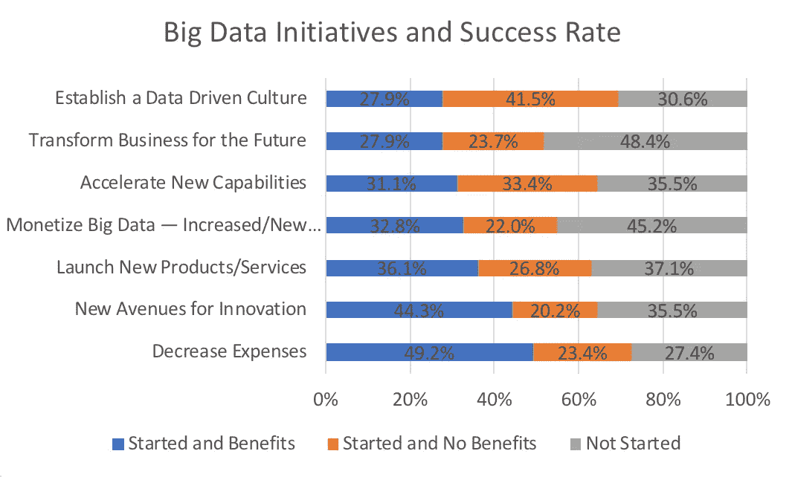
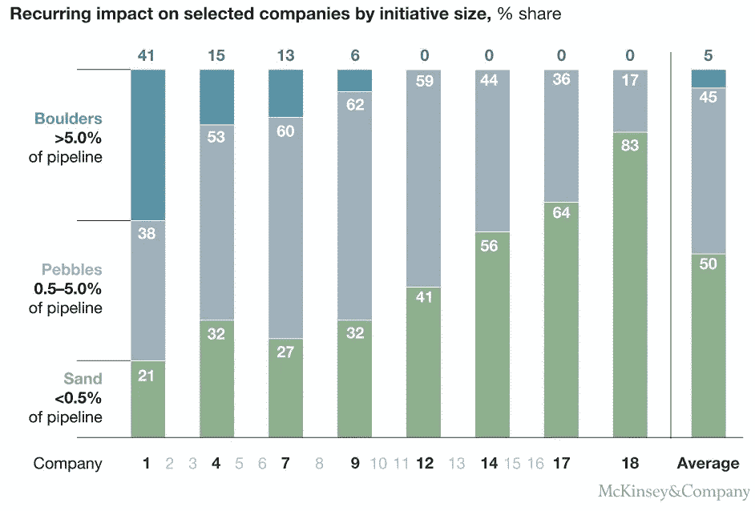

# 没那么快:分析、颠覆和组织变革

> 原文：<https://towardsdatascience.com/not-so-fast-analytics-disruption-and-organizational-change-7c0ae9f598ca?source=collection_archive---------10----------------------->

我们最近的一个客户发现自己陷入了困境。他们是一家历史悠久的制造商，拥有业内最大的市值之一。几十年来，在可靠性和质量至关重要的领域，他们一直是客户信赖的供应商。

但是最近，他们的环境发生了变化。“颠覆者”正在进入他们的市场，他们可以以更低的价格销售竞争产品，质量更低，功能更少。这些颠覆者似乎对数字技术掌握得更好，并且擅长使用数据。我们的客户拥有大量数据，但刚刚开始战略性地思考如何利用这些数据来推动未来的增长和市场机遇。随着利润开始下滑，销售转向更便宜、更新的进入者，客户必须应对这种数字破坏。

# 分析:一种颠覆性的力量

很少有商业理论像克莱顿·克里斯滕森的颠覆理论一样具有影响力和普遍性，正如在[创新者的困境](http://www.claytonchristensen.com/books/the-innovators-dilemma/)中所描述的那样。颠覆理论解释了产品昂贵复杂的老牌企业是如何被产品不复杂但更便宜的新进入者“颠覆”的。随着新进入者的产品被采用，他们的利润增长，他们进一步侵蚀领导者的统治地位。最终，新进入者取代领先者成为该市场的首选供应商。最近在 HBR 的文章(包括克里斯滕森合著的[一篇)强调，尽管在后工业时代、后互联网泡沫经济时代，颠覆理论的许多原则仍然适用，但颠覆的性质和速度正在发生变化*和*加速。](https://hbr.org/2015/12/what-is-disruptive-innovation)

作为这种不断变化的颠覆的一个例子， [Wessel](https://hbr.org/2017/09/why-preventing-disruption-in-2017-is-harder-than-it-was-when-christensen-coined-the-term) 指出，新的颠覆者往往是风险投资、面向软件的企业，它们能够([并经常](http://fortune.com/2017/03/15/tesla-debt-raise-model-3/))筹集大量资金。与老牌竞争对手相比，这些新进入者通常是轻资产的；他们靠股本借钱，而不是信贷。现有的参与者发现很难足够快地筹集资金并投资于他们需要开发的技术和战略，以有效地与颠覆者竞争。

尽管在筹集资金方面处于劣势，但占主导地位的、市场领先的公司确实比他们新的、经验不足的竞争对手有优势:**丰富的** **数据**。老牌公司拥有关于其客户和产品供应的大量信息资源，当通过分析进行探索时，这些资源将揭示颠覆性进入者无法利用的商业价值。由于许多这些根深蒂固的参与者没有将他们的数据视为资产，分析提供了以新方式做新事情的承诺——其自身的一种颠覆。因此，公司正在向数据基础设施、数据科学人才和分析项目投入大量资金，以重振运营、提高效率并开发新产品和服务。根据国际数据公司的估计，数据分析市场将在 2020 年超过[2000 亿美元，因为公司将更多的资源投入到这些活动中。](https://www.forbes.com/sites/gilpress/2017/01/20/6-predictions-for-the-203-billion-big-data-analytics-market/#5799d4d52083)

# 分析:像我们想象的那样具有破坏性？

麻烦在于，老牌公司将分析视为解决他们破坏性问题的*，而不仅仅是将*****可能的优势*** 凌驾于他们破坏性的竞争对手之上。这是一个微妙但重要的区别。在我们作为预测分析顾问的 20 多年中，我们看到了成功实施分析的许多障碍，这些障碍也是阻止公司有效应对中断的障碍。其中包括:***

*   **数据不足，无法解决相关问题**
*   **遗留的组织结构和 IT 基础设施**
*   **不灵活的人员和流程**
*   **职能部门之间沟通不畅**

**Newvantage Partners 最近在进行的一项调查显示，数据计划刚刚开始解决公司在颠覆中面临的问题。如图 1 所示，44.3%的公司成功利用数据投资来确定创新的新途径。然而，35.5%的公司尚未开始以这种方式使用数据。更麻烦的是，48.8%的受访者表示他们尚未开始使用数据来转变未来的业务(只有 48.4%的人表示他们已经开始)。**

****

***Figure 1\. Survey results of various data initiatives and their success rates (Credit: IDC)***

**因此，一家公司在分析方面的成功受到许多同样的障碍和限制，这些障碍和限制使这些公司容易受到干扰，很少有公司成功地利用分析来转变他们未来运营的业务。**

# **使用分析作为对中断的响应**

**尽管分析本身并不是应对中断挑战的解决方案，但有一些经过验证的方法可以确保分析的成功，这些方法应该是任何应对中断的计划的一部分。**

*   ****制定前瞻性分析策略**:对于大多数企业来说，想象一种新的做事方式是非常困难的。然而，这正是颠覆所要求的回应。正如[马丁和 Golsby-Smith](https://hbr.org/2017/09/management-is-much-more-than-a-science) 所写的，有必要打破“现状陷阱”认为事物只会保持原样的信念。分析提供了以新的方式做出决策的可能性，但它是基于历史证据的。改变不仅仅是把旧的事情做得更好。如果要从数据中提炼出新的见解，那么就应该构建一个[分析策略](https://www.elderresearch.com/consulting-services/analytics-strategy)，并以能够实现成功的方式执行。这意味着优先开发原型，收集或获取新的数据源，并重组人员和流程以应对这些挑战。**
*   **强调速赢:没有什么比成功更容易让人兴奋。虽然用分析“moonshot”来解决中断可能很有吸引力，但麦肯锡最近的一项研究[显示，较小的计划“通常更容易、更快地执行:它们的规模较小，涉及的批准层和协调较少。”他们根据规模或项目价值将计划分为巨石(> 5%管道)、鹅卵石(0.5%-5%)和沙子(< 0.5%)。作者发现鹅卵石和沙子计划的重复影响平均占已实现价值的 50%(见图 2)。获得早期的胜利，并庆祝它们将会产生兴奋并推动变革。](http://www.mckinsey.com/business-functions/mckinsey-recovery-and-transformation-services/our-insights/keeping-transformations-on-target)**

****

***Figure 2\. Recurring impact of a project based on size (% of total value)***

*   **培养开放沟通和解决问题的文化:尝试新事物将不可避免地导致更频繁的错误或失误。如果你是你所在市场的既定领导者，那么你的流程和结构很可能会针对你当前的解决方案进行优化。从一种效率文化转移到一种[敏捷性](https://www.elderresearch.com/consulting-services/agile-data-science)文化可能会很困难。然而，我们最成功的客户培养了开放沟通的文化，这种文化注重解决问题(而不是羞辱问题)。我们也是根据自己的经历来说的。在 Elder Research，我们在帮助客户时尝试的许多初始或中间假设都没有成功，但那些失败的首次尝试对于提炼和塑造我们有价值的最终交付品是必要的。**

**例如，我们与一家大型医院系统的持续合作不断取得成功，这要归功于从上到下贯穿整个组织的开放性和尊重。一线员工乐于向他们的领导表达自己的意见，而且表达时考虑周到，彬彬有礼。同样，管理层清楚地表达他们的决策，这产生了信心。**

# **摘要**

**我们的客户对他们的干扰者有什么反应？他们首先构建了一个强大的数据收集管道和数据存储基础设施。[数据治理](https://www.elderresearch.com/company/blog/analytics-governance-strategy)和标准化很早就得到重视，因为分析模型依赖于高质量的数据。最后，他们确定了其产品组合中可以受益于预测建模的重要产品，并开始开发模型并将其部署到生产中。作为一个敏捷策略，这是一个不断发展的过程，修改正在考虑之中。当结果开始出现时，他们在自我破坏的同时快速学习和成长。**

**当面临破坏性竞争对手带来的新挑战时，明智的做法是求助于分析来寻找新的业务方式。然而，分析本身并不能解决中断带来的问题。事实上，许多使响应中断变得困难的挑战也是使分析项目脱轨并阻止它们完全成熟的挑战！然而，成熟的参与者可以很好地利用分析作为对中断的战略响应的一部分。他们必须制定前瞻性的分析战略，强调速赢以建立势头和利益相关方的支持，并培养开放沟通和解决问题的文化。然后，成熟的领导者可以获得他们需要的数据驱动的洞察力，以阻止他们所在领域的颠覆浪潮。**

**[**请求咨询**](https://www.elderresearch.com/request-consultation) **讨论前辈研究如何帮助你利用分析手段瓦解竞争对手。****

# **有关系的**

**阅读博客[领导成功的数据分析计划的三大关键](https://www.elderresearch.com/company/blog/top-3-keys-to-successful-analytics-initiative)**

**阅读博客[制定有效的分析策略:成功路线图](https://www.elderresearch.com/company/blog/developing-effective-analytics-strategy)**

**阅读博客[避免最致命的预测陷阱](https://www.elderresearch.com/company/blog/avoiding-prediction-pitfalls)**

***原载于*[*www.elderresearch.com*](https://www.elderresearch.com/company/blog/analytics-disruption-organizational-change)*。***