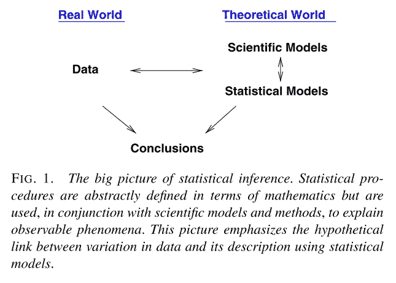
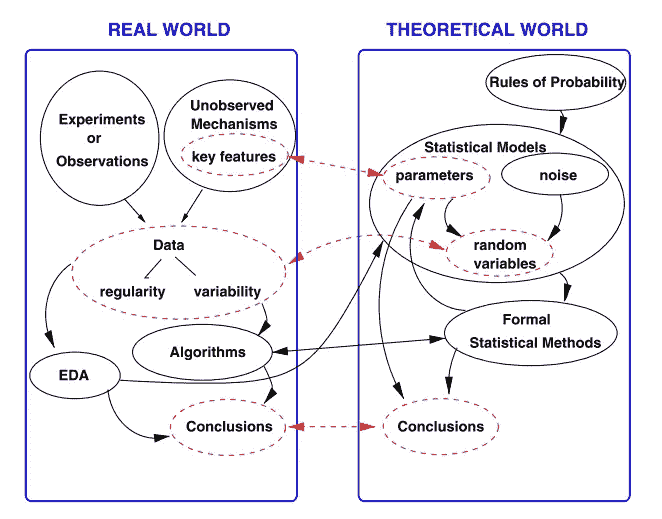

# [注]统计推断:大局

> 原文：<https://towardsdatascience.com/note-statistical-inference-the-big-picture-b1c1c4099cc7?source=collection_archive---------5----------------------->

## 罗伯特·e·卡斯，安德鲁·盖尔曼评论

这篇文章包含了我对这篇文章的笔记和相关评论:

*   卡斯，R. E. (2011 年)。统计推断:大图。统计科学，26(1)，1–9。
*   [盖尔曼(2011)。贝叶斯统计实用主义。统计推断的讨论。统计科学，26(1)，10–11。](http://www.stat.columbia.edu/~gelman/research/published/kassdiscussion.pdf)

这是一篇高水平的论文，从题目就能看出来。它试图把我们从频繁主义者/贝叶斯的泥潭中拉到统计学领域更重要的方面，即模型和真实数据的不匹配。这让我想起了乔治·博克斯的名言[:](https://www.wikiwand.com/en/All_models_are_wrong)

> 所有的模型都是错误的，但有些是有用的。

在我看来，这是每个统计学家或数据科学家的好读物。(你可能至少需要一些基本的统计学背景才能读懂它。)论文的某些部分可能需要一些时间来消化，所以每隔一段时间回顾一下是值得的。

## 统计实用主义

在本文中，卡斯描述了"*"占主导地位的当代统计哲学，并称之为"*统计实用主义*"，试图" ***将理论假设与真实数据世界的匹配或不匹配置于我们逻辑框架的中心*。**“而不是教学生“*正确背诵置信区间的长期解释*”(重点是频率主义者/贝叶斯二分法。)*

**

*卡斯认为上面图 3 中描述的标准“大图”故事是“*不是一个很好的统计推断的一般描述*”，并提出了如图 1 所示的新观点(*我认为图 1 更准确*)*

**

*图 3 试图表达的概念是:*

> *费希尔引入了从一个假设的无限总体中抽取随机样本的概念，而尼曼和皮尔森的工作鼓励了后来的数学统计学家放弃“假设”这个词，转而将统计推断描述为类似于从一个有限总体中简单的随机抽样。*

*虽然图 1 试图提醒我们:*

> *…寻找重要的假设，询问它们是否合理准确地描述了数据的变化。*

*为了更加强调“假设”部分，Fishers 的“ ***群体均值“*** (相对于*样本均值*)可以替换为“*”。**

**统计思维有两个原则:**

1.  ***“数据中的**规律性**和**变异性**的*统计模型，可以通过归纳推理，用来表达噪声存在下关于信号的**知识**和**不确定性**。”(“… *将统计推断的来源确定为数据和统计模型之间的假设联系。*”)**
2.  **"可以对统计方法进行分析，以确定它们的表现有多好."(“… *相同种类的统计模型可用于评估统计程序*”)**

**比较使用概率来描述变化和表达知识:**

1.  ****侥幸概率**:*用公平骰子掷出 3 的概率是 1/6* ”**
2.  **认知概率::*我 90%确定怀俄明州的首府是夏延。***

> **Bayesians 合并这些，应用概率法则从定量描述到量化的信念，但在每一种形式的统计推断中，偶然概率被用于，以某种方式，作出认知陈述。**

## **现实世界与理论世界**

****

**FIG.4\. A more elaborate big picture, reflecting in greater detail the process of statistical inference. As in Figure 1, there is a hypothetical link between data and statistical models but here the data are connected more specifically to their representation as random variables.**

> **仔细考虑模型和数据之间的联系是统计实践艺术和统计方法科学的核心组成部分。**

**"*让我们假设数据是正态分布的*"是假设"*数据的可变性与随机样本中发生的可变性充分一致的简写。***

> **…数据不应与随机变量混淆。随机变量存在于理论世界中。**

## **解释**

**常客:**

*   **频率主义者对置信区间的解释:*如果我们从一个 N(，1)分布中抽取无限多个* *随机样本，95%的对应置信区间(\ bar { X }—2/7，\bar{X}+ 2/7)将被覆盖。***
*   **置信区间的实用解释:*如果我们根据上述假设抽取一个随机样本，得到的置信区间(\ bar { X }—2/7，\bar{X}+ 2/7)将有* ***覆盖*** *的概率 0.95。代入= 10.2，我们得到区间 I，只要我们的理论世界与产生数据的真实世界一致，我们就能得出有用的结论***

**贝叶斯:**

*   **后验区间的贝叶斯解释:*在上述假设下，处于区间 I 的概率为 0.95。***
*   **后验区间的实用解释:*如果数据是一个随机样本，其中 10.2 成立，并且如果上述假设成立，那么在区间 I 中的概率将是 0.95。这是指随机变量的一个假设值，因为 X 生活在理论世界中，所以这个陈述仍然是理论性的。***

**(注意在贝叶斯案例中，两种解释都有相同的陈述:“*在区间 I 中的概率是/将是 0.95”*)**

> **在这里，虽然贝叶斯方法在理论世界中逃脱了间接的信任，但它在数据分析的世界中也逃脱不了，因为仍然存在用随机变量识别数据的附加层。**

**总之，**

> **频率主义者和贝叶斯推理之间的共同点是**理论假设**的使用，以及**虚拟**陈述……该推理基于如果数据**是按照统计模型分布的随机变量**时**会发生什么。如果模型**是**以准确描述数据的变化，则该建模假设是合理的。****

## **统计学家**

> **…统计学家以谨慎的态度给出了推论。**

****“信念的飞跃”——跨越现实理论的桥梁，在没有明确的机会机制的情况下**,*使统计推理在绝大多数应用中成为可能。***

> **…统计学的独特之处在于，每次应用一个模型时，它都不得不面对理论和现实世界之间的差距，在我看来，这是我们为科学合作者提供的很大一部分。统计实用主义认为，所有形式的统计推断都会做出假设，**只能非常粗略地进行测试的假设**(用拟合优度方法之类的东西)和**几乎永远无法得到验证**。这不仅是统计推断的核心，也是我们领域的大智慧。**

## **置信区间和假设检验**

> **在 ney man-Pearson 推理理论中，置信度和统计显著性是一枚硬币的两面，置信区间是一组不被显著性检验拒绝的参数值。**

**在现代贝叶斯方法中，置信区间/后验区间是以假设模型 为条件的关于参数的推断的 ***。假设检验/模型检查是“ ***将观察到的数据与模型下的复制进行比较的过程，如果它是真的话*** ”。*****

## *统计的不同流派*

> *像卡斯一样，我相信哲学辩论可能是一件好事，如果它们激励我们仔细思考我们未经检验的假设。或许，即使是很少相互交流的子领域的存在，也是允许不同的研究分支在多元化环境中发展的进步源泉，如果统计交流被任何单一的不容忍团体所主导，这种方式可能不会如此容易。抽样、推断和模型检验的思想在许多不同的统计传统中都很重要，我们很幸运有这么多不同的思想来启发我们的应用和方法研究*