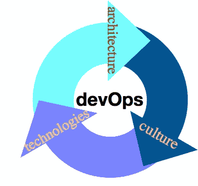
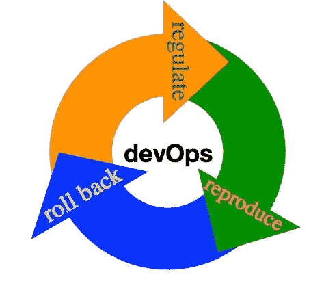

# 新型卡车、新型联合收割机:

> 原文：<https://towardsdatascience.com/nouveaux-trucs-nouvelles-combines-197fea82a00c?source=collection_archive---------5----------------------->

# 让开发人员的生活更轻松的开源工具

不久前，处理数据的困难源于这样一个事实，即数据来自不同的地方，以不同的形式存在，其中大部分是非结构化的，或者充其量是半结构化的。将这些数据整理成可供分析并用于提供见解的形状是一个繁琐的过程，数据清理和准备是一个耗时的过程。我在其他地方提到过关于“大数据的肮脏小秘密”，事实是，“大多数数据分析师花费绝大部分时间清理和整合数据，而不是实际分析数据。”这个秘密也涵盖了数据分析师的需求，他们不断地去找数据库管理员和编码员，请求他们运行这个 SQL，然后[“请再多问一个问题](https://blog.xcipi.io/data-analytics-made-as-easy-as-that/)”。在最近的过去，获取数据的例行程序是重复和耗时的，人们正在做那些软件擅长的任务。问题是我们倾向于使用的软件工具没有高度的灵活性。在主要部分，由于开源应用程序，这些天的景观非常不同。

# devOps

在基础架构级别，大量数据涌入，甚至逐渐增长的数据集都需要物理和手动操作，调试新服务器、添加内存、添加另一个磁盘都需要 John 拿出螺丝刀来完成。云改变了这一切，Peter 按需编程了更多的内存、更多的磁盘空间和更多的处理器。事实上，这些都不是新的，容器就像旧的 Unix 监狱一样:重要的是它们可以被使用的规模。现在有了新的技巧，可以通过新的工具组合和保存数据的方式来实现。随着时代的发展，我们现在该如何解决这些问题呢？首先，让我们看看发生了什么变化。

devOps 存在于三个域中；文化、工具和技术，以及建筑。

文化转变对后端工程师来说是一个巨大的飞跃。他们已经习惯了程序员使用敏捷技术，但是服务器和网络需要螺丝和电缆以及工程师来连接它们。打破系统工程师、系统管理员、操作人员、发布工程师、数据库管理员、网络工程师、安全专家和程序员、需求工程师、应用程序设计人员、测试人员、UX 设计人员之间的界限是这种文化转变的关键。

在技术领域，可用的工具和技术，如 [Jenkins](https://jenkins.io/) 和 [Codeship](https://codeship.com/) 提供了持续集成和持续部署。像([木偶](https://puppet.com/)和[主厨](https://www.chef.io/))这样的配置管理工具打开了流程编排——使手工流程自动化。一系列工具简化了部署，其中最前沿的是 [Docker](https://www.docker.com/) 和 [Kubernetes](https://kubernetes.io/) 。

devOps 是由许多动机驱动的。来调节、繁殖和逆转。它包括:

*   希望合理化依赖关系管理，供应和配置堆栈的所有组成部分。
*   对可再现部署的要求，以便整个应用程序可以被擦除，然后准确地再现。
*   创建同一应用程序的多个实例的能力，以及在资源调配期间的任何时间点从故障中恢复的能力。

## noSQL

在数据库级别，关系数据库处理结构化数据，核心组件“模式”一旦保存了任何数量的数据，就不容易更改，毕竟模式是最重要的结构。新一代的数据存储, [noSQL](https://www.mongodb.com/nosql-explained) 和 [graph](http://neo4j.com/) 比 RDBMS 数据库更好地处理了非结构化数据。列品种如 [Cassandra](https://cassandra.apache.org/) 和 [HBase](https://hbase.apache.org/) 文档库如 [CouchDB](https://couchdb.apache.org/) 和 [MongoDB](https://www.mongodb.com/) 。键值存储 [Couchbase](http://www.couchbase.com/) ， [Redis，](https://redis.io/)Riak。以及 [Neo4J](https://neo4j.com/) 等图形数据库。

大数据的大父亲也不能错过这一考虑，即 Apache [Hadoop](https://hadoop.apache.org/) ，它带有 *Hadoop 分布式文件系统*(HDFS)*YARN*一个作业调度器和集群资源管理器，以及 *MapReduce* 一个旨在处理大量数据的并行处理系统。还有许多其他的包可以和 Hadoop 放在一起。有许多供应商提供基于云的 Hadoop 平台，包括 [AWS Elastic MapReduce](https://aws.amazon.com/elasticmapreduce/) 和 [IBM BigInsights](https://console.ng.bluemix.net/catalog/services/biginsights-for-apache-hadoop/) 。

为什么 noSQL 是这样一个游戏改变者？它开辟了处理结构化、半结构化和非结构化数据的途径。因为能够处理多态数据；设计和配置数据存储所需的时间大大减少。灵活的结构允许快速部署。增加供应以处理高速度、快速增长的数据量和各种数据要容易得多。

在采用 noSql 数据存储之前，很难令人满意地建立和运行一个分布式数据库。复制提供了一种广泛而方便地分发只读数据的方法，但是让事务性数据分布在两台服务器上却是一场噩梦。克服主-主复制中隐含的怪物的唯一方法是分区、分段和分片，这两种技术都无法使用关系数据库实现灵活的部署。随着 noSql 数据存储在任意数量的服务器上自动写入数据，分片现在已经是小事一桩。noSql 数据存储被设计为在云中工作，被设计为灵活和敏捷，并且被设计为满足现代数据分析和交付需求。

## 平台

不仅仅是数据存储的变化标志着新的做事方式。平台已经发生了变化，PaaS ( [平台即服务](https://en.wikipedia.org/wiki/Platform_as_a_service))产品的进步极大地减轻了开发人员提供基础设施的复杂性；可扩展且廉价的云计算服务。数据库即服务 DaaS，如 [Mlab](https://mlab.com/) 和 Google[big query](https://cloud.google.com/bigquery/)提供类似的平台和数据库功能。

AWS 使廉价的、可扩展的分布式云计算成为可能，即使界面有点混乱。过去，这鼓励编写自定义界面和例程来浏览和使用它，现在第三方供应商正在填补这一空白。对于开发环境，有“AWS made easy”产品，如 [Heroku](https://www.heroku.com/platform) 和 [CloudFoundry](https://www.cloudfoundry.org/) 以及 AWS 上的[elastic search&Kibana](https://www.elastic.co/cloud)平台。

Google[App Engine](https://en.wikipedia.org/wiki/App_Engine)是一个支持 [Spring Framework](https://en.wikipedia.org/wiki/Spring_Framework) 和 [Django web framework](https://en.wikipedia.org/wiki/Django_%28web_framework%29) 的平台(它也是软件控制的基础设施，提供了一个带有自己查询语言的 noSql 数据存储库)。

[OpenStack](https://www.openstack.org/) 在某些方面针对平台提供商，因为它提供 IaaS(基础设施即服务)。 [OpenShift](https://www.openshift.org/) 则是真正的 PaaS 它带有 Docker 打包和 Kubernetes 容器集群管理，它提供了应用程序生命周期管理功能和操作工具。

平台是现收现付的，你在上面运行的工具主要是开源的。选择哪个平台的问题和答案总是来自于“你想用它做什么？”。对于生产部署来说，直接管理自己的平台可能更便宜，但是在生产环境中，为开发和测试 PaaS 提供者提供实例更有吸引力。根据规模，基础架构基础 IaaS 可能是构建的起点，或者真正的平台基础 PaaS 可能是正确的选择。对于较小规模的生产环境(和开发)，第三方平台托管解决方案可能更具成本效益。

## 一盒盒的把戏

集装箱化主要通过对建筑设计、开发策略和 PaaS 产生巨大影响的 [Docker](https://www.docker.com/) 发展成熟。Google 提供了 Google 容器引擎(GKE ),这是一个集群管理和容器编排系统，用于运行和管理 Docker 容器。反过来，它由 T2 的 Kubernetes T3 提供支持，这是为了快速部署应用程序而设计的；允许动态扩展，从而轻松推出更新并减少资源使用。

Docker / Kubernetes 组合提供的调节、复制和回滚功能涵盖了从“开发到生产”的整个领域。在本页提到的所有技术中，它们是使架构使开发运维成为可能的技术。在这个意义上，他们完成了 devOps 循环。

# 室内设计

现在我们已经看到了操作领域背后的工具和架构的变化；是时候看看开源是如何实现新的功能和能力的了。我们有了系统，我们要用它做什么，我们有了建筑，我们要把什么放进去，我们要怎么做。

## 理解的机器

似乎是为了锦上添花，AWS 和谷歌都提供了大量基于云的开发工具、分析、机器学习、计量计算和存储解决方案和基础设施。深度学习库，如谷歌的 [TensorFlow](https://www.tensorflow.org/) 和雅虎的 [CaffeOnSpark](http://yahoohadoop.tumblr.com/post/139916563586/caffeonspark-open-sourced-for-distributed-deep) 已经开源。有易于部署的开源搜索解决方案，如[弹性搜索](https://github.com/elastic/elasticsearch)和 [Sphinx](http://sphinxsearch.com/) 。除了作为[弹性堆栈](https://www.elastic.co/)一部分的搜索工具，还有弹性可视化工具 Kibana。其他优秀的可视化库，如 [D3j](https://d3js.org/) 和[JavaScript InfoVis Toolkit](http://philogb.github.io/jit/)正等着提供见解。

开源的 [Python](http://scikit-learn.org/stable/) 和 R 库使得统计分析更加容易。像 [Clojure](http://clojure.org/) 和 Docjure 这样的语言非常适合处理提要或文档中包含的信息。简单的 API 访问机器学习技术，如 [IBM 的 Watson](http://www.ibm.com/analytics/watson-analytics/index.html) 和 Amazons [AML](https://aws.amazon.com/machine-learning/) 现在由我们支配。其他机器学习即服务 MLaaS 包括: [DataRobot](https://www.datarobot.com/) 、 [BigML](https://bigml.com/) 、 [Rapidminer](http://rapidminer.com/products/cloud/) 和 [Algorithma](https://algorithmia.com/) 。

除了 API 访问，还有其他利用机器学习的灵活方式。Algorithma、DataRobot 和 BigMl 提供了算法开发者和应用开发者接口的平台。开发人员可以简单地将开源学习算法整合到他们的应用程序中。这再次充分利用了开源的力量。大多数众所周知的算法都经过了同行评审，有很好的文档记录，并针对速度和效率进行了优化:它们可以在最有用的库和语言(Java、R、Python、Spark 等)中获得。).

有问题可以问，有答案可以得到。

## 通用语和多国语言

虽然面向对象编程语言包含了灵活性，但是诸如封装、继承、聚合、鸭式类型、后期静态绑定和动态多态性等概念使得代码变得更加灵活。这种灵活性是以速度为代价的，因为许多对象是单独创建和销毁的。这些概念在向用户、视图层或人机界面呈现逻辑的程序部分上工作得很好，但是当被调用来处理应用了逻辑的大量数据时，它们是非常低效的。

回归到更具表达性的语言和函数式编程范式，现在允许以较低的计算开销涉水通过大量数据，换句话说，有一些语言非常适合处理大量的列表和数据，是的，它们已经以这样或那样的形式存在了很长时间。

具有讽刺意味的是，跨越语言障碍的巨大转变来自于更多元语言的出现。我喜欢在 GWT 工作的想法，因为它允许我用 Javascript 做我不知道怎么做的事情。事实上，它将 Java 编译成 Javascript 看起来确实有点疯狂，但它确实允许你以自己想要的方式编写代码，也许现在这一切都有意义了。然而现在有太多的其他语言，在这个[列表](https://github.com/jashkenas/coffeescript/wiki/list-of-languages-that-compile-to-js)中有近 200 种编译成 javascript 其中有 [CoffeeScript](https://coffeescript.org/) 和 [Dart](https://www.dartlang.org/) 。

[意味着](http://mean.io/)栈为[节点](https://github.com/nodejs/node)以及与之相伴的 [NPM](https://www.npmjs.com/) 等工具提供了一个入口，同时类似于[鲍尔](https://bower.io/)等其他包管理器，鼓励高效的生产管理。

在接口层面，编程库现在有了成熟的工具，如 [GO](https://golang.org/) 、 [React](https://github.com/reactjs) 和 [Angular](https://angularjs.org/) ，它们将优秀的旧 javascript 带到了新的地方。在移动前端的 JavaScript 框架上，比如 [Bootstrap](http://getbootstrap.com/) 和 [Foundation](http://foundation.zurb.com/) ，通过 HTML、CSS 打理响应视图。这些创建现代网站的工具提出了一个问题[我们还需要应用吗？](https://medium.com/@excipi/i-have-always-thought-that-apps-were-a-backward-step-from-standards-based-delivery-i-e-a5407e2959b8)尽管名字叫“will”[进步的网络应用](https://developers.google.com/web/progressive-web-apps/)会让“apps”过时。如果“应用程序”仍有一席之地；苹果开源了 Swift，这是编程史上发展最快的语言之一。

由于我们现在已经掌握了使用旧技术和新兴技术的新方法，我们可以寻找新的方法来提供解决方案，以处理新的想法和数据组合。

*首次发表于 XCiPi 博客上*[*2016 年 2 月 13 日*](https://blog.xcipi.io/876-2/)