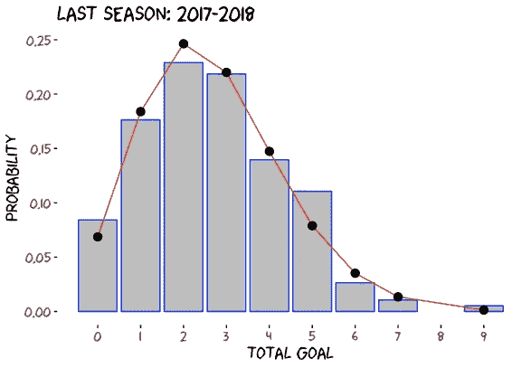
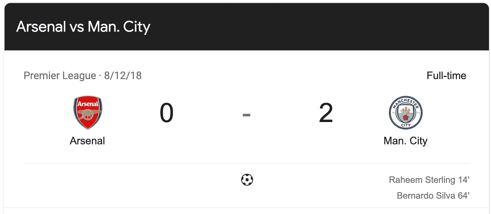
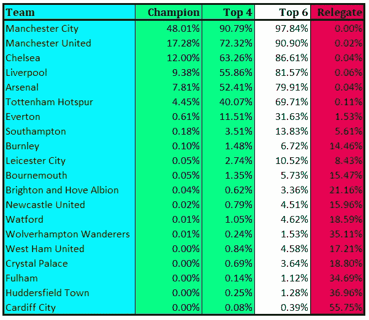

# 美丽的游戏:用随机模型预测英超联赛

> 原文：<https://towardsdatascience.com/o-jogo-bonito-predicting-the-premier-league-with-a-random-model-1b02fa3a7e5a?source=collection_archive---------7----------------------->

Image by [Michal Jarmoluk](https://pixabay.com/users/jarmoluk-143740/?utm_source=link-attribution&amp;utm_medium=referral&amp;utm_campaign=image&amp;utm_content=488714) from [Pixabay](https://pixabay.com/?utm_source=link-attribution&amp;utm_medium=referral&amp;utm_campaign=image&amp;utm_content=488714)

*剧透:一点点随机性其实* ***有助于*** *(而且不，你甚至不需要机器学习)*

# 《美丽的游戏》

> “做预测是没有意义的。这不值得猜测，因为没有什么是一成不变的，足球中的事情总是在变化。”
> 
> 克里斯蒂亚诺·罗纳尔多

人们喜欢足球，因为每场比赛都是不可预测的。上赛季，西布罗姆维奇队在一系列糟糕的表现后降级，使他们在英超联赛中跌至谷底。

> 你猜怎么着？

他们对 6 强的战绩最令人印象深刻:对热刺(1 胜 1 平)和利物浦(2 平)不败，在老特拉福德击败曼联，将利物浦淘汰出足总杯，让曼城在 90+4 '进球后拼血、甜、泪以 3 分脱身。

足球的每一刻都很重要。如果你正在观看一场比赛，把目光移开一秒钟，你可能会错过一场重要的比赛和一个突如其来的进球。英国喜剧演员卡尔·唐纳利是这么说的:

> “我在看 2010 年世界杯西班牙和巴拉圭的比赛。太无聊了，所以我去了厕所，错过了那两分钟内的 3 个点球。”

在比赛的任何时候，进球都有可能发生。虽然决定球队得分的因素有很多，但是进球的时间却是随机的。

让我们绘制一张上赛季 EPL 每场比赛进球数的柱状图。

现在，如果你认为这个直方图似乎遵循某种分布，那么你就在正确的轨道上。实际上，我们可以通过一点推理来推导出这种分布:想象一场足球比赛有 90 个一分钟的时间段，在每个时间段中，我们可以以相等的概率“放入”一个进球。

上个赛季，平均每场比赛有 2.7 个进球，这意味着平均*，我们在任何一分钟看到进球的几率是 2.7/90 = 0.03。不是很高，但足以让我继续比赛。如果我们随后模拟 90 分钟并记录进球数量，这种模拟的长期分布将遵循**离散泊松分布(**由红色线段**连接的黑点表示)***

**

*现在，为了证明我没有挑选泊松分布来证明我的观点，让我们看看过去 8 个赛季 EPL 的总进球数。*

**

*瞧，泊松分布又起作用了。*

# *泊松分布有什么酷的？*

**每当先前事件(先前目标)的时间对未来事件没有影响时，就会出现这种分布*。*

*只要有理由假设事件可以在任何时候意外发生，与之前的事件无关，那么就有理由期待泊松分布。*

*这种随机性是非常显著的！！！想想这里所有的复杂性。所有教练在边线上的呐喊，球迷的尖叫，球员脑袋里的想法，到目前为止的进球数，上场时间等等。这些都不会影响下一个进球的概率。*

**

*None of the tactics matters when it comes to the probability of the next goal being score. Image by [anncapictures](https://pixabay.com/users/anncapictures-1564471/?utm_source=link-attribution&amp;utm_medium=referral&amp;utm_campaign=image&amp;utm_content=1335365) from [Pixabay](https://pixabay.com/?utm_source=link-attribution&amp;utm_medium=referral&amp;utm_campaign=image&amp;utm_content=1335365).*

***这是一种纯粹随机产生的模式。***

*这很有效。它对足球比赛有效，对踢马致死  有效，甚至对癌症  有效。*

# ***在没有机器学习模型的情况下预测 EPL***

*你都看到了。人们已经尝试了多种不同的方法来预测足球比赛的最终比分。从线性回归、随机森林到深度神经网络等等。*

*诀窍是:要对一场比赛做出合理的预测，我只需要对泊松分布和两支球队的一些背景信息做一些非常简单的事情。*

*让我们试着预测一下上周日阿森纳对曼城的比赛！！！*

*最近 5 个赛季，主场面对曼城，*阿森纳场均 1 球失球 1.37 个*。不是一个令人印象深刻的记录。仅仅通过这些数字，我们就可以知道阿森纳将会经历一段艰难的时期。*

*通过收集这样的统计数据(你应该很高兴我已经为你做了数据收集和争论[这里](https://github.com/tuangauss/DataScienceProjects/blob/master/R/EPL/prediction/clean_data.R)，我们可以模拟每一对之间的比赛。*

*我们可以重复模拟 10，000 或 100，000 次，并记录最可能的结果。最有可能的比分是阿森纳 1:2 落败，发生的概率是 24%。*

*实际结果呢？*

**

*Image from author. Screenshot from Google Search.*

*对于 4 行代码来说，这是一个不错的预测。*

*当你有一对在过去 5 年里很少有历史成绩的队伍时，要使平均成绩变得有意义就有点难了。例如:上个赛季是布莱顿和霍伍阿尔比翁 34 年后首次尝试顶级联赛，因此布莱顿和 PL 中其他球队之间没有太多数据。对于这些场景，我使用以下策略:*

*每支球队使用四个参数:主场和客场的平均进球数(SH)和平均失球数(SA)。当两支球队相遇时，我通过均值等于 1/2(SH + CA)的泊松分布样本为主队生成进球，同时考虑主队的进攻实力和客队的防守实力。相反，访问者的目标是从均值等于 1/2(CH + SA)的泊松分布中抽取的。*

*匹配的完整代码显示在[这里](https://github.com/tuangauss/Various-projects/blob/master/R/EPL/match_simulate.R)。*

*这是我对第一轮的预测和实际结果*

**

*同样，考虑到我们只是随机模拟比分，这是一个很好的结果。我们正确识别了 10 场比赛中的 7 场比赛的结果(赢/平/输),并正确预测了其中 3 场比赛的比分。*

# *打我自己的联赛*

*一旦你可以模拟一场比赛，没有什么可以阻止我们推广我们的方法来模拟整个赛季，并进行排名。在每次模拟中，我们可以记录谁是冠军，谁获得冠军联赛，谁被降级。聚集成千上万的模拟，我们有自己的预测最终排名。*

**

*As an Arsenal fan, I’m not happy to see such a insignificant chance to title. Well, we are still better than Tottenham !!!*

*让我们一年后再来这里看看我是否接近了。*

*模拟的完整代码可以在[这里](https://github.com/tuangauss/DataScienceProjects/blob/master/R/EPL/prediction/sim.R)找到*

# *一锤定音*

*我不想给你大肆宣传泊松分布和随机性。因为足球(和生活)远不止于此。*

*到目前为止，我希望你喜欢讽刺的是，如果我们假设足球是 100%不可预测和随机的，那么泊松分布就会出现，我们就变得更容易预测。本质上:*

> *足球的(假定的)不可预测性使得比分预测更容易！！！*

*这是我的妙语。*

*然而，足球中的真实故事不是关于随机性，而是关于超越它。阿瑟·温格上赛季在阿森纳的噩梦(在连续输掉 7 场客场比赛后排名第 6。*天哪，太可怕了！！！不能用一连串的坏运气来解释。当西汉姆在安菲尔德 0:4 输给利物浦时，这不仅仅是一个随机的进球序列。西汉姆在高压下崩溃，利物浦用阵容质量资本化。我在 100 万次比赛中只遇到过一次这样的比分*,但任何观看比赛的人都会说利物浦理所应当得到它(他们错过了至少 3 次明显的机会)。***

**球员以高度同步的方式移动，球根据物理原理移动，经理们战略性地考虑战术。所有这些因素都给游戏带来了结构性，打破了我们关于随机性的小假设，并给预测带来了挑战。**

> *****所以罗是对的，但是*** 原因不对。**

****足球很难预测，不是因为它随机，而是恰恰相反，因为它有一些美丽的结构。****

**看看我在统计学和数据科学方面的一些趣事:**

*   **[贝叶斯统计如何说服我去健身房？](/how-bayesian-statistics-convinced-me-to-hit-the-gym-fa737b0a7ac)**
*   **关于统计理论中最大的争论，章鱼能告诉我们什么？**
*   **[我是如何用 Python 和 Tkinter 构建自己的 Macy fireworks show 的？](/having-your-own-fun-how-to-build-your-own-macys-firework-show-with-python-and-tkinter-79cc31631b44)**

**[1] Pandit，J. J. (2016)，普鲁士军队中的马脚致死事件——以及大型组织中的其他“从未发生的事件”。麻醉，71:7–11。doi:[10.1111/ANAE . 13261](https://doi.org/10.1111/anae.13261)**

**[2]Tomasetti，C. & Vogelstein，B. (2015)，组织间癌症风险的差异可以通过干细胞分裂的数量来解释。科学，347:78–81**