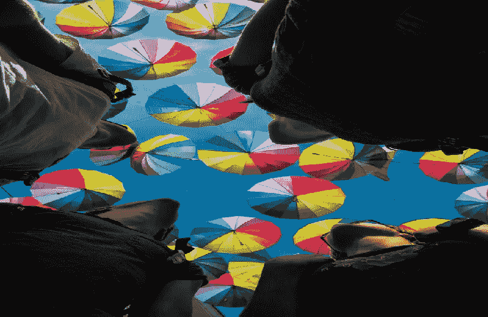
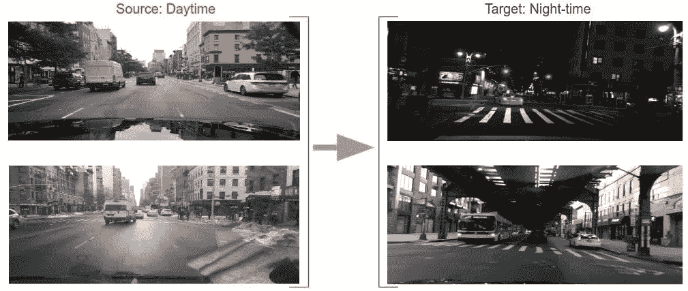
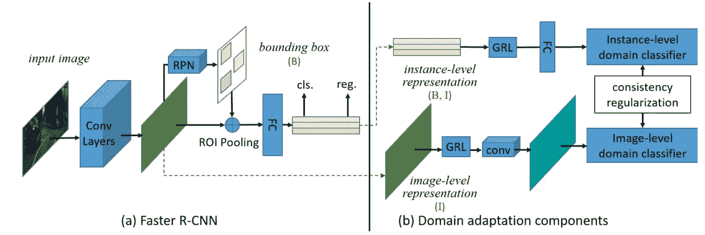

# 对象检测算法:跨域对象检测

> 原文：<https://towardsdatascience.com/object-detection-algorithms-cross-domain-object-detection-e87d3cfd3045?source=collection_archive---------6----------------------->

## *在今天的帖子中，我将介绍计算机视觉任务，它解决了域转移问题，即跨域物体检测(CDOD)*

Photo by [Marvin Kuhn](https://unsplash.com/@einstein29?utm_source=medium&utm_medium=referral) on [Unsplash](https://unsplash.com?utm_source=medium&utm_medium=referral)

近年来，计算机视觉领域，尤其是基于深度学习的目标检测任务取得了长足的进步。开发的方法通常假设有大量带标签的训练数据可用，并且训练和测试数据来自相同的分布。然而，这两个假设在实践中并不总是成立的。更准确地说，通常不是。如何处理这种情况并构建能够很好适应新环境的鲁棒检测器？如何在解决现实问题中使用跨域[物体检测](https://neurosys.com/case-study/object-detection-and-counting-for-microbiology/)？

在我们之前的帖子中，一阶段或两阶段的方式[我们描述了基于深度学习的对象检测算法](https://neurosys.com/article/object-detection-algorithms-starter-pack/)，它可以在。这些方法实现了检测器的主要目标——预测对象的位置并将检测到的对象分配到正确的类别。在今天的帖子中，我们将介绍另一个与对象检测算法相关的计算机视觉任务，该任务处理域转移问题，即跨域对象检测(CDOD)。CDOD 作为深度学习的一个新分支而诞生，以应对上面列出的挑战。这篇文章旨在描述跨领域物体检测任务的最新方法。

# 目标检测任务中的域适应

想象一下这样一种情况，您训练您的模型在 Cityscapes 数据集[1]上检测常见的对象，如建筑物、汽车或行人，该数据集包含大量来自德国街道的带注释的对象。然后，您在数据集的测试子集(白天的图像)上测试您的模型，一切似乎都运行良好。接下来，你在一些夜间或雾天的图像上测试相同的检测器——最终汽车检测系统应该在各种驾驶场景下工作——你意识到你的模型不再能够[正确检测行人](https://neurosys.com/case-study/real-time-video-analysis-for-surveillance-and-monitoring/)或汽车(见图 1。).

上述问题的原因是测试图像的域的改变。该模型在源分布(日常场景)上被训练，但是在不同的目标分布(夜间或有雾的场景)上被测试。在这里，领域自适应(DA)可以派上用场。DA 是计算机视觉中一个重要而富有挑战性的问题。该方法的无监督版本的主要目标是基于源域中的给定图像来学习目标域中的图像的条件分布，而不用看到相应图像对的任何示例。也有自适应的方法，使用来自几个领域的成对图片(不同场景中的相同镜头)[3],但是在简单的图像到图像翻译的情况下，它们不是很流行。

Fig. 1\. Adapting a pedestrian detector trained on labeled images from daytime conditions to unlabeled images from other conditions. Adapted from Ref. [2].

DA 可能以两种方式出现:当两个域彼此相似时，通过一个域和另一个域之间的直接转移(一步域适应)，或者在源和目标之间几乎没有相似性的情况下，通过几个中间域逐步从一个域到另一个域(多步域适应)[4]。

随着领域适应技术在图像分类任务中带来的成功，预期 DA 也将改进对象检测任务的性能。在这项任务中，我们必须考虑目标域中的标记数据量(假设我们有许多来自源域的标记图像)，并将跨域对象检测的类型分类为:

*   完全监督:所有目标数据都有注释，
*   半监督的:只有目标训练数据集的某些部分被注释，
*   弱监督:我们处理一些不良注释类型，例如点状注释，
*   无监督:不注释目标数据。

# 解决域转移的机制

在对象检测的情况下，有多种方法来执行域自适应。以下总结主要基于李等人的综述论文[5]。在他们的综述中，作者区分了不同类型的域适应，主要取决于用于准备域转换的技术，即基于差异的，基于重建的，基于对抗的，混合的和其他的(未分类)。

在基于差异的方法中，通过用目标数据微调基线检测器网络来减少畴变。该数据可以作为标记或未标记的图像呈现。在第一阶段目标领域中缺少注释的情况下，我们应该通过应用在源领域中的标记数据上训练的检测模块来创建伪标记。以这种方式获得的注释可以被细化，或者可以直接进入最后阶段，在最后阶段，基线检测器使用来自源域的原始标记数据和目标域中伪生成的注释被微调(重新训练)。图二。展示了一个基于差异的方法的例子[6]。

Fig. 2\. Discrepancy-based approach proposed in Ref. [6].

另一方面，基于重建的技术假设使源样本与目标样本相似(反之亦然)有助于提高对象检测的性能。在这种情况下，实验可以分为两个重要的部分。一开始，我们应该通过将图像从一个域(通常是源)转换到另一个域(通常是目标)来生成人工样本。为此，可以探索一种基于循环生成对抗网络的模型。我们在关于生成培养皿中生长的细菌菌落的不常见人工样本的文章中更详细地描述了一个给定的模型。在第一步之后，创建的数据集用于训练检测器模型。在这一阶段，源图像注释被直接(类似于图 3 所示的方法。)或者在一些改进之后转移到假生成的图像。通过添加来自两个域的带标签的照片，可以增强网络性能[7]。

Fig. 3\. An overview of the reconstruction-based system proposed in Ref. [7].

检测器旁边的基于对抗的方法使用域鉴别器来识别数据点来自哪个域。该网络进行对抗性训练，以缩小源和目标之间的领域差距。适应框架可以以多种方式设计。例如，在参考文献。[8]作者假设对抗训练应该在提取的特征上进行，因此准备两个适应组件:一个在图像级别(图像比例、图像风格、照明等)。)，另一个在实例级别(背景中的对象外观、对象的大小等)。).提议的框架如图 4 所示。

Fig. 4\. Overview of Domain Adaptive Faster R-CNN model from Ref. [8]. The network uses a standard adversarial training together with a reverse gradient layer (GRL) — sign of gradient is reversed when passing the layer during back propagation.

当然，一些作者[9]结合了上述几种机制，这种技术通常会产生更好的性能。基于差异和重构的机制是创建这种类型的混合的最流行的选择。还有几个其他的方法，文章的作者[5]没有设法适合任何上述类别。这里，作为一个例子，可以提到图诱导原型对齐[10]。

**结束语**

在对具有不同照明条件或场景的图像执行检测的情况下，对从一个域绘制的照片训练的标准神经网络失败。为了补救这一点，近年来已经提出了几种允许跨域对象检测的方法。在很大程度上，他们将一个领域的照片改编为另一个领域的照片，然后进行对象检测。

CDOD 的领域适应也涉及合成到真实图像的翻译。在目标域中只有少量样本的情况下，可以使用一些经典方法来生成照片，例如将一些按尺寸切割的对象放在来自公共数据集的多样性照片上，然后使它们看起来更真实。在下一步中，上述进行跨域检测的机制使得能够识别目标域中的对象，对于这些对象，收集注释可能是昂贵的。

另一方面，在 DA 步骤中，单个输入图像可能对应于多个可能的输出，这里出现了通用/多域对象检测的问题。消除这个问题的通用检测器的适当设计仍然是一个公开的问题。

我们希望你喜欢这次阅读。如果您正在寻找关于[物体检测解决方案](https://neurosys.com/services/research-and-development-consulting-services/)的更多详细信息，请随时查看更多定制建议。

*由欧洲区域发展基金下的欧盟基金共同资助的项目，作为精明增长业务方案的一部分。*
*项目作为国家研发中心的一部分实施:快速通道。*

# **文学**

[1] Cordts，Marius 等人，“语义城市场景理解的城市景观数据集”进行中。IEEE 计算机视觉和模式识别会议(CVPR) (2016)

[2]罗伊乔杜里，阿鲁尼。使用自我训练使物体检测器自动适应新的领域。CVPR (2019 年)

[3]朱，严军等，“多模态意象翻译研究”更正内容:arXiv 预印本 arXiv:1711.11586 (2017)

[4]王，梅，等.“深度视域适应研究综述”《神经计算》，第 312 卷，第 135–153 页(2018 年)

[5]李，，等.“深层域自适应目标检测:综述”更正:arXiv 预印本 arXiv:2002.06797 (2020)

[6] Khodabandeh，Mehran 等人，“一种用于域自适应对象检测的鲁棒学习方法”。ICCV (2019 年)

[7] Arruda，Vinicius F .等人，“使用无监督图像到图像翻译的跨域汽车检测:从白天到夜晚”，载于 IJCNN (2019 年)

[8]陈，余华，等，“用于野外目标检测的域自适应快速 R-CNN”。CVPR (2018 年)

[9] Inoue，Naoto 等，“通过渐进域自适应的跨域弱监督对象检测”。CVPR (2018 年)

[10]徐，，等.基于图诱导原型比对的跨域检测."CVPR (2020)

*原载于 2020 年 11 月 20 日 https://neurosys.com***。**