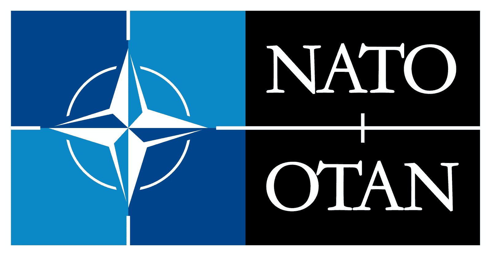
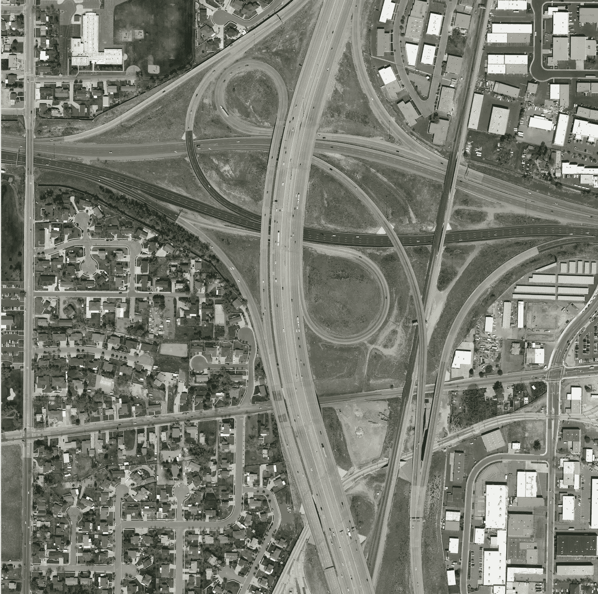
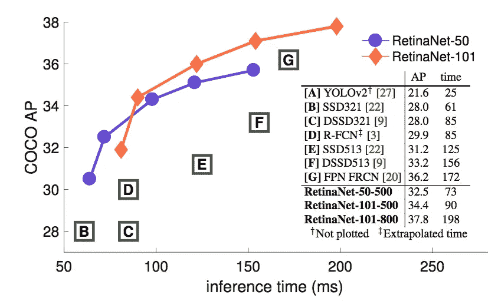
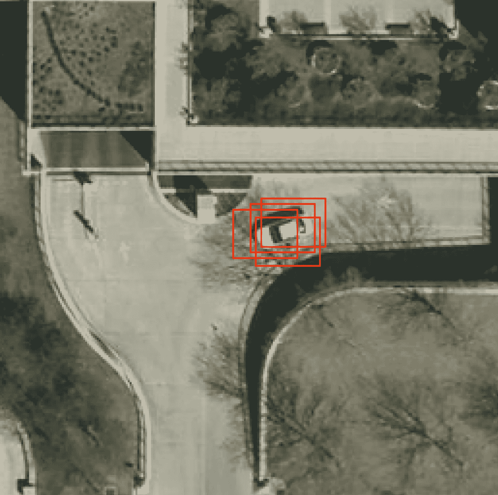
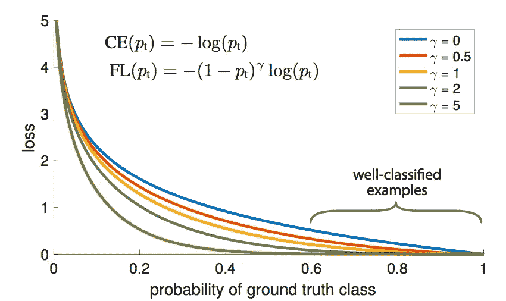
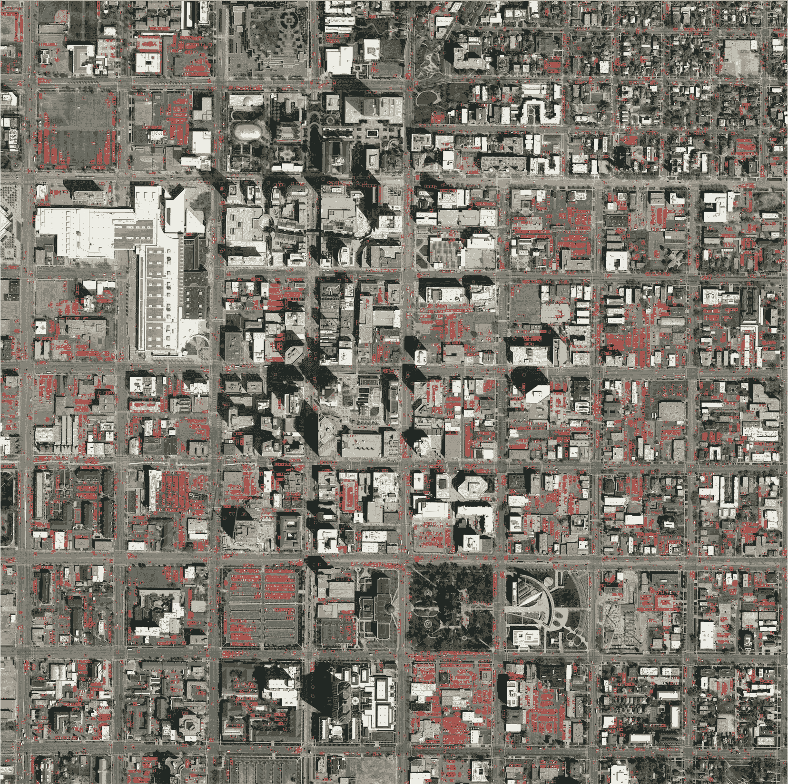
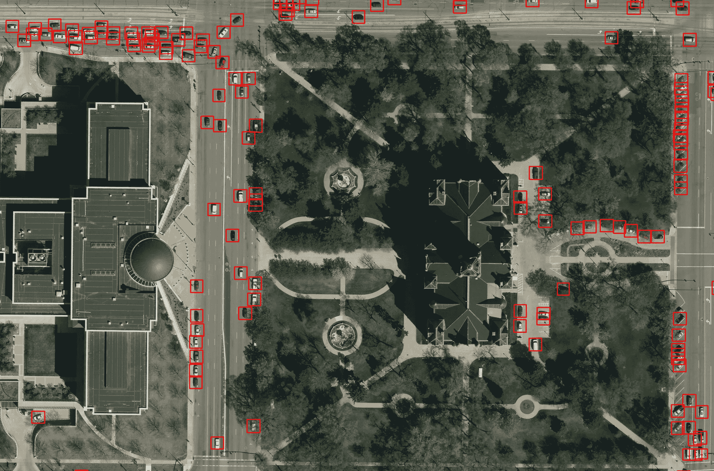
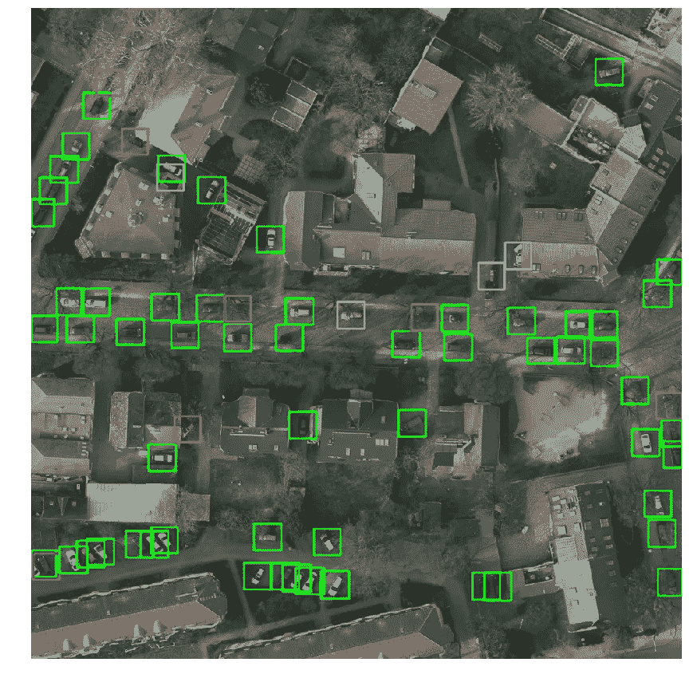
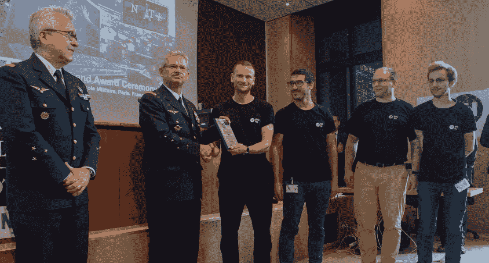

# 基于深度学习的航空图像目标检测

> 原文：<https://towardsdatascience.com/object-detection-with-deep-learning-on-aerial-imagery-c6aa7a554a59?source=collection_archive---------3----------------------->

## 想象你在一个内陆国家，一种传染病已经传播开来。政府已经垮台，反叛者正在全国流窜。如果你是这种情况下的军队，你如何在这种环境下做决定？你如何能完全理解眼前的情况？



几个月前，北约组织了一个[创新挑战赛](https://innovationhub-act.org/nato-innovation-challenge-20181)，提出了这个场景和这些问题。我们决定接受挑战，目标是在数据过滤/融合、可视化和预测分析领域找到创新的解决方案。

对于那些不知道的人来说，北约是 29 个北美和欧洲国家的政府间军事联盟。它构成了一个集体防御体系，其独立成员国同意共同防御，以应对任何外部方的攻击。

北约没有为挑战提供任何数据，所以我们必须自己寻找。最终，我们提出的解决方案使用了各种不同的技术，包括航空图像的计算机视觉、新闻和社交媒体上的自然语言处理、地理数据处理，当然还有精美的图表。

在这篇文章中(最初发表在 [Dataiku 的 blo](https://medium.com/data-from-the-trenches/object-detection-with-deep-learning-on-aerial-imagery-2465078db8a9) g 上)，我们将专注于最技术性的部分:空中图像的目标检测，浏览我们使用的数据类型，采用的架构，以及解决方案的工作方式，最后是我们的结果。如果你有兴趣从更高的层面来看这个项目，就在这里[结束](https://blog.dataiku.com/data-science-and-disease-outbreak-assistance-nato-act-innovation-challenge)。

# 1.数据集

对于项目的目标检测部分，我们使用了由劳伦斯利弗莫尔国家实验室提供的 [**Cars Overhead 和上下文**](https://gdo152.llnl.gov/cowc/) (COWC)数据集。它以在六个不同地点拍摄的航空影像为特色:

*   加拿大多伦多
*   新西兰塞尔温
*   德国波茨坦和瓦欣根*
*   哥伦布(俄亥俄州)*和美国犹他州

**我们最终没有使用哥伦布和 Vaihingen 的数据，因为图像是灰度的。*

该数据集提供了具有良好分辨率(每像素 15 厘米)的大图像(最大 4 平方公里),并具有每辆汽车的中心定位。正如在[这篇中型文章](https://medium.com/the-downlinq/car-localization-and-counting-with-overhead-imagery-an-interactive-exploration-9d5a029a596b)中所建议的，我们假设汽车的平均尺寸为 3 米。我们创建了以每个汽车中心为中心的盒子，以实现我们在看不见的图像中预测盒子(即汽车)位置的最终目标。



Figure 1: An example image from the COWC dataset

# 2.建筑

为了在这些大型航拍图像中检测汽车，我们使用了 [**RetinaNet**](https://arxiv.org/abs/1708.02002) **架构**。这篇论文于 2017 年由脸书博览会发表，获得了 2017 年 ICCV 最佳学生论文。

目标检测架构分为两类:单级和两级。

**两阶段架构**首先将潜在对象分为两类:前景或背景。然后将所有前景的潜在对象分类到更细粒度的类中:猫、狗、汽车等。这种两阶段方法非常慢，但当然也能产生最佳精度。最著名的两级架构是 [Faster-RCNN](https://arxiv.org/abs/1506.01497) 。

另一方面，**单级架构**没有这个潜在前景对象的预选步骤。它们通常不太准确，但也更快。RetinaNet 的单级架构是个例外:在拥有单级速度的同时达到了两级性能！

在下面的图 2 中，您可以看到各种对象检测架构的比较。



Figure 2: Performance of object detection algorithms

RetinaNet 由几个组件组成。我们将尝试描述数据是如何通过每一步进行转换的。


Figure 3: The RetinaNet architecture

## 2.1.卷积网络

首先有一个[**ResNet**](https://arxiv.org/abs/1512.03385)**-50。**和每一个**卷积神经网络** (CNN)一样，它以一幅图像为输入，通过几个卷积核进行处理。每个内核的输出都是一个特征图——第一个特征图捕获高级特征(如线条或颜色)。我们在网络中越往下走，由于合并图层的原因，要素地图就变得越小。虽然它们更小，但是它们也代表了更细粒度的信息(比如一只眼睛，一只狗的耳朵，等等。).输入图像有三个通道(红、蓝、绿)，但是每一个后续的特征图都有几十个通道！它们中的每一个都代表了它捕捉到的不同类型的特征。

一个公共分类器获取 ResNet 的最后一个特征图(形状为`(7, 7, 2048)`)，在每个通道上应用平均池(结果为`(1, 1, 2048)`)，并通过 softmax 将其提供给一个完全连接的层。

## 2.2.特征金字塔网络

RetinaNet 没有在 ResNet 之后增加一个分类器，而是增加了一个 [**特征金字塔网络**](https://arxiv.org/abs/1612.03144) (FPN)。通过从 ResNet 中选取不同图层的要素地图，它提供了丰富的多比例尺要素。


Figure 4: The lateral connection between the backbone and the FPN

然而，ResNet 的第一批特征地图可能过于粗糙，无法提取任何有用的信息。正如您在图 4 中看到的，更小、更精确的特征地图与更大的特征地图结合在一起。我们首先对较小的样本进行上采样，然后将其与较大的样本相加。存在几种上采样方法；这里，上采样是用最近邻法完成的。

FPN 的每一层以不同的尺度编码不同种类的信息。因此，他们中的每一个都应该参与目标检测任务。FPN 将 ResNet 的第三(`512 channels`)、第四(`1024 channels`)和第五(`2048 channels`)块的输出作为输入。第三个是第四个的一半大小，第四个是第五个的一半。

我们应用了逐点卷积(具有`1x1`内核的卷积)来使每个级别的通道数一致化为`256`。然后，我们将较小的级别向上采样两倍，以匹配较大级别的维度。

## 2.3.锚

在每个 FPN 级别，几个**锚点** 围绕 FPN 的特征地图移动。锚点是具有不同大小和比例的矩形，如下所示:


Figure 5: A sample of anchors of different sizes and ratios

这些锚点是潜在对象的基本位置。存在五种尺寸和三种比率，因此有 15 个独特的锚。这些锚也根据 FPN 层级的维度进行缩放。这些唯一的锚被复制在特征地图中所有可能的位置上。其结果是`K`总锚。

让我们暂时把这些锚放在一边。

## 2.4.回归和分类

每个 FPN 的水平被馈送到两个**完全卷积网络** (FCN)，这是仅由卷积和池构成的神经网络。为了充分利用每个 FPN 级别拥有不同类型信息的事实，这两个 fcn 在所有级别之间共享！卷积层与输入大小无关；只有它们的内核大小有关系。因此，虽然每个 FPN 的特征地图具有不同的大小，但是它们都可以被馈送到相同的 fcn。

第一个 FCN 是**回归分支**。它预测`K x 4` *(每个锚点的 x1，y1，x2，y2)*值。这些值是**增量**，稍微修改了原始锚点，使它们更适合潜在的对象。所有潜在对象现在都将具有以下类型的坐标:

```
(x1 + dx1, y1 + dy1, x2 + dx2, y2 + dy2)
```

用`x?`和`y?`，锚点的固定坐标，和`dx?`、`dy?`，回归分支产生的增量。

我们现在有了所有对象的最终坐标——也就是所有潜在的对象。他们还没有被归类为背景或汽车，卡车等。

第二个 FCN 是**分类分支**。这是一个多标签问题，其中分类器预测具有 sigmoid 的`K x N` ( `N` *是类的数量*)潜在对象。

## 2.5.删除重复项

此时我们有了`K x 4`坐标和`K x N`类分数。我们现在有一个问题:对于同一个类，检测同一个对象的几个盒子是很常见的！



Figure 6: Several boxes have been detected for a single car.

因此，对于每个类(即使它不是最高分的类)，我们应用一个**非最大抑制**。Tensorflow 提供了一个[函数](https://www.tensorflow.org/api_docs/python/tf/image/non_max_suppression)来做这件事:

```
tf.image.non_max_suppression(boxes, scores, max_output_size, iou_threshold)
```

这种方法的要点是，它将删除重叠的框(如图 6 所示),只保留一个。它还使用`scores`来保存最可能的盒子。

对上面 Tensorflow 方法的输入参数的一般评论:`max_output_size`对应于我们最终想要的最大盒子数—假设是 300 个。`iou_threshold`是一个介于 0 和 1 之间的浮点数，描述了可接受的最大重叠率。


Figure 7: Figure 6 after the non-max-suppression has been applied.

## 2.6.保留最可能的类

相同位置相同类别的重复框现在被移除。对于剩余的每个箱子，我们只保留得分最高的类别(汽车、卡车等)。).如果没有一个类的分数高于一个固定的阈值(我们使用了`0.4`)，那么它就被认为是背景的一部分。

## 2.7.焦点损失

所有这些听起来可能很复杂，但这并不新鲜——仅仅有好的准确性是不够的。RetinaNet 的真正改进是它的损失:焦点损失。没有潜在对象预选的单级架构被背景*对象*的高频率所淹没。焦点损失通过给予分类良好的例子(通常是背景)较低的权重来处理它。


Figure 8: We define `Pt, the confidence to be right`

在图 8 中，我们定义了`Pt`，即二元分类中正确的置信度。


Figure 9: The Focal Loss

在图 9 中，我们通过因子`(1 — Pt)^y`对交叉熵损失`-log(Pt)`进行建模。这里，`y`是在 0 和 5 之间振荡的调制因子。分类良好的例子有一个高的`Pt`，因此一个低的因素。因此，分类良好的示例的损失非常低，并迫使模型学习更难的示例。从图 10 中可以看出损失受到了多大的影响。



Figure 10: The focal loss under various modulating factors

# 3.履行

我们使用了 Fizyr 的 RetinaNet 的优秀的 Keras [实现](https://github.com/fizyr/keras-retinanet)。我们还编写了一个新的生成器，用熊猫的数据帧代替 CSV 文件。

Code block 1: The Generator taking Pandas DataFrame.

如您所见，**没有注释的图像保留在训练阶段。**它们仍然有助于我们算法的训练，因为它迫使算法不能到处看到汽车(即使没有任何汽车)。

我们在可可上使用了一个预训练的 RetinaNet，然后针对 COWC 数据集对其进行了微调。只有两个 fcn 为这项新任务进行了再培训，而 ResNet 主干网和 FPN 被冻结。

您可以在下面的代码块 2 中看到如何加载 RetinaNet 并编译它。注意，在加载砝码时添加`skip_mismatch=True`很重要！在 COCO 上创建的权重有 80 个类，但是在我们的例子中只有 1 个类，因此锚的数量是不同的。

Code block 2: Loading the RetinaNet and compile it.

我们仍然需要处理一些事情，那就是每个图像的巨大重量。来自 COWC 数据集的图像高达 4 平方公里，或 13k 像素宽和高。这些大图片重达 300 兆字节。将如此大的图像输入我们的视网膜是不切实际的。因此，我们将图像切割成 1000x1000 像素(或 150x150 米)的小块。

然而，错过汽车是愚蠢的，因为它们在两个补丁之间被切断。因此，为了避免这个问题，我们制作了一个 1000x1000 像素的滑动窗口，它以 800 像素的步长移动。这样，两个相邻的补片之间就有 200 像素宽的重叠。

这就导致了另一个问题:我们可能会检测两次汽车。为了消除重复，我们在将小补丁绑定在一起时应用了非最大抑制。事实上，这意味着我们有两次非最大值抑制:在 RetinaNet *和*之后，将小补片绑定在一起。对于第二个非最大值抑制，我们使用了来自 [PyImageSearch](https://www.pyimagesearch.com/2015/02/16/faster-non-maximum-suppression-python/) 的 Numpy 版本:

Code block 3: PyImageSearch’s non-max suppression. [[source]](https://www.pyimagesearch.com/2015/02/16/faster-non-maximum-suppression-python/)

在处理航空影像时，我们可以使用大量的数据增强。首先，我们可以翻转横轴和纵轴。我们也可以将图像旋转任意角度。如果影像的比例不一致(无人机到地面的距离可能不恒定)，随机缩放图片也很有用。

# 4.结果

你可以在下面的图 11 和图 12 中看到我们的 RetinaNet 在这张看不见的盐湖城图片上的表现。



Figure 11: 13,000 detected cars in a 4 square kilometer area of Salt Lake City



Figure 12: A zoom in of Figure 11

# 5.我们和好了吗？

如何评价自己的表现？

准确度不够；我们需要看看我们得到了多少假阳性和假阴性。如果我们到处检测汽车，我们会有很多假阳性，但如果我们错过了大多数汽车，那就有很多假阴性。

**召回**测量前者，而**精确**测量后者。最后， **f1 得分**是这两个指标的组合。

Code block 4: Computing the precision, recall, and F1-score

然而，我们并不期望我们的 RetinaNet 在准确的像素点上检测到汽车。因此，我们正在计算被检测车辆和地面实况车辆的 **Jaccard 指数**，如果它大于选择的阈值，我们认为该车辆被正确检测。请注意，Jaccard 索引通常也称为**交集-并集** (IoU):

Code block 5: The Jaccard index



Figure 13: True Positive (green), False Positive (yellow), and False Negative (red)

您可以在图 13 中看到一个示例，其中绘制了真阳性、假阳性和假阴性。

注意，四个误报中，有两个是垃圾箱，一个是重复的，还有一个居然是……一辆车！事实上，正如在每个数据集中一样，在基本事实注释中可能会有一些错误。

在图 12 中，f1 值为 0.91。通常在更多的城市环境中，f1 分数大约为 0.95。我们的模型所犯的主要错误是将建筑物顶部的通风井视为汽车。对于模型的辩护，没有建筑知识，这是很难看到的。

# 6.结论

对于 NATO challenge，我们不仅使用航空图像中的汽车检测，而且这是项目的主要技术部分。

哦…我们忘记告诉你挑战结果了吗？

颁发了三个奖项:北约奖(去诺福克旅游)，法国奖(25000 美元)，德国奖(去柏林旅游)。

我们同时获得了北约和法国奖！

你可以在这里阅读更多关于这个项目的高层信息(包括我们使用的所有数据和方法论)[。](https://blog.dataiku.com/data-science-and-disease-outbreak-assistance-nato-act-innovation-challenge)



Figure 14: General Maurice, Supreme Commander Mercier, and our team

*原载于大台库博客《来自战壕的数据》2018 年 6 月 22 日* [*【链接】*](https://medium.com/data-from-the-trenches/object-detection-with-deep-learning-on-aerial-imagery-2465078db8a9) *。这篇文章是我在 Dataiku 实验室实习时写的，这个项目是我作为首席技术人员做的许多项目之一。*