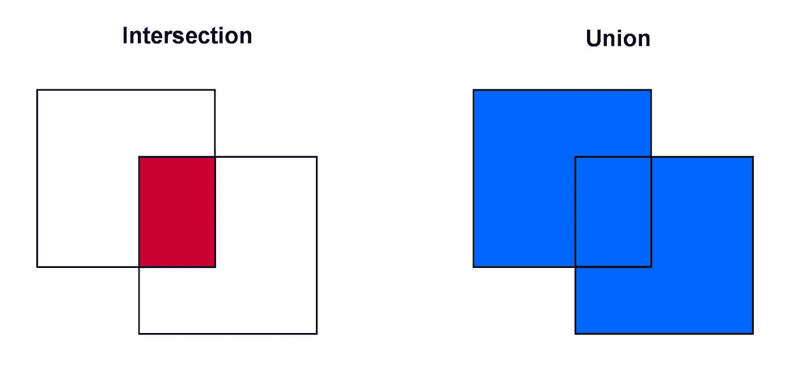
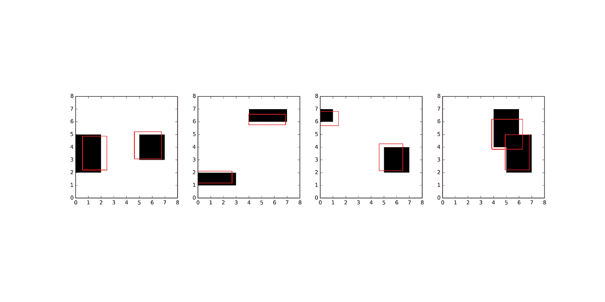
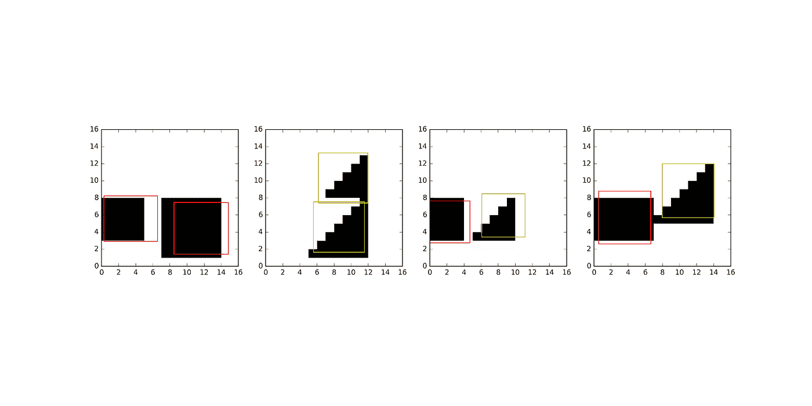

# 用神经网络进行目标检测——使用 keras 的简单教程

> 原文：<https://towardsdatascience.com/object-detection-with-neural-networks-a4e2c46b4491?source=collection_archive---------0----------------------->

> TLDR: 一个非常轻量级的图像目标检测教程。我们将**引导简单的图像**，并对它们应用越来越复杂的神经网络。最终，该算法将能够**检测出形状和颜色各异的多个物体**(如下图)。你应该对神经网络有一个基本的了解。


图像分析是深度学习中最突出的领域之一。图像很容易生成和处理，它们正是机器学习的正确数据类型:对人类来说容易理解，但对计算机来说很难。毫不奇怪，图像分析在深度神经网络的历史中发挥了关键作用。

在这篇博文中，我们将探讨对象检测——找出图像中的对象。例如，想象一辆自动驾驶汽车需要检测路上的其他汽车。目标检测有很多复杂的算法。它们通常需要庞大的数据集、非常深的卷积网络和很长的训练时间。为了使本教程易于理解，我们将应用两个简化:1)我们不使用真实的照片，而是具有抽象几何形状的图像。这允许我们引导图像数据并使用更简单的神经网络。2)我们预测每个图像中固定数量的对象。这使得整个算法变得非常非常简单(除了一些技巧之外，它实际上出奇的简单)。在帖子的最后，我将概述如何扩展这种方法来检测图像中的更多对象。

我试图使本教程尽可能简单:我将一步一步来，从检测单个对象开始。对于每一步，都有一个 Jupyter 笔记本，在这个 github repo 中有完整的代码。您不需要下载任何额外的数据集。代码是用 Python plus [keras](http://keras.io/) 编写的，所以即使对初学者来说，网络也应该容易理解。此外，我使用的网络(大部分)是非常简单的前馈网络，所以你可以在几分钟内训练它们。

**检测单个物体**

让我们从简单的开始:我们将预测单个矩形的边界框。为了构建“图像”，我创建了一组 8×8 的 numpy 数组，将背景设置为 0，并将数组中的一个随机矩形设置为 1。下面举几个例子(白色为 0，黑色为 1):


神经网络是一个非常简单的前馈网络，只有一个隐藏层(没有卷积，没有花哨)。它以展平后的图像(即 8×8 = 64 个值)作为输入，预测包围盒的参数(即左下角的坐标 x 和 y，宽度 w 和高度 h)。在训练期间，我们简单地通过均方误差(MSE)进行预测到期望边界框的回归。我在这里使用了 [adadelta](https://arxiv.org/abs/1212.5701) 作为优化器——它基本上是标准的随机梯度下降，但是具有自适应的学习速率。这是一个非常好的实验选择，因为你不需要在超参数优化上花费太多时间。以下是该网络在 keras 中的实现方式:

```
model = Sequential([
        Dense(200, input_dim=64), 
        Activation('relu'), 
        Dropout(0.2), 
        Dense(4)
    ])
model.compile('adadelta', 'mse')
```

我用 40k 张随机图像训练了这个网络 50 个时期(在我笔记本电脑的 CPU 上大约 1 分钟)，得到了几乎完美的结果。下面是上面图像中预测的边界框(它们是在训练过程中展示的):


很好，不是吗？你可以看到，我还在每个边界框上方绘制了 IOU 值:这个索引被称为**I**intersection**O**ver**U**nion，并测量预测和实际边界框之间的重叠。它的计算方法是将相交面积(下图中的红色)除以并集面积(蓝色)。IOU 介于 0(无重叠)和 1(完全重叠)之间。在上面的实验中，我得到了平均 0.9 的近乎完美的 IOU(基于保留的测试数据)。本节代码在[本 Jupyter 笔记本](https://github.com/jrieke/shape-detection/blob/master/single-rectangle.ipynb)中。



**检测多个物体**

预测单个对象没那么有趣，所以让我们添加另一个矩形。基本上，我们使用与上面相同的方法:用 8x8 numpy 阵列引导图像，并训练前馈神经网络来预测两个边界框(即向量 *x1，y1，w1，h1，x2，y2，w2，h2* )。然而，如果我们继续这样做，我们会得到以下(相当令人失望)的结果:


两个边界框似乎都在矩形的中间。发生了什么事？想象以下情况:我们在上面图中最左边的图像上训练我们的网络。假设左矩形的期望包围盒在目标向量中的位置 1(*x1，y1，w1，h1* )，右矩形的期望包围盒在向量中的位置 2(*x2，y2，w2，h2* )。显然，我们的优化器将改变网络的参数，使得第一个预测器向左移动，第二个预测器向右移动。现在想象一下，稍后我们遇到了一个类似的图像，但是这次目标向量中的位置被交换了(即左矩形在位置 2，右矩形在位置 1)。现在，我们的优化器将把预测器 1 拉到右边，把预测器 2 拉到左边——与前面的更新步骤正好相反！实际上，预测的边界框位于中心。由于我们有一个巨大的数据集(40k 图像)，将会有很多这样的“副本”。

解决方案是在训练期间将每个预测的边界框“分配”给一个矩形。然后，预测器可以学习专攻矩形的某些位置和/或形状。为了做到这一点，我们在每个时期之后处理目标向量:对于每个训练图像，我们计算预测和目标之间的均方误差 A)对于目标向量中边界框的当前顺序(即 *x1，y1，w1，h1，x2，y2，w2，h2* )，以及 B)如果目标向量中的边界框被翻转(即 *x2，y2，w2，h2，x1，y1，w1，h1* )。如果 A 的 MSE 低于 B，我们保持目标向量不变；如果 B 的 MSE 低于 A，我们翻转向量。我在这里实现了这个算法[。下面是翻转过程的可视化:](https://github.com/jrieke/shape-detection/blob/master/two-rectangles-or-triangles.ipynb)


上图中的每一行都是来自训练集的样本。从左到右是训练过程的时期。黑色表示目标向量在此时期后翻转，白色表示没有翻转。你可以很好地看到，大多数翻转发生在训练的开始，当预测者还没有专门化的时候。

如果我们在启用翻转的情况下训练我们的网络，我们会得到以下结果(同样是在保留的测试图像上):



总体而言，该网络在训练数据上实现了 0.5 的平均 IOU(我没有计算测试数据集的 IOU，但应该非常相似)。不像单个矩形那样完美，但是相当不错(特别是考虑到它是一个如此简单的网络)。请注意，最左边的图像与之前图中的图像相同(没有翻转的图像)，您可以清楚地看到预测器已经学会了专门处理矩形。

最后，关于翻转算法还有两点需要注意:首先，上面介绍的方法当然只对两个矩形有效。然而，通过查看预测器和矩形的所有可能组合，您可以很容易地将其扩展到多个矩形(我将在下面更详细地解释这一点)。其次，您不必使用均方差来决定目标是否应该翻转——您也可以使用 IOU 甚至边界框之间的距离。在我的实验中，所有三个指标导致了非常相似的结果，所以我决定坚持使用 MSE，因为大多数人应该对它很熟悉。

**分类对象**

到目前为止，探测物体已经做得很好了，但是我们当然也想知道物体是什么。因此，我们将添加三角形并分类对象是矩形还是三角形。酷的是，我们不需要任何额外的算法或工作流程。我们将使用与上面完全相同的网络，并且只将每个边界框的一个值添加到目标向量:如果对象是矩形，则为 0，如果对象是三角形，则为 1(即，二进制分类；这里的代号是。

下面是结果(我把图片尺寸增加到 16x16，这样小三角形更容易识别):



红色边界框表示网络预测了矩形，黄色表示预测了三角形。样本已经表明分类工作得相当好，而且我们确实获得了几乎完美的分类准确度。

**把它们放在一起:形状、颜色和卷积神经网络**

好了，一切都正常了，现在让我们来玩一玩:我们将把这个方法应用到一些更“真实”的场景中——这意味着:不同的颜色，更多的形状，一次多个物体。为了引导图像，我使用了 [pycairo](https://cairographics.org/pycairo/) 库，它可以将 RGB 图像和简单的形状写入 numpy 数组。我也对网络本身做了一些修改，但让我们先来看看结果:


如你所见，边界框并不完美，但大多数时候它们都在正确的位置。测试数据集上的平均 IOU 在 0.4 左右，对于一次识别三个对象来说还不错。预测的形状和颜色(写在边界框上面)非常完美(测试准确率为 95 %)。显然，网络已经真正学会了将预测器分配给不同的对象(正如我们用上面介绍的翻转技巧所瞄准的)。

与上面的简单实验相比，我做了三处修改:

1)我使用了卷积神经网络(CNN)而不是前馈网络。CNN 用可学习的“过滤器”扫描图像，并在每一层提取越来越多的抽象特征。例如，早期层中的过滤器可以检测边缘或颜色梯度，而后期层可以记录复杂的形状。我不会在这里讨论技术细节，但你可以在斯坦福大学 CS231n 班的[讲座](http://cs231n.stanford.edu/syllabus.html)或迈克尔·尼尔森的书的[这一章](http://neuralnetworksanddeeplearning.com/chap6.html)中找到精彩的介绍。对于上面显示的结果，我训练了一个有四个卷积层和两个池层的网络大约 30-40 分钟。更深/更优化/更长时间训练的网络可能会得到更好的结果。

2)我没有使用单个(二进制)值进行分类，而是使用 one-hot vectors(处处为 0，类的索引处为 1)。具体来说，我对每个对象使用一个向量来分类形状(矩形、三角形或圆形)，一个向量来分类颜色(红色、绿色或蓝色)。请注意，我在输入图像中添加了一些随机的颜色变化，看看网络是否能够处理这种情况。总而言之，图像的目标向量由每个对象的 10 个值组成(4 个用于边界框，3 个用于形状分类，3 个用于颜色分类)。

3)我修改了翻转算法来处理多个边界框(如上所述)。在每个时期之后，该算法计算一个预测的和一个预期的边界框的所有组合的均方误差。然后，取这些值中的最小值，将相应的预测和预期边界框相互赋值，从尚未赋值的框中取出下一个最小值，依此类推。

你可以在[这个笔记本](https://github.com/jrieke/shape-detection/blob/master/color-multiple-shapes.ipynb)里找到最终代码。

**现实世界的物体**

识别形状是一个很酷很简单的例子，但显然这不是你想在现实世界中做的事情(不幸的是，自然界中没有那么多抽象的 2D 形状)。此外，我们的算法只能预测每幅图像的固定数量的包围盒。然而，在现实世界中，你有各种各样的场景:一条小岔路上可能没有汽车，但只要你在高速公路上行驶，你就必须同时识别数百辆汽车。

尽管这似乎是一个小问题，但实际上很难解决——如果算法不知道有多少个对象，它应该如何决定什么是对象，什么是背景？想象你自己从近处看一棵树:即使你只看到一堆树叶和树枝，你仍然可以清楚地说这都是一个物体，因为你明白树是什么。如果树叶散落在地板上，你会很容易发现它们是单独的物体。不幸的是，神经网络不太理解什么是树，所以这对它们来说是一个相当大的挑战。

在对可变数量的对象进行对象检测的许多算法中(例如[over feet](http://arxiv.org/abs/1312.6229)或[R-CNN](https://people.eecs.berkeley.edu/~rbg/papers/r-cnn-cvpr.pdf)；看一下[这个讲座](http://cs231n.stanford.edu/slides/winter1516_lecture8.pdf)的概况)，我只想重点介绍一个，因为它和我们上面用的方法很像:它叫[YOLO](http://arxiv.org/abs/1506.02640)(**Y**ou**O**only**L**ook**O**nce)。与旧的方法相比，它只需通过一个神经网络就可以检测图像中的对象。简而言之，它将图像划分为一个网格，为每个网格单元预测两个边界框(即，与我们上面所做的完全相同)，然后尝试在整个图像中找到最佳边界框。因为 YOLO 只需要通过一个网络，它的速度非常快，甚至可以处理视频。下面是一个演示，你可以在这里看到更多的例子。

如果你想了解我的工作，请在 Twitter 上关注我( [@jrieke](https://twitter.com/jrieke) )！你也可以在我的网站上看看其他的项目。