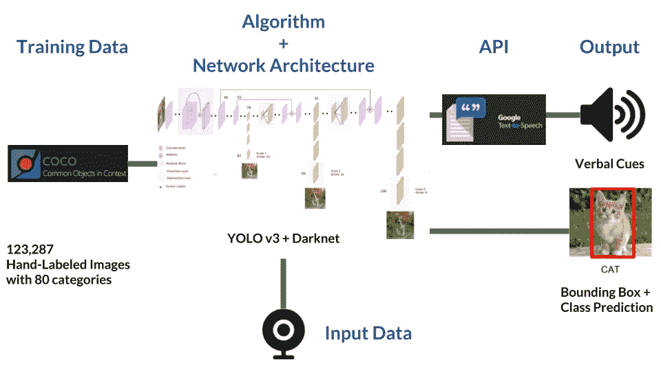
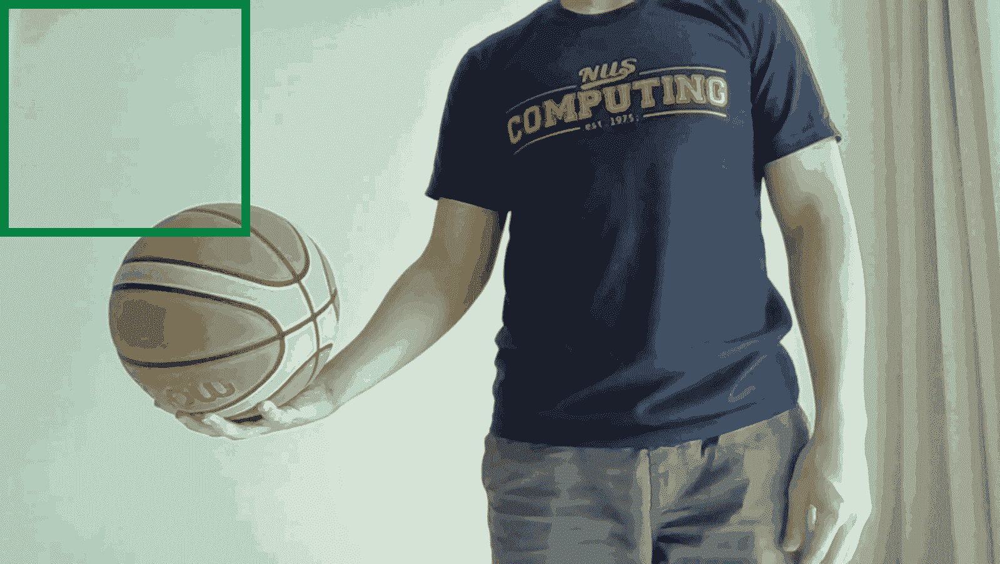
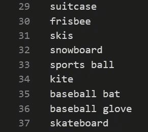
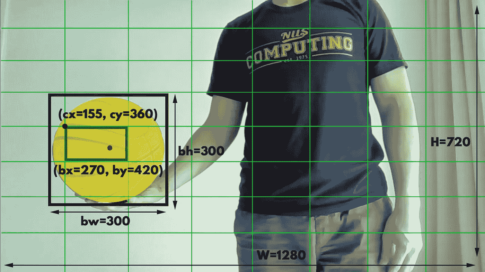
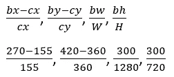
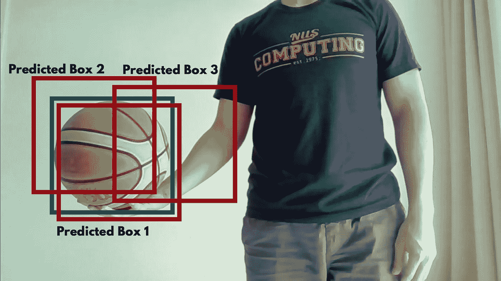
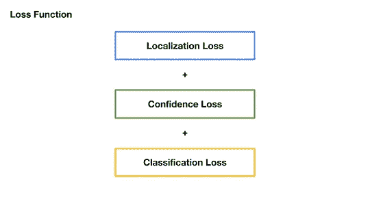
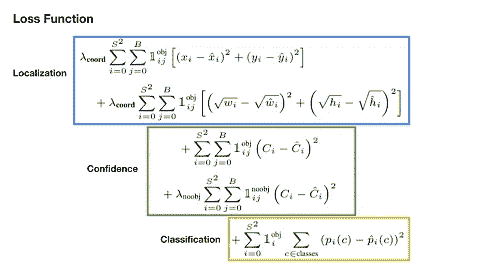

# 带有语音反馈的物体检测— YOLO v3 + gTTS

> 原文：<https://towardsdatascience.com/object-detection-with-voice-feedback-yolo-v3-gtts-6ec732dca91?source=collection_archive---------6----------------------->

## 帮助盲人听到他们看不见的东西。

期末考试终于结束了！！！我被计算机视觉中的物体检测的想法迷住了，并想开始一个关于它的项目。我意识到，我们或许可以通过图像到文本和文本到语音的转换来帮助盲人“看”得更好，而不需要任何复杂的硬件。

要完全理解整个流程中的每一个环节是非常困难的，但是我已经尽我所能去理解这个任务。

# 目标检测

是计算机视觉的一个领域，它检测图像/视频中语义对象的实例(在我们的例子中，通过在它们周围创建边界框)。然后，我们可以将注释文本转换成语音响应，并给出对象在人/摄像机视野中的基本位置。

# 非常高层次的概述



1.  **训练数据:**用[上下文中的公共对象](http://cocodataset.org/#explore) (COCO)数据集训练模型。你可以在链接中浏览他们标记的图片，这很酷。
2.  **模型:**这里的模型是**你只看一次** (YOLO)算法，它通过一种极其复杂的卷积神经网络架构的变体运行，称为[暗网](https://pjreddie.com/darknet/)。尽管我们使用的是一个更加增强和复杂的 YOLO v3 模型，我还是会解释最初的 YOLO 算法。另外，python **cv2** 包有一个从 yolov3.cfg 文件中的配置设置 Darknet 的方法。

这一次我更感兴趣的是让一些东西尽快工作，所以我将使用一个预先训练好的模型。这意味着可可已经被其他人在 YOLO v3 上训练过，并且我们已经获得了存储在 200+mb 文件中的权重。

如果你不确定什么是权重，就把它想象成在线性回归中寻找最佳拟合线。我们需要找到 y=mx+c 中 m 和 c 的正确值，使我们的线使所有点之间的误差最小。现在，在我们更复杂的预测任务中，当我们将图像输入复杂的网络时，我们有数百万个 x。这些 x 每个都有一个 m，这些是存储在 yolov3.weights 文件中的预测重量。这些 **m** s 已经被不断地重新调整以最小化一些功能损失。

3.**输入数据:**我们将使用我们的网络摄像头以每秒 30 帧的速度向这个经过训练的模型提供图像，我们可以将其设置为每隔一帧处理一次，以加快速度。

4. **API:** 每一帧中检测到的物体的类别预测将是一个字符串，例如“猫”。我们还将获得图像中对象的坐标，并将位置“上”/“中”/“下”&“左”/“中”/“右”附加到类预测“猫”上。然后，我们可以使用 **gTTS** 包将文本描述发送到 Google 文本到语音转换 API。

5.**输出:**我们还将获得在我们的帧中检测到的每个对象的边界框的坐标，将这些框覆盖在检测到的对象上，并将帧流作为视频回放返回。我们还将计划在每秒的第一帧(而不是 30 fps)获得语音反馈，例如“左下角的猫”，这意味着在我的相机视图的左下角检测到一只猫。

# 理解 YOLO 算法

以前，基于分类的模型用于使用定位、基于区域的分类或诸如滑动窗口之类的东西来检测对象。只有图像的高得分区域被认为是检测，并且它们可能非常耗时。



All that work just for 1 frame.

相反，YOLO 是基于**回归的**。我们在算法**(只看一次图像的像素)**、**、**的**一次运行**中快速预测整个图像的类别和边界框，以便图像中的全局上下文通知**、**预测。

## 训练时间



Object classes in coco.names file are indexed.

c 代表我们试图标记的对象的类索引。一个运动球意味着 C=33。训练已经在 COCO 上完成了。


Values in pixels, measured from (0,0) as top-left. Example of how the images are labeled to train the model.

在训练期间，我们必须以这种格式`C bx by bw bh`为图像中的每个对象手动标记以下 5 个值。我们还将通过将 4 个 b 值表示为 W & H (1280 x 720 px)的一部分，将每个 b 值归一化到 0–1 之间。

假设我们在框架中标记了两个对象——运动球和我自己。这由张量表示:向量的一般形式，将在训练期间输入到模型中。

```
[33, 0.21, 0.58, 0.23, 0.42]  -  sports ball
[1, 0.67, 0.5, 0.5, 0.9]  -  myself
```

## 预测/检测时间

现在，我们在预测时间将 1280 x 720 帧从我们的相机输入到 YOLO。YOLO 会自动将其大小调整为 416 x 234，并通过用 0 填充超出部分来适应流行的标准大小的 416 x 416 网络。YOLO 将每幅图像分成 S×S 个单元，每个单元的大小为 32×32(缩减系数=32)。这就产生了 416/32 = 13 x 13 个单元。



Using 8x8 cells for illustration. Dark-green box is the cell which contains the center of the object.

**边界框中有 5 个值— (bx，by，bw，bh，BC)**

如果对象的中心(红点)落入网格单元，则只有该网格单元(深绿色单元)负责检测该对象。每个边界框有 5 个值。前 4 个值 **bx，by，bw，bh** 代表盒子的位置。



1) Normalized using the coordinates of the top-left corner of the cell which contains the object’s center. 2) using the dimensions of the entire image.

第 5 个值是 **BC** :盒子置信度得分。

BC = Pr(存在于框中的对象)* **IOU (** 并集上的交集)。

这衡量了盒子中包含一个*任意类*的物体的可能性以及预测的准确性。如果在那个盒子里不存在任何物体，那么 BC=0，我们希望 BC=1 来预测地面实况。


Fairly high IOU

**在每个网格单元中预测有 B 个包围盒**



YOLO v3 makes B=3 bounding boxes in each cell to predict that **one** object in the cell.

**在每个网格单元中也有 C 个条件类概率**

当我们使用 COCO 时，每个单元格有 80 个条件类概率— Pr(Class i | Object)。假定在单元中有一个对象，则预测的对象属于 I 类的概率。

```
1 person 0.01
2 bicycle 0.004
.
.
33 sports ball 0.9
.
.
80 toothbrush 0.02
```

在我们上面的例子中，类别 33 具有最高的概率，并且它将被用作我们对该对象是一个运动球的预测。

**综上所述**

有 S×S 个单元，并且在这些单元的每一个中有 2 样东西:1) B 个边界框，每个边界框有 5 个值(bx，by，bw，bh，BC)，2) C 个条件类概率。预测被编码为一个 S x S x (5 * B + C)张量。

**非最大抑制**

对于唯一用于预测对象的网格单元，实际上有 B 个重复检测(深绿色框)。NMS 抑制了具有低盒置信度分数的检测:BC，以便当只有一个运动球时，我们不会最终预测到 3 个运动球。NMS 的实现可以是:

1.  从具有最高 BC 的边界框开始。
2.  移除与其重叠超过给定阈值量= 0.5 的任何剩余边界框。
3.  转到步骤 1，直到不再有边界框。

## 损失函数

虽然我们已经有了我们的预测，但我们想了解权重是如何调整的，以使我们在训练期间的损失函数最小化。这个函数看起来很复杂，但分解起来却非常直观。



1.  地面实况框与预测边界框之间的差异。
2.  物体在盒子中的 100%置信度与盒子置信度之间的差异。
3.  C 实际类别概率(0，…，1，…，0)与 C 预测类别概率(0.01，…，0.8，…，0.02)之间的差异



Basically uses sum of squared-differences for each component. Most symbols are pretty self-explanatory.


参数λcoord 通常=5，以增加定位损失的权重，使其更重要。

参数λnoobj 通常=0.5，以降低置信度损失的权重，因为不包含对象的盒子具有置信度得分 BC=0。这使得模型更稳定，更容易收敛。

**语音反馈**

我们可以使用相对于 W & H 的 bx & by 来确定检测到的物体的位置，并通过这个简单的命令将其作为文本字符串发送给 gTTS。

```
tts = gTTS("mid left sports ball, lang=’en’)tts.save(‘tts.mp3’)
```

我还使用了 **pydub** 和 **ffmpeg** 来操作生成的音频文件。

# 演示

我不能实时返回帧，因为当它处理每 30 帧时，会使视频播放看起来非常不稳定。我还研究了多线程技术，理论上讲，每隔 30 帧就应该创建一个进程来处理视频，另一个进程用于视频播放。

然而，我只能对我的网络摄像头上实时检测到的物体进行口头描述，这更重要，因为盲人无论如何都看不到边界框。对于下面的视频，我在传递它之前记录了自己，以创建边界框并生成口头响应。

在那里，YOLO v3 的可可随着 gTTS，做它的魔术！

我很享受这个学习、实践、然后分享的过程。我认为“从应用中学习”在分享方面更上一层楼。将复杂的问题分解成简单的问题，用外行人的语言理解和解释困难的概念，这是我想进一步磨练的技能。更多即将推出！

[链接到项目回购](https://github.com/jasonyip184/yolo)

请在 [LinkedIn](http://linkedin.com/in/jasonyip184) 或通过 jasonyip184@gmail.com 与我进一步讨论！

**参考文献**

[](https://www.pyimagesearch.com/2018/11/12/yolo-object-detection-with-opencv/) [## 基于 OpenCV - PyImageSearch 的 YOLO 目标检测

### 在本教程中，您将学习如何使用 YOLO 对象检测器来检测图像和视频流中的对象…

www.pyimagesearch.com](https://www.pyimagesearch.com/2018/11/12/yolo-object-detection-with-opencv/) [](https://hackernoon.com/understanding-yolo-f5a74bbc7967) [## 了解 YOLO

### 这篇文章解释了 YOLO 对象检测体系结构，从某人的角度谁想要实现…

hackernoon.com](https://hackernoon.com/understanding-yolo-f5a74bbc7967) [](https://medium.com/@jonathan_hui/real-time-object-detection-with-yolo-yolov2-28b1b93e2088) [## 使用 YOLO、YOLOv2 和现在的 YOLOv3 进行实时物体检测

### 你只看一次(YOLO)是一个目标为实时处理的对象检测系统。我们将介绍 YOLO…

medium.com](https://medium.com/@jonathan_hui/real-time-object-detection-with-yolo-yolov2-28b1b93e2088)