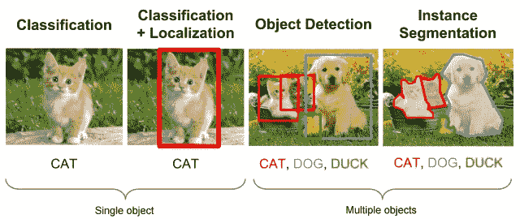
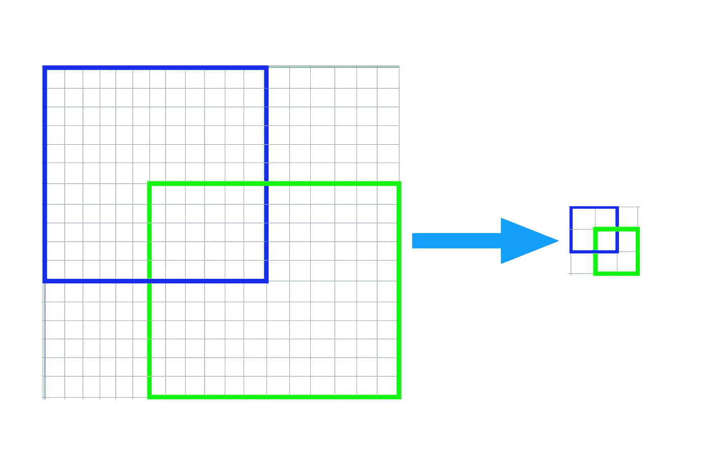
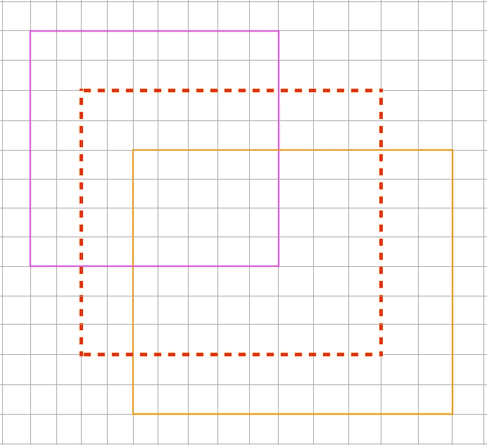

# 过食中的物体定位

> 原文：<https://towardsdatascience.com/object-localization-in-overfeat-5bb2f7328b62?source=collection_archive---------1----------------------->

目标定位的任务是预测图像中的目标及其边界。目标定位和目标检测之间的区别是微妙的。简单地说，目标定位旨在定位图像中的主要(或最可见)目标，而目标检测则试图找出所有目标及其边界。

Citation needed.

AlexNet 应该是第一个用来做物体定位或检测的神经网络。由于 Alexnet 的论文没有提到实现， [Overfeat (2013)](https://arxiv.org/abs/1312.6229) 是第一个发表的基于神经网络的目标定位架构。基本思想如下图所示。

Object Localization Architecture

如果去掉边界回归器，这将是一个典型的图像分类架构。实际上，Overfeat 首先训练一个图像分类器。然后确定特征层并训练边界回归器。这再简单不过了。

乍一看，不同的类应该有不同的边界回归量，因为不同的对象往往有不同的方法来定义它们的边界。然而，在本文的实验中，类之间共享的回归器优于 1000 个不同的回归器(因为 ImageNet 有 1000 个类)。是因为数据稀缺吗？我们能直接训练回归变量来预测边界而不需要对象的类别吗？培训结束我会更新答案:-)。

Overfeat 中一个有趣的贡献是多尺度分类，它利用卷积神经网络的空间特征来减少计算。

**多尺度分类**

如在其他实验中所示，我们可以通过简单地裁剪多个图像补片并在测试阶段根据补片的预测投票决定最终预测来提高图像分类的准确性。显然，我们可以将这种方法用于目标定位问题中的图像分类器。假设我们有一个 8×8 的图像或特征图，我们采用 6×6 的随机裁剪来训练我们的图像分类器。在预测阶段，我们随机裁剪几个 6×6 的小块，并从这些小块的预测中选出最终的预测。下图显示了两种作物(蓝色和绿色)。重叠区域是黄色的，而红色的 3x3 补丁是应用于重叠作物的滤镜之一。

Redundant Compution in CNN

如果我们将两种作物一个接一个地输入分类器，我们将在红色区域应用 3×3 滤镜两次。计算是多余的，因为滤波器和图像中的位置是相同的。Overfeat 提出了一个巧妙的方法来消除这种冗余。

假设我们有一个大小为 18x18 的要素地图或图像，我们希望获得大小为 12x12 的裁剪，然后应用卷积和池化操作。卷积运算的滤波器是 3×3，没有重叠，因此原始映射将缩小到 6×6。然后我们应用 2x2 非重叠池，大小将变成 3x3。作物(0，0，12，12)变成(0，0，2，2)在最终的特征图中，作物(6，0，18，12)变成(1，0，3，2)，作物(0，6，12，18)变成(0，1，2，3)，作物(6，6，18，18)变成(1，1，3，3)。我们可以看到，我们可以在原始地图上应用一次操作，得到四种作物的特征地图。最终特征图(0，0，2，2)和(1，1，3，3)的初始裁剪如下图所示。

Apply convolutional and pooling operations for patches at the same time.

因此，我们可以对初始特征地图或图像应用非重叠卷积和汇集操作，以获得其裁剪结果。这里的好处是避免了我们之前谈到的冗余计算。这里的架构包括非重叠、非重叠过滤器和非重叠池。

如果避免了冗余计算，我们可以用不同大小的裁剪来训练不同的分类器，以集成结果。本文称之为多尺度分类。

如果我们有多个分类器，每个分类器都预测预测对象的一个框，哪个框是最准确的？Overfeat 将重叠较大且相互靠近的盒子保留下来，将两个相距较远的盒子的坐标进行平均，如下图所示。这种方式有助于移除其他对象的框而不是主对象。然后使用检测器的分类分数挑选出最终的盒子。

The box with dotted borders has a better chance

**过量进食检测**

过量饮食中的目标检测属于图像分类领域。唯一的区别是，你需要一些负样本来使分类器能够预测物体之外的背景。显然，多作物和多尺度分类有助于提高准确性和性能。