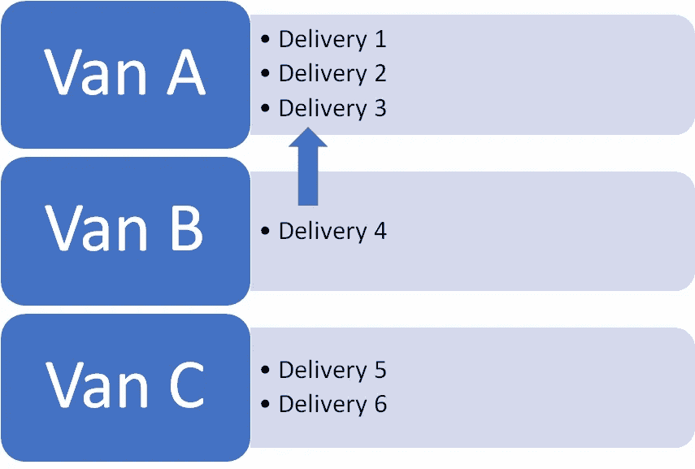

# 禁忌、邻居和优化

> 原文：<https://towardsdatascience.com/of-taboos-neighbors-and-optimization-2955b72fbdf?source=collection_archive---------12----------------------->

## 改善您的路线

“A mailman sitting in a mail truck sorting mail parked outside of a house in Tulsa” by [Pope Moysuh](https://unsplash.com/@pope_moisa?utm_source=medium&utm_medium=referral) on [Unsplash](https://unsplash.com?utm_source=medium&utm_medium=referral)

假设你经营一个快递车队。每天，您必须通过将包裹分配到配送货车来安排包裹递送，确保它们按时送达，确保您不会让任何货车超载，确保工作在司机之间平均分配，确保司机不会超过他们的合同和法律约束期，确保您最大限度地减少燃料消耗……根据您的特定业务，这个清单还可以继续下去。GOGOVAN 的 Kamil Bujel 曾在另一篇文章中描述过这种特殊情况。

他们通过使用现成的优化包来解决这个问题，以帮助他们解决手动调度车辆的日常繁重工作。Kamil 在他的文章中详细描述了这个过程，以及他们试图让算法在合理的时间和内存范围内工作所经历的麻烦。但是为什么优化解决方案会有这样的表现呢？为什么会消耗这么多内存？这样，优化解决方案就像一个黑匣子，它的用户很少或根本不知道里面可能会发生什么。

如果我们能看到这些优化算法中的一个会怎么样？为了吐出一个“优化”的解决方案，他们在引擎盖下表演了什么样的魔术？我决定在 Kamil 自己的文章之后写这篇文章。碰巧的是，在其他事情中，我一直在为我自己的公司开发一个这样的路线优化算法，这篇文章是我通过实现一个特定类型的优化算法所学到的东西的一个简短的精华。

**离散优化**

优化是一个误称，因为我们很少找到最好的解决方案。这个领域的所有研究，从臭名昭著的旅行推销员问题(TSP)开始，会告诉你最优解只能在玩具问题中找到。真正的问题，有数百辆车和交货地点，实在是太大了，无法在有用的时间内完全搜索，所以我们必须用一些聪明的方法。此外，我在这里讨论的优化类型是离散型的。如果你熟悉连续优化，那么你可以利用梯度，以便沿着最陡的路径下降到全局最小值。离散优化就没有这种运气了。向组合中添加另一辆货车，或删除一个交货，或在货车之间移动一个交货会产生什么结果？你必须尝试这个选项，评估结果，然后决定怎么做。这基本上是我们如何在精神上做这种类型的优化，也许使用几个显而易见的规则，如地理分组交付。

我已经提到了一些没有很好定义的术语。我提到了一个*最小值*。但是最少什么？我们是否希望最小化车辆、距离、时间和燃料消耗？这个问题很容易回答:我们希望最小化日常运营成本。但是这个成本怎么算呢？好奇的读者，请继续读下去。

**路线优化**

路线优化是如何工作的？计算我们必须服务的工作的最优车辆分配需要什么？如何计算时间和顺序，以便我们最大限度地降低运营成本，同时保持高客户满意度和低司机流失率？我们从哪里开始？我们如何结束？

这篇文章将告诉你这个问题的一个可能的解决方案，一个臭名昭著的旅行推销员问题(TSP)的扩展，使用一些具有异国情调的名字的扩展。在这里，我将解释一个解决这个问题的实现，通过解决一个真实的发行公司的需求，像 [GOGOVAN](https://medium.com/gogovan-technology/improving-operations-with-route-optimization-e032d8bf5edc) 。如果你还没有这样做，请阅读 Kamil 的文章，以获得一个这样的公司如何运作，以及他们的优化挑战是什么。

我不是使用现成的解决方案，而是在概念上开发一种方法，基于[禁忌搜索](https://en.wikipedia.org/wiki/Tabu_search)、[局部搜索](https://en.wikipedia.org/wiki/Local_search_(optimization))和[可变邻域搜索](https://en.wikipedia.org/wiki/Variable_neighborhood_search)来解决相同的问题。让我们继续学习这些概念。

在快递这一行，你每天都要处理大量相对较小和较轻的包裹。交货是在具有给定货物容量的类似货车中进行的，通常以重量、体积、单位或这三者的任意组合来衡量。计算车辆载货量很重要，因为这是这个问题的一个硬限制，也就是说，出于安全和法律原因，你不能让货车超载。如果一辆或多辆货车装载的货物超过允许的数量，您就无法设计出解决包裹配送问题的方案。这不是一个*可行的*方案*可行的*方案。当我谈到*可行的解决方案*时，我指的是不违反像这样的硬性限制的解决方案。请注意，一个可行的解决方案可能会违反*软限制*，例如当货车计划晚点到达给定的客户时。在这种情况下，这种解决方案(通过应用*迟到成本惩罚*)会比所有货车都准时交付的另一种方案更昂贵。请注意，选择什么是硬限制或软限制完全由你决定，我只是用我以前用过的限制来说明这个概念。

在这种类型的交付场景中，所有车辆每天一次被装载到一个地方，即中央仓库(我从跟踪我的网上购买推测是在清晨)。优化算法的目的是通过确保满足交付时间，同时保持最低的运营成本，来计划所有的日常交付。

如果这个优化过程是一个烹饪食谱，那么我们需要关心的配料是什么？我们有客户、送货、货车、司机、道路、交通和运营成本。让我们对其中的每一项进行建模，以便了解我们需要的信息类型。

***客户***

客户可以很容易地被建模为简单的地理位置，即他们的纬度和经度。地理配准客户是一个重要的步骤，因为我们需要推导出运营地图中任意两个位置之间的行程*持续时间*和*距离*。为了计算这些，必须将所有客户位置转换为地理坐标，以便距离和时间计算方法能够正常工作。如果这些客户有特定的交付时间窗口，那么这些也可以考虑并记录下来。如果这样做，还要考虑打破这些时间窗口是硬限制还是软限制。请记住，硬限制会使解决方案无效，而软限制只会增加解决方案的成本。当我们考虑成本最小化时，会有更多的讨论。

***交付***

交付是一个简单的陈述，一辆货车必须访问一个客户位置，并在那里花费给定的*时间*交付给定货物尺寸(重量、体积、单位)的包裹。这意味着单次交付必须被视为从车辆到达交付地点的行程，加上执行交付所需的时间。优化程序将试图在时间和货车中调整交货，以便以低成本产生一个高效的解决方案。

***车辆***

除了每辆货车的唯一标识符(如牌照)之外，我们还需要每辆货车的最大载货量记录。将交货分配给给定的货车时，我们从可用的车辆货物中扣除交货货物尺寸，剩余值必须为正数。否则，我们会超载的。

除了这些数据，我们还必须记录每辆货车的任何相关运营成本，如租金、每公里成本或其他可用于优化程序最小化的成本。

我还要假设每辆车都有自己的司机，所以司机不是稀缺资源。然而，我们需要考虑的是任何合同安排，比如每天最长工作时间，或者公司工作时间。使用这种简化，这些限制可以应用于货车本身，我们不担心司机作为一个优化实体。

***道路和交通状况***

道路网络和交通阻抗是强加于模型的外部条件，必须予以考虑。在这里，我们有一系列的可能性，从最昂贵和最复杂的(从 Google 或 Here 等专业提供商处获取数据)到最便宜和不太精确的(使用测地线测量值结合距离因子计算所有距离)，以及用于计算行程持续时间的平均速度。如果您选择第一种方式，流量也是一种选择，既可以作为实时反馈，也可以作为给定时间间隔内的典型阻抗。无论如何，你必须能够建立任意两点之间的距离和持续时间对的矩阵，因为这是优化算法的主要材料。

***成本***

我一直提到运营成本，因为这将有助于衡量优化器生成的解决方案的质量。为了做到这一点，我们必须创建一个*成本函数*,将前面所有的成分转换成同一个指标:经济成本。使用每公里成本率将距离转换为成本。使用罚金将延误转化为成本。使用货车的每日折扣率或租赁率将车辆使用率转换为成本。您可以将这些成本视为真实的分类账成本和/或您对优化流程的个人偏好。例如，如果您不关心要使用的货车数量，您可以将它们的单个成本设置为零。另一方面，如果您想要最小化货车的数量，请指定每辆车的使用成本。因此，优化器会倾向于使用较少的 van 的解决方案。距离也是如此。请注意，优化器在决定最佳解决方案时，只会查看这个成本函数的输出，*，其他什么都不会做*。这就是为什么所有的重要变量都必须转换成一个成本，并包含在这个成本函数中。

**优化过程**

既然所有的配料都收集好了，我们可以开始做饭了。

我将使用术语“解决方案”来表示一个*可行的*配置，它只是车辆的集合，每辆车包含一个有序的*计划*交付的集合。这些计划交付包括关于开始和结束时间以及它们的地理路线的信息。

A toy solution with three vans and six deliveries

对于每个解决方案，可以通过成本函数计算相关成本。优化器将尽力最小化该成本，*，即*，在给定所有限制和计算时间的情况下，找到具有最小可能成本的解决方案。

***初始解***

我们需要做的第一件事是创建最初的解决方案。就像匆忙地把你孩子的所有玩具放进一个盒子里，让盖子关上，我们将使用任何必要的试探法来创造一个这样的*可行的*解决方案。请注意，这将是一个成本高昂的糟糕解决方案。但这是可行的。这是我们的起点，我们现在可以开始改进了。

***改进循环***

改进初始解决方案需要一个非常简单的概念:对初始解决方案做一个小的*扰动*(确保我们仍然得到一个可行的解决方案)，然后评估它的成本。但是什么是扰动呢？它可以简单到改变一辆货车的交货顺序，或者将一批货物从一辆车转移到另一辆车上。它可以是简单的，也可以是复杂的。在某种意义上，这是一个*邻域*并且在其中的搜索是一个*局部搜索*。

Perturbing a solution by moving a delivery

请注意，可以将邻域视为执行单一类型扰动的算法。在图片的例子中，它的工作方式是将一批货物从一辆货车转移到另一辆货车上。还要注意，货车内的交货顺序也很重要，因为它决定了交货的顺序，进而决定了要走的路线。这对距离成本有明显的影响。

正如我之前提到的，不可能预先知道给定的扰动是否会降低成本。与连续优化相反，我们不能计算成本函数的梯度，并跟随它们下降到(*希望是*)全局最小值——我们必须做出改变并评估其价值。它降低了成本，增加了成本还是保持不变？我们该怎么办呢？如果它降低了成本，我们可以采用它作为我们的下一个最佳解决方案，即*现任*解决方案。现任解决方案是目前为止最好的解决方案，成本最低，是您在优化过程结束时将使用的解决方案。

但是如果我们的扰动增加了求解成本呢？我们是不是放弃这个解决方案，尝试另一个方案，直到我们获得更低的成本？还是我们采用了更差的解决方案，希望它会带来更好的解决方案？如果你从高空滑下，这就像爬上附近的土堆，希望另一边有一个更陡的斜坡。

从我的经验来看，你可以两者都做，但在不同的情况下。第一种方法是所谓的*贪婪搜索*，当不同的可能解决方案的数量——状态空间——非常大时，这种方法似乎效果最好。在这些场景中，可能的解决方案数量如此之大，以至于你几乎总是可以*指望*一条下降的路径。对于较小的状态空间，情况并非如此。在这里，经验告诉我允许成本增加，以便优化器能够找到附近更深的成本谷，在那里它可以寻找更好的解决方案。

现在我们可以返回，用我们更新的解运行循环，产生另一个扰动，看看会发生什么。这是一个决定我们是坚持使用同一个小区还是应该使用另一个小区的好时机。这个决定可能非常重要，尤其是当其中一个邻域似乎停留在[局部最小值](https://en.wikipedia.org/wiki/Maxima_and_minima)上，无法产生更好的解决方案时。决定何时改变邻域以及改变到哪个邻域的方法本质上是启发式的。简而言之，这就是可变邻域搜索(VNS)。

***这是严格的禁忌……***

这个计划还有最后一个要素:我们必须像迷宫中的阿里阿德涅一样，标出我们要走的路。每个生成的解决方案都必须保留在一个列表中以备将来使用，以防止优化器再次探索它。因此它的名字叫做:禁忌列表。每当优化器生成一个新的解决方案时，它必须查看禁忌列表，并检查该解决方案是否已经生成(或被访问过)。如果是这样，它应该尝试另一个，可能是第二好的。

***停止准则***

那么我们什么时候停止？正如我之前所说的，几乎不可能知道你找到了可能的最佳解决方案，所以必须有一个预设的标准来停止改进循环并报告现有的解决方案。在这里，我把它留给你的想象力。我的不是很牵强，所以我用了一个严格的时间标准。在运行优化过程之前，我指定了我愿意等待“优化”解决方案的时间。仅此而已。

或者，您可以计算流程已经计算的循环次数，并在 *N* 次无改进循环后停止。

**结束语**

我希望现在这样更有意义。毕竟，这些都是简单的概念，有着花哨的名字，围绕着现代技术的计算能力。但是我在这里仅仅触及了表面。还有更多细节等待着您去探索，尤其是当您开始使用并行化的强大功能时。没有剧透给你，继续探索这个迷人的世界离散优化！

**推荐阅读**

[国际卡车运输的动态车队管理:关注临时运输任务(生产和物流)](https://www.amazon.com/Dynamic-Fleet-Management-International-Transportation/dp/3834928798/ref=sr_1_2?ie=UTF8&qid=1533033490&sr=8-2&keywords=dynamic+fleet+management&dpID=41pHZQi-i4L&preST=_SY291_BO1,204,203,200_QL40_&dpSrc=srch)

[反应式搜索和智能优化(运筹学/计算机科学接口系列)](https://www.amazon.com/Reactive-Intelligent-Optimization-Operations-Interfaces/dp/1441934995/ref=mt_paperback?_encoding=UTF8&me=&qid=1533121768)

[狮子道](https://www.amazon.com/LION-Way-Learning-Intelligent-Optimization/dp/1496034023/ref=sr_1_3?ie=UTF8&qid=1533056285&sr=8-3&keywords=LION+way&dpID=51SuB2aH%252BKL&preST=_SY291_BO1,204,203,200_QL40_&dpSrc=srch)