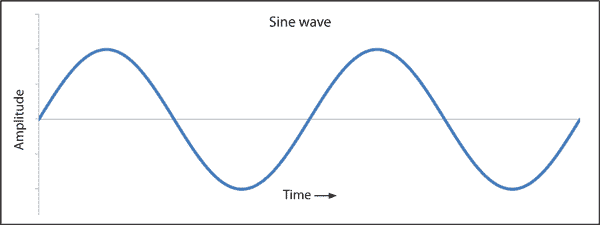
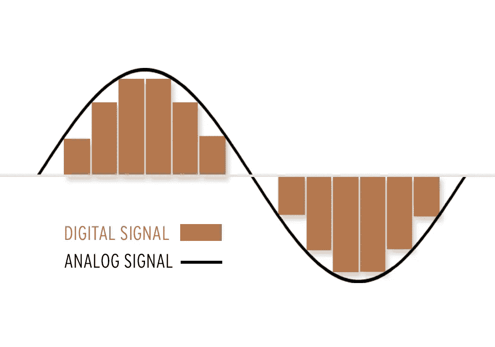
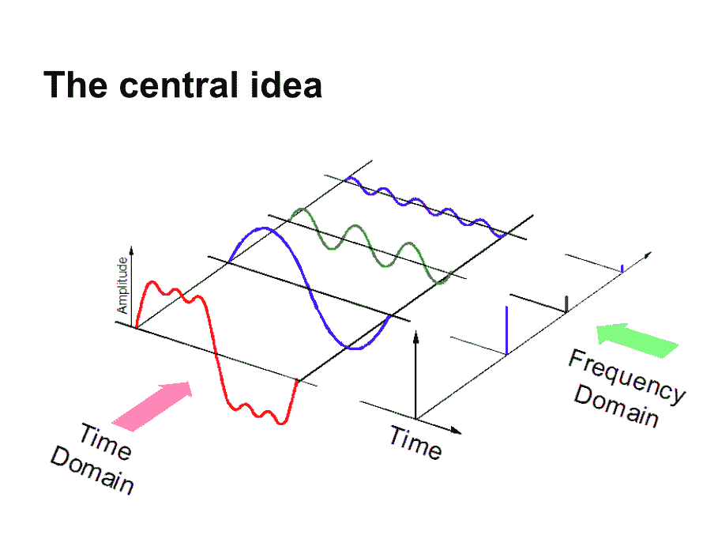
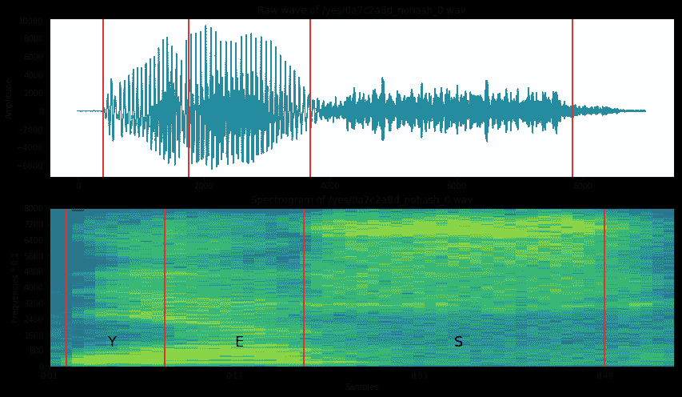

# 好的谷歌:如何进行语音识别？

> 原文：<https://towardsdatascience.com/ok-google-how-to-do-speech-recognition-f77b5d7cbe0b?source=collection_archive---------10----------------------->

语音识别是检测口语单词的任务。有许多技术可以进行语音识别。在这篇文章中，我们将介绍语音识别所需的一些背景知识，并使用一种基本技术来构建一个语音识别模型。该代码可在 [GitHub](https://github.com/jayeshsaita/Speech-Commands-Recognition) 上获得。对于这篇文章中提到的技术，检查这个 [Jupyter 笔记本](https://github.com/jayeshsaita/Speech-Commands-Recognition/blob/master/training.ipynb)。

“turned-on charcoal Google Home Mini and smartphone” by [Bence ▲ Boros](https://unsplash.com/@benceboros?utm_source=medium&utm_medium=referral) on [Unsplash](https://unsplash.com?utm_source=medium&utm_medium=referral)

## 音频处理的一些背景知识

让我们后退一步，理解音频到底是什么。我们都在电脑/手机上听音乐。通常，它们是 mp3 格式的。但是. mp3 文件并不是真正的音频。这是一种在我们的计算机中表现音频的方式。我们不会直接打开. mp3 文件并阅读它们(就像我们阅读一样。记事本中的 txt 文件)。我们使用应用程序打开那些. mp3 文件。这些应用程序知道什么是. mp3 文件以及如何播放它们。这些 mp3 文件编码(代表)音频。

音频被表示为波。通常，这些波有两个轴。x 轴表示时间，y 轴表示振幅。所以在每一个时刻 *t，*，我们都有一个振幅值。

Sine wave — A simple audio wave ([Source](https://youtubemusicsucks.com/wp-content/uploads/2017/10/sine-waves.gif))

你可以在这里听一个简单的正弦波[。太好了！现在我们只需要弄清楚如何在我们的代码中使用这些音频文件来执行识别。](https://en.wikipedia.org/wiki/File:220_Hz_sine_wave.ogg)

## 使用音频文件

我们将使用波形音频文件格式或。wav 文件。那么我们该如何解读这些？wav 文件？输入 librosa——一个允许我们阅读的 python 包。wav 文件。看完这些我们得到了什么。wav 文件？我们得到了大量的数字。这是我读了一个 1 秒长的音频文件后得到的输出。

*数组([ 0.0007143，0.00551732，0.01469251，…, -0.00261393，-0.00326245，-0.00220675]，dtype=float32)*

这些数字是什么意思？记得我告诉过你，音频被表示为具有两个轴的波。这些值代表该波的 y 轴，也称为振幅。那么 x 轴 aka 时间是怎么表示的呢？这就是数组的长度！所以对于 1 秒的音频，长度应该是 1000(1000 毫秒)。但是这个数组的长度实际上是 22050。这是哪里来的？

## 采样率

考虑一个 5 秒钟的音频剪辑。如果它是模拟的，那么它在每一瞬间都有一些振幅值，也就是每纳秒，或者每皮秒都有一些值。因此，考虑一个 5 秒钟的音频剪辑，它对每一皮秒都有一定的价值。那些是 *5e+12* 或*500000000000*值。想象一下储存在电脑上。在 C 语言中，存储一个浮点值需要 4 个字节。所以是 5e+12 * 4 字节。仅 5 秒钟的音频片段就需要大约 18tb 的数据！

Analog vs Digital Audio Signal ([Source](https://www.klipsch.com/blog/digital-vs-analog-audio))

我们不想仅仅为了存储一个 5 秒钟的音频片段而使用 18tb。所以我们把它转换成离散形式。为了将其转换为离散形式，我们在每个时间步长记录样本(也称为振幅值)。因此，对于 5 秒钟的音频，我们可以每 1 秒钟记录一次样本。那只是 5 个值(样本)！这被称为**采样率**。

Sampling Rate ([Source](https://wiki.hydrogenaud.io/index.php?title=File:Digital_wave.png))

形式上，采样率是每秒收集的样本数。这些收集的样本在时间上以相等的间隔隔开。对于上面的例子，采样率是每秒 1 个样本。你可能已经注意到有很多信息丢失。这是从连续(模拟)转换到离散(数字)的一个折衷。采样率应尽可能高，以减少信息损失。

那么为什么我们得到了长度为 22050 的数组呢？如果没有指定，Librosa 使用默认的采样率 22050。你可能会奇怪，为什么是 22050？这是人类听觉范围的上限。人类可以听到 20 赫兹到 20 千赫的频率。那 20 千赫就是 22050。更常见的采样速率是 44100，即 44.1KHz。

另外，请注意，我们得到的是 1D 数组，而不是 2D 数组。这是因为。我使用的 wav 文件是单声道音频，而不是立体声。有什么区别？单声道音频只有一个声道，而立体声有两个或更多声道。什么是频道？简单来说，就是音频的来源。假设您使用一个麦克风来录制您的两个朋友之间的对话。在理想情况下，麦克风只录下你朋友的声音，不录下任何其他背景噪音。您录制的音频有两个声道，因为有两个信号源，即您的两个朋友。现在，如果背景中有狗叫声，音频将有 3 个通道，3 个来源是你的朋友和狗。

在音频处理中使用之前，我们通常会将立体声音频转换为单声道音频。再次，天秤座帮助我们做到这一点。我们只是在加载时传递参数 *mono=True* 。wav 文件，它可以为我们将任何立体声音频转换成单声道。

## 音频识别功能

我们可以使用上述时域信号作为特征。但是它仍然需要大量的计算空间，因为采样率应该相当高。表示这些音频信号的另一种方式是在频域中。我们使用傅立叶变换。简而言之，傅立叶变换是一种工具，可以将时域信号转换到频域。频域中的信号需要少得多的存储计算空间。来自[维基百科](https://en.wikipedia.org/wiki/Fourier_series)，

> 在数学中，傅立叶级数是一种将函数表示为简单正弦波之和的方法。更正式地说，它将任何周期函数或周期信号分解成一组(可能无限)简单振荡函数的和，即正弦和余弦

简单来说，任何音频信号都可以表示为正弦波和余弦波之和。

A Time Domain Signal represented as the sum of 3 sine waves. ([Source](https://docs.google.com/presentation/d/1zzgNu_HbKL2iPkHS8-qhtDV20QfWt9lC3ZwPVZo8Rw0/pub?start=false&loop=false&delayms=3000#slide=id.g5a7a9806e_0_84))

在上图中，时域信号表示为 3 个正弦波之和。这如何减少存储空间？考虑正弦波是如何表示的。

The mathematical representation of sine wave. ([Source](https://en.wikipedia.org/wiki/Sine_wave))

由于信号表示为 3 个正弦波，我们只需要 3 个值来表示信号。

## 梅尔频率倒谱系数

我们的声音依赖于我们声道的形状，包括舌头、牙齿等。如果我们可以准确地确定这个形状，我们就可以识别正在说的单词/字符。MFCC 是声音的短期功率谱的代表，简单来说，它代表声道的形状。你可以在这里阅读更多关于 MFCC[的信息。](http://practicalcryptography.com/miscellaneous/machine-learning/guide-mel-frequency-cepstral-coefficients-mfccs/)

## 光谱图

频谱图是表示音频信号的另一种方式。光谱图以二维形式传达三维信息(2D 光谱图)。x 轴是时间，y 轴是频率。特定时间特定频率的振幅表示为该点的颜色强度。

Waveform and corresponding Spectrogram for a spoken word “yes”. ([Source](https://www.kaggle.com/davids1992/speech-representation-and-data-exploration))

## 方法概述

为了。wav 文件，我使用了 Kaggle 竞赛的训练数据子集- [Tensorflow 语音识别挑战赛](https://www.kaggle.com/c/tensorflow-speech-recognition-challenge)。Google Colaboratory 用于训练。它提供 12 小时的免费 GPU 使用。它不是很快，但对这个项目很好。

音频文件以 16000 的采样率进行采样。频谱图用于语音命令识别。我写了一个小脚本来转换。wav 文件转换成光谱图。光谱图图像被输入到卷积神经网络。迁移学习在 Resnet34 上完成，resnet 34 在 ImageNet 上训练。PyTorch 用于编码这个项目。

## 重启随机梯度下降(SGDR)

SGDR 使用余弦退火作为学习速率退火技术来训练模型。学习率在梯度下降的每次迭代(非历元)时降低，并且在一个循环完成后，学习率被重置，即设置为初始学习率。这有助于实现更好的泛化。

其思想是，如果模型处于局部最小值，其中参数的微小变化会极大地改变损失，那么它不是一个好的局部最小值。通过重置学习率，我们允许模型在搜索空间中找到更好的局部最小值。

SGDR for 3 cycles

在上图中，一个循环由 100 次迭代组成。学习率在每个周期后重置。在每一次迭代中，我们逐渐降低学习率，这使我们能够陷入局部最小值。然后，通过在一个周期结束时重置学习率，我们检查局部最小值是好是坏。如果它是好的，那么在下一个周期结束时，模型将进入相同的局部最小值。但是如果它是坏的，那么模型将收敛到不同的局部最小值。我们甚至可以改变周期的长度。这允许模型深入到局部最小值，从而减少损失。

## 快照集成

这是一种和 SGDR 一起使用的技术。集成的基本思想是为一个特定的任务训练一个以上的模型，并平均出它们的预测值。大多数模型对相同的输入给出不同的预测。所以如果一个模型给出了错误的预测，另一个模型给出了正确的预测。

Snapshot Ensembling ([https://arxiv.org/abs/1704.00109](https://arxiv.org/abs/1704.00109))

在 SGDR，我们借助自行车进行组装。基本上，每个局部最小值具有不同的损失值，并对数据给出不同的预测。在做 SGDR 时，我们从一个局部最小值跳到另一个局部最小值，最终找到最优最小值。但是，来自其他局部最小值的预测也是有用的。因此，我们在每个周期结束时检查模型参数。在进行预测时，我们将输入数据提供给每个模型，并对它们的预测进行平均。

## 调整设置以减少培训时间

培训是在 Google Colab 上进行的。它提供了一个 Tesla K80 GPU，非常适合这个任务。在该 GPU 上，梯度下降的一次迭代大约需要 1.5-2 秒。但是当训练结束后，一个时期的训练需要大约 80 分钟！这是因为，默认情况下，PyTorch 数据加载器中不能使用超过 1 个 workers。如果您尝试，PyTorch 会抛出一个错误，突然中断训练。

但是为什么要 80 分钟呢？这是因为准备下一批的任务是在 CPU 上完成的，而只有梯度下降和权重更新是在 GPU 上完成的。当权重更新完成后，GPU 空闲，等待下一批。所以在这种情况下，CPU 大部分时间是忙的，GPU 是闲的。

当我们在数据加载器中指定 num_workers 参数时，PyTorch 使用多重处理来并行生成批处理。这消除了瓶颈，并确保 GPU 得到适当利用。

我们如何在 Google Colab 上做到这一点？Google Colab 基于 Linux 系统。并且大多数 Linux 系统都有一个名为 **/dev/shm** 的临时分区。该分区被进程用作共享内存。它是一个虚拟内存，这意味着它不驻留在硬盘上，而是驻留在内存上。PyTorch 使用这个分区为 GPU 放置批处理。

默认情况下，Google Colab 为这个分区分配 64 MB 的大小。这个规模对于使用足够数量的工人来说是非常小的。这意味着如果我们尝试使用 num_workers，在训练期间的某个时候，这个分区将溢出，PyTorch 将抛出一个错误。解决方案是增加这个分区的大小。增加大小后，我们可以使用许多工作线程来加载数据。但是我们应该使用多少 num_workers 呢？

似乎使用尽可能多的 num_workers 是好的。我用不同大小的/dev/shm 和不同的 num_workers 做了不少实验。这是结果。

看起来使用 64 名工人不是最好的选择。为什么我们会得到这些结果？当我们在数据加载器中为 num_workers 指定一个值时，在开始训练之前，PyTorch 会尝试用批处理填充这些数量的 workers。因此，当我们指定 num_workers=64 时，PyTorch 用批处理填充 64 个工作线程。仅这个过程就需要 2.5-3 分钟。这些是我们的模型所要求的。然后，该模型根据这些批次更新权重，并等待下一组批次。这个过程只需要大约 3-5 秒钟。与此同时，CPU 正在进行下一组批处理。在 Google Colab 中，只有一个 CPU。所以在更新权重之后，GPU 再次空闲等待 CPU。同样，大约需要等待 2 分钟。这个过程还在继续。这就是为什么在使用大量工人时，培训需要大约 10 分钟。

因此，在选择工人数量时，需要权衡模型更新权重所需的时间和 CPU 生成下一批所需的时间。我们必须通过考虑这些时间来选择工人数量。通过选择 8 名工人，**,我们能够减少 96%的培训时间。你可以在这个 [Jupyter 笔记本](https://github.com/jayeshsaita/Speech-Commands-Recognition/blob/master/training.ipynb)里查看这个调整。**

## 结果

经过这些麻烦之后，我终于能够训练我的模型了。该模型达到了 90.4%的准确率。这个结果可以通过不同的技术来改进。其中一些是:

*   **数据扩充** —我没有在我的数据中使用任何数据扩充。音频数据有许多数据增强，如时移、速度调整等。你可以在这里找到更多关于数据扩充[的信息。](https://www.kaggle.com/haqishen/augmentation-methods-for-audio)
*   **结合梅尔光谱图+ MFCC** —当前模型仅基于光谱图给出预测。CNN 进行特征提取，分类器(全连接层)从 CNN 的输出特征中寻找最佳超平面。除了这些特征，我们还可以给分类器 MFCC 系数。这将增加一些特征，但 MFCC 会给分类器提供音频文件的额外信息。这将有助于提高精确度。需要适当的调整以避免过度拟合。
*   **使用不同类型的网络**——正如我们在音频数据中看到的，它有一个时间维度。对于这种情况，我们可以使用 RNNs。事实上，对于音频识别任务，有结合 CNN 和 RNN 的方法，其产生比仅使用 CNN 更好的结果。

目前就这些。如果你喜欢这个帖子，请分享给你的朋友并留下掌声:)如果你想联系我，请在 [LinkedIn](https://www.linkedin.com/in/jayeshsaita/) 上联系我，或者在 [Twitter](https://twitter.com/JayeshSaita) 上关注我。敬请关注更多内容。