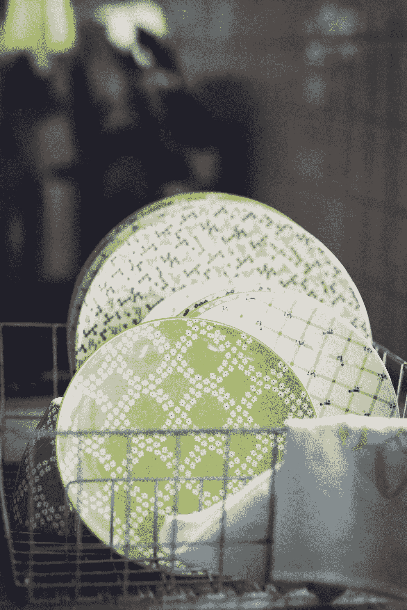

# 关于敏捷、特雷罗和思想的“干燥”

> 原文：<https://towardsdatascience.com/on-agile-trello-and-the-dryness-of-ideas-bf66985796cb?source=collection_archive---------14----------------------->

Photo by [Tracey Hocking](https://unsplash.com/@lazybonesaustralia?utm_source=medium&utm_medium=referral) on [Unsplash](https://unsplash.com?utm_source=medium&utm_medium=referral)

在我开始创建自己的预测分析产品的科技创业公司之前，我曾在咖啡馆、酒吧和餐馆做全职工作。科技初创企业的场景和热情好客相去甚远。但我最近的转变，从初创企业到收缩的数据科学角色，揭示了一些更令人震惊的对比。餐馆和公司都喜欢在真正“干净”的环境中工作。但在企业界，这种清洁实际上窒息了那些从事真正有创意和复杂项目的人，比如数据科学，而初创企业似乎在这方面蓬勃发展。

# ***清洁与干燥的区别***

在酒店业，你的工作是为人们创造一个享受食物和饮料的环境。卫生很重要。经理们的永恒妙语是“如果你有时间学习，你就有时间打扫”。让东西看起来非常干净，(桌子、餐具、玻璃杯、地板等)理所当然地占据了大量的注意力。

最近转向合同工，为一般的大公司客户管理数据科学项目，让我看到了另一种洁癖。一眼望去，大公司工作的数字空间和程序闪闪发光。光泽出现在每个方面，从完美的电子邮件签名，程序文档的完美模板，如“解决方案范围定义声明”，带有品牌页眉和页脚，文档元数据，归属所有者的超链接字段，目录号，截止日期等。在他们的文件共享系统中，目录中预装了一些文件夹，这些文件夹描述了项目每个可能阶段的所有可以想象的文件类型。但还是没有一个明显符合你现在要上传的文件。你必须点击几十个可能的目录和子目录(大部分都是空的)，才能找到一个既能找到又不会玷污系统完美状态的地方。

过了一段时间，我才停止责备自己，我在初创公司使用的工作流程是多么没有条理，看起来是多么“混乱”。就像一个优秀的服务人员一样，我的第一反应是认为清洁是一种普遍的美德。但是项目进行了几个月后，我意识到实际上清洁文化可能是完成真正好的工作的大部分困难的一部分，如果不是原因的话。

公司，尤其是他们的 IT、数据或创新部门，没有生产食品的工作。他们的工作是产生想法，并从中获取价值。有时是通过提供新的商品和服务，有时是通过提高现有流程的效率，有时是进入新的市场，或者更好地满足现有市场的需求。有没有可能创意需要在一个不像准备和提供食物和饮料的地方那么优雅的地方准备和提供？

简单的回答是肯定的。最好的想法来自原始的创意汤，它看起来并不纯粹。说好的想法是从一个乱七八糟的地方诞生的，这是在说真话。他们的品质最初并不明显，但经过大量的工作和精心的提炼和展示，他们变得如此。

酒店业也有相似之处。事实上，在所有最好的厨房和酒吧里都有很多乱七八糟的东西。然而，脏乱的部分总是发生在旨在控制和管理脏乱的阶段和系统中，因此最终产品最终完美呈现给顾客，并且始终保持良好的卫生。

反思我最近所看到的，我开始认为，企业对结构和秩序的痴迷实际上可能是扼杀大量好想法的原因。他们不知道如何在一件东西还处于不整洁的状态时就让它存在。模板、网关、标准和检查点系统有效地组成了一个自动免疫系统，旨在消除任何可能不健康的东西。问题是，它还扼杀了可能带来伟大新想法的创造性过程，并且在面对复杂项目时遇到了巨大的阻力，在这些项目中，下一步并不总是显而易见和常规的，包括数据科学。

这听起来像是不可避免的紧张。大公司抵制怪异、不干净或奇怪的想法，因为它们可能不卫生，并威胁整个系统的健康。小型初创企业孕育着各种古怪的想法。但是他们也经常死去，因为这些想法并不完全是好的，好的部分没有成功。

大型、笨重的组织有希望找到一种方法来平衡对强大而严格的卫生系统的需求，同时为做创新或挑战性的事情所需的杂乱无章的流程留出足够的创造性空间吗？我想是的，因为卫生不仅仅是清洁。

在酒店业，老手们都知道清洁与保持卫生同等重要，如果不是更重要的话。干燥。事实证明，不管一件东西有多干净，如果它是湿的，甚至是微湿的，并且允许它长时间保持这种状态，它不可避免地会产生某种可见的霉菌，或者有气味的臭味，并且必须重新清洁或处理掉。保持东西干净很容易。更微妙和普遍的敌人是持久的水分。就像那块被潮湿地折叠起来放在抽屉里的抛光布，或者是台面上的一个小扭结，它可以防止水溅出来。大量的卫生危害实际上与非常干净的东西有关。它们还没干。

我认为这是一个不言而喻的事实，即在许多大公司中管理程序和项目的闪闪发光、格式良好的文件。它们很干净，但不是干的。最近(一个客户)鼓励我将他们的一个项目启动文档中的一些文本复制到我正在做的一个报告中。但是我发现很难做到。章节标题(完美的项目符号)没有真正的意义。真正复杂的话题或问题被一笔带过。定义或列表通常是部分冗余的，相互矛盾的，或者没有定义最重要的东西。我有一个清晰的印象，那就是我正在读的东西是某人脑海中浮现的第一件东西，它可以被格式化以满足所有被认为是官方文件的“干净”标准。其实并不坏。这只是…嗯，这就是我们的工作，并没有激发信心。这让我想起了上周末放在架子后面的一品脱啤酒，湿湿的，从那以后就再也没用过了。完全干净，但里面仍然有一层凝结的雾气，还有一股淡淡的霉味，会破坏你对啤酒的渴望。

我认为，大公司实际上可以调整他们的流程来培养新的创意，并承担现有模板无法依赖的复杂流程。但是他们必须调整心态。对“清洁”的关注必须大幅转向“干燥”。你需要释放出许多仍然很乱、湿淋淋的想法，在它们被清理干净之前，把它们放在一个可以“晾干”的地方。

我说的干涸，是指他们需要得到持续的曝光或任何形式的曝光(批评、评论、也许是一个赞、投票、甚至表情符号、任何东西、任何东西),在他们打算适应任何形式的规定结构或通过任何验收标准之前。这就是 Trello、Slack 或其他现代协作和消息工具开始发挥作用的地方。在他们看起来准备好成为人们期待的特定事物之前，他们创造了一点空间来把事情公开。它们提供了创造、协调和容纳创造性混乱的空间。

# 人们尝试了几种方法，但都失败了

***传阅稿***

我怀疑，当带有标记的草案文件在被采纳前通过电子邮件传阅时，企业可能会为自己的透明和合作而沾沾自喜。这是一种高尚的努力，但完全是可悲的，就像一个酒保用擦桌子湿了的抹布擦酒类。是的，我知道你在努力打扫，但其实……(重重的叹了口气)。

一旦某样东西成了“草稿”，你就已经明确宣布了它应该是什么样的，并且有效地接受了所有的标准，即“最终”版本是必要的和充分的。你需要在那个阶段之前很久就开始表达你的想法。被认为是“干净”的东西并不意味着它是“好”的。大多数情况下，草稿会选择前者，这意味着后者。在你修改格式、调整措辞等之前，很久就要理清想法的好与坏，以及它们可能如何混合、融合或改编。

此外，如果你让一个人自己完成草稿，你现在已经让他们的自我和可用性在草稿中得到内在的提升。像‘不，我认为这是完全错误的角度，也许我们应该试试……’这样的评论再也不会出现了。被当成人身攻击的风险太大了，更不用说，这意味着所有的努力都白费了。

最后，很有可能分发列表太小了。如果它是一封电子邮件，它只发送给那些被认为需要或需要批准或输入的人，并且只由那些有足够时间阅读的人阅读。这两个群体的交集通常几乎不包含任何人。

***召集会议***

这很容易是项目管理和领导类型最常见的下意识反应，无论何时复杂性或混乱超过了他们最初的指示。一旦人们开始指出一些可能需要解决的紧张关系或问题，并且没有明显的答案，领导者会非常自豪地召集会议。能够利用人们的日记显然是对他们资历的一种安慰性的确认，这可能不是通过任何技术力量获得的。他们解决问题的妙招是把所有其他有能力和知识解决这个问题的人聚集在一个房间里，激励他们去解决这个问题。

总的来说，我还是喜欢开会。让人们交谈，尤其是面对面的交谈，在很多方面都有好处。但是对于困难的问题，这往往是不够的。会议的失败在于人们对会议的期望，一旦会议结束，我们就会有一个计划，知道该做什么。

难题的麻烦在于，包括像数据科学这样具有技术挑战性的问题，人们头脑中准备在会议上脱口而出的观点和知识通常不足以解决问题。你不能只是在房间里走来走去，获得每个人的观点，然后让正确的道路出现。

这并不意味着你抓错了人。对于真正复杂或技术性的项目，即使是非常有能力的人，即使是他们领域的专家，也不知道所有的事情。他们可能知道去哪里找，这就足够了，前提是你不要让他们在会议上当着同事的面当场给出一个即时的答案，而这个答案是你为接下来的几周设定路线的依据。

在数据科学会议上，经常会出现这样的情况，即最佳答案是什么，就像这样，我应该去调查一下。这可能包括去和其他一些人讨论，我们认为这些人对于会议的主要焦点来说是不必要的。或者，敏锐的技术人员会说‘等一下，我马上就有’，然后迅速搜索 google、Github、Stack-overflow 或其他地方以获得快速答案。也许这需要他们两分钟，但这仍然足以打破会议的流程，当答案到来时，每个人都在聊别的事情。

另一个常见的是，答案已经存在，并且“准备好”讨论。但这是一个列表。房间里的一个人已经仔细考虑过的清单，可能会引起另一个人的强烈兴趣，但每个人都不想(或不能)完成实际的项目。在会议真正开始之前，两人必须就此达成某种结论，把它分开，选出前三名，或者类似的事情。

因此，一个过早召开的会议的典型标志是一个结果，看起来像一个奇怪的杂七杂八的待办事项列表，一些技术，一些管理，要找出的事情，其他利益相关者要交谈，一个小团队处理一些事情并汇报的小型子会议...换句话说，所有应该提前完成的事情，都被推迟完成了。

为了避免这种令人不满意的结果，一位意志坚定的经理将犯下最大的错误，并在会议进行期间，在其他所有人都在场的情况下，开始记录结果/结论。这是一种极具破坏性的领导风格。这相当于要求房间里的每个人通过沉默来表示同意。这是锁定一个非常湿的、草率的想法的终极方法，并把它固定下来，这样它就永远不会被挑战。在那些关键的要点被写下来的时候，四处弥漫着一种意味深长的沉默，这是其他人的尴尬，他们要么脱口而出自己对提案的平庸有多么不满，要么在句号出现和下一个话题开始之前，被无法准确说出问题所在或提出更好的替代方案的挫败感所压倒。好的领导者应该给他们的员工时间来表达他们最聪明、最有建设性的异议。

***预定一个‘单口相声’***

再说一次，原则上我喜欢单口相声，但是它们的真正目的被那些试图弥补会议不足的项目经理们滥用了。这很快就变成了‘鉴于我留给你们的目标是多么模糊，我想每天都和你们大家*检查一下，督促你们确保你们仍然朝着我认为正确的方向前进’。是啊，当然。请到其他地方“清除阻挡者”。*

*单口相声应该只出现在 sprint 团队，而不是 scrum 团队。客户，甚至是项目经理和其他股东，都不应该被邀请。这是关于那些在战壕中工作的人，他们每天一次从自己的屏幕上抬起头来，看看其他人过得怎么样。有机会把他们的作品放在更大的画面中，在他们可以的地方提供帮助或建议，也许调整团队内的优先次序，以帮助更快地达到相同的固定目标。*

*你绝不会希望非技术股东接近这些会议。他们不能帮助解决技术人员实际面临的任何问题。他们能做的就是改变范围。他们通过改变目标来“帮助”。那一点帮助都没有。一旦开发人员或数据科学家团队被告知，每天都是一个机会，可以少做一些他们计划做的事情，而是做一些不同的事情，那么生产力就会开始下降。提供无限的移动目标的机会是对未能首先找到目标位置的最糟糕的补偿。*

# *敏捷的数据科学诀窍:在冲刺之间放慢速度*

*对于任何在解决方案中工作的项目，我都是敏捷的大力提倡者——对于成功的定义来说，空间太大或太复杂，以至于无法预先很好地定义。软件开发和数据科学是两个很有资格的学科。实际上，我认为数据科学更需要它，正是因为它主要涉及科学(发现关于外部现实的未知)，而软件仍然有重要的工程成分(将新事物带入现实)。*

*我承认我从未接受过任何正式的培训，但是我读过一些关于敏捷方法的文献。我推荐阅读由 Ken Schwaber 和 Jeff Sutherland 撰写的 Scrum 指南，作为一个主要框架的相当确定的起点。我发现这份文档非常简洁地说明了要做什么，但在解释为什么每一步都很重要方面却很糟糕。因此，它给人的感觉相当枯燥和教条，人们可能会试图只松散地应用某些部分，但一点点经验通常会证明，几乎所有元素背后都有一个重要的原因。*

*但只有一点我想认真对待。也许这只是数据科学中的一个问题，但是我从来没有发现“在前一个冲刺结束后，一个新的冲刺立即开始*”(强调是附加的)这个想法是实际的或者完全可以实现的。**

**我怀疑这可能是因为大部分数据科学项目实际上是一系列实验。你不能构建一个特性，然后转移到下一个。你正试图证伪一个假设，证明或否定某件事，或者更有可能确定一些概率上的自信，而你却没有能力做到这两者。下一个逻辑实验可能会完全不同，这取决于上一个实验的结果。**

**所以我的直觉(我不是软件开发人员，所以这只是直觉)是，在数据科学中，我们有更少的、概念性的产品积压，而不是我们希望看到的所有功能和特性的丰富、扩展的列表。(我们称之为项目积压，因为有时“产品”不是自然的终点)。这个项目有一个广泛的目标，但是接下来的逻辑步骤是什么，或者这个目标是否仍然是可实现的，或者是否如我们所希望的那样是可实现的，很少会在一个 sprint 之前就清楚了，并且通常即使是上一个 sprint 的结果也需要在下一个 sprint 开始成形之前进行一点消化。**

**如果这听起来很极端，我认为有必要强调一下，现实生活中的数据科学项目实际上与 Kaggle 竞赛完全不同。Kaggle 竞赛通常在一开始就有两个完美定义的东西:数据和标签。现实世界的数据科学项目，尤其是咨询/承包项目，通常两者都没有。他们通常从一种模糊的业务目标开始，如“节省运营成本”，或“更好地满足客户需求”，以及可用数据的手写描述。有时你听说所有的数据都准备好了，但是一旦你开始使用它，你就会发现所有的迹象，你收到的摘录实际上只是所有数据的一小部分。**

**我越来越相信敏捷工作流程中最有价值的部分是发生在冲刺阶段的部分。弄清楚下一步该做什么实际上是最难的，也是最重要的部分。**

**我已经采纳了一个普遍的规则，即冲刺评审可以而且应该在冲刺结束后立即进行，而冲刺计划应该是紧接在冲刺之前的会议。但是那两个会议应该*永远不要*在同一天。如果是的话，至少根据我的经验，你会遇到我前面提到的所有问题。你将被迫去处理那些首先浮现在脑海中的想法。没有人会有时间和空间尽可能地提出最好的批评或反建议。本质上，当你开始工作时，你将确保你关于下一步该做什么的想法是完全错误的。最轻微的不完美，看似良性的假设或简化，将随着 Sprint 的进行而恶化和变异，直到它们对 Sprint，甚至整个项目真正有害。**

*****创建一个垂直或倾斜的表面*****

**让想法得到适当的暴露和通风，直到坚实的想法出现的方法是让所有可能的想法以它们最辉煌的潮湿，凌乱，邋遢的状态，到我倾向于称之为某种“垂直表面”，或者至少是“倾斜表面”上。什么是“垂直表面”,这是最后一个酒店类比。**

**几乎在任何餐馆或酒店的任何酒吧下面，你都会发现一些看起来相当恶心的表面。冰箱的侧面，或者支撑架子的腿的背面，将会用啤酒和拖把水的飞溅来装饰，用咖啡渣或石灰木髓或其他东西来覆盖。但是，尽管它看起来并不吸引人，但它没有气味，也不会造成任何伤害。除了飞溅发生的几秒钟，表面一直保持完全干燥，因为多余的液体流到地板上，其余时间，一堆冰箱和啤酒冷却器的热旋转空气保持完全干燥。虽然表面仍然应该定期清洁，在最好的场地，足够的干燥实际上确保了即使是明显恶心的脏乱也不会导致任何真正危险的事情发生。**

**我认为这个概念有数字上的对等物。在社交媒体的各种订阅源或论坛上的帖子中，这些平台能够很容易地保持最受欢迎或最受关注的内容——在顶部附近浮动的项目，最不相关的项目很快就会消失。我认为创造一个“垂直”或至少“倾斜”的表面是创造空间的一个重要创新，在这个空间里，想法可以在混乱中形成和出现，而没有肮脏的东西也在混乱中产生危险的风险。**

**我目前的想法是，在一个数据科学项目中，Scrum 团队中的每个人(尤其是产品负责人)都应该在 Sprint 评审后尽快将他们关于下一步的所有想法放到某种垂直的平面上。一个松弛频道可能是好的，但目前我正在尝试与特雷罗。它没有自然地体现提要的倾斜/排序特性，但是我通过使用几个不同的列表复制了这种效果，适当地命名，这样一个可以是“头脑风暴”，另一个是“草稿待办事项”，等等。这个想法只是为人们创造一个空间，让他们可以毫无拘束地把所有想法放在桌面上，包括问题、异议、未知、对未来疯狂的渴望等等。然后，他们可以慢慢地形成清晰、明确的计划或清单，每个人都可以边看边评论。**

**老实说，我正在努力。尤其是公司客户，他们似乎有种麻痹的恐惧，害怕写下任何在某种程度上没有“完成”或“正确”的东西。它认为这就是文化。在会议上，未完成的事情可以自由表达。但是你写下的东西呢？？！天哪，在你仔细检查草稿十几遍并和你的上级确认之前，不要把这个放在心上。**

**这是一种愚蠢的文化，必然会阻碍任何真正优秀或复杂的东西的发展，在这种情况下，你可能需要许多其他真正聪明的人坐下来思考一些事情，然后他们才能发现缺陷，或者提出改进建议。但我是一个乐观主义者，并希望像 Trello 和 Slack 这样的东西是有用的工具，可以创造空间，让人们更多地用语言表达，但用书面形式表达。**

**我正在取得一些成功。在两天的过程中，我从一些客户端利益相关者那里获得了一些关于 Trello 的有意义的参与，包括一个以前从未使用过 Trello 的人。客户写下了他对 sprint 的期望的精彩描述。他写的时候，它完全没有定义，完全不可能执行，但它很好地描述了他希望看到的，并允许我充实所有的不确定性和中间步骤，这将是实现目标所必需的。我张贴了一个分类变量的直方图，一位主题专家说它将包含感兴趣事件的重要标志，以突出与该列中其他类似命名的标签的混淆。他核实了他的消息来源，并通过在图表下方发表评论来回复我进行澄清。完美。**

**我越来越相信，花几天时间在 Trello 或其他工具上研究出所有你能想到的东西，是有效的冲刺规划会议的必要前提。你应该为每个人都真正可能关心的话题预留见面时间，并且能够做出贡献。比如阐明意图、关于替代方向或权衡的重大决策。目的是让每个人都有最后一次机会表达自己的担忧，或者听取相关人员的意见，从而建立整个团队对计划的信任和信心。**

**如果你还在讨论事实、技术细节、填充列表、写下要点，那么你就是在浪费宝贵的会议时间。预计人们会脱离，一些超负荷的领导者不得不人为地将事情处理成一个可定义的结果，你甚至会在开始之前就让自己陷入一场失败的冲刺。在你把人们召集到一起之前，一个可行的计划的所有要素都应该已经摆在桌面上了。**

**所以我的建议是在冲刺之间花点时间。会议是好的，但还不够。想法需要一段时间来暴露，虽然仍然是一片混乱，以便干了一点。我认为在 Trello 或 Slack 上工作一两天提供了这种时间，以及一种合适的“倾斜”表面，这种表面可以比我认为过去可能做到的更好。固体的东西会粘在一起，而不干净的东西会流下来，变干，变得无害。当你的想法干了，那么你就可以把它们弄干净，为接下来的冲刺产生一个优秀的计划。**