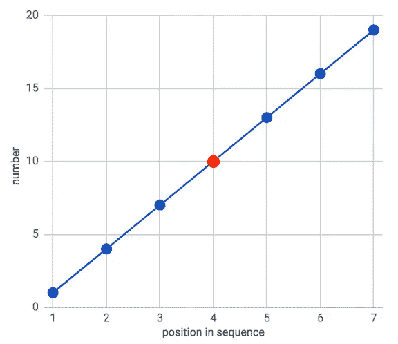
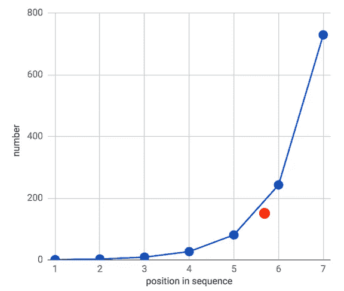
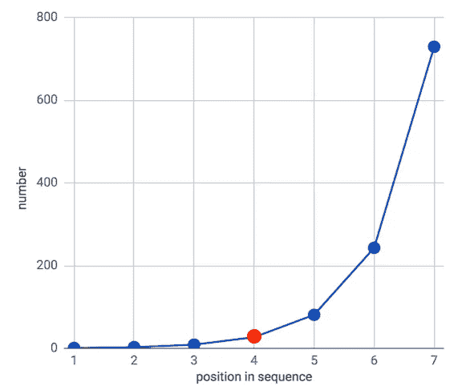
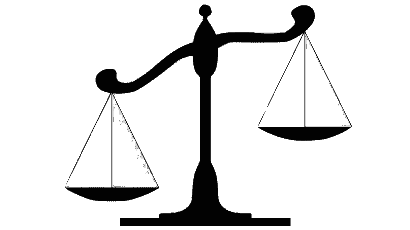
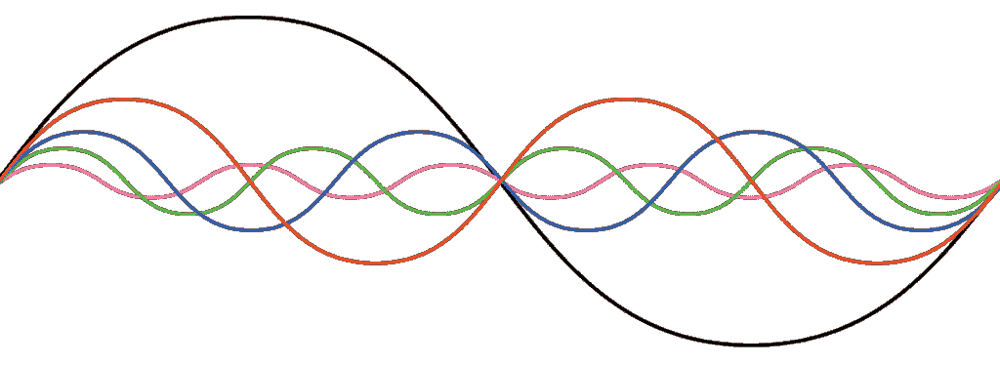
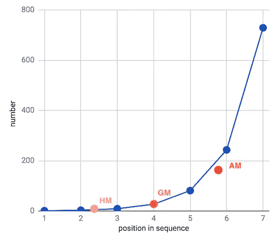

# 平均而言，你使用了错误的平均值:数据分析中的几何与调和平均值

> 原文：<https://towardsdatascience.com/on-average-youre-using-the-wrong-average-geometric-harmonic-means-in-data-analysis-2a703e21ea0?source=collection_archive---------0----------------------->

## 当意思不是你想的那样

# 前言

*(如果你已经搜索了“集中趋势”，跳过这一步)*

Comparison of the arithmetic, geometric and harmonic means of a pair of numbers *(via* [*Wikipedia*](https://en.wikipedia.org/wiki/Pythagorean_means)*)*

**这可能是最常见的数据分析任务:**

> 你有一堆数字。你想用更少的数字来概括它们，最好是单个数字。所以你把所有的数字加起来，然后除以数字的总数。嘣:看“**平均值**，对吧？

也许吧。

与普遍的看法相反，从数学上来说，*平均值实际上并不是一个东西。含义:**没有数学运算恰当地称为“平均”**。我们[通常所说的*平均*](https://en.wikipedia.org/wiki/Average) 就是“算术平均”，也就是上面所说的众所周知的运算。我们称之为“平均值”，因为我们希望它符合“平均值”的通俗定义:典型的、“正常的”或中间值。我们经常是正确的，但比我们想象的要少。*

## *汇总统计数据*

*算术平均值只是得出“平均值”的许多方法中的一种。更专业地说，这些被称为“[汇总统计](https://en.wikipedia.org/wiki/Summary_statistics)”、“[集中趋势度量](https://en.wikipedia.org/wiki/Central_tendency)”或“[位置](https://www.stat.berkeley.edu/~stark/SticiGui/Text/location.htm)度量”。*

*第二个最著名的*汇总统计*可能是**中值**，数据集的字面中间值(因此，通常比平均值更“平均”)。我不会在这里讨论这个问题，但足以说明的是，在许多情况下，当**中位数**更合适时，**算术平均值**被过度使用了。延伸阅读[此处](https://www.linkedin.com/pulse/20140715160509-29681087-median-vs-average-household-income/)，此处&此处(最后一个和本文其余部分有点重叠，很好)。*

*本文将重点介绍两个鲜为人知的度量:***&****谐音*** ***意为*** 。***

****第一部分**从概念上、直觉上&实际理解它们如何工作&何时使用它们。**

**[**第二部分**](/on-average-youre-using-the-wrong-average-part-ii-b32fcb41527e) 是一个单独的帖子&更深入一点&更技术性，用 R 代码演示各自的动态，真实&模拟数据&剧情。**

# **一.毕达哥拉斯的意思是**

****

**A geometric construction of the Quadratic and Pythagorean means (of two numbers *a* and *b*). via [Wikipedia](https://en.wikipedia.org/wiki/Pythagorean_means)**

****算术平均数**正好是 3 的 1’[毕达哥拉斯的意思是](https://en.wikipedia.org/wiki/Pythagorean_means)’(以研究他们比例的毕达哥拉斯&之流命名)。如前所述，**周正** & **谐音** **意为**圆出三重奏。**

**为了理解它们如何工作的基本原理，让我们从熟悉的算术平均值开始。**

## **等差中项**

***算术平均值*被恰当地命名为:我们通过*将数据集中的所有数字相加*，然后除以数据集中的所有数字(以便将总和降低到原始数字的比例)。**

> **`3 + 8 + 10 = 21
> 21 ÷ 3 = 7
> **Arithmetic mean** = **7**`**

**注意，我们在这里本质上说的是:*如果我们数据集中的每一个数字* ***都是同一个数字*** *，那么为了拥有与我们实际数据集相同的* `***sum***` *又会是什么数字呢？***

**但是加法没什么特别的。这只是一个相当简单的数学运算。当数字之间存在*加性*关系时，算术平均值可以很好地产生数据集的“平均”数字。这种关系通常被称为“*线性*”，因为当以升序或降序绘制时，数字往往落在一条直线上或直线周围。一个简单的理想化示例是数据集，其中每个数字都是通过将前一个数字加 3 而产生的:**

> **`1, 4, 7, 10, 13, 16, 19…`**

****

**因此**算术平均值**给了我们一个非常合理的中间值:**

> **`(1 + 4 + 7 + 10 + 13 + 16 + 19) ÷ 7 = **10**`**

****

**但是并不是所有的数据集都可以通过这种关系得到最好的描述。有些具有*乘法*或*指数*关系，例如，如果我们**将每个连续数字**乘以 3，而不是**将**加上 3，如我们上面所做的:**

> **`1, 3, 9, 27, 81, 243, 729…`**

**这就产生了所谓的*(提示提示)。当按顺序绘制时，这些数字更像一条曲线，而不是直线。***

******

***在这种情况下，**算术平均值**不适合产生一个“平均”数来总结该数据。***

> ***`(1 + 3 + 9 + 27 + 81 + 243 + 729) ÷ 7 = **156.1**`***

******

***与我们数据集中的大多数数字并不十分接近。事实上它比 **5x** 的**中位数**(中间数)，也就是 **27** 。***

***当数据绘制在扁平数字线上时，这种偏斜更加明显:***

******

***那怎么办呢？***

***介绍…***

## ***几何平均数***

***因为关系是*乘*，为了找到**几何平均数**，我们乘而不是加所有的数。然后，为了将乘积重新调整回数据集的范围，我们必须取`*root*`，而不是简单的除法。还记得`*square root*`吗:需要平方的数才能得到我们感兴趣的数。***

> **`Square root of 25 = 5, because 5 * 5 = 25`**

**这是相同的想法，但我们需要找到将被提升到 7 次幂的数字来产生我们的乘积，而不是提升到 2 次幂(也称为“平方”)，因为我们的数据集中有 7 个数字，我们将它们相乘。这通常被称为`*n*th root`，其中`*n*`是数据集的大小。因此，我们需要找到`7th root`。**

**请注意，我们在这里所说的是:*如果我们的数据集中的每个数字* ***都是同一个数字*** *，那么为了拥有与我们实际的数据集相同的乘法***该是什么数字呢？****

**因此，我们数据集的几何平均值是:**

> **`1 * 3 * 9 * 27 * 81 * 243 * 729 = 10,460,353,203
> 7th root of 10,460,353,203 = 27
> **geometric mean** = **27**`**

****

**在数字行上:**

****

**在这种情况下，我们的几何平均值 ***非常类似于数据集的中间值*** 。其实相当于**中位数**。**

****注意**:几何平均值不会**总是**等于中值，只有在所有数字之间存在精确一致的乘法关系的情况下(例如，将之前的每个数字乘以 3，正如我们所做的)。真实世界的数据集很少包含这种精确的关系，但是对于那些近似这种乘法关系的数据集来说，**几何平均值**将给出比**算术平均值**更接近的“中间数”。**

## **几何平均的真实世界应用**

**事实证明，**几何平均**有许多实际用途，因为现实世界中存在大量的乘法关系。**

**一个典型的例子是:**

****复利****

****

**假设我们有`$100,000`，它为`5 years`每年累积不同的利率:**

> **`annual interest rates: 1%, 9%, 6%, 2%, 15%`**

**我们想走捷径找到我们的平均年利率，也就是 5 年后我们的总金额，所以我们试着“平均”这些利率:**

> **`(.01 + .09 + .06 + .02 + .15) ÷ 5 = .066 = **6.6%**`**

**然后我们将这个平均百分比插入到复利公式中:**

> **`Total interest earned = $100,000 * (1.066⁵ - 1) = $37,653.11
> Interest + principal = $37,653.11 + 100,000 = $137,653.11
> **Final total** = **$137,653.11**`**

**为了确保我们没有欺骗自己，让我们用长时间的方法来比较结果:**

> **`**Year 1**: 100,000 + (100,000 * .01) = 100,000 * 1.01 = $101,000`
> `**Year 2**: 101,000 * 1.09 = $110,090`
> `**Year 3**: 110,090 * 1.06 = $116,695.40`
> `**Year 4**: 116,695.40 * 1.02 = $119,029.31`
> `**Year 5**: 119,029.31 * 1.15 = $136,883.70`
> **

**发生了什么事？我们的捷径高估了我们的实际收入近 1000 美元。**

**我们犯了一个常见的错误: ***我们对一个乘法过程应用了加法运算，&得到了一个不准确的结果。*****

**现在让我们用**几何平均数**再来一次:**

> **`1.01 * 1.09 * 1.06 * 1.02 * 1.15 = 1.368837042
> 5th root of 1.368837042 = 1.064805657
> **Geometric mean** = **1.064805657**`**

**(**技术说明**:我们必须使用`1 + interest rate`作为几何平均数计算中的输入，因为这些是乘以本金值以产生每期应计利息金额的实际因数，并且*我们需要找到这些因数的平均值*。这有一个额外的好处，即使当出现负比率时，也可以避免负数，这是几何平均方程无法处理的【它也无法处理`0s`】。算术平均没有这个问题。无论我们使用利率本身还是`1 + interest rate`作为输入(然后从结果中减去`1`)都是一样的，因为它是加法而不是乘法。但是几何平均数会不一样，而且不对，如果不加`1`。)**

**将利率的**几何平均值**代入我们的复利公式:**

> **`Total interest earned = $100,000 * (1.0648⁵ - 1) = $36,883.70
> Interest + principal = $36,883.70 + 100,000 = $136,883.70
> **Final total** = **$136,883.70** exactly the same as the long method above`**

**这还差不多。**

**我们对正确的工作使用了正确的方法，得到了正确的结果。**

***几何平均还有什么用？***

****不同的比例或单位****

****

**几何平均数**的一个奇特的特点是**你实际上可以在*完全不同的尺度*上计算数字的平均值。**

**例如，我们想比较使用两种不同来源的两家咖啡店的在线评分。问题是`**source 1**`用的是`5-star`标尺&T2 用的是`100-point`标尺:**

> ***`*source 1*`*评分:*`*4.5*``*source 2*`*评分:* `*68*`***
> 
> ****`*source 1*`**评分:*【
> `*source 2*`**评分:* `*75*`******

***如果我们天真地对每家咖啡店的原始评分进行算术平均:***

> ******咖啡馆 A =*** `(4.5 + 68) *÷* 2 **= 36.25**` ***咖啡馆 B =*** `(3 + 75) *÷* 2 = **39**`***

***我们得出结论，咖啡店 B 是赢家。***

***如果我们对数字更了解一点，我们就会知道，在用算术平均值对它们进行平均之前，我们必须将我们的值标准化到相同的范围内，以获得准确的结果。因此，我们将`**source 1**`评级乘以`20`，使其从`5-star`等级变为`**source 2**`的`100-point`等级:***

> ****`4.5 * 20 = 90
> (90 + 68) ÷ 2 = **79**`****
> 
> ****`3 * 20 = 60
> (60 + 75) ÷ 2 = **67.5**`****

***所以我们发现**咖啡店 A** 是真正的赢家，与上面算术平均值的天真应用相反。***

***然而，几何平均数使我们能够得出相同的结论，而不必在尺度或测量单位上大惊小怪:***

> ******咖啡馆甲****=*`*square root of (4.5 * 68) =* ***17.5***` ***咖啡馆乙*** *=* `*square root of (3 * 75) =* ***15***`***

***瞧啊！***

*****算术平均值**在更大范围内受数字支配，这使我们认为**咖啡店 B** 是评级较高的商店。这是因为算术平均值期望数字之间的加法关系&不考虑比例&的比例。因此，在应用算术平均值之前，需要将数字放在同一尺度上。***

***另一方面，**几何平均值**由于其乘法性质，可以轻松处理不同的比例。这是一个非常有用的属性，但是**注意我们失去了什么**:我们不再有任何可解释的*标度*。在这种情况下，几何平均值实际上是无单位的。***

***即上述几何平均既不是`**17.5** 'out of' 100 points` 也不是`**15** 'out of' 5 stars`。它们只是相对比例的无单位数。(技术上来说，它们的尺度是原尺度的几何平均值，`**5** & **100**`，也就是`**22.361**`)。如果我们实际上想要相对于一些对我们有意义的尺度来解释结果，比如最初的`5`或`100-point`系统，这可能是一个问题。但是如果我们只是想知道两家咖啡店的收视率之间的关系，我们就可以开始了。***

> *****2018 年 7 月 14 日更新**:正如[由](https://medium.com/@mfernezir/thanks-for-an-interesting-article-it-was-a-nice-read-d31aa21ae9d5)[m laden fern eir](https://medium.com/u/ee9e607c5dd3?source=post_page-----2a703e21ea0--------------------------------)指出的，不能保证**几何平均值**将始终保持**算术平均值**在缩放值或归一化值上的排序，更不用说与其成比例了，正如我最初指出的那样。相反，它只是总结不同数字组之间关系的一种不同方式(尽管这种方式通常会在不同尺度上产生更“可信”的数值汇总)。所以再一次，谨慎的批判性思维对它的应用是必要的。***

*****几何平均重述** 至*TL；博士:****

*   *****几何平均值** *乘以*而不是*对*值求和，然后取`*n*th root`而不是除以`*n*`***
*   ***它本质上说:*如果我们数据集中的每个数字* ***都是同一个数字*** *，那么这个数字必须是* ***才能和我们实际的数据集有相同的乘法运算*** `***product***` *？****
*   ***这使得它非常适合于描述*的乘法关系，例如`rates` & `ratios`，即使那些比率在 ***不同的标度*** (即没有相同的`denominator`)上。(由于这个原因，它经常被用来计算金融& [其他指标](https://en.wikipedia.org/wiki/Human_Development_Index) /指数。)****
*   *****也有不利的一面**:有意义的*标度* & *单位*在应用几何平均值时可能会丢失，其*对异常值的不敏感性*可能会掩盖可能产生后果的大值。此外，它会产生与转换为单个刻度的值的算术平均值不一致的结果。***

***正如生活中的大多数事情一样，应用几何平均数几乎没有铁定的规则(除了复利之类的东西)。有一些试探法和经验法则，但是最终判断和科学怀疑是必需的，一如既往，对于[健全的经验主义](https://medium.com/@dnlmc/wtf-now-pt-2-whither-data-science-8632534aa750)。***

***在下面的结论中有更多关于这一点的内容，但是现在让我们介绍我们最后的**毕达哥拉斯的意思** …***

## *****调和平均值*****

******

***第三个也是最后一个毕达哥拉斯平均数。***

***这一节将比上一节短，因为调和平均数比几何平均数更深奥，但仍然值得理解。***

*****算术平均值**需要加法&**几何平均值**采用乘法，**调和平均值**采用[倒数](https://www.mathsisfun.com/reciprocal.html)。***

***你可能还记得，一个数字`***n***`的`reciprocal`就是`**1 / n**`。(如`5`的`reciprocal`为`1/5`)。对于已经是分数的数字，这意味着你可以简单地“翻转”分子&分母:`reciprocal of 4/5 = 5/4`。这是真的，因为`1 divided by a fraction`产生那个分数的`reciprocal`，例如`1 ÷ (4/5) = 5/4`。***

***另一种思考倒数的方式是:*两个数相乘等于 1*。所以在求一个数`***n***`的倒数时，我们只是简单地问:*我们必须与*`***n***`**相乘才能得到* `***1***`。(这就是为什么`reciprocal`有时也被称为*)的乘法逆运算。)*****

****那么，这个**调和平均值**可以用文字描述为:*数据集*的 ***倒数******算术平均值*******倒数*** *。******

***这里有很多相互翻转，但实际上只是几个简单的步骤:***

> ***`*1\. Take the reciprocal of all numbers in the dataset
> 2\. Find the arithmetic mean of those reciprocals
> 3\. Take the reciprocal of that number*`***

***在数学符号中，这看起来像:***

******

***来自[维基百科](https://en.wikipedia.org/wiki/Harmonic_mean)的一个简单例子:`1`、`4`、`4`的调和平均值为`2`:***

******

***note: the notation “**n**-¹” is one way of symbolizing “the reciprocal of ***n****”****

***注意，我们在这里说的是:*如果我们数据集中每个数字的***的倒数都是同一个数字* *，那么* ***是什么数字才能有同一个倒数***`***sum***`**作为我们实际的数据集呢？******

***(**注:**由于`0`没有`reciprocal`(没有什么可以乘以`0`到`= 1`)，所以**调和平均**也不能处理包含`0`的数据集，类似于**几何平均**。)***

***这就是管道的工作原理。 ***但是*** ***有什么好处呢？******

## ***调和平均值在现实世界中的应用***

***要回答这个，我们得回答:*倒数有什么用？****

***因为*倒数*像所有除法一样，只是伪装的乘法(伪装的加法)，我们意识到:**倒数帮助我们更容易地除以分数**。***

***比如什么是`5 *÷* 3/7`？如果你还记得小学数学，你可能会用`5`乘以`7/3`(`3/7`的`reciprocal`)来解出这个问题:***

> ***`5 *÷* 3/7 = 5/1 * 7/3 = 35/3 = 11 2/3 = 11.66667`***

***但是一个等效的方法是将数字`5` & `3/7`缩放到一个公分母，然后以正常方式除法:***

> ***`5/1 ÷ 3/7 = 35/7 ÷ 3/7 = 35 ÷ 3 = 11 2/3 = 11.66667`***

***同样，类似于使用**几何平均值**作为乘法或非线性关系`(see above)`的**算术平均值**，**，*调和平均值*帮助我们找到分数之间的乘法/除法关系，而无需担心公分母**。***

***因此，**调和平均值** *自然地* *容纳了几何平均值*之上的另一层乘法/除法*。*因此**在处理不同长度或时期的利率或比率(即分数)数据集时**很有帮助。***

> *****侧边栏*** *:(你可能会想:* ***“等等，我以为*几何平均数*是用来平均利息的*利率 *&* 比率*”*** *你说得没错。你也* [*不会先被*](https://stats.stackexchange.com/questions/23117/which-mean-to-use-and-when) [*这个*](https://www.quora.com/When-is-it-most-appropriate-to-take-the-arithmetic-mean-vs-geometric-mean-vs-harmonic-mean) [*这个*](http://economistatlarge.com/r-guide/arithmetic-harmonic-geometric-means-r) *给弄糊涂了。我自己开始写这篇文章来澄清我自己的想法。所以请原谅我，我希望通过下面的例子让这一点更加清楚&在下面这篇文章的结论中总结所有这些差异。)***

****平均行驶速度****

****

**在现实世界中使用**谐波手段**的典型例子包括以不同的速率(即速度)穿越物理空间:**

**考虑去一趟杂货店然后回来:**

*   **在去那里的路上，你全程都在开车**
*   **回来的路上，车流如织，你一路开车**
*   **你走了相同的路线，每条路都走了相同的路程(`**5 miles**`)。**

**在整个旅程中，你的平均速度是多少？**

**同样，我们可能会天真地将**算术平均值**应用于`**30 mph**` & `**10 mph**`，并自豪地宣称“`**20 mph**`！”**

**但是再考虑一下:因为你在一个方向上行驶得更快，你在那个速度下行驶的总时间更短，所以你在整个行程中的平均速度不是在`**30 mph**` & `**10 mph**`的中间点，它应该更接近于`**10 mph**` ，因为你在那个速度下行驶的时间更长。**

**为了在这里正确地应用**算术平均值**，我们必须确定以每种速率旅行所花费的时间，然后适当地加权我们的算术平均值计算:**

****行程在那里:(时速 30 英里)** `30 miles per 60 mins = 1 mile every 2 minutes = 1/2 mile every minute
5 miles at 1/2 mile per minute = 5 ÷ 1/2 = 10 minutes
**"Trip There" time** = **10 minutes**`**

****返回行程:(以 10 英里/小时的速度)** `10 miles per 60 mins = 1 mile every 6 minutes = 1/6 miles every minute
5 miles at 1/6 mile per minute = 5 ÷ 1/6 = 30 minutes
**"Trip Back" time** = **30 minutes**`**

**`**Total trip time** = 10 + 30 = **40 minutes**`**

**`**“Trip There” % of total trip** = 10 / 40 minutes = .25 = 25%
**“Trip Back” % of total trip** = 30 / 40 minutes = .75 = 75%`**

**`**Weighted Arithmetic Mean** = (30mph * .25)+(10mph * .75) = 7.5 + 7.5 = 15
**Average rate of travel = 15 mph**`**

**因此，我们看到我们真实的平均旅行率是`**15 mph**`，比我们用未加权的**算术平均值**得出的`**20 mph**`要低`5 mph`(或`25%`)。**

**你大概能猜到这将走向何方…**

**让我们用**调和平均值**再试一次。**

**`**Harmonic mean** of 30 and 10 = ...
**Arithmetic mean** of **reciprocals** = 1/30 + 1/10 = 4/30 ÷ 2 = 4/60 = 1/15
**Reciprocal** of **arithmetic mean** = 1 ÷ 1/15 = 15/1 = **15**`**

**瞧吧！**

**我们真实的平均行驶速度，*自动*根据每个方向花费的时间进行调整= **15 英里/小时**！**

********************

**[inorite](https://en.wiktionary.org/wiki/inorite)**

**请注意以下几点:**

*   **这仅仅是因为每次旅行的总距离是相同的。如果不同，我们就必须使用一个**加权调和平均值**，或者另一个**加权** **算术平均值**。**
*   **对于**算术平均值**的^，我们将再次通过*以每种速度行驶所花费的时间*来加权，而对于**调和平均值**我们将通过行驶的距离来加权(因为它已经通过取它们的倒数来说明了速率中隐含的时间比例)。**
*   **^**毕达哥拉斯的意思是**的许多狡猾和诡秘归结为****比率*** *&我们对比率的哪一面更感兴趣*。例如，**算术平均值**总是用分母表示。在行驶速度的情况下，比率是**英里每小时**，因此**算术平均值**根据其(有点隐藏的)分母**小时** : `**(30m / 1hr)+(10m / 1hr) ÷ 2 = 20m/1hr = 20 mph**`给出了一个结果。如果我们在每个方向花相同的时间旅行，这将是准确的，我们知道这是错误的。相反，**调和平均值**翻转这些比值，取它们的倒数，将我们实际感兴趣的数字放入分母，*然后*取算术平均值，再次翻转，&给出我们根据平均速度寻找的答案，与在该速度下花费的时间成比例。(关于使用财务**市盈率**比率的更深入讨论，请参见[本文](https://papers.ssrn.com/sol3/papers.cfm?abstract_id=2621087)。)***
*   ***几何平均数**对我们上面的复利例子有效的原因是利率在相等的时期内累积:一年。如果周期不同，也就是说，在每种利率下累积利息的时间长度不同，我们就不得不再次使用某种权重。*****
*   ***^**几何平均值**处理*乘法关系*，例如应用于不同评分等级的本金投资&比率的比率，而**调和平均值**则更进一步，通过*倒数*的魔力，轻松适应*另一层乘法/除法关系*，例如变化的周期或长度。***

***就像复利和几何平均数一样，这是一个精确、客观地应用调和平均数的例子。但是，事情并不总是那么清楚。还有其他精确的、数学上合理的[应用](https://en.wikipedia.org/wiki/Harmonic_mean#Examples)在物理、金融、水文&甚至(按照惯例)在[棒球统计](https://en.wikipedia.org/wiki/Power%E2%80%93speed_number)中。与数据科学更密切相关:它经常应用于机器学习模型评估中的[精度&召回](https://en.wikipedia.org/wiki/Harmonic_mean#In_other_sciences)。***

***但更多时候，这是一个判断，取决于对数据和手头任务的敏捷理解。***

***我将试着澄清和总结下面的要点。***

# ***第一部分结论***

******

***Back to where we started: A geometric construction of the Pythagorean means (of two numbers *a* and *b*)***

***回顾并明确我们已经展示的内容:***

> ******1。这三个毕达哥拉斯的方法是密切相关的，&每一个都可以表达为彼此的特例。******

***例如，我们看到:***

*   ***不同尺度上的*分数的**几何平均值**̵̵i̵̶̵s̵̶̵̵̶̵p̵̶̵r̵̶̵o̵̶̵p̵̶̵o̵̶̵r̵̶̵t̵̶̵i̵̶̵o̵̶̵n̵̶̵a̵̶̵t̵̶̵e̵̶̵̵̶̵t̵̶̵o̵̶̵有时可以保持**算术平均值**的排序，当这些值被标准化到一个公共尺度时****
*   *****调和平均值**相当于行程速率的**加权算术平均值**(其中值由行程花费的相对时间加权)***

***在**第二部分**(随后会有单独的帖子)中，我们将看到那些已经熟悉乘法变换的人应该清楚的东西:数据集的**几何平均值**等价于该数据集中每个数字的 [***对数***](https://en.wikipedia.org/wiki/Logarithm) 的**算术平均值**。因此，正如**调和平均值**仅仅是经过一些倒数变换的**算术平均值**一样，**几何平均值**仅仅是经过[对数变换](http://onlinestatbook.com/2/transformations/log.html)的**算术平均值**。***

***如果每个意味着只是另一个的变换或重构，那么这些变换如何交互&影响你的结果？***

> ******2。毕达哥拉斯的意思是符合严格的顺序关系。******

***由于各自的方程式:****调和平均值*** *总是小于* ***几何平均值*** *，后者总是小于* ***算术平均值*** 。****

***根据基础数据的分布情况，这三个平均值之间的距离会更近或更远。此规则的唯一例外发生在极端情况下，即数据集中的所有数字都是相同的精确数字，在这种情况下，所有 3 个平均值也是等价的。由此可见，**下面的** [***不等式***](https://en.wikipedia.org/wiki/Inequality_(mathematics)) **成立**:***

***`**harmonic mean** ≤ **geometric mean** ≤ **arithmetic mean**`***

***这些比例可以在本节开始的**毕达哥拉斯** (+二次)**意为**的几何描绘中观察到。***

***认识到这种关系有助于理解何时应用每种方法，以及对结果的影响。***

***为了更具体地说明这一点，让我们重温一下我们最初的加法和乘法数据集，每个数据集都描述了三种方法:***

*****加法数据集{** `*1, 4, 7, 10, 13, 16, 19…*` **}*****

******

***`**Harmonic mean** = 4.3
**Geometric mean** = 7.3
**Arithmetic mean** = 10`***

***显然，**几何** & **谐波** **意味着**似乎大大低估了这个线性、可加数据集的“中间值”。这是因为这些平均值对较小的数字比对较大的数字更敏感(使它们对较大的异常值也相对不敏感)。***

*****乘法数据集{** `*1, 3, 9, 27, 81, 243, 729…*` **}*****

************

***`**Harmonic mean** = 4.7
**Geometric mean** = 27
**Arithmetic mean** = 156.1`***

***在这里，**几何平均值**精确地位于数据集的顺序中间，而**调和平均值**仍然偏向低侧&**算术平均值**由于受到大的异常值的影响而严重偏向高侧。***

***要描绘一个由**调和平均值**很好地描述了中心趋势的数据集并不容易，所以我将继续…***

> ******3。有一些硬性规定，一些启发法&很大的判断余地******

*   ***为了对不同标度的*比率进行平均；使用**几何平均值**(或**标准化分数的算术平均值**)****
*   ***为了平均*连续期间的复合利率变化*:使用**几何平均数*****
*   ***为了平均不同时期或长度的*利率；使用**调和平均值**(或**加权算术平均值**)****
*   ***知道你对自己的哪一方面更感兴趣，以及申请哪一方面。**算术平均值**用*分母*表示，不管它是否可见。**调和平均值**允许您*反转*比率，以获得原始分子的答案。***
*   ***如果你的数据*显示一个加法结构*:算术平均值**通常是安全的*****
*   ***如果您的数据*显示乘法结构和/或有较大的异常值*:那么**几何平均值**或**调和平均值**可能更合适(正如**中值**一样)***
*   ***任何决策都有**陷阱&权衡**:使用**几何平均** - *数据集与* `*0*` *的*不能与**几何平均**或**调和平均**、& *一起使用****
*   ***更实际和更容易理解的是:
    -在存在大的异常值
    时使用**中值**-移除或限制异常值
    -使用**加权算术平均值**或统计变换，而不是深奥的**毕达哥拉斯方法*****
*   ***尽管 R 统计计算语言具有用于[矩阵求逆](https://www.statmethods.net/advstats/matrix.html) & [三次样条插值](https://www.rdocumentation.org/packages/stats/versions/3.4.3/topics/splinefun)的内置方法，但它没有计算简单的**几何**或**调和平均值**的原生函数，这可能表明它们的稀有性。*(谷歌工作表&然而 Excel 确实有)****

*****如果有一个 TL；对于这一整块，DR 应该是:*****

*****了解你的数据的性质&仔细考虑你用来描述它的汇总统计数据——否则“平均”来说就有出错的风险。*****

***请在下面用你自己的使用案例和经验来评论较次要的**毕达哥拉斯方法**(以及你可能在这篇文章中发现的任何错误！).***

****查看本帖的* [*第二部分*](/on-average-youre-using-the-wrong-average-part-ii-b32fcb41527e) *，该部分省略了概念叙述，有利于用真实的&模拟数据、分布、伴随 R 代码的图&对主题进行更简洁、更经济的&技术处理。****

***——
在推特上关注:[@ dnlmc](https://www.twitter.com/dnlmc)
LinkedIn:[linkedin.com/in/dnlmc](http://www.linkedin.com/in/dnlmc)
Github:[https://github.com/dnlmc](https://github.com/dnlmc)***

> *****2018 年 7 月 14 日更正:**这篇文章的前一个版本称“当这些值被标准化到一个共同的尺度时，*分数的*的**几何平均值**与**算术平均值**成比例”。[姆拉登·费尔南德斯](https://medium.com/u/ee9e607c5dd3?source=post_page-----2a703e21ea0--------------------------------) [指出](https://medium.com/@mfernezir/thanks-for-an-interesting-article-it-was-a-nice-read-d31aa21ae9d5)这不是真的。谢谢你的纠正！***