# 平均而言，你使用了错误的平均值——第二部分

> 原文：<https://towardsdatascience.com/on-average-youre-using-the-wrong-average-part-ii-b32fcb41527e?source=collection_archive---------2----------------------->

真实和模拟数据+使用 R & BigQuery 的汇总统计动态

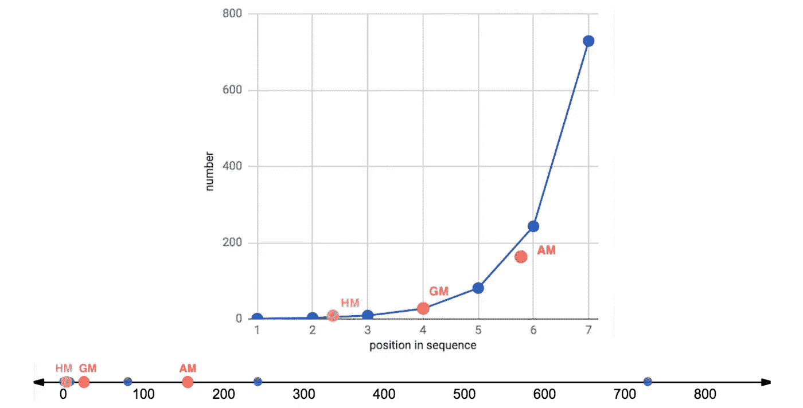

Depiction of harmonic, geometric & arithmetic means of a simple geometric series, from [Part I](/on-average-youre-using-the-wrong-average-geometric-harmonic-means-in-data-analysis-2a703e21ea0).

## 前言

[本系列的第一部分](/on-average-youre-using-the-wrong-average-geometric-harmonic-means-in-data-analysis-2a703e21ea0)构建了一个实用的&概念框架，用于在数据分析中使用鲜为人知的[勾股方法](https://en.wikipedia.org/wiki/Pythagorean_means)来理解&。我竭尽全力(大约 5000 个单词)为普通观众建立直觉，只需要小学数学知识。

这篇文章将会更深入一点&更具技术性，探索这些方法在更丰富的模拟数据集下的动态变化，这些数据集来自于几个概率分布。然后，我们将这些与一些可比较的“真实世界”大数据集并置。我的目标也是更简洁和经济，假设有更高水平的数学和概率理论。

## 毕达哥拉斯的意思是重述

回想一下，有 3 种毕达哥拉斯方法符合不等式:

> `**harmonic mean** ≤ **geometric mean** ≤ **arithmetic mean**`

只有在数据集中的每个数字都是相同数字的极限情况下，它们才是相互等价的。

*   `**arithmetic mean**`通过简单的加法&除法产生。
*   `**geometric mean**`是通过乘法&根产生的。
*   `**harmonic mean**`是通过倒数，加上&除法产生的。

他们的方程式是:


via [Wikipedia](https://en.wikipedia.org/wiki/Pythagorean_means)

因此，每一个都可以被导出或表达为彼此的重新配置。例如:

*   `**geometric mean**`就是数据集的对数转换值的`**arithmetic mean**`的反对数。它还可以*有时*保持缩放到一个共同分母的比率的顺序`**arithmetic means**`，或者至少产生类似的可信汇总值。
*   `**harmonic mean**`是数据集倒数的`**arithmetic mean**`的倒数。它也可以通过数据集的适当`**weighted arithmetic mean**`来再现。

经验法则:

*   `**arithmetic mean**`最适合于*加法*、*线性*、*对称*、*正态*/*高斯*数据集
*   `**geometric mean**`最适合于*乘法*、*几何*、*指数*、*对数正态*、*偏斜*数据集，以及不同尺度上的*比率* & *复合增长率*。
*   `**harmonic mean**`是三者中最罕见的，但就分子而言，它非常适合平均比率，如旅行率、一些财务指标&各种专业应用从物理学到数学&机器学习模型的[评估](https://en.wikipedia.org/wiki/Harmonic_mean#In_other_sciences)。

局限性:

*   由于相对罕见，`**geometric**` & `**harmonic**`的意思可能很难解释&误导观众期待“平均”更传统的含义
*   `**geometric mean**`实际上是“无单位”的，因为标度&可解释单位在乘法运算中丢失(因子在不同标度上)
*   `**Geometric**` & `**harmonic**`表示不能容纳≤ 0 的输入

更详细的讨论见[第一部分](/on-average-youre-using-the-wrong-average-geometric-harmonic-means-in-data-analysis-2a703e21ea0)。我们现在将看到一些实际操作。

## 模拟数据集

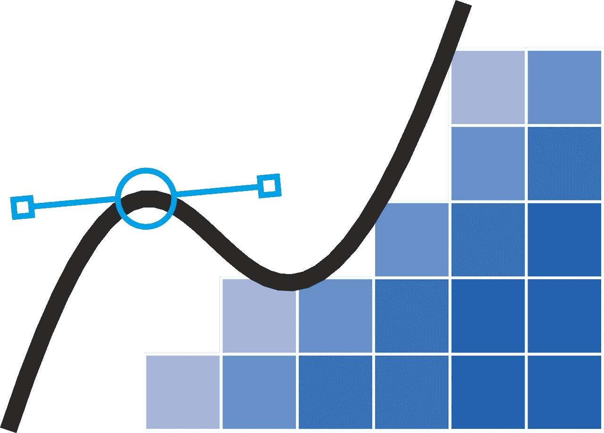

在第一部分中，我们观察了在平凡的加法和乘法数据集下勾股平均的动力学。在这里，我们将通过模拟 r 中各种概率分布的更丰富的数据集来扩展这个练习。

对于我们的*加法*或*线性*数据集，我们将从**随机正态**分布中抽取 10，000 个样本，平均值为 100 &标准差为 20，以避免抽取值≤ 0:

```
hist( 
  rnorm( 10000, 100, 20 ) 
  )
```

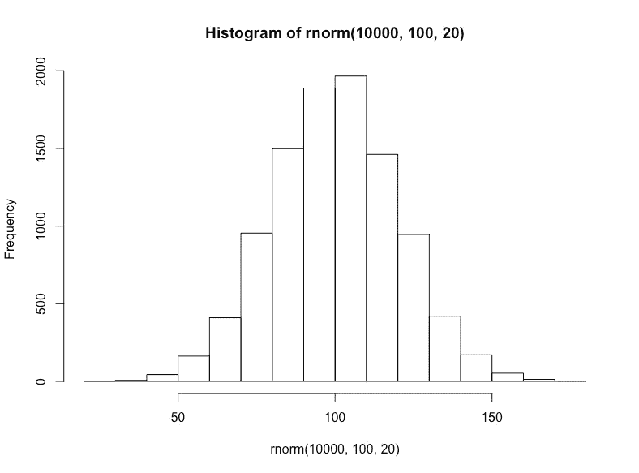

接下来我们将模拟三种类型的乘法数据集(尽管[有意义](https://en.wikipedia.org/wiki/Relationships_among_probability_distributions) [差异](https://projecteuclid.org/euclid.im/1089229510)，但它们通常[难以区分](https://math.stackexchange.com/questions/164436/difference-between-power-law-distribution-and-exponential-decay)):对数正态分布**、**指数分布**、&、**幂律分布**。**

有许多方法可以产生对数正态分布——基本上任何同分布随机变量的乘法相互作用都会产生对数正态分布——这就是为什么它在现实世界中如此频繁地出现，特别是在人类的努力中。为了简化&的可解释性，我们将简单地将[欧拉数](https://en.wikipedia.org/wiki/E_(mathematical_constant))提升到从**正态**分布中抽取的随机指数，然后加上 100，使其处于我们的**正态**分布的范围内:

```
hist(
  exp(1)^rnorm(10000,3,.9) + 100,
  breaks = 39
 )
```

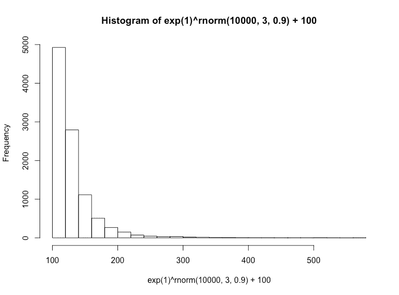

从技术上讲，这是一个**指数**分布的特例，但是我们将通过 R 的`rexp`函数模拟另一种变化，在这里我们简单地指定样本的数量&衰减率(同样，将结果加 100):

```
hist(
  rexp(10000, 1/10) +100
 )
```

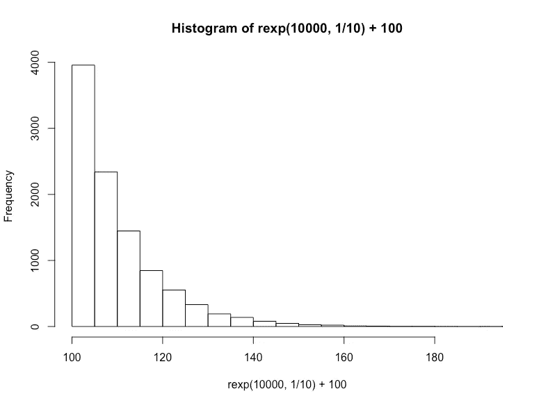

最后，我们将通过将样本从**正态**分布提升到常数指数(再次是欧拉数，保持其自然*)来生成**幂律**分布，然后加上 100:*

> *(注意，这与我们的**对数正态**方法相反，其中欧拉数是基数&分布是指数)*

```
*hist(
  rnorm(10000, 3, 1)^exp(1) + 100
 )*
```

*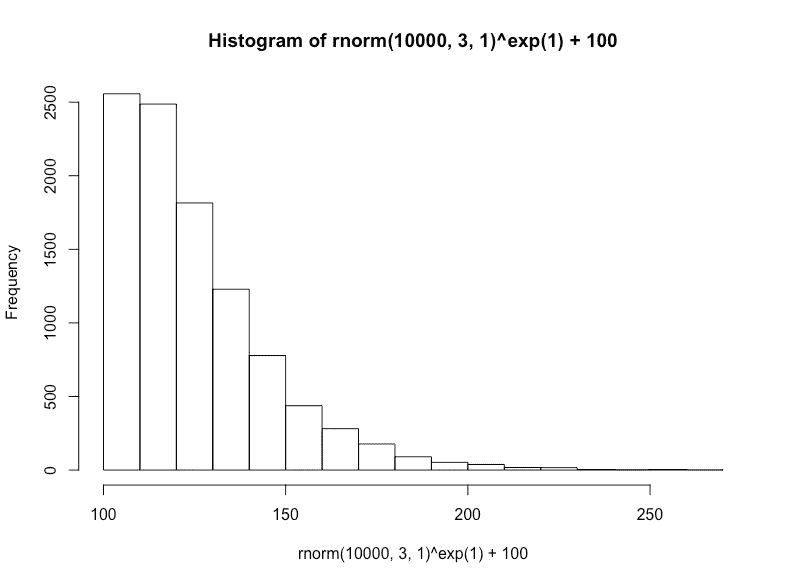*

*好了，现在我们将使用`**ggridges**`包来更好地绘制我们的分布图。我们还会加载`**tidyverse**`包，像文明用户一样:*

```
*library(tidyverse)
library(ggridges)*
```

*让我们把我们的分布放入一个有序因子表中:*

*现在让我们更巧妙的看看我们的发行版:*

*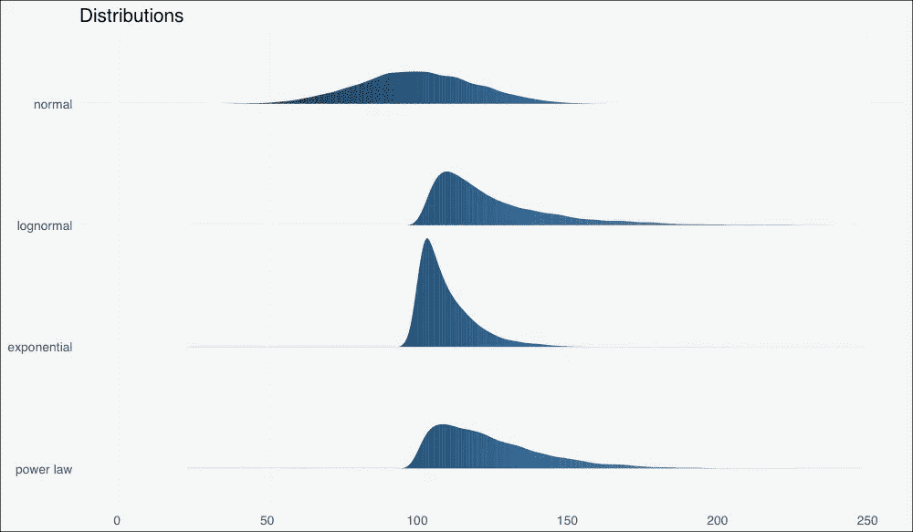*

*身材匀称的一群人。让我们计算一些汇总统计数据。*

**既然 R 本身没有* `***geometric***` *或者* `***harmonic***` *的意思函数，我们就要稍微狡猾一点:**

*输出:*

```
*# A tibble: 4 x 5
  distribution median    am    gm    hm
  <fct>         <dbl> <dbl> <dbl> <dbl>
1 normal         99.6  99.9  97.7  95.4
2 lognormal     120   129   127   125  
3 exponential   107   110   110   109  
4 power law     120   125   124   122*
```

*…并将它们添加到我们的图中:*

*(note: I did some post-production editing for the subtitle legend cuz I can never bend gglegends sufficiently to my will — & the median lines are a bit of a hack)*

*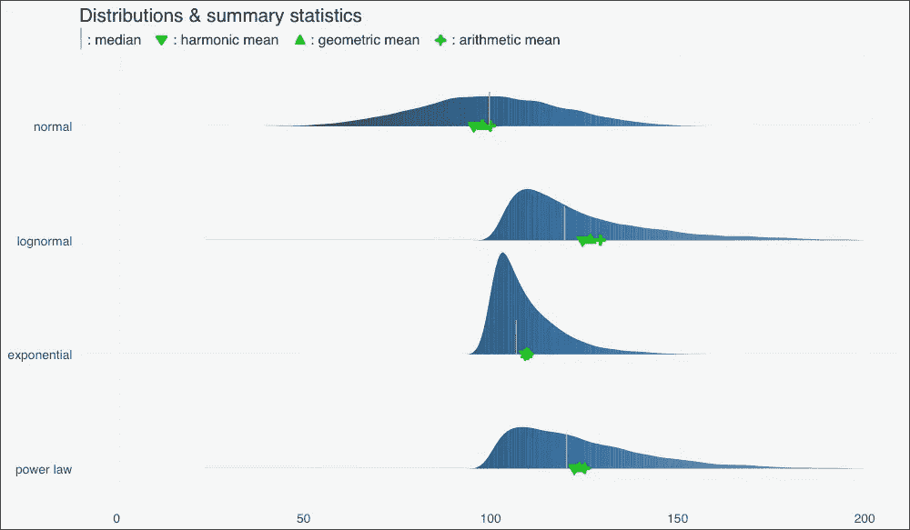*

*我们立即注意到偏斜密度以及[长&厚尾](https://en.wikipedia.org/wiki/Heavy-tailed_distribution)对均值分布的影响以及它们与中位数的关系:*

*   *在我们的**正态分布**中，`**median**` & `**arithmetic mean**`几乎完全相同。(`99.6` & `99.9`分别按上表输出)。*
*   *我们的其他分布的向右偏斜将所有的平均值拉向`**median**`的右边，这倾向于数据集的更密集的峰*

*虽然这里有点拥挤，但让我们通过调整 x 轴限制来仔细看看，又名`xlim()`:*

```
*...xlim(90, 150)...*
```

*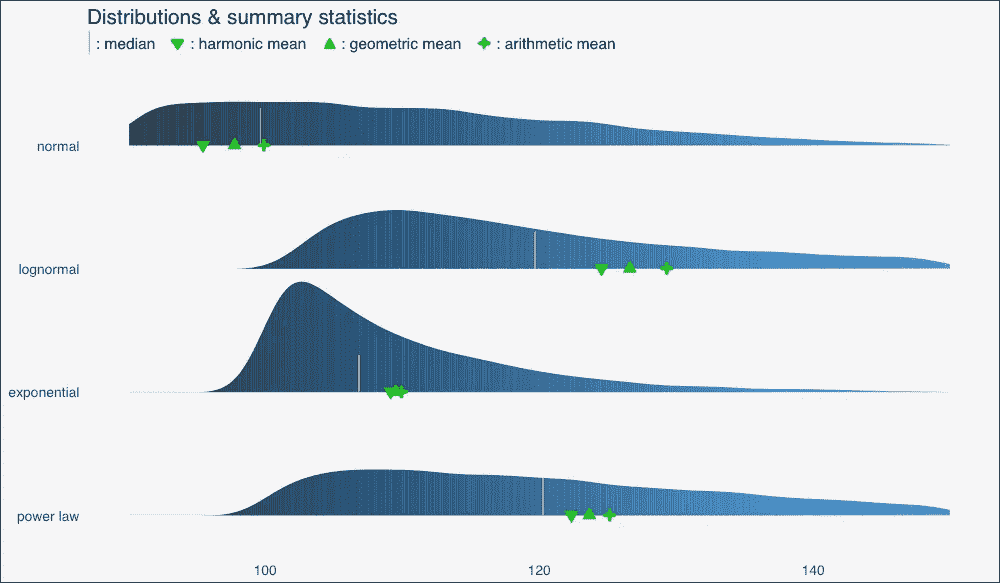*

*   *再次注意，在**正常**对称数据集中，`**geometric**` & `**harmonic**`意味着有意低估了数据的“中点”，但大致等间距(每个约相隔 2 个单位)。*
*   *在**对数正态**分布中，长(略细)的尾巴将均值拉离`**median**`所代表的有序中点很远，&甚至会扭曲均值的分布，使得`**arithmetic**`比`**harmonic**`离`**geometric**`更远。*
*   *在我们的**指数**分布中，值是如此密集&指数衰减的短细尾巴消失得如此之快，以至于我们的平均值也挤在一起——尽管严重的偏斜仍然将它们从`**median**`中移走。*
*   *我们的**幂律**分布衰减最慢，&因此尾巴最粗。尽管如此，它在“身体”中几乎是正常的，不对称分布的偏斜是最轻微的。它的平均距离大致相等，但仍远离`**median**`。*

*在**第一部分** &上面我提到的`**geometric**` & `**arithmetic**`的对数关系是指:*

> *`**geometric mean**`只是数据集的对数转换值的`**arithmetic mean**`的反对数。*

*为了证明这一点，让我们再看一下我们摘要统计表:*

```
*# A tibble: 4 x 5
  distribution median    am    gm    hm
  <fct>         <dbl> <dbl> <dbl> <dbl>
1 normal         99.6  99.9  97.7  95.4
2 lognormal     120   129   ***127***   125  
3 exponential   107   110   110   109  
4 power law     120   125   124   122*
```

*注意我们的**log normal**T5:`127`。*

*现在我们将计算*对数转换后的*值的`**arithmetic mean**`:*

```
*dist2$x %>% log() %>% mean()# output:
[1] 4.84606*
```

*…&然后拿那个号码的*反日志*:*

```
*exp(1)^4.84606# output
[1] 127.2381*
```

*就这样。*

*现在，为了让大家明白这一点，让我们来看看为什么会这样(为什么对数正态分布得名):*

```
*# subtract 100 we originally added before taking the log(dist2$x — 100) %>% log() %>% hist()*
```

**

*顾名思义，**对数正态**分布的*对数变换*产生了**正态**分布。因此，`**arithmetic mean**`的加法基在**正态**分布中产生的结果与`**geometric mean**`的乘法性质在**对数正态**分布中产生的结果相同。*

*我们不应该对经过对数变换的**对数正态**数据集产生的完美正态分布印象太深，因为我们指定了产生**对数正态**值的精确的[数据生成过程](https://en.wikipedia.org/wiki/Data_generating_process)，&实际上只是颠倒了该过程，以再现潜在的**正态**分布。*

*在现实世界中，事情很少如此整齐，生成过程通常更加复杂&未知或不可知。因此，关于如何建模的[困惑&争议](https://projecteuclid.org/euclid.im/1089229510)描述经验得出的数据集。*

*让我们来看一些这样的数据集&看看有什么大惊小怪的。*

## *真实世界数据*

**

*虽然通常不如我们的模拟分布温顺，但真实世界的数据集通常至少类似于上述四类中的一类。*

***正态**分布——被大肆宣传的“钟形曲线”——最常出现在自然&生物有机体&相互作用很少的场景中。身高&体重是典型的例子。因此，我的第一反应是寻找可靠的数据集。它满足了要求，但是关于`n = 50`(数据集中一种花的观察数量)还有一些不足之处。我在想*更大的*。*

*所以让我们加载`[bigrquery](https://github.com/r-dbi/bigrquery)`包，&做 *bigRqueries* 。*

*`library(bigrquery)`*

*谷歌的 BigQuery 提供了大量真实数据的公共数据集，有些非常大，从基因组学到专利再到维基百科的文章统计。*

*出于我们最初的目的，`natality`数据集看起来足够生物化:*

```
*project <- “YOUR-PROJECT-ID”sql <- “SELECT COUNT(*) 
        FROM `bigquery-public-data.samples.natality`”query_exec(sql, project = project, use_legacy_sql = F)*
```

**(protip:这里有很多数据，&你得到的* [*是按被访问的数据量收费的*](https://cloud.google.com/bigquery/pricing#free-tier) *，但是你每个月的第一 TB 是免费的。此外，尽管* `SELECT *` *由于显而易见的原因而被极力劝阻，但* `SELECT COUNT(*)` *实际上是一个自由操作，&是一个扩展事物范围的好主意)**

*输出:*

```
**0 bytes processed*
  f0_
1 137826763*
```

*这还差不多，1.37 亿婴儿记录。我们不太需要所有这些，所以让我们随机抽取 1%的婴儿体重，取前一百万个结果&看看我们得到了什么:*

```
*sql <- “SELECT weight_pounds
        FROM `bigquery-public-data.samples.natality`
        WHERE RAND() < .01”natal <- query_exec(sql, project = project, use_legacy_sql = F,
                    max_pages = 100)*
```

*输出:*

```
*Running job /: 7s:1.0 gigabytes processed
Warning message: 
Only first 100 pages of size 10000 retrieved. Use max_pages = Inf to retrieve all.*
```

*`hist(natal$weight_pounds)`产量:*

*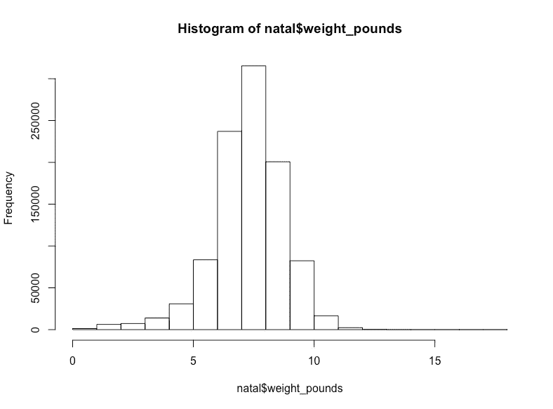*

***正常** af imo。*

*现在，为了找到一些有偏差的乘法数据，让我们超越生物学，进入社会学。*

*我们将查看 *New York* 数据集，其中包含各种城市信息，包括乘坐黄色&绿色出租车的出行。*

```
*sql <- “SELECT COUNT(*) 
        FROM `nyc-tlc.green.trips_2015`”query_exec(sql, project = project, use_legacy_sql = F)*
```

*输出:*

```
**0 bytes processed*
  f0_                                                               
1 9896012*
```

*不到 1000 万，所以我们来看看整个旅程的距离:*

**(这可能需要一段时间)**

```
*sql <- "SELECT trip_distance FROM `nyc-tlc.green.trips_2015`"trips <- query_exec(sql, project = project, use_legacy_sql = F)hist(trips$trips_distance)*
```

*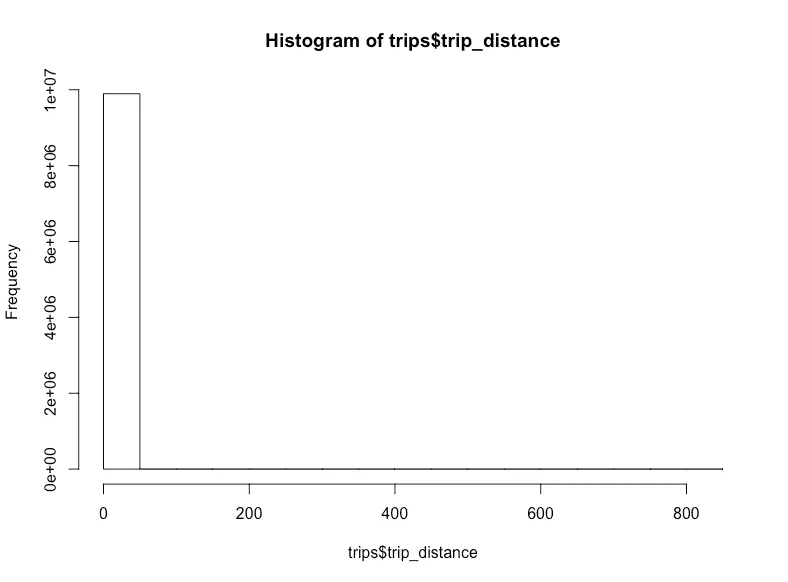*

*-_-*

*看起来有一些极端的异常值把我们的 x 轴拉到了 800 英里。糟糕的出租车之旅。让我们把这个范围缩小到 20 英里以内&再看一看:*

*`trips$trip_distance %>% subset(. <= 20) %>% hist()`*

*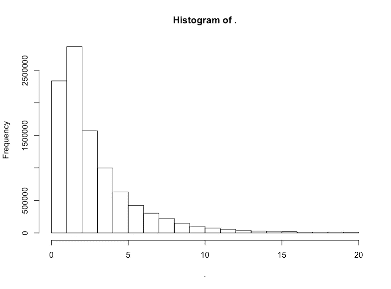*

*这就是我们，对数正态分布的一个警示标志:长尾*。让我们通过绘制日志直方图来检查数据的对数正态性:**

**`trips$trip_distance %>% subset(. <= 20) %>% log() %>% hist()`**

**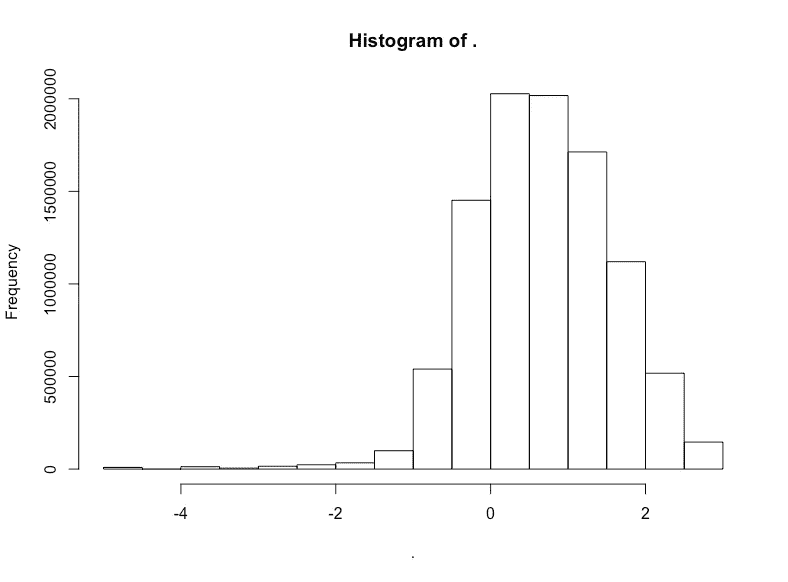**

**正常的*鱼*肯定，但我们超过了标记一点&现在观察到一点左歪斜。唉，现实世界又来了。但是可以肯定地说，对数正态分布在这里并不是一个完全荒谬的模型。**

**继续前进。让我们找到更多的[重尾](https://en.wikipedia.org/wiki/Heavy-tailed_distribution)数据，这次是在一个更接近我自己的数字网络分析专业亲和力的领域:Github 数据集:**

```
**sql <- "SELECT COUNT(*)
        FROM `bigquery-public-data.samples.github_nested`"query_exec(sql, project = project, use_legacy_sql = F)**
```

**输出:**

```
***0 bytes processed*
  f0_
1 2541639**
```

**250 万行。由于我开始担心我的本地机器的内存，我们将使用我们的随机采样器&百万行定界符来获得每个 github 库的“观察者”计数:**

```
**sql <- “SELECT repository.watchers 
        FROM `bigquery-public-data.samples.github_nested`
        WHERE RAND() < .5”github <- query_exec(sql, project = project, use_legacy_sql = F,
                     max_pages = 100)github$watchers %>% hist()**
```

**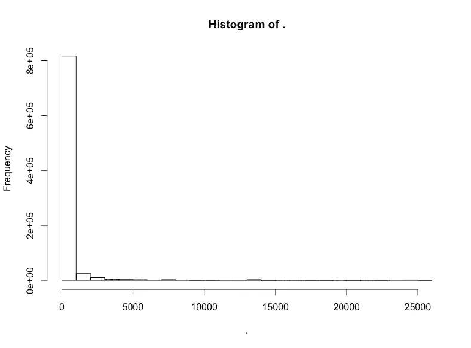**

**同样，极端的长尾动态，所以让我们做一些修整:**

**`github$watchers %>% subset(5 < . & . < 3000) %>% hist()`**

****

**指数 af。**

**但是又是 **lognormal** 吗？**

**`github$watchers %>% subset(5 < . & . < 3000) %>% log() %>% hist()`**

**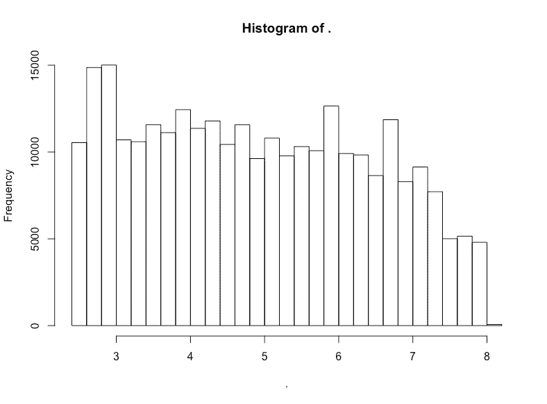**

**不要。**

**谁知那只稀有的野兽:[**分布**](https://www.vosesoftware.com/riskwiki/LogUniformdistribution.php)**！****

****让我们从大数据瓮中再抽取一个，这一次看几十个[黑客新闻](https://news.ycombinator.com/)帖子:****

```
****sql <- “SELECT COUNT(*)
        FROM `bigquery-public-data.hacker_news.full`”query_exec(sql, project = project, use_legacy_sql = F)****
```

****输出:****

```
*****0 bytes processed*
  f0_
1 16489224****
```

****…****

```
****sql <- “SELECT score
        FROM `bigquery-public-data.hacker_news.full`
        WHERE RAND() < .1”hn <- query_exec(sql, project = project, use_legacy_sql = F,
                 max_pages = 100)hn$score %>% hist()****
```

****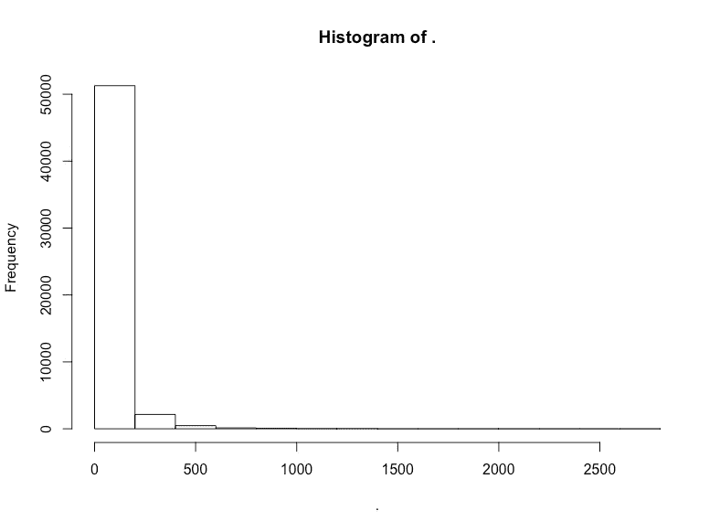****

****…****

****`hn$score %>% subset(10 < . & . <= 300) %>% hist()`****

****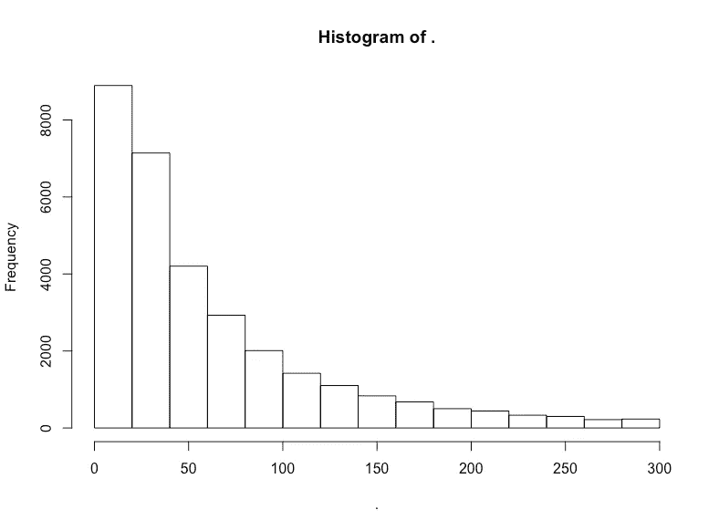****

****较慢的衰减(一旦修整)。至于对数变换呢？****

****`hn$score %>% subset(10 < . & . <= 300) %>% log() %>% hist()`****

****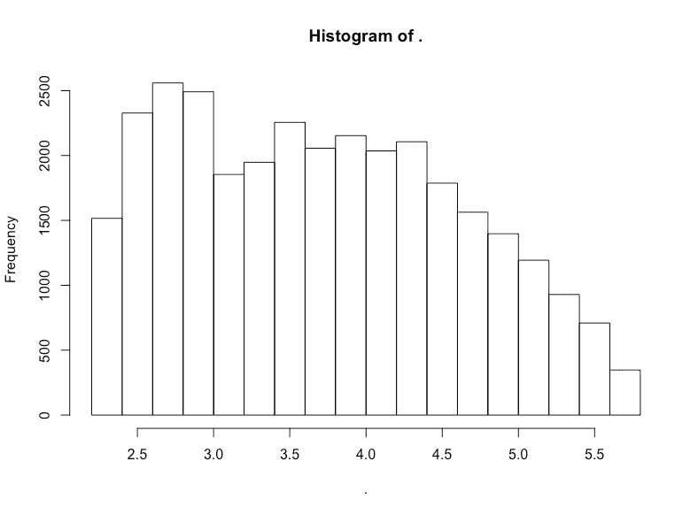****

****再次粗略地用向右衰减的**对数均匀化**。****

****我粗略地搜索了一下野外的**幂律**分布，结果证明毫无结果，这也许并不奇怪，因为它们最常出现在[网络科学](https://icon.colorado.edu/#!/)中(&，[似乎比最初声称的](https://www.quantamagazine.org/scant-evidence-of-power-laws-found-in-real-world-networks-20180215/)还要稀少)。****

****在任何情况下，让我们组织我们真实世界的数据集，就像我们对模拟分布所做的那样&比较性地绘制它们。我们将对它们进行归一化，再次将它们集中在 100 左右:****

****现在开始绘图:****

****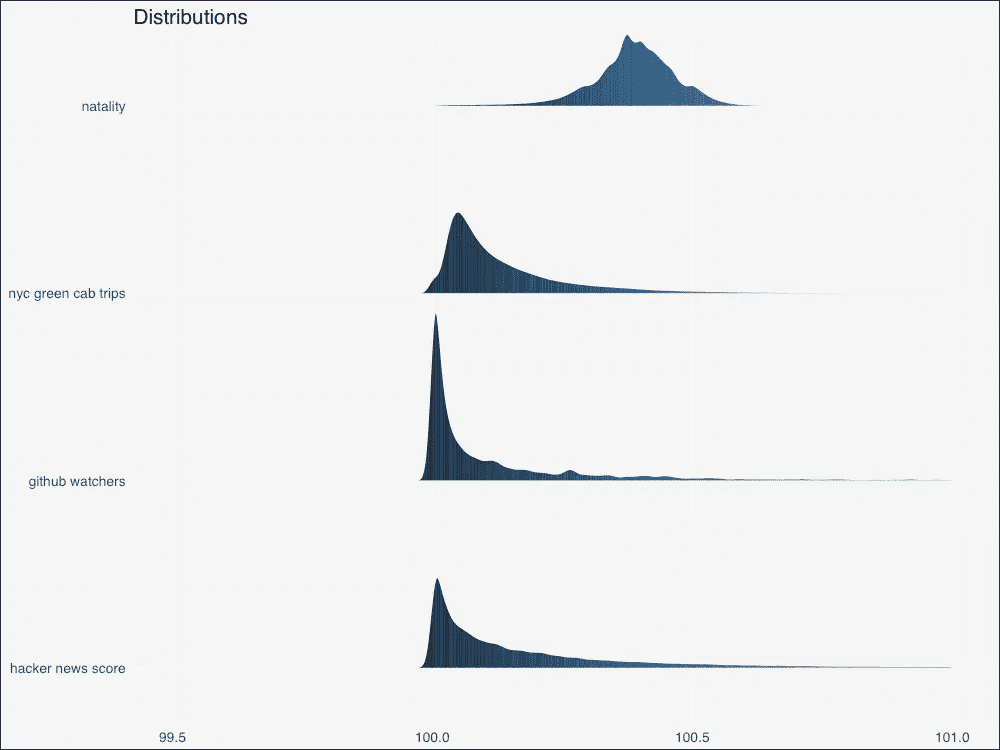****

****与它们来自的真实世界一样，边缘比我们模拟的分布要粗糙一些。仍然非常相似。让我们将它们与来自不可或缺的托马斯·林·彼得森的新(& excellent) [拼接包](https://github.com/thomasp85/patchwork)并排放在一起:****

****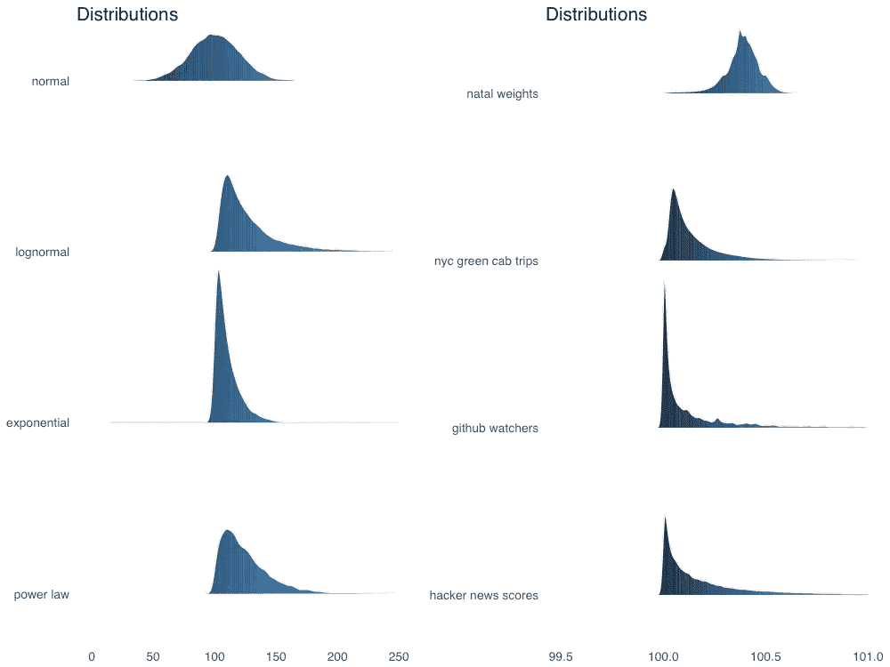****

****乍看之下，我们的模拟分布将为其相邻的真实世界数据集提供合理的模型，除了`**power law** -> **hacker news scores**`，其中衰减的凹度&尾部的权重有很大不同。****

****当然，还有许多更严格的模型拟合等测试，但让我们像以前一样，通过绘制分布的汇总统计来再看一看。****

> ****不幸的是，关于标准化的真实世界数据的一些东西干扰了我的汇总统计计算，它们都或多或少地彼此无法区分。我怀疑这与计算机在浮点运算上的挣扎有关(但也可能与我自己在算术上的挣扎有关)。在任何情况下，我们将不得不使用我们的非标准化的真实世界数据，这意味着我们将不得不单独绘制它们&尝试手动排列 ggridge 拼接。****

****首先编译我们的非标准化分布并计算汇总统计数据:****

****现在开始绘图(这很难看，因为我们必须为每个真实的分布创建单独的绘图，但是*拼接*允许我们优雅地定义布局):****

********

****有趣的是，我们真实世界的数据集汇总统计数据似乎比我们模拟的分布更加分散。让我们放大来仔细看看。****

****我不会转贴所有代码，但基本上只是修改了`pm1`，让`xlim(90, 150)` &取消了其余情节中`xlim()`行的注释:****

****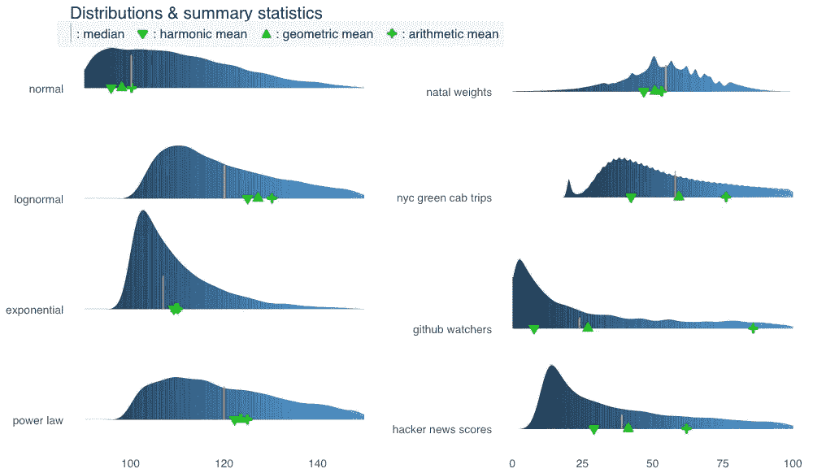****

****这里甚至更明显，但是对于正态分布:汇总统计动态差异很大，这应该让我们在容易地“目测”理想化模型与现实世界数据的拟合时暂停。****

****这就结束了我们在模拟的&真实世界分布下对**毕达哥拉斯意义**的探索。****

****如果您还没有，请查看[第一部分](/on-average-youre-using-the-wrong-average-geometric-harmonic-means-in-data-analysis-2a703e21ea0)以获得更低级、更明确的&直观介绍。参考资料见下文&进一步阅读。****

****还有，关注我更多这样的！****

****—
在推特上关注:[@ dnlmc](https://www.twitter.com/dnlmc)LinkedIn:【linkedin.com/in/dnlmc】T4Github:[https://github.com/dnlmc](https://github.com/dnlmc)****

## ****选择参考文献和进一步阅读****

******第一部分******

*   ****[https://en.wikipedia.org/wiki/Pythagorean_means](https://en.wikipedia.org/wiki/Pythagorean_means)****
*   ****[https://en.wikipedia.org/wiki/Summary_statistics](https://en.wikipedia.org/wiki/Summary_statistics)****
*   ****[https://en.wikipedia.org/wiki/Central_tendency](https://en.wikipedia.org/wiki/Central_tendency)****
*   ****[位置测量&展开](https://www.stat.berkeley.edu/~stark/SticiGui/Text/location.htm)”—stat.berkeley.edu****
*   ****"[中位数 vs 平均家庭收入](https://www.linkedin.com/pulse/20140715160509-29681087-median-vs-average-household-income/) " — LinkedIn****
*   ****"[平均收入 vs 中位收入](http://wkuappliedeconomics.org/indblogs/mean-vs-median-income-which-one-to-use-and-what-it-means-for-south-central-kentucky/)"****
*   ****你应该用几何平均数来总结数据****
*   ****”[哪个‘意思’要用&当？](https://stats.stackexchange.com/questions/23117/which-mean-to-use-and-when) " —堆栈溢出****
*   ****"[什么时候取算术平均值 vs 几何平均值 vs 调和平均值最合适？](https://www.quora.com/When-is-it-most-appropriate-to-take-the-arithmetic-mean-vs-geometric-mean-vs-harmonic-mean)”—Quora****
*   ****[算术，调和&几何意思同 R](http://economistatlarge.com/r-guide/arithmetic-harmonic-geometric-means-r)****
*   ****"[使用市盈率调和平均值来提高公司估值](https://papers.ssrn.com/sol3/papers.cfm?abstract_id=2621087) " —期刊文章****

******第二部分******

*   ****[https://en.wikipedia.org/wiki/Heavy-tailed_distribution](https://en.wikipedia.org/wiki/Heavy-tailed_distribution)****
*   ****[https://en . Wikipedia . org/wiki/Relationships _ inter _ probability _ distributions](https://en.wikipedia.org/wiki/Relationships_among_probability_distributions)****
*   ****[http://www . win-vector . com/blog/2010/02/living-in-a-log normal-world/](http://www.win-vector.com/blog/2010/02/living-in-a-lognormal-world/)****
*   ****"[幂律和对数正态分布生成模型简史](https://projecteuclid.org/euclid.im/1089229510) " —期刊文章****
*   ****"[幂律分布与指数衰减的区别](https://math.stackexchange.com/questions/164436/difference-between-power-law-distribution-and-exponential-decay) " —堆叠交换****
*   ****"[现实世界网络中发现的幂律证据不足](https://www.quantamagazine.org/scant-evidence-of-power-laws-found-in-real-world-networks-20180215/) " —量子杂志****