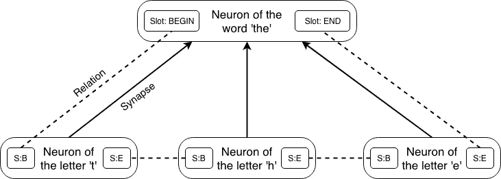

# 将符号推理集成到深度神经网络中

> 原文：<https://towardsdatascience.com/on-integrating-symbolic-inference-into-deep-neural-networks-22ed13ebbba9?source=collection_archive---------14----------------------->

## 是什么让生物神经网络如此优越于它们的技术对手？到目前为止，我们忽略了什么吗？

深度神经网络在过去几年里取得了巨大的成功。人工智能领域的许多进步，如识别现实世界的物体，流利地翻译自然语言或在世界级水平上下棋，都是基于深度神经网络的。然而，关于这种方法的局限性的报道很少。一个这样的限制是不能从少量的例子中学习。深度神经网络通常需要大量的训练样本，而人类能够从单个样本中学习。如果你给一个从未见过猫的孩子看一只猫，它可以根据这个单一的例子认出另一只猫。另一方面，深度神经网络需要成千上万的图像来学习猫的样子。另一个限制是不能根据以前学到的常识做出推论。当阅读文本时，人们倾向于对文本的可能解释进行广泛的推断。人类可以做到这一点，因为他们可以回忆起非常不同领域的知识，并将其应用到文本中。

这些限制表明，深层神经网络中缺少一些基本的东西。这是一种在现实世界中建立实体的符号引用，并将它们相互联系起来的能力。数十年来，形式逻辑形式的符号推理一直是经典人工智能的核心，但它被证明是脆弱而复杂的。然而，有没有办法增强深度神经网络，使它们能够处理符号信息？深度神经网络受到了类似人脑的生物神经网络的启发。本质上，它们是神经元和突触的简化模型，而神经元和突触是大脑的基本组成部分。其中一个简化是忽略了生物神经网络的尖峰性质。但是如果不仅实际激活一个神经元很重要，而且这个神经元什么时候被激活也很重要呢？如果神经元激活的时间点，建立了一个与这种激活相关的关系环境，那会怎样？举个例子，一个神经元代表一个特定的单词。如果每次这个词出现在文本中，这个神经元都会被触发，这难道没有意义吗？在这种情况下，峰值的时间将发挥重要作用。而且，不仅仅是单次激活的时间，神经元所有传入的脉冲相对于彼此的时间也是至关重要的。这个定时模式可以用来建立这些输入激活之间的关系。例如，如果代表特定单词的神经元对于该单词中的每个字母都有一个输入突触，那么重要的是，只有当字母神经元以正确的顺序相互激发时，单词神经元才会被触发。从概念上讲，这些定时差异可以被建模为神经元的输入突触之间的关系。这些关系也定义了神经元自身相对于其输入激活而触发的时间点。出于实际原因，允许一个神经元的激活有几个与其相关联的槽，比如一个单词的开头和结尾，可能是有用的。否则，单词的开头和结尾将不得不被建模为两个独立的神经元。这些关系是一个非常强大的概念。它们允许容易地捕获文本的层次结构或者将文本中的不同范围相互关联。在这种情况下，一个神经元可能指一个非常局部的信息，比如一个字母，或者一个非常广泛的信息，比如一篇文章的主题。

使用激活函数来近似单个神经元的放电率是关于生物神经网络的另一种简化。为此，经典神经网络使用 sigmoid 函数。然而，sigmoid 函数相对于大的正或负输入值是对称的，这使得使用该函数用神经元来模拟类似逻辑门的操作非常困难。另一方面，尖峰网络有一个明确的阈值，并忽略所有低于该阈值的输入信号。因此，ReLU 函数或一些其他非对称函数可以更好地逼近发射率。这种不对称对于处理关系信息的神经元也是必不可少的。当某个单词不出现时，代表该单词的神经元必须一直保持完全不活动状态。

此外，大脑皮层中存在不同类型神经元的事实在深层神经网络中被忽略了。两种重要的类型是主要具有兴奋性特征的棘锥体细胞和具有抑制性特征的棘星状细胞。抑制性神经元是特殊的，因为它们允许建立负反馈回路。这些反馈回路通常不会出现在深度神经网络中，因为它们向网络引入了内部状态。考虑以下具有一个抑制性神经元和两个兴奋性神经元的网络，代表单词“August”的两种不同含义。

这两种含义是互斥的，意味着网络现在有两种稳定状态。这些状态可能取决于两个兴奋性神经元的进一步输入突触。例如，如果单词“August”之后的下一个单词是潜在的姓氏，则实体神经元 August-(first name)的对应输入突触可以增加该状态的权重。现在更有可能的是，单词“August”将被归类为名字，而不是月份。但是请记住，这两种状态都需要评估。在更大的网络中，许多神经元可能通过负反馈或正反馈回路连接，潜在地在网络内创建大量的稳定状态。

由于这个原因，网络需要一个有效的优化过程来确定关于某个目标函数的最佳状态。这个目标函数可以是最小化抑制强烈激活的神经元的需要。然而，这些状态具有巨大的优势，它们允许考虑给定文本的不同解释。这相当于一个思维过程，在这个过程中，不同的解释被评估，而最合适的解释就是结果。幸运的是，对最优解状态的搜索可以被很好地优化。

在这些反馈回路中，我们需要抑制性神经元，因为否则所有相互抑制的神经元将不得不彼此完全连接。这将导致突触数量成倍增加。

通过负反馈回路，也就是说，通过简单地将负突触连接到它的前体神经元之一，我们突然进入了非单调逻辑的领域。非单调逻辑是形式逻辑的一个子领域，其中蕴涵不仅被添加到模型中，而且被移除。假设需要非单调逻辑来为许多常识推理任务得出结论。非单调逻辑的一个主要问题是，它经常不能决定哪些结论可以得出，哪些不可以。如果没有其他更可能的结论，它应该只得出怀疑或轻信的推论。这就是神经网络的加权特性派上用场的地方。这里，可能性较大的状态可以抑制可能性较小的状态。

## 结论

虽然深度神经网络已经走过了漫长的道路，现在正在提供令人印象深刻的结果，但它可能值得再看一看原始的人类大脑及其电路。如果像人脑这样一个内在复杂的结构被用作神经模型的蓝图，我们必须做出简化的假设。但是，这必须非常小心地完成，否则原作的重要部分可能会丢失。

## 参考

1.  [爱歌项目](http://aika.network)
2.  [使用元神经元从单个训练示例中学习事实](/using-meta-neurons-to-learn-facts-from-a-single-training-example-781ca0b7424d)
3.  [关于给神经网络增加负反馈突触](/on-adding-negative-recurrent-synapses-to-a-neural-network-25a28409a6f2)
4.  神经科学:探索大脑

马克·贝尔、巴里·康纳斯、迈克尔·帕拉迪索

5.[神经符号学习和推理:综述和解释](https://arxiv.org/pdf/1711.03902.pdf)

塔里克·贝索尔德、阿图尔·达维拉·加西亚、塞巴斯蒂安·巴德；霍华德·鲍曼、佩德罗·多明戈斯、帕斯卡尔·希茨勒、凯-乌韦·库恩伯格、路易斯·c·兰姆；丹尼尔·劳德、普里西拉·马查多·维埃拉·利马、利奥·德彭宁、加迪·平卡斯、潘海丰、格尔森·扎维鲁查

6.[深度学习:批判性评估](https://arxiv.org/pdf/1801.00631.pdf)

加里·马库斯

7.[非单调推理](http://www.informatik.uni-leipzig.de/~brewka/papers/NMchapter.pdf)

格哈德·布鲁卡、伊尔卡·尼梅拉、米罗斯瓦夫·特鲁什琴斯基