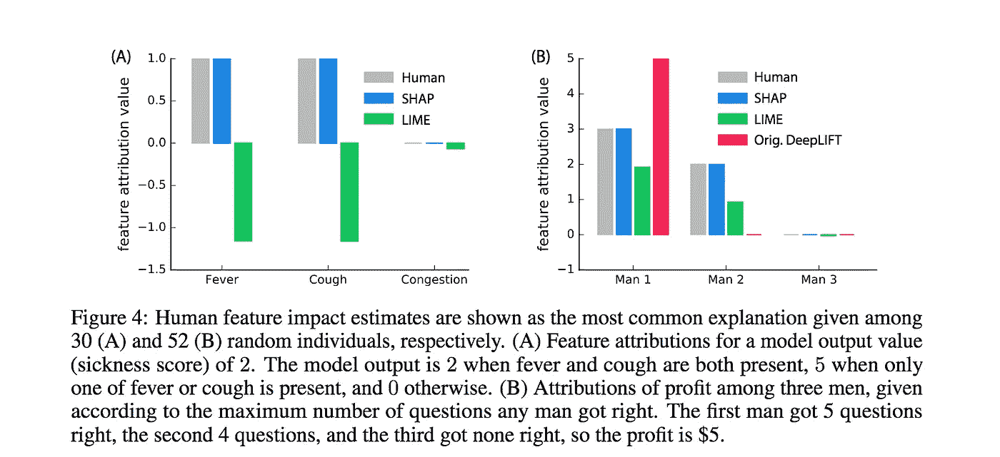

# 一种特征归属方法(假定)可以统治所有这些特征:Shapley 值

> 原文：<https://towardsdatascience.com/one-feature-attribution-method-to-supposedly-rule-them-all-shapley-values-f3e04534983d?source=collection_archive---------1----------------------->

在 NIPS 引起我注意的论文中，有一篇论文，它声称发现了一个框架，将几乎所有现有的模型解释方法连接在一起。在之前的一份工作中，我对模型解释领域产生了一点兴趣，因为法规要求我们解释为什么我们的模型会做出它们所拥有的决定。所以，我很好奇。

本文为去年发布的广受欢迎的 LIME 方法提出了一个替代核心，并声称只有它的方法才能满足可解释性的三个关键公理。

但是，在我们进入所有这些之前，让我们从最开始说起，在这种情况下，是在博弈论领域。

# 如果我们都合作，我们如何分配收益？

虽然 Shapley 值在这里是在特性的上下文中使用的，但它最初来自博弈论中的一个核心问题:在一个由拥有不同技能的多个玩家组成的联盟中，会产生一些集体收益，在玩家之间分配收益的最公平方式是什么？

你可以想象解决这个问题的一种方法是想象小组成员按顺序加入，并记录每个玩家的边际贡献。从表面上看，这是一个明智的提议，因为它意味着，从字面上看，每个球员都因他们对团队整体成果的贡献而获得奖励。(注意:这里我们假设可以计算任意规模玩家子集的博弈联合收益)。这里的想法是，如果艾娃是第一个成员，收益为 5，比尔加入使收益为 9，后来克里斯汀加入使收益为 11，那么玩家各自的收益将是(5，4，2)。

但是，我们有一个问题。如果克里斯汀和比尔有非常相似的技能组合会怎么样？然后，如果 Christine 在 Bill 之前加入团队，她可能会有更高的边际贡献，因为她会是第一个提供他们重叠技能集的人，然后当他加入时，他的边际贡献会更低；想象一下(5，1，5)的(艾娃，比尔，克里斯汀)的不同收益向量。实际上，如果每个人都同时加入了这个群体，我们应该如何决定这两种收益分布中哪一种是最正确或公平的呢？

这种困境是 Shapley 值形成的原因，Shapley 值可以从高层次上理解为“找到每个玩家的边际贡献，在玩家可能被添加到该组的每个可能序列上求平均值”。因此，在上面概述的例子中，你可以模拟到达的顺序:ABC，ACB，BCA，BAC，CAB 和 CBA，对于每个顺序，捕捉每个玩家的边际收益。然后，平均所有这些收益，你就得到每个玩家的 Shapley 值。

除了这种框架，还有另一种处理子集的数学框架。它稍微复杂一点，但是它是找到这些值的实际计算的基础，如果你想搜索整篇论文，这是一个必要的理解。

这里，这种方法不是直接处理序列，而是对不同的玩家子集进行处理，并根据这些子集所代表的所有序列的部分对它们进行加权。例如，想象你有 5 个球员，ABCDE。想象一下，你当前的目标是计算参与人 C 在一个序列中不同点的边际贡献。从那个角度来看，同时评价(A > B >C)和(B > A > C)是没有意义的，因为，*从 C* 的角度来看，A 和 B 进入哪个顺序并不重要。所以，我们可以只对 f(AB)和 f(ABC)的收益函数求值一次，然后跟踪 C 进来时增加了多少。

然而，因为这种方法的要点是平均所有**序列**的边际贡献，您需要根据它代表多少个序列来加权这个子集计算。正如我们已经提到的，这种计算适用于 ABC 和 BAC。然而，我们还需要考虑到可能出现在链末端的不同序列。具体来说，在这种情况下，您可以在添加 C 之后添加 DE 或 ED。所以，总的来说，这种“取 f(ABC)-f(A)的差”的计算适用于四个序列:ABCDE、ABCED、BACDE 和 BACED。

有了这种直觉，下面的等式就没那么可怕了。s！对应于集合 S 的排列数，或者，A 和 B 相加到这一点的方式数(2！= 2*1 = 2).因为|F|是联盟中付款人的总数，所以|F| — |S| — 1 表示对应于在玩家 *i* 之后要添加的玩家的数量，在我们的示例中对应于 D 和 e。同样，我们取这个值的阶乘来获得可以添加这些玩家的可能方式的数量。这两个量相乘在一起，然后除以全序列的置换序列总数:5！，在这种情况下。所以，满分 5 分！序列，这个特定的子集捕获了其中的 4 个，因此我们相应地对其计算进行加权。这只是意味着不要评估这 4 个不同的序列(我们知道它们会给出相同的结果)并尽职尽责地将它们各加 1/5！重量，我们一次全部加进去，4/5！体重。

Notation: |F| is the size of the full coalition. S represents any subset of the coalition that doesn’t include player i, and |S| is the size of that subset. The bit at the end is just “how much bigger is the payoff when we add player i to this particular subset S”

这个方法是[可证明的](http://www.lamsade.dauphine.fr/~airiau/Teaching/CoopGames/2011/coopgames-7[8up].pdf)唯一满足三个信用归属公理的方法:

1.  如果一个玩家从未增加任何边际价值，他们的收益部分应该是 0(虚拟玩家)
2.  如果两个玩家总是把相同的边际价值加到他们被加到的任何子集上，他们的收益部分应该是相同的(可替代性)
3.  如果一个游戏由两个子游戏组成，你应该能够将子游戏上计算的收益相加，这应该与整个游戏计算的收益相匹配(可加性)

# 等等，这个帖子不是关于特征归属的吗？

是的，回到那个问题:正如你可能从阅读上面的解释中所怀疑的那样，这篇论文的论点是，你可以将从对联盟有贡献的玩家中产生的相同直觉应用到对模型有贡献的特征的问题上。

在模型是线性的情况下，或者特征是真正独立的情况下，这个问题是微不足道的:不管其他特征的值，或者特征被添加到模型的顺序，给定特征的贡献是相同的。

为了直观地了解不会出现这种情况的情况，让我们想象一个简单的 ReLu 非线性，其中包含两个特征。

然后，假设平均而言，一个观察的输入值为 5。我们有两个二进制特征，X1 和 X2，其中每一个都有-4 的权重进入这个非线性。如果两个特性均设为 0，则该非线性的输出将等于 5。如果 X1 从 0 切换到 1，则输出变为 1 (max(0，(5–4))。然后，如果 X2 也被切换到 0，输出移动到 0 (max(0，1–4))，这意味着两个特性的相加对输出有不同的影响，即使它们在非线性中具有相同的权重。如果你改变想象的顺序，那么 X2 将输出移动 4 个单位，X1 移动 1 个单位。随着我们添加更多的功能，并有更多的复合非线性，这些复杂的影响会增加，这意味着有一种方法是有价值的，如 Shapley 值，考虑和加权所有这些不同的边缘值。

因此，我们得到了这个方法的一个公式，和玩家/联盟公式几乎一样。这里，M 是特征的全部数量，z’是一个向量，在该向量中存在正在解释的实例中存在的一些特征子集。(别担心:我们一会儿会谈到“在场”意味着什么)。而不是一个回报，我们取而代之的是评估一个模型的价值，在其他特征的某个子集上添加和不添加特征 I，然后根据它代表多少个序列来加权那个子集。

关于这个等式，有几个微妙的问题值得一问。

1.  那些小撇(如 x ')符号在做什么？在本文中，用撇号表示的东西意味着是特征向量的“简化”版本，这表示特征是“存在”还是“不存在”。因此，举例来说，如果你有一个简化的向量[0，1，1]，并希望将其传递到一个模型中，这将意味着“评估模型，就好像你只有特征 x_1 和 x_2，而 x_0 不存在。(注意:本文用一个映射函数 h(x') = x 来描述这一点，该函数在简化和非简化版本的向量之间进行映射)
2.  **“评估模型就像特征 x_0 丢失了”实际上是什么意思？**是的，这有点奇怪。大多数模型本身不能处理丢失的数据-它们处理浮点型数据，并且不能对文字空值进行操作-本文提出，对于特征在简化向量中“不存在”的情况，我们将其表示为该特征在整个数据集上呈现其期望值。这里的想法是，如果您想要模拟模型无法访问给定特性的信息值的情况，明智的做法是只向模型显示表示该特性值的未知最佳猜测值。
    这种想法的一个例子是，在你不知道某人的身高的情况下，用人口中的平均身高来代替，因为这是你对他们实际身高的最佳无信息猜测。虽然这种近似涉及一些我们知道可能是错误的数学假设(例如:模型是线性的)，因此在实践中肯定不是完美的，但它是一个合理的基线，易于计算。

# 近似的乐趣

我们上面概述的所有内容在概念上都很棒，但它有一个小问题:对一长串功能中的每个可能的功能子集进行采样非常耗时，尤其是在功能数量很多的情况下。对计算更合理的方法的渴望激发了寻找近似值的动力，这就是我们回到 LIME 的地方。

[LIME](https://github.com/marcotcr/lime) 是去年提出的一种方法，旨在通过选择可解释的特征(如上:代表特征“存在”或“不存在”的特征)采样来解释模型中的个体预测，然后建立一个专注于该实例周围局部区域的线性模型。这里的想法是:虽然一个模型在整体上可能是非常非线性的，但在一个特定的子区域中的线性近似可能更接近且更有用。实际上，这意味着您要拟合一个简单的线性模型，其中您试图预测的值是您的复杂模型的输出，并且系数与您的主模型的特征是否提供信息有关。因此，举例来说，如果一个特征在这个模型中有一个特别大的系数，这将意味着该特征的移除，或者用一个不提供信息的猜测来替换它，将极大地改变您的输出。

实现这种局部近似的方法是通过一种叫做内核的东西。在机器学习中，内核出现在很多奇怪的上下文中，它们让我困惑了一段时间，但在这种上下文中，你基本上可以把它们看作一个距离函数。它们接受两个向量，并返回一个度量值，该度量值对于被确定为高度相似的点是高的，对于不相似的点或较远的点是低的。如果你不习惯以这种方式思考，那么想到有不同种类的距离会显得很奇怪。在这里建立直觉的一个方法是考虑距离的绝对值与距离的平方。这两种都是测量点与点之间相似性的有效方法，但是它们意味着不同的假设:在后一种情况下，你更强烈地惩罚非常远的观察。

因此，在 LIME 中，通过置换输入向量对点进行采样，然后通过在样本和输入之间计算的某个核的值对这些样本进行加权，这意味着对与输入更相似的样本赋予更大的权重。

A useful visual intuition: the red cross is the instance being predicted

这种加权机制是将 Shapley 值方法与 LIME 方法联系起来的关键。还记得之前，我们将 Shapley 值的估计框定为计算复杂模型分数的变化，作为向子集添加特征 I 的函数，通过子集代表的序列数进行加权。以类似的方式，我们可以基于代表给定子集所占的特征添加序列数量的核，对我们的时间样本进行加权，时间样本包含我们试图预测的任何实例中存在的特征子集。在这个回归框架中，我们基于一些样本集来估计值，而不是精确地计算它们。这不是一个完美的估计，但它比试图完全采样所有子集的区域涉及更少的计算，这使它非常有吸引力。

该论文声称，与 LIME 相比，它的方法给出的结果更符合人类的直觉，即在给定的模型中，特征之间的信任应该如何共享。显然，这是一个小样本的例子，但我很好奇，看看这些解释是否在更广泛的数据集上有理想的属性。如果你想对你的数据进行实验，代码在这里。