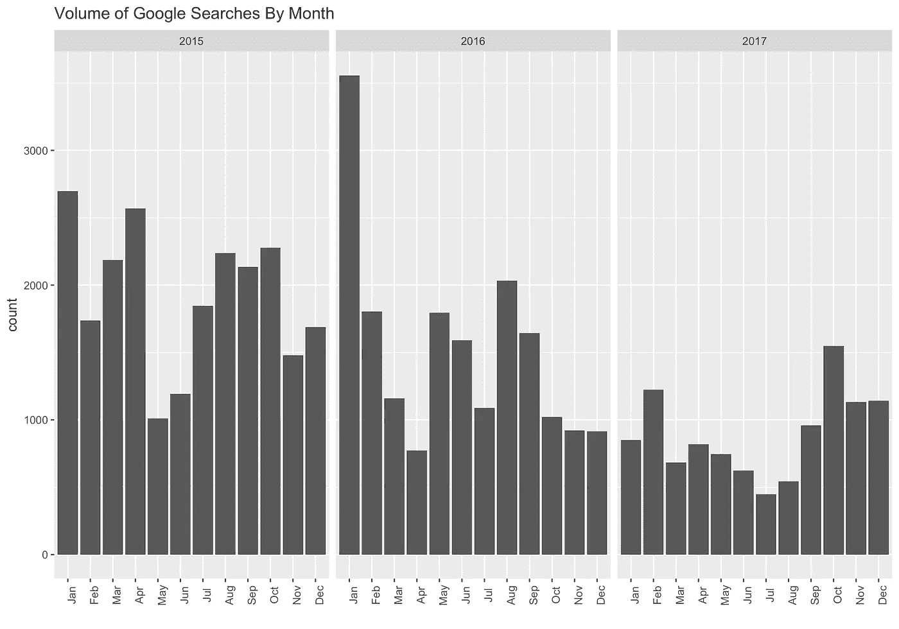
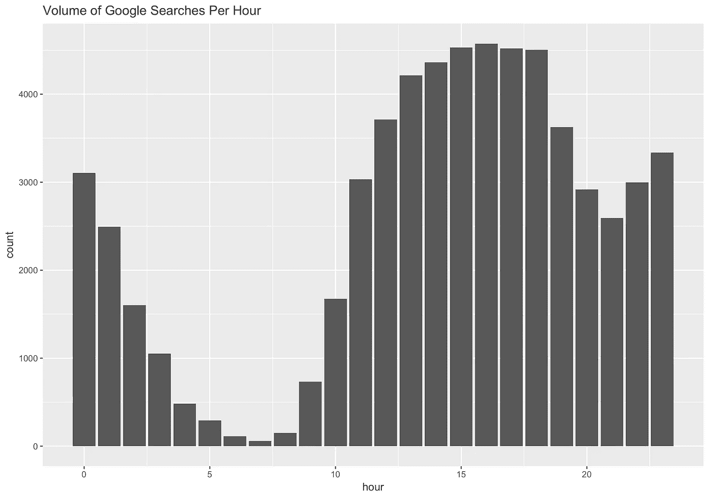

# 数字存在的在线模式

> 原文：<https://towardsdatascience.com/online-patterns-of-a-digital-being-ddf37be0483d?source=collection_archive---------14----------------------->

## 分析我的谷歌档案搜索数据

目前(2018 年 8 月)，西方国家关于电子记录和数据收集的集体良知处于最高点。有些人甚至可能会说，我们的意识已经稳定下来，因为我们不再每天都收到隐私更新电子邮件。由于新的数据保护政策在欧洲的实施，我敢肯定，你的收件箱是/曾经是充满了一般数据保护条例(GDPR)通知。世界各地的公司现在都在争先恐后地遵守法规，增加透明度。毕竟，脸书+剑桥分析公司的崩溃和谷歌自私的账本视频不久前才曝光。

现在，许多人开始质疑我们是如何走到这一步的，是否有出路，以及我们如何量化科技公司收集的数据的价值/成本( [Smith，2018](https://www.npr.org/2018/04/12/601759872/should-social-media-companies-pay-us-for-our-data) )。虽然像谷歌这样的公司收集各种数据(关于我们的一切联合国/想象不到的东西)，但他们也提供免费服务([《经济学人》，2017](https://www.economist.com/finance-and-economics/2017/08/24/the-free-economy-comes-at-a-cost) )。现在，一些人正试图打一场仗来收回他们的数据，这让我产生了一个问题——如果我们收回数据，我们会怎么做？所有这些思考让我想到了这篇文章的要点——分析你的谷歌数据。你可以在文章末尾找到所有关于如何挖掘你自己的数据的说明。

# 挖掘我的谷歌档案

这一努力始于一项练习，旨在吸引和鼓励参加我的商业分析课程的学生通过将他们的分析技能应用于他们的个人数据来学习 R。在这里，我将分享我从挖掘我的谷歌档案中发现的东西。我会在文末分享一个循序渐进的帖子。

## **搜索数据:从存档到一张表**

作为谷歌用户，我们不知道我们在这个平台上花了多少时间。时间戳给了我们很多关于谷歌搜索模式的信息。通过对时间戳、搜索类型和文本进行分类，可以创建一个简明的 google 存档数据数据集。*免责声明:只要谷歌不改变其交付用户档案或 html 代码的方式(scraper 的 2.0 版本)，这个 scraper 就能工作*。

## 数据分析:可视化谷歌搜索

为了对搜索量有一个总体的概念，让我们按年份来看搜索量。有趣的是，我的最高搜索量与我的研究生时代相符。更进一步，我相信我在 2013 年或 2014 年开通了这个谷歌账户(专业版)。从学生们做的谷歌挖掘中，我看到了开放 10 到 15 年的账户的数据。特别是来自中国的学生发现的另一个有趣的模式是，他们可以通过在特定时间段内缺乏搜索数据来追踪他们在中国和美国之间的所有旅行。

由于我迄今为止最多产的搜索年份是 2015 年、2016 年和 2017 年，我决定更仔细地研究它们。在夏季，搜索量明显下降，这是有道理的，而在学期的最后几个月，搜索量有所增加。

## 我能睡多久？

另一个有趣的指标是给定时间内的搜索量。令人惊讶的是，我的搜索高峰时间是在下午，从下午 1 点到 6 点。这种见解让我更仔细地考虑我的行为，以确定为什么我可能会在下午更多地使用谷歌。

每小时的搜索模式在一周的每一天都非常相似，如下图所示。我现在发现，周一我倾向于工作到深夜，我的搜索会超过午夜，并与周二的搜索重叠。

## 我周末可以休息吗？

虽然我假设任何谷歌搜索都只是为了专业或工作目的，但有趣的是，在我休息的日子里，搜索量只减少了大约 33%。这可能反映了与家庭作业相关的搜索，因为被分析的年份是我在研究生院的年份。我最活跃的日子是从一周的开始到一周的中间/结束(周四)，在周三达到高峰。我想知道其他人是否会有类似的结果。

## 按年份和工作日列出的搜索总数

当按年份和工作日比较完整的数据集时，很明显，到目前为止，我谷歌搜索最多的年份是 2015 年，这与我在学校的想法一致。

## 云这个词

谁不喜欢好词云？营销人员和商人喜欢它们。下面是我搜索的前 100 个单词的单词云，最低频率为 100。这些词通常反映了我作为数据科学家每天使用的软件堆栈。虽然 Enrico Bertini 可以为你提供世界云的许多其他更好的替代方案([拆开单词云](https://medium.com/@FILWD/taking-word-clouds-apart-alternative-designs-for-word-clouds-and-some-research-based-guidelines-df91129aa806))，但单词云似乎可以吸引商学院学生学习分析和编程的注意力。

我希望你对我的网上行为的探索感兴趣。随着分析的进展，我希望你注意到谷歌对我们的在线行为了解多少。请记住，这只是谷歌 46+产品网络中的一个产品的数据。希望这能激发你挖掘自己的谷歌数据的兴趣。你可能会发现有趣的个人行为模式，你可能会决定改变管理隐私设置的方式，谁知道呢——你甚至可能会决定早点睡觉。

这里是一个博客，一步一步的指导你如何分析你自己的谷歌搜索数据。

 [## 用 R 挖掘 Google 档案搜索数据

### 从你的在线行为中学习

medium.com](https://medium.com/@jlroo/mining-google-archive-search-data-with-r-51f4f76c2d21) 

## **来源**

史密斯，史黛西·瓦内克。“社交媒体公司应该为我们的数据付费吗？” *NPR* ，NPR，2018 年 4 月 12 日，[www . NPR . org/2018/04/12/601759872/should-social-media-companies-pay-us-for-our-data。](http://www.npr.org/2018/04/12/601759872/should-social-media-companies-pay-us-for-our-data.)

“自由经济是有代价的。”*《经济学人》*《经济学人》报 2017 年 8 月 24 日[www . Economist . com/finance-and-economics/2017/08/24/The-free-economy-comes-at-a-cost。](http://www.economist.com/finance-and-economics/2017/08/24/the-free-economy-comes-at-a-cost.)

Harris，“被认为有害的词云”，Niemanlab，2011 年 10 月 13 日，[http://www . nieman lab . org/2011/10/Word-clouds-considered-habital/](http://www.niemanlab.org/2011/10/word-clouds-considered-harmful/)

Bertini，e .“将单词云拆开”，Medium，2017 年 10 月 16 日，[https://Medium . com/@ FILWD/Taking-Word-Clouds-Apart-alternative-designs-for-Word-Clouds-and-some-research-based-guidelines-df 91129 aa 806](https://medium.com/@FILWD/taking-word-clouds-apart-alternative-designs-for-word-clouds-and-some-research-based-guidelines-df91129aa806)

5 月 17 日，The Verge。2018，[https://www . the verge . com/2018/5/17/17344250/Google-x-自私-账本-视频-数据-隐私](https://www.theverge.com/2018/5/17/17344250/google-x-selfish-ledger-video-data-privacy)

斯蒂芬斯-达维多维茨(2017 年)。*每个人都在撒谎大数据、新数据以及互联网能告诉我们关于我们到底是谁的信息*。纽约州纽约市:戴街。