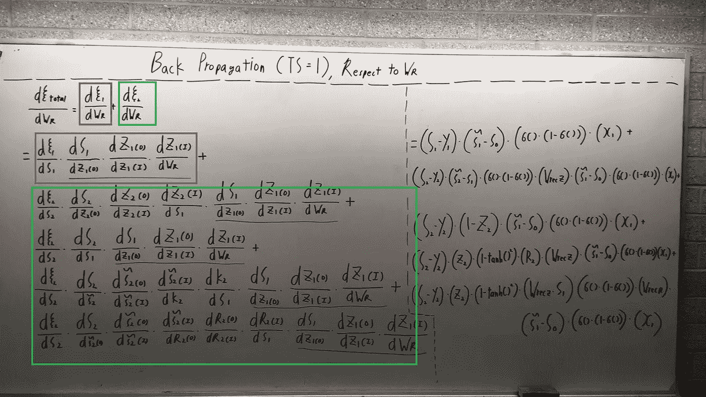
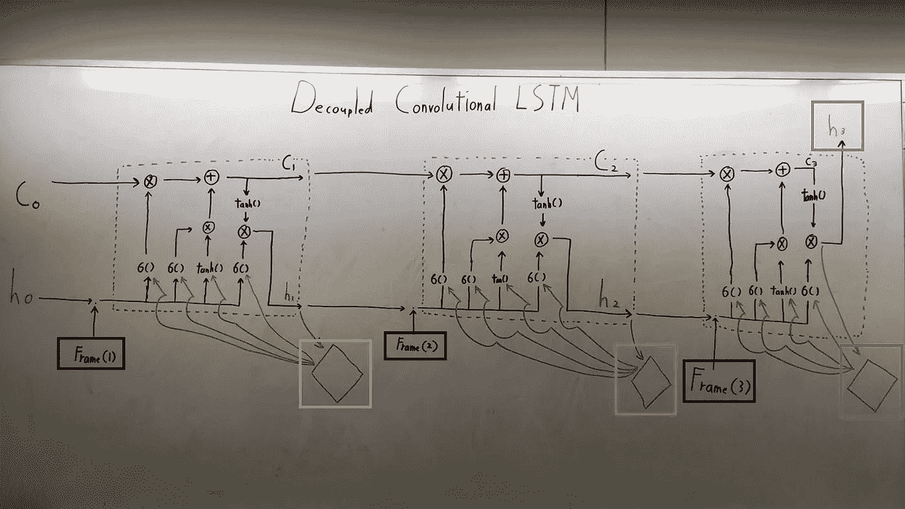
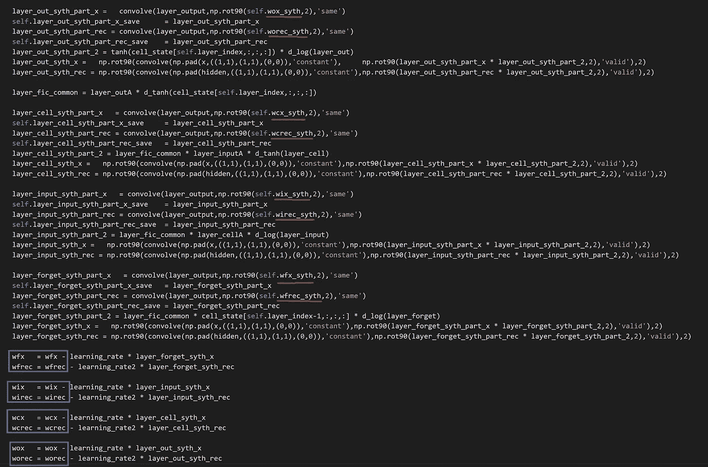
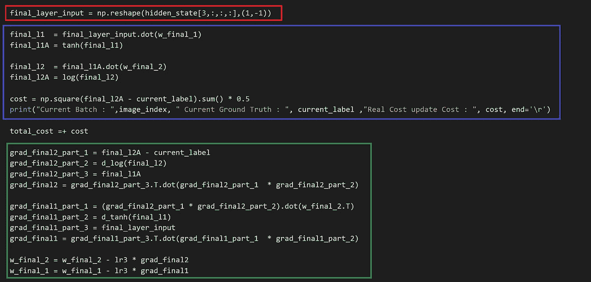
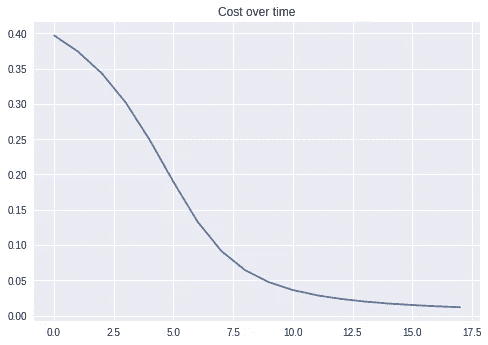
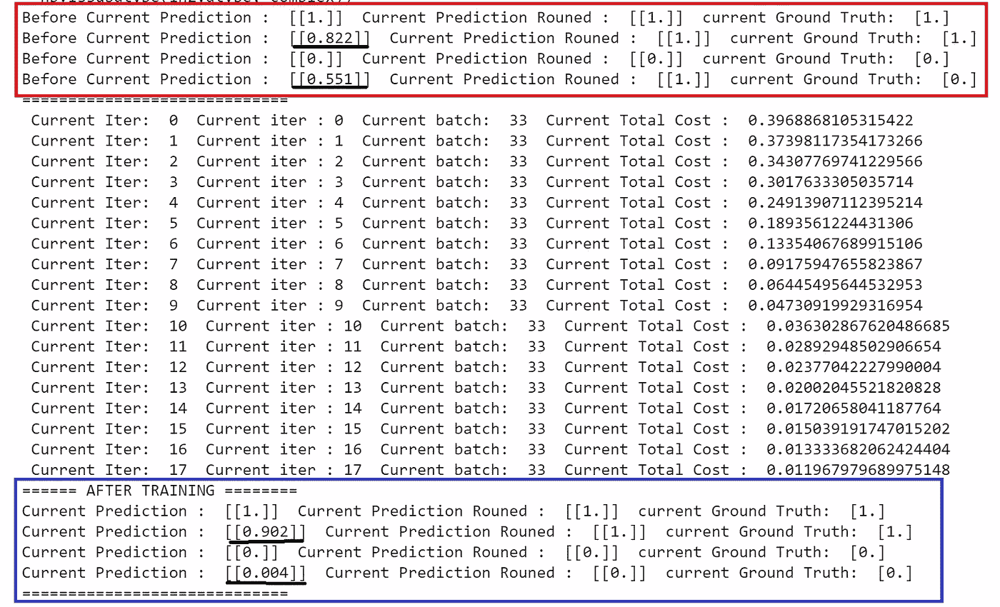
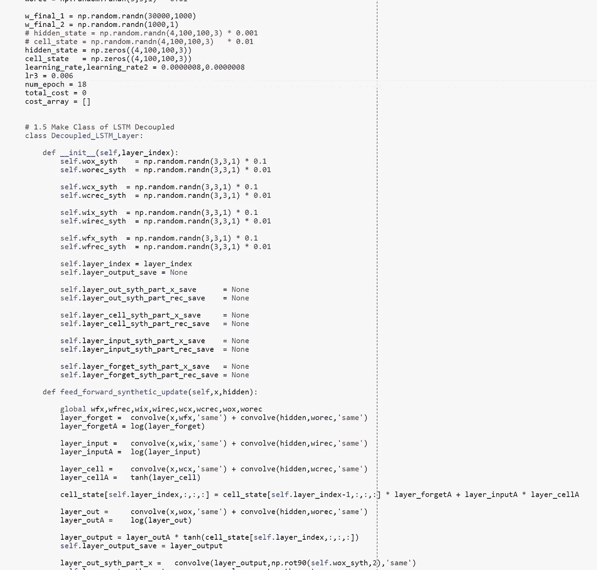
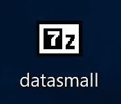

# 只有 Numpy:解耦卷积 LSTM 分类小狗 gif 和婴儿 gif 与互动代码。

> 原文：<https://towardsdatascience.com/only-numpy-decoupled-convolutional-lstm-to-classify-puppy-gifs-and-baby-gifs-with-interactive-4d3f4ab9d725?source=collection_archive---------6----------------------->

在继续阅读之前，请注意这是实验模型，我只是想挑战自己来建造这个模型。因此，在反向传播过程中存在一些错误的可能性很高。我会回来这个帖子确认这件事。还有，本帖所有的 [*GIF 都来自 GIPHY*](https://giphy.com/) *。*


Corgy [Image from Pixel Bay](https://pixabay.com/en/animal-dog-pet-park-corgi-1284286/)

LSTM 很难训练，不使用框架更难实现。在我看来，原因在于，我们需要求解大量的方程，才能得到不同时间标记中每个权重的梯度。在对 GRU 执行[反向传播时，我意识到我们需要多少个方程才能得到时间戳 1 中一个权重的梯度。](https://medium.com/@SeoJaeDuk/only-numpy-deriving-forward-feed-and-back-propagation-in-gated-recurrent-neural-networks-gru-8b6810f91bad)



实际上，我们需要的方程的数量相对于每一层的循环连接的数量呈指数增长。所以在 LSTM 的例子中，所需方程的数量增长了…..

```
4^n where n is the time stamp going in back wards direction
```

此外，如果我们获得不同时间戳层的成本，而不仅仅是最外层的成本，还要加上 alpha。请在这里看看我关于在 lstm 上执行[前馈和反向传播操作的博文。](https://becominghuman.ai/only-numpy-deriving-forward-feed-and-back-propagation-in-long-short-term-memory-lstm-part-1-4ee82c14a652)

然而，有一种方法可以减少我们需要的方程数量，那就是使用[解耦神经网络架构](https://arxiv.org/abs/1608.05343)。使用这种方法，我们可以打破链式法则，有点…..

记住这一点，让我解释一下我想做什么。此外，如果你不熟悉 LSTM，请查看 Colah 的 Blo

**数据集(GIF 图像)—训练数据**


以上是训练数据的小狗部分，我们将它们标记为 1。另外，所有的 GIF 图片都被调整为 100*100 像素，并且只包含 3 帧。所以我们总共有 18 帧。


以上是训练数据的婴儿部分，我们将它们标记为 0。同样，所有的 GIF 都被调整为 100*100 像素，并且只包含 3 帧。所以我们总共有 36 帧，包括小狗和婴儿的 gif。

**数据集(GIF 图像)—测试数据**


如上所述，我们有 4 个 GIF 作为测试数据，所有这些都被调整为 100*100 像素，只包含 3 帧。所以我们总共有 12 帧。

**网络架构(图形形式)**



**橙色框** →时间戳甲骨文框 1
红色框 →时间戳甲骨文框 2
蓝色框 →时间戳甲骨文框 3

**紫框**→LSTM 的最终输出，这个值将连接到一个全连接的神经网络，用于预测给定的 GIF 是小狗 GIF 还是婴儿 GIF。

**黑盒** →每个时间戳的输入帧，因为每个 GIF 有 3 帧，所以我们有 3 个时间戳。

因此，使用每个时间戳中的 oracle box，我们可以立即更新我们的权重。另一件需要注意的事情是，我使用了 OOP 方法来实现每一层，所以每一层都是一个类。我是通过 [iamtrask 的解耦神经网络教程](https://iamtrask.github.io/2017/03/21/synthetic-gradients/)得到这个灵感的。


每一层都有三个功能。
**a .初始化** →创建层合成权重的地方
**b .前馈合成更新** →执行标准前馈操作并使用合成梯度更新权重
**c .合成权重更新** →使用从下一层传播的梯度更新每一层的合成梯度。

基于这种理解，我将通过截图来“尝试”描述每个操作。

**解耦 LSTM 层:前馈操作**


以上是每一层的前馈过程，正如你所见，这是 LSTM 层的标准前馈操作。这里我们有 4 个门，遗忘，输入，单元和输出。每个门具有不同的激活功能。

**去耦 LSTM 层:使用合成渐变进行渐变更新**



**红色下划线** →使用合成梯度计算误差率
**蓝框** →使用计算的误差率更新循环权重。

因此，如上所述，我们现在能够在完成前馈操作后立即更新递归权重。

**分离的 LSTM 层:传递渐变到前一层**


**红色下划线** →使用更新的递归权重，我们正在计算将传递给前一层的渐变。

现在这个操作只适用于第一层之后的层，因为我们没有第 0 层。然而，因为我们使用面向对象的方法，甚至第 1 层将执行这个操作。但是我们不会存储返回的变量，如下图所示。


**粉色方框** →忽略从第 1 层返回的通过梯度
**黄色下划线** →存储从第 2 层返回的通过梯度，并将其交给第 1 层进行合成梯度更新。

**去耦 LSTM 层:合成渐变更新**


**蓝色框** →更新遗忘门的合成权重
**粉色框** →更新输入门的合成权重
**绿色框** →更新单元门的合成权重
**紫色框** →更新输出门的合成权重

因此，每一层都将使用从下一层传递来的渐变来更新它们的合成权重。

**全连接层**



还有最后一部分我还没讲，就是全连接层。

**红框**→LSTM 最终输出矢量化
**蓝框** →全连接层标准前馈运算和 L2 范数代价函数
**绿框** →全连接层标准反向传播。

**训练和结果**



以上是训练的成本，它首先从 0.39 开始，在最后一个时期下降到 0.011。(我训练了 18 个纪元。)



**红框** →训练前模型对测试集的预测
**蓝框** →训练后模型对测试集的预测
**黑色下划线数字** →模型置信度如何变化

以上是模型对给定 GIF 是小狗 GIF(表示为 1)还是婴儿 GIF(表示为 0)的预测。现在很公平地说，我只有 4 个训练 GIF，其中三个甚至在训练前就被正确预测了。然而，我关注的不是准确性，而是其他东西。

请看看黑色下划线的数字，这是我所关注的。似乎这个模型已经学会了一些特性(我不知道是什么)。)这使得它能够更有把握地决定给定的 GIF 是否属于一个类别。

**交互代码**



*为了交互代码，我搬到了 Google Colab！所以你需要一个谷歌帐户来查看代码，你也不能在谷歌实验室运行只读脚本，所以在你的操场上做一个副本。最后，我永远不会请求允许访问你在 Google Drive 上的文件，仅供参考。编码快乐！*

现在运行这段代码有点复杂，因为我使用了自己的数据集。不过不要担心，我已经把我用过的所有 GIF 上传到我的公共 Gitlab，要访问它[请点击这个链接](https://gitlab.com/jae.duk.seo/Only_Numpy/tree/master/9_Decoupled_LSTM)。要访问[知识库的主页，请点击此处](https://gitlab.com/jae.duk.seo/Only_Numpy/tree/master)。现在请按照一步一步的教程。



1.  从上面的链接下载“datasmall.zip”文件。其中当然包含一种致命的电脑病毒[😈](https://emojipedia.org/smiling-face-with-horns/)。


2.将 Google Colab 中的代码复制到您自己的游戏中。运行代码时，会弹出一个小按钮，如上所示。(绿色方框)。单击“选择文件”并选择最近下载的“datasmall.zip”文件。


3.该计划将完成上传数据到谷歌 Colab，它将继续运行。

所以记住上面的简短教程，请点击这里[访问交互代码](https://colab.research.google.com/drive/1S4R9L8Vw9IymSncu6wpafgQZMZSRz_HU)。

**遗言**

使用这种去耦架构，可以实现深度超过 3 层的 LSTM 网络。此外，我开始了一个新的系列，我将重新审视我过去的所有帖子，并反复检查我是否正确地实现了所有内容。

如果发现任何错误，请发电子邮件到 jae.duk.seo@gmail.com 找我。

同时，在我的 twitter [这里](https://twitter.com/JaeDukSeo)关注我，并访问[我的网站](https://jaedukseo.me/)，或我的 [Youtube 频道](https://www.youtube.com/c/JaeDukSeo)了解更多内容。如果你感兴趣的话，我还做了解耦神经网络的比较。

**参考**

1.  了解 LSTM 网络。(未注明)。检索于 2018 年 2 月 10 日，来自[http://colah.github.io/posts/2015-08-Understanding-LSTMs/](http://colah.github.io/posts/2015-08-Understanding-LSTMs/)
2.  Seo，J. D. (2018 年 1 月 15 日)。Only Numpy:衍生门控递归神经网络中的前馈和反向传播(GRU)-…2018 年 2 月 10 日检索，来自[https://medium . com/@ SeoJaeDuk/only-Numpy-derivating-Forward-feed-and-Back-Propagation-in-Gated-Recurrent-Neural-Networks-gru-8b 6810 f 91 bad](https://medium.com/@SeoJaeDuk/only-numpy-deriving-forward-feed-and-back-propagation-in-gated-recurrent-neural-networks-gru-8b6810f91bad)
3.  Seo，J. D. (2018 年 1 月 11 日)。只有 Numpy:推导长期短期记忆中的前馈和反向传播(LSTM)第 1 部分。2018 年 2 月 10 日检索，来自[https://becoming human . ai/only-numpy-derivating-forward-feed-and-back-propagation-in-long-short-term-memory-lstm-part-1-4ee 82 c 14 a 652](https://becominghuman.ai/only-numpy-deriving-forward-feed-and-back-propagation-in-long-short-term-memory-lstm-part-1-4ee82c14a652)
4.  贾德伯格，m .，Czarnecki，W. M .，奥辛德罗，s .，维尼亚尔斯，o .，格雷夫斯，a .，& Kavukcuoglu，K. (2016)。使用合成梯度的去耦神经接口。 *arXiv 预印本 arXiv:1608.05343* 。
5.  G.(未注明)。搜索所有的 GIF &制作你自己的动画 GIF。检索于 2018 年 2 月 10 日，来自[https://giphy.com/](https://giphy.com/)
6.  没有反向传播的深度学习。(未注明)。检索于 2018 年 2 月 10 日，来自[https://iamtrask.github.io/2017/03/21/synthetic-gradients/](https://iamtrask.github.io/2017/03/21/synthetic-gradients/)