# 仅 Numpy:使用带有交互代码的 Numpy 实现 GAN(通用对抗网络)和 Adam 优化器。(跑甘在线)

> 原文：<https://towardsdatascience.com/only-numpy-implementing-gan-general-adversarial-networks-and-adam-optimizer-using-numpy-with-2a7e4e032021?source=collection_archive---------4----------------------->

所以今天我受到了这篇博文的启发，“TensorFlow 中的[生成对抗网络”，我想用 Numpy 自己实现 GAN。下面是](https://wiseodd.github.io/techblog/2016/09/17/gan-tensorflow/)[原创甘论文](https://arxiv.org/abs/1406.2661)作者 [**@** goodfellow_ian](https://twitter.com/goodfellow_ian) 。下面是从简单的 GAN 生成的所有图像的 gif。

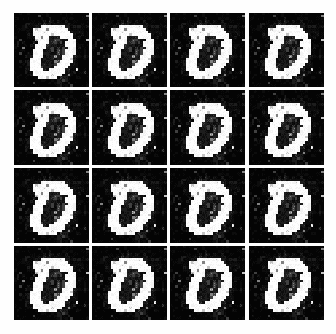

在阅读之前，请注意我不会涉及太多的数学知识。更确切地说，是代码的实现和结果，我将在以后讨论数学。我正在使用 Adam Optimizer，但是，我不会在这篇文章中解释 Adam 的实现。

**GAN 中鉴频器的前馈/部分反向传播**

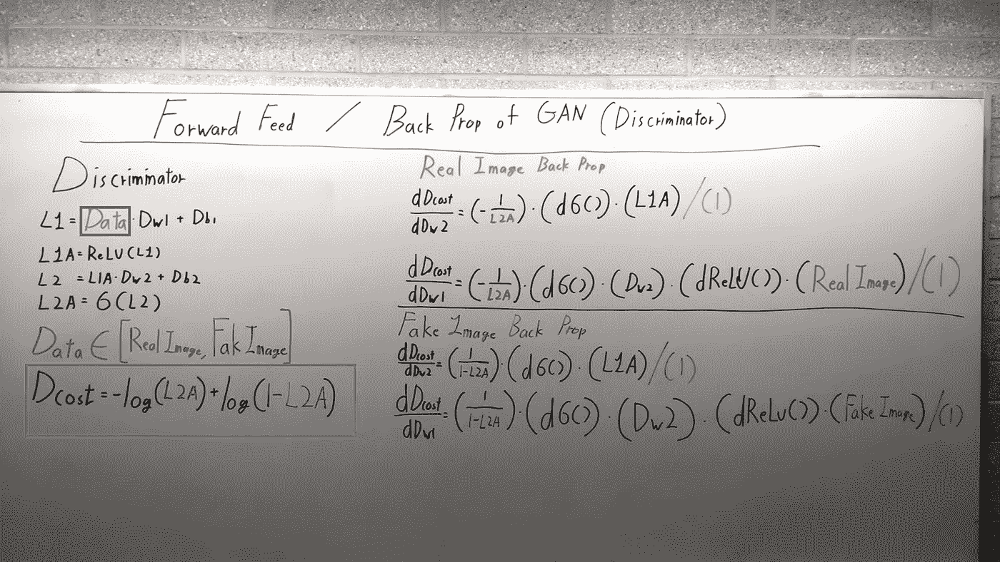

同样，我不会说太多的细节，但请注意红色方框区域称为数据。对于 GAN 中的鉴别器网络，该数据可以是由发生器网络产生的真实图像或虚假图像。我们的图像是 MNIST 数据集的(1，784)矢量。

还有一点要注意的是**红色(L2A)和蓝色(L2A)** 。红色(L2A)是以真实图像作为输入的我们的鉴别器网络的最终输出。蓝色(L2A)是我们的鉴别器网络的最终输出，以假图像作为输入。

我们实现这一点的方法是在将真实图像和虚假数据放入网络之前获取它们。

第 128 行—获取真实图像数据
第 147 行—获取虚假图像数据(由发生器网络生成)

第 162 行—我们的鉴频器网络的成本函数。

另外，请注意蓝框区域，这是我们的成本函数。让我们比较原始论文中的成本函数，如下所示。

Image [from original Paper](https://arxiv.org/pdf/1406.2661.pdf)

不同之处在于，我们在第一个学期日志(L2A)前面放了一个(-)负号。

Image [from Agustinus Kristiadi](https://wiseodd.github.io/techblog/2016/12/24/conditional-gan-tensorflow/)

如上所述，在 TensorFlow 实现中，如果我们想要最大化某个值，我们翻转符号，因为 TF 自动微分只能最小化。

我思考过这个问题，并决定以类似的方式实现。因为我想最大化我们的鉴别者对真实图像猜测正确的机会，同时最小化我们的鉴别者对虚假图像猜测错误的机会，我希望这些值的总和达到平衡。然而，我还不能 100 %确定这一部分，我会很快重新考虑这件事。

**GAN 中发电机的前馈/部分反向传播**

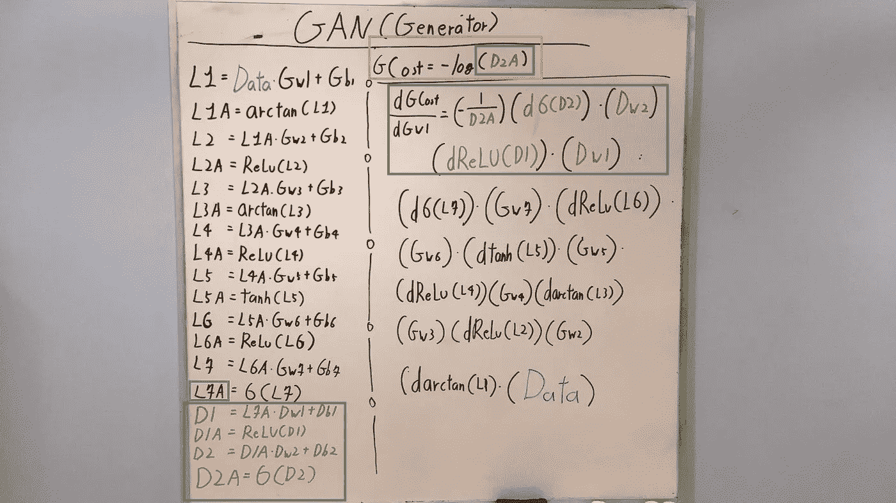

GAN 中发生器网络的反向传播过程有点复杂。

蓝框—从发电机网络产生的假数据
绿框(左角)—鉴别器接受产生的(蓝框)输入并执行前馈过程

橙色框—发电机网络的成本函数(同样，我们希望最大化产生真实数据的机会)

绿框(右角)—发生器网络的反向传播过程，但我们必须通过一路梯度鉴别器网络。

下面是实现代码的屏幕截图。

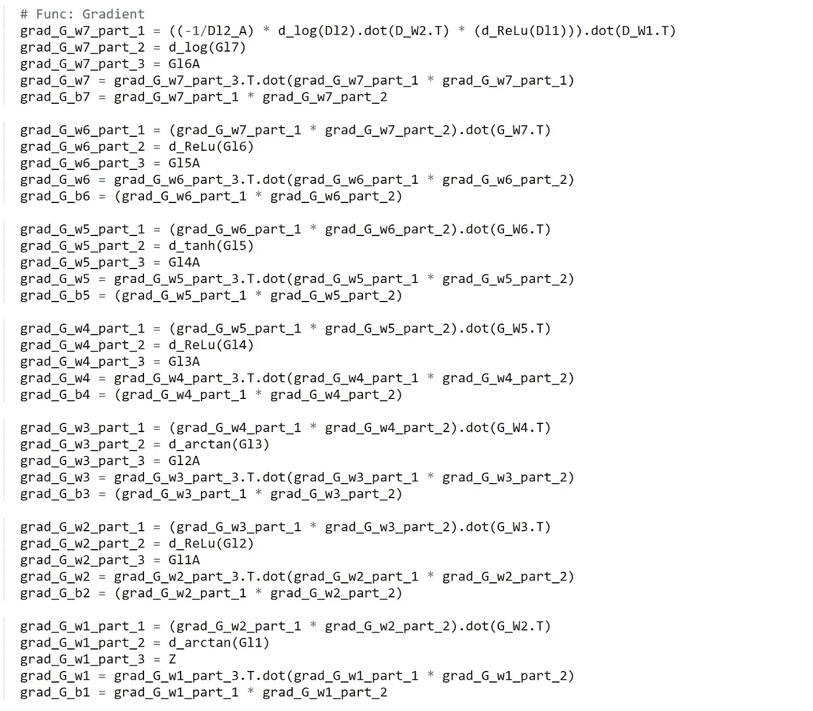

标准的反向传播，没什么特别的。

**训练结果:失败的尝试**

我很快意识到训练 GAN 是极其困难的，即使有 Adam Optimizer，网络似乎也没有很好地收敛。因此，我将首先向您展示所有失败的尝试及其网络架构。

1.  *生成器，2 层:200，560 个隐藏神经元，输入向量大小 100*

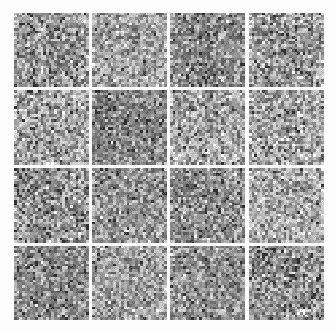

*2。发生器，tanh()激活，2 层:245，960 个隐藏神经元，IVS 100*

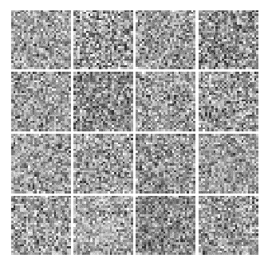

*3。生成器，3 层:326，356，412 个隐藏神经元，输入向量大小 326*

*4。生成器，2 层:420，640 个隐藏神经元，输入向量大小 350*

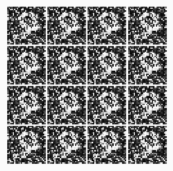

*5。生成器，2 层:660，780 个隐藏神经元，输入向量大小 600*

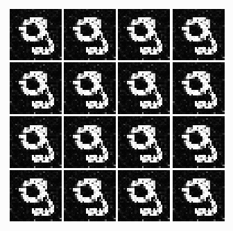

*6。生成器，2 层:320，480 个隐藏神经元，输入向量大小 200*

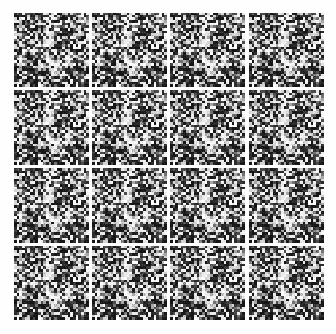

所以如上所见，他们似乎都学到了一些东西，但不是真正的 LOL。然而，我能够使用一个巧妙的技巧来生成一个看起来有点像数字的图像。

**极端阶梯式梯度衰减**

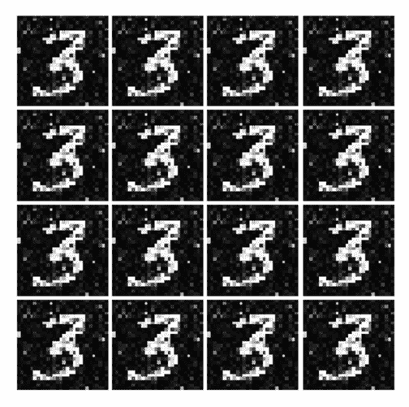

以上是一张 gif，我知道差别很小，但是相信我，我不是在耍你。这个技巧非常简单，也很容易实现。我们首先为第一次训练设置学习率高速率，并且在第一次训练之后，我们通过因子 0.01 设置学习率的衰减。由于未知的原因(我想对此进行更深入的研究),这似乎是可行的。)

但由于巨大的成本，我认为我们正在向一个网络只能产生特定类型数据的“地方”靠拢。意思是，从-1 和 1 之间的数的均匀分布。生成器只会生成看起来像 3 或 2 等的图像。但这里的关键点是，网络不能生成不同的一组数字。事实证明，图像中所有的数字看起来都像 3。

然而，看起来像一个数字是一些什么合理的形象。让我们看看更多的结果。

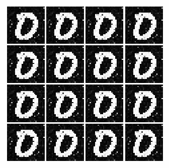

如上所述，随着时间的推移，数字变得更加尖锐。一个很好的例子是生成的图像 3 或 9。

**交互代码**

*更新:我搬到谷歌 Colab 的交互代码！所以你需要一个谷歌帐户来查看代码，你也不能在谷歌实验室运行只读脚本，所以在你的操场上做一个副本。最后，我永远不会请求允许访问你在 Google Drive 上的文件，仅供参考。编码快乐！*

请点击[在线访问互动代码。](https://colab.research.google.com/notebook#fileId=1D2kF1uBbJlVuglpuBSrw7A_3ws-Nvxk-)

当运行代码时，确保你是在' main.py' tap 上，如上面绿色框中所示。这个程序会问你一个随机的播种数，如蓝框所示。生成一幅图像后，要查看该图像，请单击上面的“单击我”选项卡，红色框。

## 最后的话

把甘训练到半身不遂是一项很大的工作，我想研究更有效的训练甘的方法。最后一件事，喊出 [**@** replit](https://twitter.com/replit) ，这些家伙太厉害了！

如果发现任何错误，请发电子邮件到 jae.duk.seo@gmail.com 找我。

同时，在我的 twitter [这里](https://twitter.com/JaeDukSeo)关注我，并访问[我的网站](https://jaedukseo.me/)，或我的 [Youtube 频道](https://www.youtube.com/c/JaeDukSeo)了解更多内容。如果你感兴趣的话，我还做了解耦神经网络的比较。

**参考文献**

1.  Goodfellow，I .、Pouget-Abadie，j .、Mirza，m .、Xu，b .、Warde-Farley，d .、Ozair，s .、… & Bengio，Y. (2014 年)。生成对抗网络。在*神经信息处理系统的进展*(第 2672-2680 页)。
2.  免费的在线动画 GIF 制作工具——轻松制作 GIF 图像。(未注明)。检索于 2018 年 1 月 31 日，来自[http://gifmaker.me/](http://gifmaker.me/)
3.  张量流中的生成对抗网。(未注明)。检索于 2018 年 1 月 31 日，来自[https://wise odd . github . io/tech blog/2016/09/17/gan-tensor flow/](https://wiseodd.github.io/techblog/2016/09/17/gan-tensorflow/)
4.  J.(未注明)。jrios 6/亚当-vs-SGD-Numpy。检索于 2018 年 1 月 31 日，来自[https://github . com/jrios 6/Adam-vs-SGD-Numpy/blob/master/Adam % 20vs % 20 SGD % 20-% 20 on % 20 kaggles % 20 titanic % 20 dataset . ipynb](https://github.com/jrios6/Adam-vs-SGD-Numpy/blob/master/Adam%20vs%20SGD%20-%20On%20Kaggles%20Titanic%20Dataset.ipynb)
5.  Ruder，S. (2018 年 1 月 19 日)。梯度下降优化算法综述。检索于 2018 年 1 月 31 日，来自 http://ruder.io/optimizing-gradient-descent/index.html#adam
6.  E.(1970 年 01 月 01 日)。埃里克·张。2018 年 1 月 31 日检索，来自[https://blog . ev jang . com/2016/06/generative-adversarial-nets-in . html](https://blog.evjang.com/2016/06/generative-adversarial-nets-in.html)