# Only Numpy Medical:使用交互式代码的神经网络对肺部 CT 扫描进行去噪—第 2 部分，卷积神经网络(使用卷积神经网络的低剂量 CT 去噪)

> 原文：<https://towardsdatascience.com/only-numpy-medical-denosing-lung-ct-scans-using-neural-networks-with-interactive-code-part-2-6def73cabba5?source=collection_archive---------5----------------------->

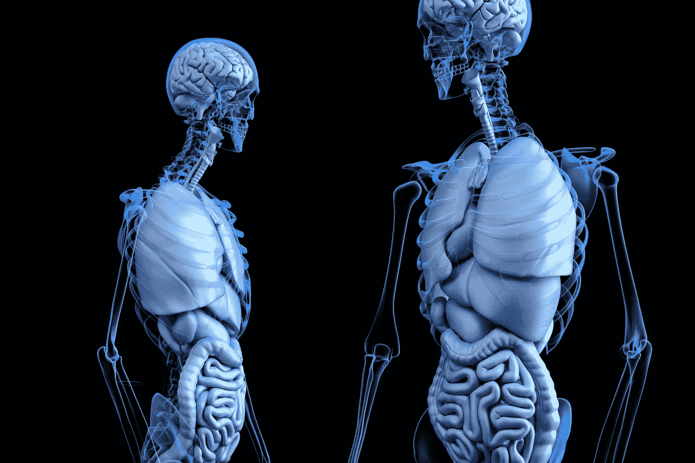

image from [pixel bay](https://pixabay.com/en/anatomical-anatomy-body-gut-health-2261006/)

所以今天我就继续上图像去噪系列，幸运的是我找到了这篇论文“[卷积神经网络低剂量 CT 去噪。在*生物医学 Imagi*](https://arxiv.org/ftp/arxiv/papers/1610/1610.00321.pdf)*【n】*由陈虎。因此，让我们深入了解一下它们的实现，看看我们会得到什么结果。最后，为了好玩，让我们使用不同类型的反向传播来比较什么给我们最好的结果。我们将要使用的不同类型的反向传播是…

a.[谷歌大脑的梯度噪声](https://becominghuman.ai/only-numpy-implementing-adding-gradient-noise-improves-learning-for-very-deep-networks-with-adf23067f9f1)
b. [扩张型反向传播](https://hackernoon.com/only-numpy-dilated-back-propagation-and-google-brains-gradient-noise-with-interactive-code-3a527fc8003c)
c. [扩张型反向传播+谷歌大脑的梯度噪声](https://hackernoon.com/only-numpy-dilated-back-propagation-and-google-brains-gradient-noise-with-interactive-code-3a527fc8003c)

如果你不知道它们之间的区别，请阅读我链接的博文。

***注:所有的 DICOM 图像均来自*** [***癌症影像存档网***](http://www.cancerimagingarchive.net/) ***，如果您打算使用这些数据，请查阅他们的数据使用年龄政策。具体来说，我将使用来自*** [***仿真 FDA***](http://dx.doi.org/10.7937/K9/TCIA.2015.ORBJKMUX) ***数据集的 DICOM 图像。***

**网络架构(数学方程形式)**

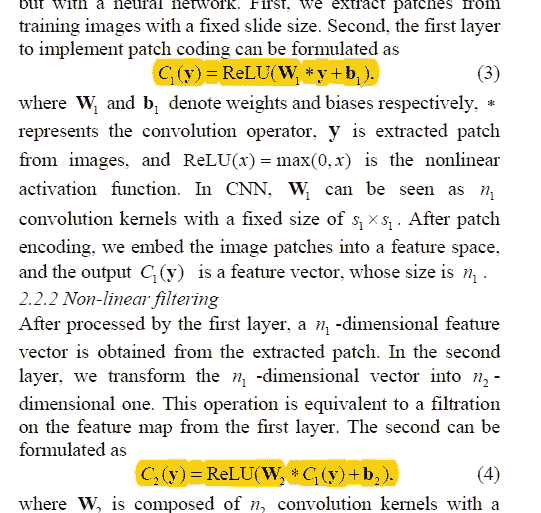

The [first two layers of our convolutional NN](https://arxiv.org/abs/1610.00321)

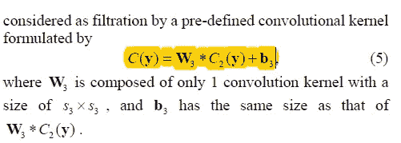

The [final Layer of Convolutional NN](https://arxiv.org/abs/1610.00321)

这篇论文写得有点奇怪，当提到符号时，有时他们用 X 代表 Y，反之亦然。因此，在我最大的能力范围内，我认为我们正在建立一个三层卷积神经网络。两层的激活函数都是 ReLU()激活函数，最后一层没有任何激活函数。

**网络架构(OOP 形式)**

网络的 OOP 形式非常简单，除了一部分。我们有 4 种情况，记住，我们将使用不同类型的反向传播，看看哪种能给出最好的结果，它们在这里。

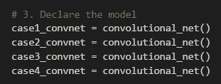

这里需要注意的一个非常重要的事实是，每个网络并不是以相同的权重开始的！这可能不是最公平的比较。然而，我决定这样做，看看每个反向传播方法在长期效果中的表现。也就是说，如果它们确实优于另一个，那么无论初始权重如何初始化，网络都会表现得更好。

**训练/测试数据**

Original [Paper link here](https://arxiv.org/abs/1610.00321)

如上文中所见，作者([陈虎](https://arxiv.org/find/physics/1/au:+Chen_H/0/1/0/all/0/1))将一幅图像分割成独立的图像块。现在，我们不打算使用与本文中完全相同数量的补丁，而是将我们的训练和测试映像分成几个补丁。下面可以看到一个训练图像。

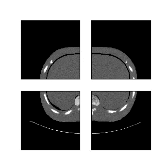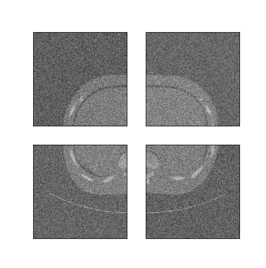

**第一行图像** →原始图像和分割补丁
**第二行图像** →添加噪声图像和分割补丁

因此，原始图像的尺寸为(512*512 ),我们将把图像分成 4 个小块。更具体地说，每个图像块将具有(256*256)维。记住这一点，下面是其他训练和测试数据的例子。(此外，我忘了拍摄分割后的原始图像，所以这就是为什么你看不到它们的原因。)

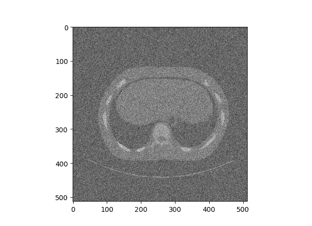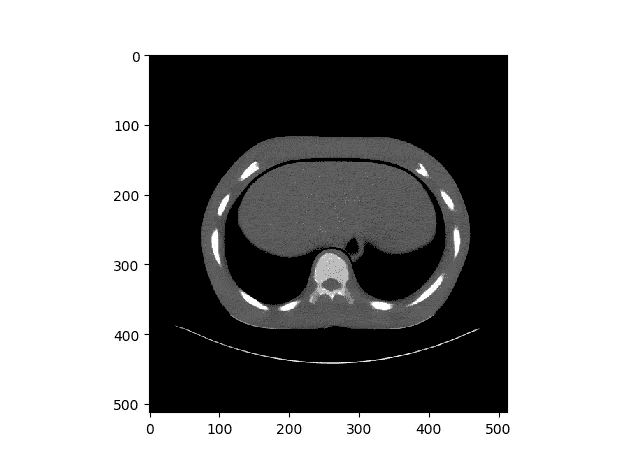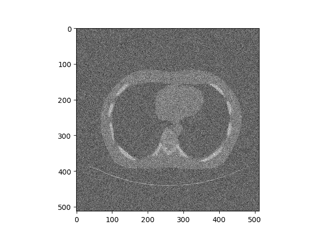

**成本函数/反向传播**

现在让我们来看看我们将要使用的成本函数。既然这个方程的设定值对我们来说优化它是非常重要的。

现在，请记住这篇论文的符号是混淆的。但我可以有把握地说，我们将使用的成本函数是 L2 范数除以批量数量，而不是 0.5。这可以通过下面的代码来实现。

由于我们的批量大小为 4，(我们将图像分成 4 个不同的空间)我们将使用 0.25。此外，我想在这里指出一件非常重要的事情。

如果我们遵循反向传播的严格规则，我们实际上应该在红框区域乘以 0.5，但是为了稳定，我决定只使第一个梯度更小。(这个决定是在多次不同的尝试和错误之后做出的。)

**案例 1:培训和结果**

案例 1 是正常的随机梯度下降，如上图所示，可以看到 CT 扫描的整体形状。然而很难看出。右图是用于比较的原始图像之一。

**案例二:培训及结果**

对于梯度噪声，你可以。看到中间有东西。然而，没有办法告诉这是一个肺部 CT 扫描图像。右图是用于比较的原始图像之一。

**案例 3:培训和结果**

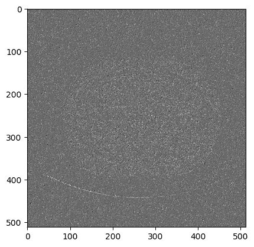

现在，使用扩张的反向传播，我们可以看到得到的去噪图像看起来非常类似于情况 1 的结果。然而，再次很难准确地说出 CT 扫描中哪个是肺的部分。右图是用于比较的原始图像之一。

**案例 4:培训及结果**

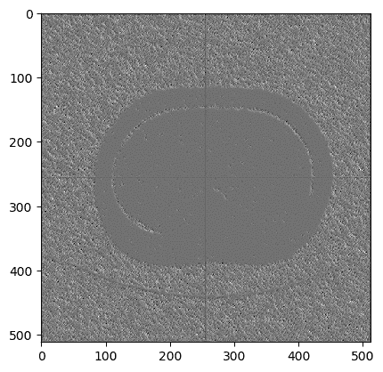

现在我们可以清楚地看到我们在看什么。然而，它缺乏细节，我的意思是很多细节。如果你把 GIF 和正确的图像进行比较，你几乎分辨不出细节。右图是用于比较的原始图像之一。

**互动码**

*我转到 Google Colab 获取交互代码！所以你需要一个谷歌帐户来查看代码，你也不能在谷歌实验室运行只读脚本，所以在你的操场上做一个副本。最后，我永远不会请求允许访问你在 Google Drive 上的文件，仅供参考。编码快乐！*

现在运行这段代码有点复杂，因为我使用了自己的数据集。不过，不要担心，我已经将我使用的所有 DICOMs 上传到我的公共 Github (Gitlab 遇到了问题)，要访问它[请点击这个链接](https://github.com/JaeDukSeo/Only_Numpy_Basic/tree/master/a_Lung_CT_Scan_Data)。要访问[存储库的主页，请单击此处](https://gitlab.com/jae.duk.seo/Only_Numpy/tree/master)。现在请按照一步一步的教程。

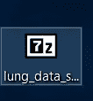

1.  从上面的链接下载“lung_data_small_jpg.zip”文件。

2.将 Google Colab 中的代码复制到您自己的游戏中。运行代码时，会弹出一个小按钮，如上所示。(绿色方框)。单击选择文件并选择最近下载的“lung_data_small.zip”文件。

3.该计划将完成上传数据到谷歌 Colab，它将继续运行。

所以记住上面的简短教程，[请点击这里访问交互代码。](https://colab.research.google.com/drive/1srgPvZ3rnRBGMFg37cZxAkwTRoLsKSHw)最后，请注意，培训过程非常不稳定，因此每次结果都可能不同。

**最后的话**

所以我们尝试了两种不同的方法，[自动编码器](/only-numpy-medical-denosing-lung-ct-scans-using-auto-encoders-with-interactive-code-part-1-a6c3f9400246)和现在的卷积神经网络。然而，他们都没有给我们一个医学专业人士可以在现实生活中使用的结果。所以传奇仍在继续……

如果发现任何错误，请发电子邮件到 jae.duk.seo@gmail.com 给我，如果你想看我所有写作的列表，请点击这里查看我的网站。

同时，在我的推特[这里](https://twitter.com/JaeDukSeo)关注我，访问[我的网站](https://jaedukseo.me/)，或者我的 [Youtube 频道](https://www.youtube.com/c/JaeDukSeo)了解更多内容。如果你感兴趣，我还在这里做了解耦神经网络[的比较。](https://becominghuman.ai/only-numpy-implementing-and-comparing-combination-of-google-brains-decoupled-neural-interfaces-6712e758c1af)

**参考**

1.  患者 CD/DVD DICOM 浏览器。(未注明)。检索于 2018 年 2 月 16 日，来自[https://www.radiantviewer.com/](https://www.radiantviewer.com/)
2.  Scipy.ndimage.imread。(未注明)。检索于 2018 年 2 月 16 日，来自[https://docs . scipy . org/doc/scipy/reference/generated/scipy . ndimage . im read . html](https://docs.scipy.org/doc/scipy/reference/generated/scipy.ndimage.imread.html)
3.  陈，洪，张，杨，张，魏，廖，李，周，王，(2017 年 4 月)。基于卷积神经网络的低剂量 CT 去噪。在*生物医学成像(ISBI 2017)，2017 IEEE 第 14 届国际研讨会上*(第 143–146 页)。IEEE。
4.  如何在 Python 中读取压缩文件夹中的文本文件？(未注明)。检索于 2018 年 2 月 16 日，来自[https://stack overflow . com/questions/22646623/how-to-read-text-files-in-a-zipped-folder-in-python](https://stackoverflow.com/questions/22646623/how-to-read-text-files-in-a-zipped-folder-in-python)
5.  Seo，J. D. (2018 年 1 月 18 日)。only Numpy:Implementing " ADDING GRADIENT NOISE IMPROVES-LEARNING FOR-VERY-DEEP-NETWORKS-with-ADF 23067 F9 f12018 年 2 月 17 日检索自[https://becoming human . ai/only-Numpy-Implementing-ADDING-GRADIENT-NOISE-IMPROVES-LEARNING-FOR-VERY-DEEP-NETWORKS-with-ADF 23067 F9 f1】](https://becominghuman.ai/only-numpy-implementing-adding-gradient-noise-improves-learning-for-very-deep-networks-with-adf23067f9f1)
6.  Seo，j . d .(2018 . 2 . 15)。只有 Numpy:扩张的反向传播和谷歌大脑的梯度噪声与交互代码。检索于 2018 年 2 月 17 日，来自[https://hacker noon . com/only-numpy-expanded-back-propagation-and-Google-brains-gradient-noise-with-interactive-code-3a 527 fc 8003 c](https://hackernoon.com/only-numpy-dilated-back-propagation-and-google-brains-gradient-noise-with-interactive-code-3a527fc8003c)
7.  Seo，J. D. (2018 年 2 月 13 日)。Only Numpy Medical:使用具有交互代码的神经网络对肺部 CT 扫描进行去噪—第 1 部分…2018 年 2 月 17 日检索自[https://towards data science . com/only-Numpy-Medical-de nosing-Lung-CT-Scans-using-auto-encoders-with-Interactive-Code-Part-1-a6c3f 9400246](/only-numpy-medical-denosing-lung-ct-scans-using-auto-encoders-with-interactive-code-part-1-a6c3f9400246)
8.  越来越多的癌症医学图像档案。(未注明)。检索于 2018 年 2 月 12 日，发自 http://www.cancerimagingarchive.net/
9.  Gavrielides，Marios A，Kinnard，Lisa M，Myers，Kyle J，Peregoy，，Pritchard，William F，曾，荣平，… Petrick，Nicholas。(2015).数据来自 Phantom_FDA。癌症影像档案。[http://doi.org/10.7937/K9/TCIA.2015.ORBJKMUX](http://doi.org/10.7937/K9/TCIA.2015.ORBJKMUX)