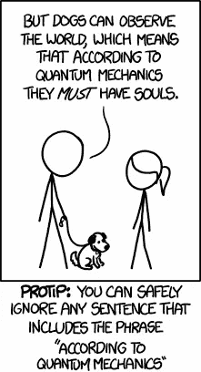
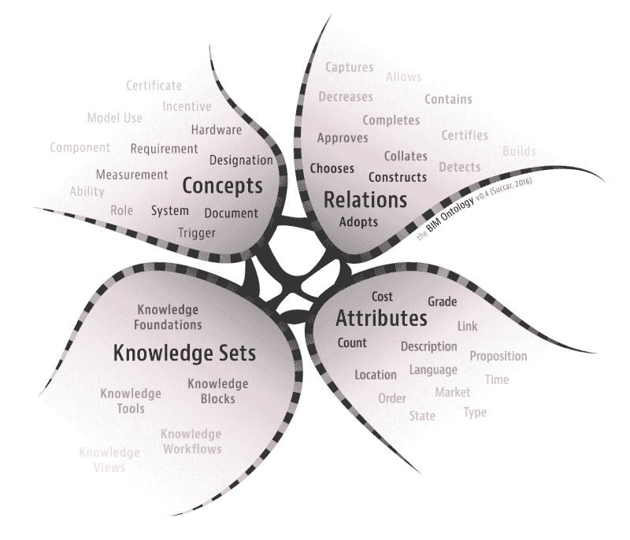
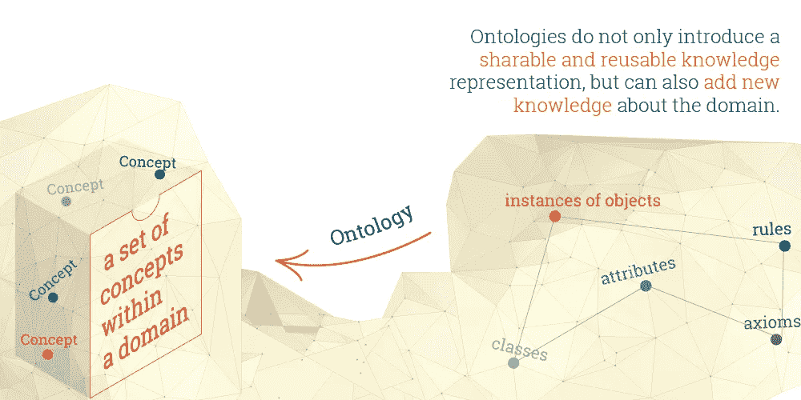
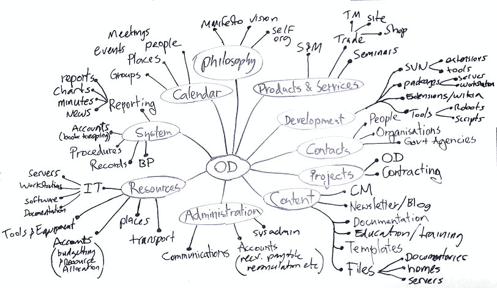
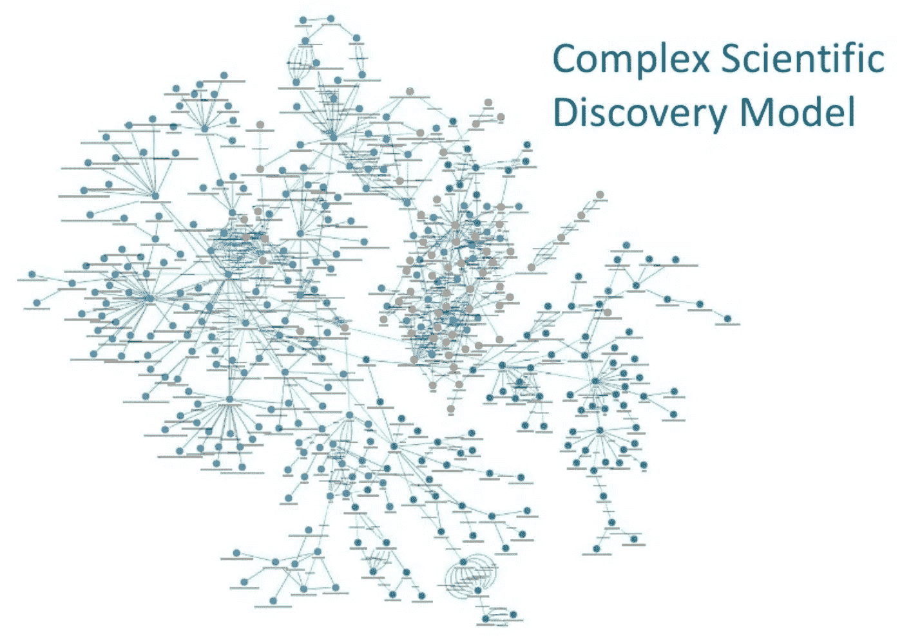
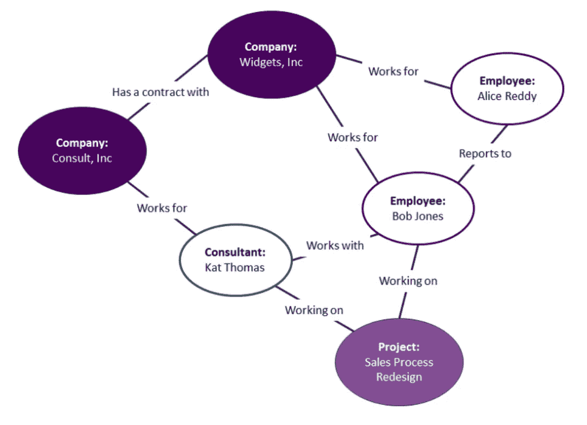

# 本体论和数据科学

> 原文：<https://towardsdatascience.com/ontology-and-data-science-45e916288cc5?source=collection_archive---------1----------------------->

## 对现有数据的研究如何帮助我们成为更好的数据科学家。

Photo by Valentin Antonucci from Pexels

如果你是本体这个词的新手，不要担心，我将给出它是什么的初级读本，以及它对数据世界的重要性。我将明确哲学本体论和与计算机科学中的信息和数据相关的本体论之间的区别。

# 本体论(哲学部分)

简而言之，人们可以说本体论是对现有事物的研究。但是这个定义的另一部分将在下面的章节中帮助我们，那就是本体通常也被认为包含了关于存在的实体的最一般的特征和**关系的问题。**

存在论为存在者打开了新的大门。我给你举个例子。

量子力学开启了对现实和自然界“存在”什么的新观点。对于 1900 年代的一些物理学家来说，量子形式主义中根本不存在现实。在另一个极端，有许多量子物理学家持截然相反的观点:单一演化的量子态完全描述了真实的现实，这意味着几乎所有的量子选择都必须继续共存(叠加)。从而让整个世界对自然界中“存在”的“事物”有了新的认识和理解。

但是让我们回到定义中的实体关系部分。有时当我们谈论实体及其关系时，本体论被称为**形式本体论。这些理论试图给出某些实体的属性和关系的精确数学公式。这种理论通常提出关于这些问题实体的公理，用基于某种形式逻辑系统的某种形式语言来阐明。**

这将允许我们做一个**量子跳跃**到文章的下一部分。

[https://xkcd.com/1240/](https://xkcd.com/1240/)

# 本体(信息和计算部分)

如果我们从上面带回形式本体论的定义，然后我们想到数据和信息，就有可能建立一个框架来研究数据及其与其他数据的关系。在这个框架中，我们以一种特别有用的方式来表示信息。以特定的形式本体表示的信息可以更容易地被自动化信息处理所访问，如何最好地做到这一点是像数据科学这样的计算机科学中的一个活跃的研究领域。这里使用的形式本体是**具象**。它是一个表示信息的框架，因此，无论实际上使用的形式理论是否真正描述了实体的领域，它在表示上都是成功的。

现在是一个很好的机会来看看本体如何在数据科学世界中帮助我们。

如果你还记得我上一篇关于语义技术的文章:

 [## 面向大众的深度学习(…和语义层)

### 深度学习现在无处不在，在你的手表里，在你的电视里，在你的电话里，在某种程度上，在你的平台上…

towardsdatascience.com](/deep-learning-for-the-masses-and-the-semantic-layer-f1db5e3ab94b) 

我谈到了关联数据的概念。链接数据的目标是以一种易于使用和与其他链接数据组合的方式发布结构化数据。我还讨论了知识图的概念，它包含数据和信息的集成集合，还包含不同数据之间的大量链接。

所有这些定义中缺失的概念是本体论。因为这是我们连接实体和理解它们之间关系的方式。有了本体，我们可以实现这样的描述，但首先我们需要正式地指定组件，如个体(对象的实例)、类、属性和关系，以及限制、规则和公理。

下面是解释上述段落的一种象形方法:

[https://www.ontotext.com/knowledgehub/fundamentals/what-are-ontologies/](https://www.ontotext.com/knowledgehub/fundamentals/what-are-ontologies/)

## 数据库建模和本体

目前，大多数采用数据建模语言(如 SQL)的技术都是按照严格的“构建模型，然后使用模型”的思维方式设计的。

例如，假设您想要更改关系数据库中的属性。你以前认为财产是单值的，但现在它需要多值。对于几乎所有的现代关系数据库，这种改变需要您删除该属性的整个列，然后创建一个全新的表来保存所有这些属性值和一个外键引用。

这不仅工作量很大，而且还会使任何处理原始表的索引失效。它还会使用户编写的任何相关查询无效。简而言之，做出这样的改变是非常困难和复杂的。通常情况下，这样的改变是如此的麻烦，以至于根本就没有进行过。

相比之下，本体语言中的所有数据建模语句(以及其他所有东西)本质上都是增量的。事后增强或修改数据模型可以很容易地通过修改概念来实现。

# 从 RDBS 到知识图谱

到目前为止，我发现将您的数据湖转换为智能数据湖的最简单的框架是 Anzo。这样，您就可以向完全连接的企业数据结构迈出第一步。

> 数据结构是支持公司所有数据的平台。它是如何被管理、描述、组合和普遍访问的。该平台由企业知识图构成，以创建统一的数据环境。

这种数据结构的形成首先需要在你所拥有的数据之间创建本体。这种转变也可以认为是从传统数据库到图形数据库+语义的转变。

根据[剑桥语义](https://www.cambridgesemantics.com/)公司的这个展示,图形数据库有用有三个原因:

1.  图形数据库产品在功能和多样性方面越来越成熟
2.  图形的应用已经超越了经典的图形问题
3.  复杂数据的数字转换需要图形

因此，如果您将这种优势与建立在本体上的语义层联系起来，您可以从拥有这样的数据开始:

[https://www.slideshare.net/camsemantics/the-year-of-the-graph](https://www.slideshare.net/camsemantics/the-year-of-the-graph)

对此

[https://www.slideshare.net/camsemantics/the-year-of-the-graph](https://www.slideshare.net/camsemantics/the-year-of-the-graph)

其中有一种人类可读的数据表示，可以用常见的业务术语唯一地标识和连接数据。这一层帮助最终用户自主、安全、自信地访问数据。

然后，您可以创建复杂的模型来发现不同数据库中的模式。

[https://www.slideshare.net/camsemantics/the-year-of-the-graph](https://www.slideshare.net/camsemantics/the-year-of-the-graph)

在其中，你有代表实体间关系的本体。也许这样一个本体论的例子在这里会很好。这是从

 [## 什么是本体，我为什么想要本体？-企业知识

### 本体和语义技术再次流行起来。它们是 21 世纪初的热门话题，但是…

enterprise-knowledge.com](https://enterprise-knowledge.com/what-is-an-ontology/) 

让我们创建一个关于您的员工和顾问的本体:

在本例中，Kat Thomas 是一名顾问，他正在与 Bob Jones 合作一个销售流程重新设计项目。凯特在咨询公司工作，鲍勃向爱丽丝·雷迪汇报工作。我们可以通过这个本体推断出很多信息。由于销售流程重新设计是关于销售的，我们可以推断 Kat Thomas 和 Bob Jones 在销售方面有专长。咨询公司也必须提供这方面的专业知识。我们还知道 Alice Reddy 可能负责 Widgets，Inc .的某个方面的销售，因为她的直接下属正在从事销售流程重新设计项目。

当然，您可以在带有主键的关系数据库中使用它，然后创建几个连接来获得相同的关系，但这更直观，也更容易理解。

令人惊奇的是，Anzo 将连接到您的数据湖(意味着 HDFS 或甲骨文或其他公司内部的大量数据),并自动为您创建这个图表！然后你可以自己去添加或者改变本体。

# 数据科学的未来(只有明年 lol)

在本文中:

 [## 人工智能，数据科学，分析 2018 年的主要发展和 2019 年的主要趋势

### 和过去一样，我们为您带来专家的预测和分析综述。我们问了主要的是什么…

www.kdnuggets.com](https://www.kdnuggets.com/2018/12/predictions-data-science-analytics-2019.html) 

我谈到了未来几年数据科学(可能)会发生什么。

对我来说，2019 年的主要趋势是:

*   AutoX:我们将看到更多的公司开发并在其栈技术和库中包含自动机器和深度学习。这里的 X 表示这个自动化工具将扩展到数据摄取、数据集成、数据清理、探索和部署。自动化将会继续存在。
*   语义技术:今年对我来说最有趣的发现是 DS 和语义之间的联系。这在数据世界中并不是一个新的领域，但是我看到越来越多的人对语义、本体、知识图及其与 DS 和 ML 的联系感兴趣。
*   编程更少:这很难说，但是随着 DS 过程中几乎每一步的自动化，我们每天的编程会越来越少。我们将拥有创建代码的工具，这些工具将理解我们想要 NLP 做什么，然后将其转化为查询、句子和完整的程序。我觉得[编程]还是一个很重要的东西要学，但是很快就会更容易了。

这是我写这篇文章的原因之一，试图跟踪整个行业正在发生的事情，你应该意识到这一点。在不久的将来，我们将减少编程，更多地使用语义技术。更接近我们的思考方式。我的意思是你认为在关系数据库？我并不是说我们用图表来思考，但是在我们的头脑和知识图表之间传递信息要比创建怪异的数据库模型容易得多。

对这个有趣的话题，我期待更多。如果您有任何建议，请告诉我:)

如果您有任何问题，请在 Twitter 上关注我:

 [## 法维奥·巴斯克斯(@法维奥·巴斯克斯)|推特

### Favio Vázquez 的最新推文(@FavioVaz)。数据科学家。物理学家和计算工程师。我有一个…

twitter.com](https://twitter.com/faviovaz) 

和 LinkedIn:

 [## favio vázquez——science ia y Datos | LinkedIn 创始人

### 查看 Favio Vázquez 在世界上最大的职业社区 LinkedIn 上的个人资料。Favio 有 16 个工作列在他们的…

www.linkedin.com](https://www.linkedin.com/in/faviovazquez/) 

那里见:)