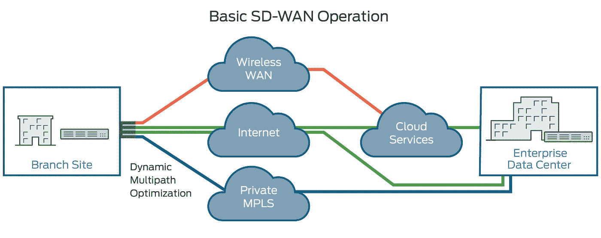
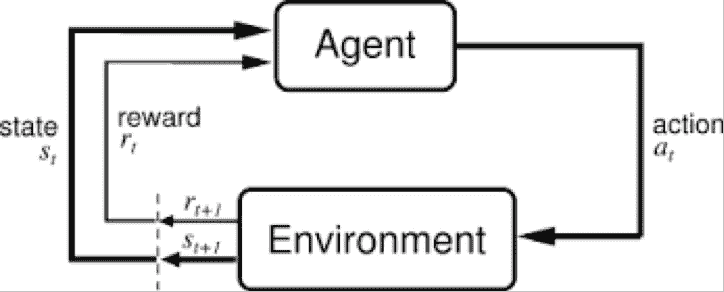
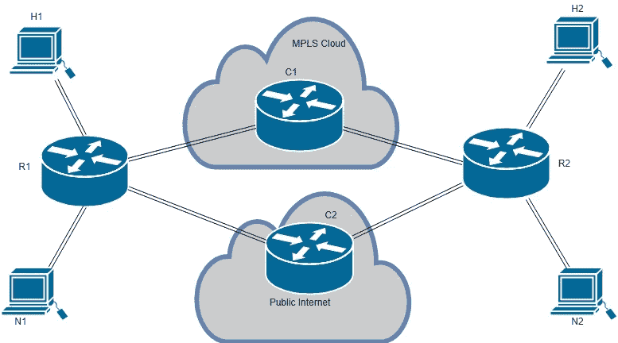
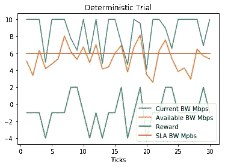
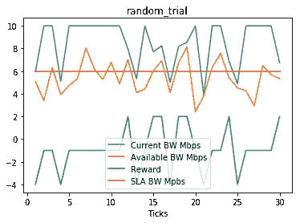

# 用于 SD-WAN 链接选择的开放 AI 健身房

> 原文：<https://towardsdatascience.com/open-ai-gym-for-sd-wan-link-selection-fe7dac671172?source=collection_archive---------9----------------------->


Credit: NVIDIA blog ([https://blogs.nvidia.com/blog/2018/04/30/nvail-deep-learning-iclr/](https://blogs.nvidia.com/blog/2018/04/30/nvail-deep-learning-iclr/)

强化学习已经成功地应用于机器人和玩电脑游戏。它在网络领域中的应用令人鼓舞，用于解决无线接入网络中的资源分配(Comsa 等人)，用于优化 WAN 和资源(Xiu 等人)，用于 SDN 中的路由优化(Stampa 等人)，并且该列表还在不断增长。在这篇文章中，我试图探索用强化学习来解决 SD-WAN 网络中一个非常相关的问题，即链路选择的想法。链路选择是 SD-WAN 解决方案的关键组成部分，是其解决方案的核心。在应用强化学习之前，需要模拟 SD-WAN 环境，以便 RL 算法通过反复试验来学习最佳行为。传统上，这些模拟被称为健身房，这是 openAI (gym.openai.com)创造的一个术语。在这篇文章中，我提出了如何编写一个 gym 来解决 SD-WAN 链路选择实验的想法。在这个体育馆上应用不同 RL 算法的结果将在后续文章中给出。

# 什么是 SD-WAN

软件定义的广域网(SD-WAN)提供了一种基于软件的覆盖架构，该架构基于传统广域网硬件上的软件定义的网络(SDN)技术。这简化了网络管理，将控制层移至云端，实现了网络虚拟化。(参考: [sdxcentral](https://www.sdxcentral.com/sd-wan/definitions/essentials-sd-wan-architecture/) )

SD-WAN 在分支机构站点和企业数据中心之间提供两条或多条备用路径，如下所示。动态成本优化来自于将流量从私有 MPLS 云切换到更便宜的公共互联网服务。对于 SD-WAN 网络而言，如何决定何时进行链路切换以及切换频率至关重要。进行关于 QOS 参数的连续测量来得出这个决定。(参考: [JuniperNetworks](https://www.juniper.net/documentation/en_US/cso3.2/topics/concept/ap-config-app-sla-profile-overview.html) )



Credit: https://www.sdxcentral.com/sd-wan/definitions/essentials-sd-wan-architecture/

# 什么是强化学习及其在 SD-WAN 中的应用

强化学习是一种机器学习，其中代理正在学习如何通过试验环境提供的各种选项来最好地利用周围环境。通过尝试不同的行动，代理人学会优化他从环境中获得的回报。(reinforcementlearning.ai-depot.com)

下图描述了典型的强化学习设置。代理正在与环境交互并尝试不同的动作。环境保持其状态，并由于与代理的交互而经历不同的状态变化，并提供回报。每一个强化学习系统都有一个目标，代理人通过试错来学习实现目标。代理的目标是通过学习一组最优动作来最大化这种回报。



Credit: [Sutton and Barto](http://incompleteideas.net/book/bookdraft2017nov5.pdf)

这种强化学习与 SD-WAN 的相关性可以通过一个实验来思考，在该实验中，代理正在切换 WAN 链路并试图最大化带宽利用率。这是通过在有足够带宽可用时切换到互联网云，然后在 QOS 数量开始下降时切换回 MPLS 来实现的。如何实现这种链路交换，从而以最小的 MPLS 链路利用率获得最佳带宽是目标。

# 开放式人工智能健身房

[Gym](https://gym.openai.com/) 是一个工具包，它为代理提供了一个平台，让他们在定制的环境中尝试和学习最佳行为。有像“翻筋斗”、“钟摆”和“山地车”等游乐场。

与健身房的典型互动如下所示

```
import gym env = gym.make('CartPole-v0')

env.reset()

for _ in range(1000):

env.render()

env.step(env.action_space.sample()) *# take a random action*
```

上面的每一步都返回四个值。这些是

1)“观察”——这实质上是捕捉环境的状态。

2)“奖励”——通过“行动”获得的衡量奖励。

3)“完成”——剧集是否完成

4)‘信息’—杂项信息

(更多见 https://gym.openai.com/docs/

# SD-WAN 的环境

任何健身房都是一个模拟环境，代理人可以尝试不同的动作并获得奖励。对于 SD-WAN，我们需要模拟所谓的“分支机构”和“总部”之间的 WAN 网络。在这个简化的网络中，存在两条备用路径，一条经由专用 MPLS 电路，另一条经由公共互联网。对于网络模拟，存在不同的技术，如 NS3、mininet 等。我选择 mininet 是因为它的简单性和对 SDN 应用的适用性。(更多信息见 mininet.org)。

在下面的设计中，我们有两个路由器 R1 和 R2，分别代表分支边缘路由器和总部边缘。



核心路由器 C1 代表 MPLS 路径，C2 代表公共互联网。目标是将流量从分支机构的主机 H1 发送到总部的主机 H2。我们还从主机 N1 向 N2 发送额外的流量，这模拟了互联网专用路径中的其它流量。

# 对环境的观察(或状态)

我选择了以下任一时间点的实验状态('打勾')。请注意，这些是在实验开始时以及代理采取任何“行动”时的任何“步骤”中测量的。

1)当前带宽——通过任何路径(如 MPLS 或公共互联网)获得的带宽量

2)可用带宽—这是互联网云中可用的带宽。假设 MPLS 路径有足够的带宽来满足任何需求。

3)链路 Id——在任何时刻传输流量的链路。

尽管像“延迟”和“抖动”这样的 QOS 参数在 SLA 管理中起着很大的作用，但我并没有从这里开始考虑它们。这些将在以后添加，以增强模型的实际用途。

# 行动

该代理的动作将是在 MPLS 和因特网之间进行选择。有两个独立的操作—链路 0(互联网)和链路 1 (MPLS)。任何动作及其状态转换都没有随机性。一条链路到另一条链路的切换是确定性的。

# 奖励设计

奖励是设计的关键部分，强化学习算法的性能在很大程度上依赖于奖励的设计方式。在设计奖励时，我必须牢记系统的目标。这里，SD-WAN 的目标是最大化互联网路径的带宽利用率，这是一个更便宜的选择。以下是设计奖励时要牢记的一些原则——

1)必须不惜任何代价维持 SLA，因此当前达到的带宽应该总是超过 SLA 规定的限制。当带宽低于 SLA 限制时，奖励应该被设计成严厉惩罚这样的失误。

2) MPLS 电路不是成本有效的，因此奖励应该阻止它的使用

3)上述的另一面是，互联网电路应该更经常地被使用。

4)无论做出何种选择，目标都是维持交通流量。所以每次‘滴答’都应该带来最小的正回报。

# 插曲

强化学习的实验有一个插曲的概念，意思是当实验或游戏被获胜的一方结束时。在 SD_WAN 的这个实验中，没有赢的这回事。数据传输可以无限期地进行，但是为了实验的目的，已经设计了最大滴答的人为限制。当“滴答”的次数超过这个限制时，就认为该事件结束了。

这一集还有另一种结束方式，那就是错误。每当连续两个时间“滴答”未满足 SLA 带宽时，就判定该事件已经结束，代理必须重新开始。

# 履行

SD_WAN 健身房已经使用 OpenAI 提供的指南实现(这里是关于如何实现定制健身房的信息—[https://github . com/open ai/gym/tree/master/gym/envs # how-to-create-new-environments-for-gym](https://github.com/openai/gym/tree/master/gym/envs#how-to-create-new-environments-for-gym))

SD-WAN 健身房代码已在 github(【https://github.com/amitnilams/sdwan-gym】T2)签到

一些简单的实验已经在健身房进行，以设定一些基线。像“深度 Q 学习”或“演员评论”这样的高级算法应该应用于这些基线。这个健身房的一个局限是它仍然是单代理环境。它不能用于多代理算法 A3C 算法。

# 确定性实验

对于确定性情况，只要当前带宽低于 SLA 限制，我们就需要选择 MPLS 电路。SLA 限制是环境的一部分，不会通过“观察”或状态来揭示。换句话说，这个实验知道这个模型的一切，以及奖励是如何设计的，等等。在选择行动的算法中没有随机性。这是一集的一些输出(最大滴答数= 30)

```
2018-12-06 11:28:40,296 - root - INFO - SdwanEnv - Version 0.1.0

('Initial State:', (0, '11.0', 0.0))

2018-12-06 11:29:11,627 - root - INFO - current bw:10.0, sla bw:6.0

('Ticks:', 1, 'Action:', 1, 'Ob:', (1, 10.0, 5.09), 'R:', -1, 'Total Reward:', -1)

2018-12-06 11:29:26,655 - root - INFO - current bw:10.0, sla bw:6.0

('Ticks:', 2, 'Action:', 1, 'Ob:', (1, 10.0, 3.3899999999999997), 'R:', -1, 'Total Reward:', -2)

2018-12-06 11:29:41,680 - root - INFO - current bw:10.0, sla bw:6.0

('Ticks:', 3, 'Action:', 1, 'Ob:', (1, 10.0, 6.34), 'R:', -1, 'Total Reward:', -3)

2018-12-06 11:29:56,719 - root - INFO - current bw:4.94, sla bw:6.0

2018-12-06 11:29:56,719 - root - INFO - BW is less than SLA

('Ticks:', 4, 'Action:', 0, 'Ob:', (0, '4.94', 4.19), 'R:', -4, 'Total Reward:', -7)

2018-12-06 11:30:11,768 - root - INFO - current bw:10.0, sla bw:6.0

('Ticks:', 5, 'Action:', 1, 'Ob:', (1, 10.0, 4.73), 'R:', -1, 'Total Reward:', -8)

2018-12-06 11:30:26,794 - root - INFO - current bw:10.0, sla bw:6.0

('Ticks:', 6, 'Action:', 1, 'Ob:', (1, 10.0, 5.34), 'R:', -1, 'Total Reward:', -9)

2018-12-06 11:30:41,820 - root - INFO - current bw:10.0, sla bw:6.0

('Ticks:', 7, 'Action:', 1, 'Ob:', (1, 10.0, 8.05), 'R:', -1, 'Total Reward:', -10)

2018-12-06 11:30:56,889 - root - INFO - current bw:7.76, sla bw:6.0

('Ticks:', 8, 'Action:', 0, 'Ob:', (0, '7.76', 6.2), 'R:', 2, 'Total Reward:', -8)

2018-12-06 11:31:11,915 - root - INFO - current bw:6.36, sla bw:6.0

('Ticks:', 9, 'Action:', 0, 'Ob:', (0, '6.36', 5.27), 'R:', 2, 'Total Reward:', -6)

2018-12-06 11:31:26,963 - root - INFO - current bw:10.0, sla bw:6.0

('Ticks:', 10, 'Action:', 1, 'Ob:', (1, 10.0, 6.77), 'R:', -1, 'Total Reward:', -7)

2018-12-06 11:31:42,018 - root - INFO - current bw:5.92, sla bw:6.0

2018-12-06 11:31:42,018 - root - INFO - BW is less than SLA

('Ticks:', 11, 'Action:', 0, 'Ob:', (0, '5.92', 4.89), 'R:', -4, 'Total Reward:', -11)

2018-12-06 11:31:57,045 - root - INFO - current bw:10.0, sla bw:6.0

('Ticks:', 12, 'Action:', 1, 'Ob:', (1, 10.0, 7.029999999999999), 'R:', -1, 'Total Reward:', -12)

2018-12-06 11:32:12,113 - root - INFO - current bw:4.80, sla bw:6.0

2018-12-06 11:32:12,114 - root - INFO - BW is less than SLA

('Ticks:', 13, 'Action:', 0, 'Ob:', (0, '4.80', 4.15), 'R:', -4, 'Total Reward:', -16)

2018-12-06 11:32:27,196 - root - INFO - current bw:10.0, sla bw:6.0

('Ticks:', 14, 'Action:', 1, 'Ob:', (1, 10.0, 4.4), 'R:', -1, 'Total Reward:', -17)

2018-12-06 11:32:42,219 - root - INFO - current bw:10.0, sla bw:6.0

('Ticks:', 15, 'Action:', 1, 'Ob:', (1, 10.0, 6.029999999999999), 'R:', -1, 'Total Reward:', -18)

2018-12-06 11:32:57,263 - root - INFO - current bw:7.21, sla bw:6.0

('Ticks:', 16, 'Action:', 0, 'Ob:', (0, '7.21', 6.91), 'R:', 2, 'Total Reward:', -16)

2018-12-06 11:33:12,279 - root - INFO - current bw:4.68, sla bw:6.0

2018-12-06 11:33:12,280 - root - INFO - BW is less than SLA

('Ticks:', 17, 'Action:', 0, 'Ob:', (0, '4.68', 3.7800000000000002), 'R:', -4, 'Total Reward:', -20)

2018-12-06 11:33:27,321 - root - INFO - current bw:10.0, sla bw:6.0

('Ticks:', 18, 'Action:', 1, 'Ob:', (1, 10.0, 6.720000000000001), 'R:', -1, 'Total Reward:', -21)

2018-12-06 11:33:42,360 - root - INFO - current bw:9.54, sla bw:6.0

('Ticks:', 19, 'Action:', 0, 'Ob:', (0, '9.54', 8.15), 'R:', 2, 'Total Reward:', -19)

2018-12-06 11:33:57,388 - root - INFO - current bw:4.12, sla bw:6.0

2018-12-06 11:33:57,388 - root - INFO - BW is less than SLA

('Ticks:', 20, 'Action:', 0, 'Ob:', (0, '4.12', 3.51), 'R:', -4, 'Total Reward:', -23)

2018-12-06 11:34:12,416 - root - INFO - current bw:10.0, sla bw:6.0

('Ticks:', 21, 'Action:', 1, 'Ob:', (1, 10.0, 2.5700000000000003), 'R:', -1, 'Total Reward:', -24)

2018-12-06 11:34:27,441 - root - INFO - current bw:10.0, sla bw:6.0

('Ticks:', 22, 'Action:', 1, 'Ob:', (1, 10.0, 6.33), 'R:', -1, 'Total Reward:', -25)

2018-12-06 11:34:42,478 - root - INFO - current bw:8.97, sla bw:6.0

('Ticks:', 23, 'Action:', 0, 'Ob:', (0, '8.97', 7.57), 'R:', 2, 'Total Reward:', -23)

2018-12-06 11:34:57,505 - root - INFO - current bw:6.57, sla bw:6.0

('Ticks:', 24, 'Action:', 0, 'Ob:', (0, '6.57', 5.42), 'R:', 2, 'Total Reward:', -21)

2018-12-06 11:35:12,538 - root - INFO - current bw:10.0, sla bw:6.0

('Ticks:', 25, 'Action:', 1, 'Ob:', (1, 10.0, 3.84), 'R:', -1, 'Total Reward:', -22)

2018-12-06 11:35:27,564 - root - INFO - current bw:10.0, sla bw:6.0

('Ticks:', 26, 'Action:', 1, 'Ob:', (1, 10.0, 4.27), 'R:', -1, 'Total Reward:', -23)

2018-12-06 11:35:42,582 - root - INFO - current bw:10.0, sla bw:6.0

('Ticks:', 27, 'Action:', 1, 'Ob:', (1, 10.0, 2.95), 'R:', -1, 'Total Reward:', -24)

2018-12-06 11:35:57,606 - root - INFO - current bw:10.0, sla bw:6.0

('Ticks:', 28, 'Action:', 1, 'Ob:', (1, 10.0, 6.49), 'R:', -1, 'Total Reward:', -25)

2018-12-06 11:36:12,646 - root - INFO - current bw:6.90, sla bw:6.0

('Ticks:', 29, 'Action:', 0, 'Ob:', (0, '6.90', 5.69), 'R:', 2, 'Total Reward:', -23)

2018-12-06 11:36:27,681 - root - INFO - current bw:10.0, sla bw:6.0

('Ticks:', 30, 'Action:', 1, 'Ob:', (1, 10.0, 5.34), 'R:', -1, 'Total Reward:', -24)

Episode finished after 30 timesteps
```

# 随机实验

这个实验的逻辑很简单。它对奖励是如何设计的一无所知，随机尝试一个动作，并希望得到最好的结果。以下是典型剧集的一些输出(最大滴答数= 30)

```
2018-12-06 11:38:11,893 - root - INFO - SdwanEnv - Version 0.1.0

('Initial State:', (0, '10.3', 0.0))

2018-12-06 11:38:43,886 - root - INFO - current bw:5.96, sla bw:6.0

2018-12-06 11:38:43,887 - root - INFO - BW is less than SLA

('Ticks:', 1, 'Action:', 0, 'Ob:', (0, '5.96', 5.09), 'R:', -4, 'Total Reward:', -4)

2018-12-06 11:38:58,917 - root - INFO - current bw:10.0, sla bw:6.0

('Ticks:', 2, 'Action:', 1, 'Ob:', (1, 10.0, 3.3899999999999997), 'R:', -1, 'Total Reward:', -5)

2018-12-06 11:39:13,947 - root - INFO - current bw:10.0, sla bw:6.0

('Ticks:', 3, 'Action:', 1, 'Ob:', (1, 10.0, 6.34), 'R:', -1, 'Total Reward:', -6)

2018-12-06 11:39:28,986 - root - INFO - current bw:5.08, sla bw:6.0

2018-12-06 11:39:28,987 - root - INFO - BW is less than SLA

('Ticks:', 4, 'Action:', 0, 'Ob:', (0, '5.08', 3.9299999999999997), 'R:', -4, 'Total Reward:', -10)

2018-12-06 11:39:44,027 - root - INFO - current bw:10.0, sla bw:6.0

('Ticks:', 5, 'Action:', 1, 'Ob:', (1, 10.0, 4.73), 'R:', -1, 'Total Reward:', -11)

2018-12-06 11:39:59,049 - root - INFO - current bw:10.0, sla bw:6.0

('Ticks:', 6, 'Action:', 1, 'Ob:', (1, 10.0, 5.34), 'R:', -1, 'Total Reward:', -12)

2018-12-06 11:40:14,080 - root - INFO - current bw:10.0, sla bw:6.0

('Ticks:', 7, 'Action:', 1, 'Ob:', (1, 10.0, 8.05), 'R:', -1, 'Total Reward:', -13)

2018-12-06 11:40:29,105 - root - INFO - current bw:10.0, sla bw:6.0

('Ticks:', 8, 'Action:', 1, 'Ob:', (1, 10.0, 6.2), 'R:', -1, 'Total Reward:', -14)

2018-12-06 11:40:44,134 - root - INFO - current bw:10.0, sla bw:6.0

('Ticks:', 9, 'Action:', 1, 'Ob:', (1, 10.0, 5.27), 'R:', -1, 'Total Reward:', -15)

2018-12-06 11:40:59,159 - root - INFO - current bw:10.0, sla bw:6.0

('Ticks:', 10, 'Action:', 1, 'Ob:', (1, 10.0, 6.77), 'R:', -1, 'Total Reward:', -16)

2018-12-06 11:41:14,184 - root - INFO - current bw:10.0, sla bw:6.0

('Ticks:', 11, 'Action:', 1, 'Ob:', (1, 10.0, 4.89), 'R:', -1, 'Total Reward:', -17)

2018-12-06 11:41:29,221 - root - INFO - current bw:7.94, sla bw:6.0

('Ticks:', 12, 'Action:', 0, 'Ob:', (0, '7.94', 7.029999999999999), 'R:', 2, 'Total Reward:', -15)

2018-12-06 11:41:44,247 - root - INFO - current bw:5.32, sla bw:6.0

2018-12-06 11:41:44,248 - root - INFO - BW is less than SLA

('Ticks:', 13, 'Action:', 0, 'Ob:', (0, '5.32', 4.11), 'R:', -4, 'Total Reward:', -19)

2018-12-06 11:41:59,285 - root - INFO - current bw:10.0, sla bw:6.0

('Ticks:', 14, 'Action:', 1, 'Ob:', (1, 10.0, 4.4), 'R:', -1, 'Total Reward:', -20)

2018-12-06 11:42:14,315 - root - INFO - current bw:7.70, sla bw:6.0

('Ticks:', 15, 'Action:', 0, 'Ob:', (0, '7.70', 6.02), 'R:', 2, 'Total Reward:', -18)

2018-12-06 11:42:29,341 - root - INFO - current bw:8.24, sla bw:6.0

('Ticks:', 16, 'Action:', 0, 'Ob:', (0, '8.24', 6.92), 'R:', 2, 'Total Reward:', -16)

2018-12-06 11:42:44,366 - root - INFO - current bw:5.00, sla bw:6.0

2018-12-06 11:42:44,367 - root - INFO - BW is less than SLA

('Ticks:', 17, 'Action:', 0, 'Ob:', (0, '5.00', 4.11), 'R:', -4, 'Total Reward:', -20)

2018-12-06 11:42:59,396 - root - INFO - current bw:8.18, sla bw:6.0

('Ticks:', 18, 'Action:', 0, 'Ob:', (0, '8.18', 6.720000000000001), 'R:', 2, 'Total Reward:', -18)

2018-12-06 11:43:14,427 - root - INFO - current bw:8.55, sla bw:6.0

('Ticks:', 19, 'Action:', 0, 'Ob:', (0, '8.55', 8.15), 'R:', 2, 'Total Reward:', -16)

2018-12-06 11:43:29,463 - root - INFO - current bw:10.0, sla bw:6.0

('Ticks:', 20, 'Action:', 1, 'Ob:', (1, 10.0, 2.41), 'R:', -1, 'Total Reward:', -17)

2018-12-06 11:43:44,517 - root - INFO - current bw:3.87, sla bw:6.0

2018-12-06 11:43:44,518 - root - INFO - BW is less than SLA

('Ticks:', 21, 'Action:', 0, 'Ob:', (0, '3.87', 3.83), 'R:', -4, 'Total Reward:', -21)

2018-12-06 11:43:59,554 - root - INFO - current bw:10.0, sla bw:6.0

('Ticks:', 22, 'Action:', 1, 'Ob:', (1, 10.0, 6.33), 'R:', -1, 'Total Reward:', -22)

2018-12-06 11:44:14,580 - root - INFO - current bw:10.0, sla bw:6.0

('Ticks:', 23, 'Action:', 1, 'Ob:', (1, 10.0, 7.57), 'R:', -1, 'Total Reward:', -23)

2018-12-06 11:44:29,622 - root - INFO - current bw:6.88, sla bw:6.0

('Ticks:', 24, 'Action:', 0, 'Ob:', (0, '6.88', 5.42), 'R:', 2, 'Total Reward:', -21)

2018-12-06 11:44:44,658 - root - INFO - current bw:4.89, sla bw:6.0

2018-12-06 11:44:44,659 - root - INFO - BW is less than SLA

('Ticks:', 25, 'Action:', 0, 'Ob:', (0, '4.89', 4.53), 'R:', -4, 'Total Reward:', -25)

2018-12-06 11:44:59,730 - root - INFO - current bw:10.0, sla bw:6.0

('Ticks:', 26, 'Action:', 1, 'Ob:', (1, 10.0, 4.27), 'R:', -1, 'Total Reward:', -26)

2018-12-06 11:45:14,755 - root - INFO - current bw:10.0, sla bw:6.0

('Ticks:', 27, 'Action:', 1, 'Ob:', (1, 10.0, 2.95), 'R:', -1, 'Total Reward:', -27)

2018-12-06 11:45:29,781 - root - INFO - current bw:10.0, sla bw:6.0

('Ticks:', 28, 'Action:', 1, 'Ob:', (1, 10.0, 6.49), 'R:', -1, 'Total Reward:', -28)

2018-12-06 11:45:44,806 - root - INFO - current bw:10.0, sla bw:6.0

('Ticks:', 29, 'Action:', 1, 'Ob:', (1, 10.0, 5.69), 'R:', -1, 'Total Reward:', -29)

2018-12-06 11:45:59,844 - root - INFO - current bw:6.76, sla bw:6.0

('Ticks:', 30, 'Action:', 0, 'Ob:', (0, '6.76', 5.34), 'R:', 2, 'Total Reward:', -27)

Episode Finished  after 30 timesteps
```

# 图表比较



确定性试验是每当因特网链路上的可用带宽超过 SLA 规定的值时进行链路切换。否则就是坚持 MPLS 链路的安全选项。从上面确定性试验的图表可以明显看出，每当链路切换到 MPLS 时，带宽上升到最大值，但回报变得平缓。

对于随机试验，没有这样的逻辑来跟踪互联网链路上的可用带宽。切换链接的选择是绝对随机的。从图中可以明显看出，即使互联网链路中有可用的带宽，由于其随机决策，它仍然坚持使用 MPLS 选项。然而，在这两种情况下，总报酬都没有上升趋势。相反，如下图所示，在两种情况下，它都迅速下降。


值得用其他更先进的算法，如“深度 Q 学习”或“A3C”来重新审视这些图表，并看看它们如何与这些基线保持平衡。这将在后续文章中讨论。

# 结论

软件定义网络有很大的潜力受益于各种机器学习算法的应用，而强化学习最有希望解决其一些核心问题。在这里，我们刚刚开始解决 SD-WAN 中的一个非常相关的问题，该问题有可能通过机器学习算法，特别是强化学习来解决。为了应用 RL 的原则，我们需要一个健身房来玩，我们创造了 SD-WAN 健身房。下一个挑战将是应用高级算法，如“深度 Q 学习”或“A3C ”,实际解决 SD-WAN 中链路选择的相关问题。

# 参考

Comsa，I. S .(未标明)。5G 无线接入网络中 QoS 驱动的调度— IEEE Xplore 。从 https://ieeexplore.ieee.org/document/8254926/[取回](https://ieeexplore.ieee.org/document/8254926/)

JuniperNetworks。(未注明)。 *SLA 配置文件和 SD-WAN 策略概述*。检索自[https://www . juniper . net/documentation/en _ US/CSO 3.2/topics/concept/AP-config-app-SLA-profile-overview . html](https://www.juniper.net/documentation/en_US/cso3.2/topics/concept/ap-config-app-sla-profile-overview.html)

reinforcementlearning.ai-depot.com(未标明)。从 http://reinforcementlearning.ai-depot.com/[取回](http://reinforcementlearning.ai-depot.com/)

sdxcentral。(未注明)。*SD-WAN 架构的要点:优势和选择*。检索自[www . sdx central . com:](http://www.sdxcentral.com:)[https://www . sdx central . com/SD-wan/definitions/essentials-SD-wan-architecture/](https://www.sdxcentral.com/sd-wan/definitions/essentials-sd-wan-architecture/)

斯坦福大学。*一种用于软件定义网络路由优化的深度强化学习方法*。从 https://arxiv.org/pdf/1709.07080.pdf[取回](https://arxiv.org/pdf/1709.07080.pdf)

萨顿河(未标明)。从 http://incompleteideas.net/book/bookdraft2017nov5.pdf[取回](http://incompleteideas.net/book/bookdraft2017nov5.pdf)

休河(未标明)。*工作负载工程:通过基于 RL 的工作负载放置优化广域网和 DC 资源*。从 https://arxiv.org/pdf/1703.06967 取回

# 下一篇文章:

[SD-WAN 链路交换机作为深度 Q 学习的强化学习实验](/sd-wan-link-switch-as-reinforcement-learning-experiment-with-deep-q-learning-7a39cd1e8722)