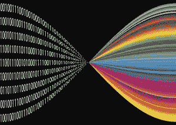

# 开放式学习依赖于非物质现象

> 原文：<https://towardsdatascience.com/open-ended-learning-relies-on-nonphysical-phenomena-cb1c596d81b6?source=collection_archive---------3----------------------->

Information is not a physical phenomenon but relies upon a system of interpretation.

## 在自发表'[以来的短暂时间里，机器学习是开放式的吗？我一直在思考机器学习技术很可能能够进行开放式学习的想法。我提出，让节点明确成为自然选择对象的方法可能是一个合适的前进方向，但我越来越确定这不会起作用。我回溯的原因是，我不相信简单地使一个节点成为自私的适应度最大化代理就足以使它成为一个进化对象。就像我如何论证迷因对象被编码在大脑网络结构的配置中一样，我认为同样的问题也适用于我自己的建议。因此，我现在非常确信，自然选择和其他优化算法将会因为同样的原因产生(或失败)同样的效果。](https://medium.com/towards-data-science/is-machine-learning-open-ended-75128deaf6af)

像基因或迷因这样的物体的问题在于它们不是物理的东西。如果我将产生相同效果的所有 DNA 片段集合起来，我会发现 DNA 的每个功能单位都包含不同的 DNA 序列。基因不是被定义为任何特定的 DNA 序列，而是被定义为功能单位。用哲学术语来说，进化理论的相关基因不是物质“标记”，而是信息“类型”。或者，换句话说，基因(或模因)是语义内容的单位，而不是纯粹的语法对象。令人沮丧的是，这样做的后果是，基因将永远是编码的非物质或非物质的产物，不能像我之前暂时设想的那样直接放入网络。

然而，我认为我对当前网络架构固定性的批评仍然有效。我强烈主张在培训前对网络设置采取一种无政府主义的方法，尽可能少地给出指导性的限制，以便为创造性的解决方案留出空间。神经网络的这种子结构方法的理想是用具有少量隐藏节点的网络开始训练，并使隐藏节点能够按照某种选择增长、分裂或消亡。如果成功，这种子结构主义将消除对神经网络设计艺术的需要，使网络结构本身没有固定的总体形式限制，如层排列、宽度和深度，这些限制了节点如何连接。通过做更少的假设，子结构主义也许能够容纳更多不同的对象。

我仍然认为网络编码和对象之间的关系是一个重要的设计问题:我们希望网络具有独立自然选择(或优化)的进化对象，但它们不能直接编码到学习架构中。概念上的问题是，我们不应该把进化对象看作是“存在于”环境中的东西，相反，进化对象是从一个主体和它们的环境之间的关系中出现的。进化对象，作为语义内容的单位，是由一串语法(在环境中“存在”)和一个主体对语法的主观解释(在内部)之间的相互作用产生的。因此，从智能体的角度来看，一个物理事物只有在值得解释为一个对象(通过将语法解码为意义)的情况下，才会成为一个经历选择*的进化对象。*

从进化的角度来看，人们可以很好地想象，在一群智能体通过一组共享的语法-语义相互关系进行通信之前，智能体在本质上发明了一种特殊的语法来存储关于个人经验和学习的信息。这种特殊的语法会让代理人的行为反应成为未成熟的迷因——我的意思是指无法通过交流复制并在代理人之间传播的迷因。如果代理人可以发明(或内置)某种系统来评估他们在任务表现上的成功，这种迷因可以在代理人的头脑中经历自然选择。但我不清楚，一个外部观察者如何能够区分一个具有大量指导性本能或这种早期模因学习的主体的行为或神经模式。这是心理学中一个古老的问题，它导致动物行为学(动物行为的研究)采取激进的行为主义，保守地忽略了动物具有早期迷因所能提供的精神状态的可能性。但是，[正如我在](https://becominghuman.ai/from-instinct-to-intelligence-has-ai-taken-a-wrong-turning-e84582dc4600)之前多次说过的，很少有动物的行为复杂到足以通过模因论进行分析。

当考虑机器时，原则上唯一的区别特征应该是表明机器正在利用心理语法来产生早期模因，即它们的行为应该非常灵活和有能力。在对当前形式的渐进式神经网络的数学进行进一步研究后，他们确实觉得在约束神经网络以保持整个网络中与先前训练相对应的部分方面相当“粗暴”。我仍然坚持认为，它们不同于灵活能力的模因形式。相反，正如我在本文前面所讨论的，子结构方法可能会产生必要的创造性，而不需要“硬编码”想要的结果。

但是，即使采取了亚结构的方法，我也不确定这是否足以产生不完整的迷因。我相信环境的复杂性扮演着极其重要的角色。如果环境非常简单，就没有理由为想法开发个人语法。语法首先是记忆的工具。语法不是有任何数量的模拟状态，而是创建一个明确的代码，可以用来存储学习的结果。

当你考虑儿童发展时，行为复杂性与语言发展的相关性并不是巧合(也见于[相关病理学](https://www.ncbi.nlm.nih.gov/pmc/articles/PMC3168536/))。正如我在这里广泛使用的术语，语法主要指音素的动词语法，因为正是这种语法使思想能够被编码(不一定是字母，尽管这是编码的后期和重叠发展)。能够真正地自言自语，可以增强推理、自我意识等能力，这是学习的基础。毕竟，通过这样的心理功能来处理编码的想法，使得一个想法可以在内部选择过程中作为不成熟的迷因与另一个想法进行比较。与模因评估的本能系统相比，这种模因学习是特殊的，因为它将模因从基因中分离出来，并使模因能够相互评估。虽然基因可以播种到评估系统，迷因成为推理的最终仲裁者。

但是，在过于纠结于人类的例子之前，很明显，有许多人类知识是隐性的——这意味着它不能被推理或在人与人之间传播。这样的知识显然不是模因，尽管它可能属于模因的这种‘本能评价’范畴。我认为非模因论的解释更好，因为一旦隐性知识被遗忘，就没有“标签”或等同物使一个单位的隐性知识被重新获得。被遗忘的隐性知识不能通过记忆重新获得，而必须通过经验重建。因此，这样的知识在头脑中并没有真正的位置，因为它实际上是一种潜意识或运动可塑性。

根据行为控制的模因和塑料部分之间的这种区别，我们不应指望大脑是一个单一用途的思维机器，因为它涉及到如此多的其他身体控制，这些控制最好留给它们自己的设备，从呼吸到平衡。同样，我们不应该指望人工神经网络代表一个统一的模因推理系统，因为还有其他功能最好留给非模因过程，如可塑性。本质上，我们面临的问题是如何为机器学习代理设计环境，以促进具有模因品质的“心智模块”。最明显的变化是增加了学习环境和感觉运动系统的复杂性，使代理能够与学习环境进行交互。人工智能研究人员已经开始这样做了，特别是 DeepMind，他们不断增加他们的 DQN 代理在中玩的游戏的复杂性。但要知道这是否会像人们希望的那样有所回报还为时过早。

对于人工智能来说，这是一个非常有趣的时代，事情发展得如此之快。(事实上，我写帖子的当天就给自己回复了！)在我的困惑和回溯之后，我认为现有的技术很可能能够进行(开放式的)模因式学习，并将有力地支持两个关键领域的发展:1)像以前一样，给予机器更多的权力来设计它们自己的网络架构，以及 2)以新的重点，增加机器代理的环境和感觉运动者对这些环境的访问的复杂性。最后，我还要强烈重申“[从本能到智能](https://becominghuman.ai/from-instinct-to-intelligence-has-ai-taken-a-wrong-turning-e84582dc4600)”的信息:你可以设计一台*看起来*通过复杂的“硬编码”本能网络的任务能力具有智能行为的机器，许多动物可能都有，但类似人类的智能行为有一些根本的不同，因为*我们在变得智能之前就变得有知觉*。机器学习的含义是，现有的技术将继续收集更多的奖杯，但人工智能确实需要一种仿生方法来改变正在生产的智能机器的联盟。制造一台具有模因能力的机器很可能是制造 AGI 的实际目标，但要知道如何设计 1)潜在模因智能体的适当子结构，以及 2)适当的环境，以实现智能体的模因潜力，仍然很棘手。

我对这个结论比我今天早些时候发布的[更有信心，但是我很想听听你的想法和评论。感谢阅读！](https://medium.com/towards-data-science/is-machine-learning-open-ended-75128deaf6af)