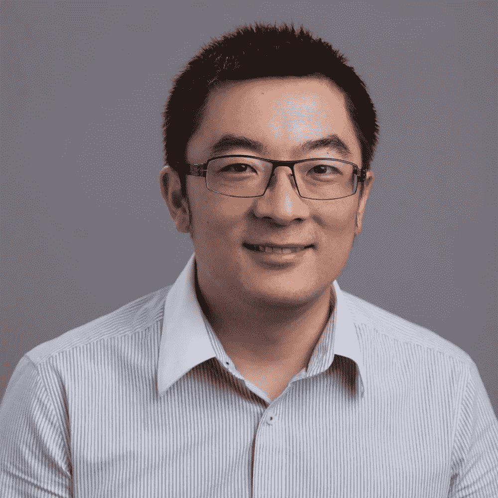

# OpenHouse。人工智能:通过透明扰乱房地产

> 原文：<https://towardsdatascience.com/openhouse-ai-disrupting-real-estate-through-transparency-4156b1ab620f?source=collection_archive---------17----------------------->

技术如何改变一个受到严格监管、拥有强大制衡、信息受到严格保护的行业？房地产行业主要由独立的房地产经纪人组成，由经纪公司和全国房地产协会统一管理。在这种寡头垄断的范围内，有一些规则保护其参与者，并确保市场维持对几十年来定义的结构的依赖。

与此同时，市场已经发展成为由信息驱动的按需经济。如今，购房者越来越容易获得信息，这使得他们在某些方面可以绕过中介。对即时满足和以最低成本找到最佳价值的知识的需求正在慢慢演变这个行业。房地产如何在未来十年取得成功将完全取决于购房者习惯的改变，他们默许慢慢拆除这一市场结构，以改善买家对信息的获取，同时创造新的价值来源。

一家总部位于卡尔加里和多伦多的初创企业正在为这种颠覆铺平道路，并向参与者发起挑战:房地产经纪人和购房者对这些交易有不同的看法。OpenHouse。AI 是一个基于云的数据和功能丰富的住宅房地产网络平台，使买家和卖家能够通过清晰和透明做出更好更快的房地产决策。

这些由和 Yanky Li 创立的年轻企业家们正在真正地解开一个非常传统的模式，并创造一个平台，在这个平台上，免费信息极大地改变了游戏规则。

# 条条大路通 OpenHouse。人工智能

张智峰在 R&D 工作了 12 年多。他毕业于法国，获得软件工程硕士学位，曾在多个行业的技术领域工作，包括公用事业、金融、电信和会计。当他从 NYU 商学院毕业时，他经历了一次“觉醒”，改变了他开始思考的方式。

> 我想在生活中做一些更有意义的事情，更直接地帮助人们创造积极的社会影响，而不仅仅是薪水和提前退休。我总是觉得我必须改变才能保持原样，做真实的自己。成为企业家对我来说再好不过了。

杨基李本质上一直是一个企业家，年轻时总是向家人、朋友和同学卖东西。他记得在小学时，他饲养并出售仓鼠，通过在学校进行的交易和装在塑料豆腐容器中的存货赚了一些钱。这些年来，他在商业和技术领域度过了他的职业生涯。通过咨询和项目管理的角色，他不断地寻找解决方案，并被期望能够快速思考。为他人工作并实现他们的梦想并不那么令人满意。杨基想要实现自己的梦想。

OpenHouse 的愿景。人工智能是连接人，而公司则提供洞察力。对 Will 来说，这个平台的想法源于他的经历。在他的职业生涯中，他幸运地见证了信息的释放，这将比任何一个人产生更广泛的影响。在开源运动下创建的应用程序，特别是在机器学习社区，已经取得了长足的进步。维基百科创立的理念是“每个人都可以自由获取所有人类知识的总和”，它利用社区和信任的力量来维持自身。一天，威尔和一个同样从事高级分析研究的朋友在一起，他们都意识到可以运用自己的技能帮助普通购房者做出人生中最重要的决定之一。

> 我女儿出生后，我和妻子在看一个开放的房子。我见到了店主。他开始带我们参观他的家，并谈论他对房子进行的翻新和升级(这些信息大多不在房地产清单上)。这对我们来说是一次很棒的购买体验。我希望我有更多这样的东西。就在那时，我构思了一个产品，将房主和房地产经纪人联系起来，在购买过程中创造更好的体验。我和我的老朋友 Yanky 分享了这个想法:我们建立一个允许人们贡献信息的产品。然后，我们部署技术来聚合和分析信息，并将数据开放给任何想要使用它的公司或第三方。

对杨基来说，这是一个影响世界的机会:

> 我已经获得了很多经验，我想把它带到一个新的水平，并影响人们的生活。我挨家挨户地去听人们的故事(我们了解他们的痛点)。我们正处于一个技术普及、成本降低的时代，初创公司正试图通过利用技术来帮助人们。我们没有房地产背景，所以我们进入这个问题:这应该如何工作？

# 你如何改变心态？

你如何告诉房地产经纪人，他们一直是真相的行业守护者，释放这些信息不会把他们的工作置于危险之中？创始人的使命是为每个人创造积极的影响。当技术以正确的方式创造并正确部署时，它可以增强人们的能力。

对于房地产经纪人来说，技术可以提供有价值的洞察力。人际关系也很重要。在房地产行业，关系至关重要。这些经历推动了更多的业务。OpenHouse。AI 将为房地产经纪人提供更有意义的见解，让他/她更好地了解社区，以加强这些关系。随着大数据的出现，来自世界各地的信息使技术能够积累更多的洞察力，从而为用户提供更多的价值。虽然代理人有信息，随时可以获得实时的，相关的信息仍然难以捉摸。如果房地产经纪人有更好的信息，他们可以为客户提供更好的服务。按照遗嘱:

> 我们正在创建一个不偏不倚的信任平台，将使信息随时可用。

杨基同意。在最近一次对一家经纪公司的采访中，他们花了过多的时间编写报告和做研究。如果他们有能力即时访问数据，他们就可以专注于他们最擅长的事情:发展良好的关系，并向人们展示合适的房屋。

对于购买者来说，目标是使他们能够做出更明智的决定，并确保这些决定是有效的。对于销售者来说，他/她可能会评价不同的销售方式。他们上演吗？他们翻新吗？他们卖多少钱？OpenHouse。人工智能将通过数据将卖家与市场联系起来，这样他们就可以优化他们的销售决策。

向所有人开放这些信息会创造一种透明度，这反过来会在利益相关者之间培养一种急需的信任。

# 在数据保护中释放信息的二分法

随着人工智能开始流行，人们对用户数据的收集、安全和处理感到担忧和谨慎。于 5 月 25 日生效的《欧洲通用数据保护条例》( GDPR)也指出，需要仔细审查数据是如何汇编的，以生成关于个人及其倾向的背景。

威尔介绍了他们的赋权价值观:

*   让人们能够使用人工智能做决定
*   通过让人们控制平台可以访问哪些信息以及哪些信息将与他人共享，来增强人们的能力。

他们是“人民数据”的坚定信仰者。人们对分享他们的信息有不同的舒适度。让他们选择分享他们愿意分享的数据，例如个人信息。在许多情况下，他们可能会分享他们的购买偏好，如房屋特征、邻里要求，即允许平台为他人创造洞察力的信息类型。按照美国佬的说法，

> 当个人需要时，来自整体的贡献使他们受益。

威尔补充说，人工智能将影响成本节约，并将成为一个重要的利润驱动因素，并影响就业。然而，他不相信它会淘汰或取代人类。这将解放人们以不同的方式思考，随着时间的推移，他的公司准备启用和验证这一点。

让人们能够控制他们的数据意味着确保隐私功能嵌入到平台的所有层中。当卖家想要列出房屋时，他们可以选择隐藏任何他们不想在网站上透露的信息。他们也可以选择不使用用于分析的信息。作为一个数据聚合器，OpenHouse。AI 的设计理念是向用户传达他们在旅程的每一步将会获得什么。

> 隐私权是一种权利。用户需要具备这一点，才能对您的系统产生信任。

这种将人们联系起来、做出更好的决定、赚钱和默许人们的隐私的哲学——都共存于一个系统中吗？杨基强调这是可能的。关键是不断从市场中学习，迭代并提供一个优化社区体验的平台，并提供保持其运行的价值和信任。Yanky 指出，他们参加了真正的北方会议，在那里他们积极参与了对《T2 永久技术宣言》的完善。他们当然也自己签了名。组织者阐述了这一宣言的前提:

> *如今，随着新技术的不断进步，我们有机会退一步，讨论如何深思熟虑地使用技术。随着加拿大在全球科技舞台上声名鹊起，我们相信我们已经做好了举行这些重要对话的准备。* ~ Steve Currie，Communitech 首席创新官。
> 
> *加拿大商业领袖和他们的组织处于理想的位置，以确保他们开发和使用的技术合乎道德、包容和公平地为所有人追求“好”的结果。* ~ Peter Barr，德勤滑铁卢和西安大略地区管理合伙人。

这是重要的一步，不仅仅是在沟通 OpenHouse 方面。人工智能的价值，还在于确保它在整个平台上得到功能性的转化。

# 颠覆的时代和对未来十年的展望

威尔关注 AI 的大规模部署，并设想它将如何扰乱人们的日常生活。但是，通过技术创造解决迫在眉睫的粮食危机、疾病发病率和迫在眉睫的能源危机的方法来改善人们生活的机会显示了巨大的希望。与此同时，技术可以大幅降低基本生活成本，改善每个人的福祉。

对于 Yanky 来说，他设想随着创新的增加，技术社区在政策上有更多的发言权。目前，在努力跟上技术发展的过程中，政策和监管存在滞后，减轻这种风险的最佳方式是让技术在与企业和政府监管机构的谈判中占有一席之地。这将迫使政府与市场变化和消费者偏好保持同步。

通过允许商业和技术公司更道德地使用数据，技术有能力最小化社会的财富差距。随着社交媒体的出现，Joe Public 获得了一个扩音器，AI 有能力释放每个人手中的信息。这种不可避免性将要求所有层面的问责制:用户、企业、系统和政府。

OpenHouse。艾:这些门什么时候会开？按照遗嘱，

> 计划首先在 AB 的卡尔加里进行测试，以确保产品适合市场。不着急。我们希望确保买家、卖家和房地产专业人士之间的价值。我们知道这需要时间。我们知道这会带来怎样的影响，所以我们真的需要正确地构建它。一旦发布，我们将不断改进，一次推出一个城市。

忠于他们的价值观，以使平台有用为目标是最重要的。优先考虑创造经济和社会影响的目标，而不是货币化，将保持开放门户。人工智能在通往可持续发展的道路上走得更少。对威尔来说，他将继续倾听市场，学习和更新平台，用他自己的话来说，“不断变化，以保持真实的自我”。

**约** [约**开房。艾**](http://openhouse.ai/)

在过去的十年里，张智峰一直致力于运筹学、产品商业化、技术咨询和 R&D 组织设计方面的先进技术。他拥有商业分析和软件工程硕士学位，曾在欧洲和北美的公用事业、金融、能源和会计领域带头发起技术倡议。

Yanky Li 的职业生涯几乎都在致力于平衡业务和技术。作为特许专业会计师和项目管理专家，Yanky 在世界各地领导了许多成功的项目，在这些项目中，他利用技术为业务问题设计解决方案。他本质上一直是一个企业家，他的动力是为人们创造影响，倡导包容性的社会变革。

这篇文章最初发表在[福布斯](https://www.forbes.com/sites/cognitiveworld/2018/07/11/openhouse-ai-disrupting-real-estate-through-transparency/#7e84e37d79c0)上