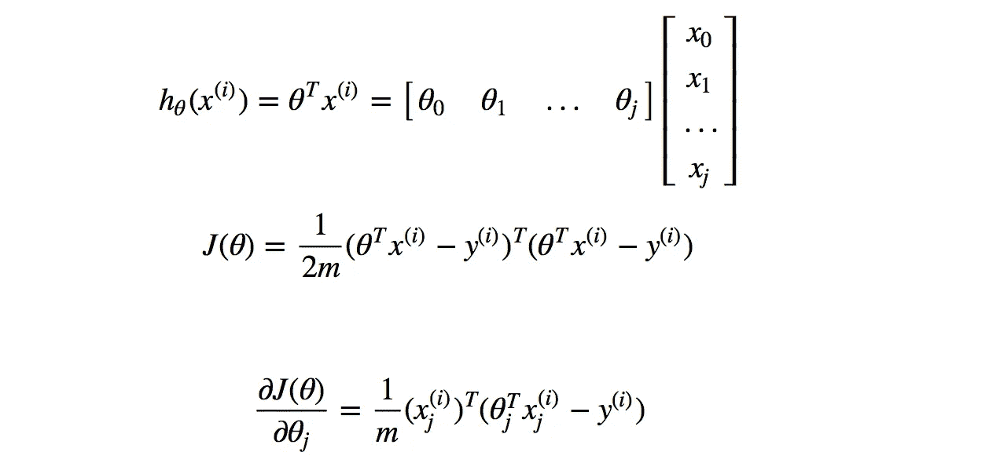
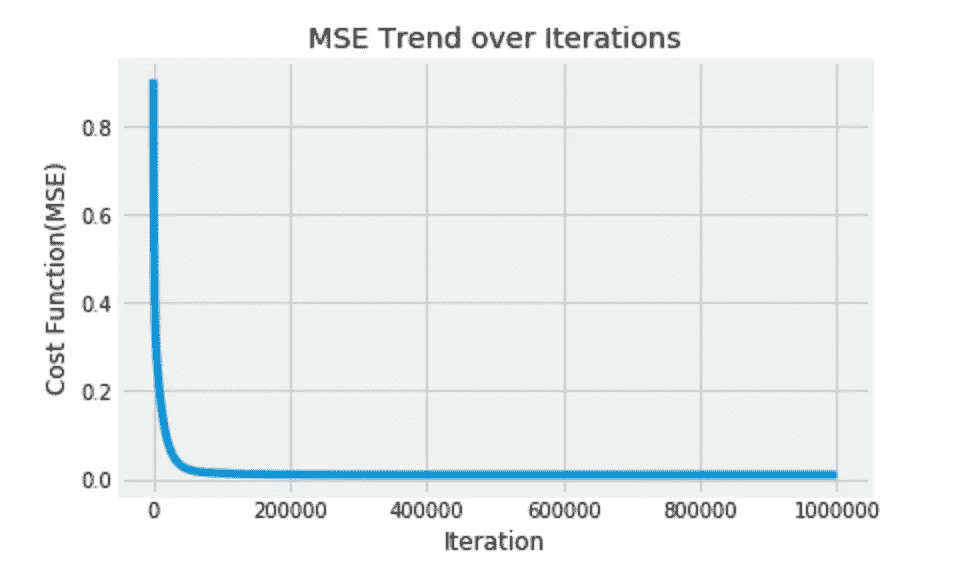
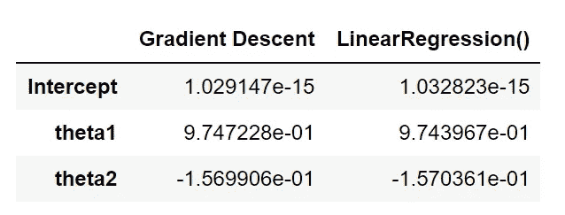

# 最优化:引擎盖下的损失函数(上)

> 原文：<https://towardsdatascience.com/optimization-of-supervised-learning-loss-function-under-the-hood-df1791391c82?source=collection_archive---------8----------------------->


在建立机器学习模型时，我通常会想到类似这样的问题:模型是如何优化的？为什么模型 A 的表现优于模型 B？

要回答这些问题，我认为一个切入点可以是了解不同模型的损失函数，此外，能够根据项目的目标和误差类型的容限选择合适的损失函数或自定义损失函数。我将发表一系列博客，讨论几种常见的监督学习模型的损失函数和优化算法。我会尽量用对没有很强数学背景的观众友好的方式来解释。让我们从第一部分开始，线性回归。

对于监督学习，通过找到最小化成本函数的最佳系数来优化模型。成本函数是用损失函数计算的每个数据点损失的总和。我们选择使用的模型是我们的假设。这是线性回归模型的假设。


线性回归最常用的损失函数是**最小二乘误差**，其代价函数也被称为**均方误差(MSE)** 。


从公式中可以看出，成本函数是一条抛物线。为了最小化它，我们需要找到它的顶点。它可以通过分析或使用编程算法来解决。在这篇博客中，我将重点介绍最流行的编程解决方案之一，**梯度下降**，来完成优化过程。梯度下降广泛应用于不同的模型中，其基于学习速率α采取步骤，向抛物线的顶点移动以找到线性回归的全局最小值，该点也称为斜率等于 0 的点。为了得到斜率，我们对每个系数θ的成本函数求导。


From: [https://hackernoon.com/gradient-descent-aynk-7cbe95a778da](https://hackernoon.com/gradient-descent-aynk-7cbe95a778da)

接下来，通过大量迭代不断更新每个θ，同时观察成本函数的降低，直到它达到一条水平线。实际上，由于所选择的步长，斜率不可能达到 0 的精确值，但根据超参数，它可以尽可能接近 0。


现在记住这些概念，让我们使用真实世界的数据(来自 [UCI 机器学习库](https://archive.ics.uci.edu/ml/machine-learning-databases/housing/)的 Boston Housing 数据)。由于我在这篇博客中只演示了优化部分，所以我将跳过所有的过程，如探索性数据分析、特征工程等。，并直接转到数据标准化，为预测做好准备。我们来看看前几行数据。


为了解释简单，我选择了两个特征(RM:每套住宅的平均房间数，年龄:1940 年之前建造的自有住房的比例)来进行预测，目标变量是 MEDV(以 1000 美元为单位的自有住房的中值)。为了计算效率，我把所有的计算转换成矩阵格式。下面是用于假设、成本函数、成本函数导数的矩阵，以及用于矩阵计算的 python 查询。



```
# Instantiate a hypothesis
hypothesis = X@theta - y# Calculate cost function
def cost(theta, X=X, y=y, m=m):
    cost = np.transpose((X@theta - y))@(X@theta - y)
    cost = (1/(2*m))*cost
    return cost# Calculate derivative of cost function
def cost_dev(j, theta, X=X, y=y, m=m):
    dev = X[:, j]@(X@theta - y)
    dev = (1/m)*dev
    return dev
```

所有系数在开始时都设置为 1。下面的查询返回 100，000 次迭代来同时更新系数。当趋势开始变平时，这意味着梯度下降已经收敛，并且已经达到成本函数的最小值。

```
# Assign a learning rate
a = 0.001cost_list = []
theta_temp = np.zeros(theta.shape)
theta_list = []for i in range(100000):

    for j in range(len(theta)):
        theta_temp[j] = theta[j] - a*cost_dev(j, theta)

    theta = theta_temp        

    theta_list.append(list(theta))
    cost_val = cost(theta)
    cost_list.append(cost_val)
```


我们能让这种趋势变得更好，更自信地说确实达到了最低水平吗？如果我们将学习率调整为 0.0005，迭代 1，000，000 次，会发生什么？



这种趋势看起来很疯狂。这并不是一个很好的成本函数演示，但我们可以对优化的结果非常有信心，假设最小均方误差达到当前设置。我们来对比一下刚刚手动从梯度下降算法得到的系数和从 Scikit-learn LinearRegression()得到的系数，数据集相同。



哒哒！他们几乎是一样的。这个博客的目标是揭示机器学习模型的基本优化秘密。梯度下降有许多高级变体，Scikit-learn 软件包中也应用了其他算法。当然，在大多数情况下，没有必要被那些数学问题所困扰。然而，能够理解引擎盖下的损失函数有助于我们作为机器学习工程师前进到下一个级别！

未完待续……