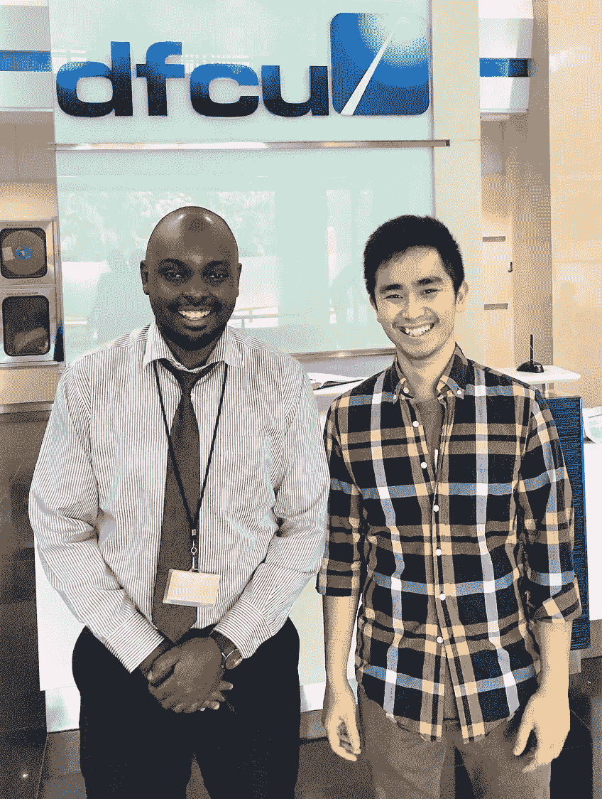
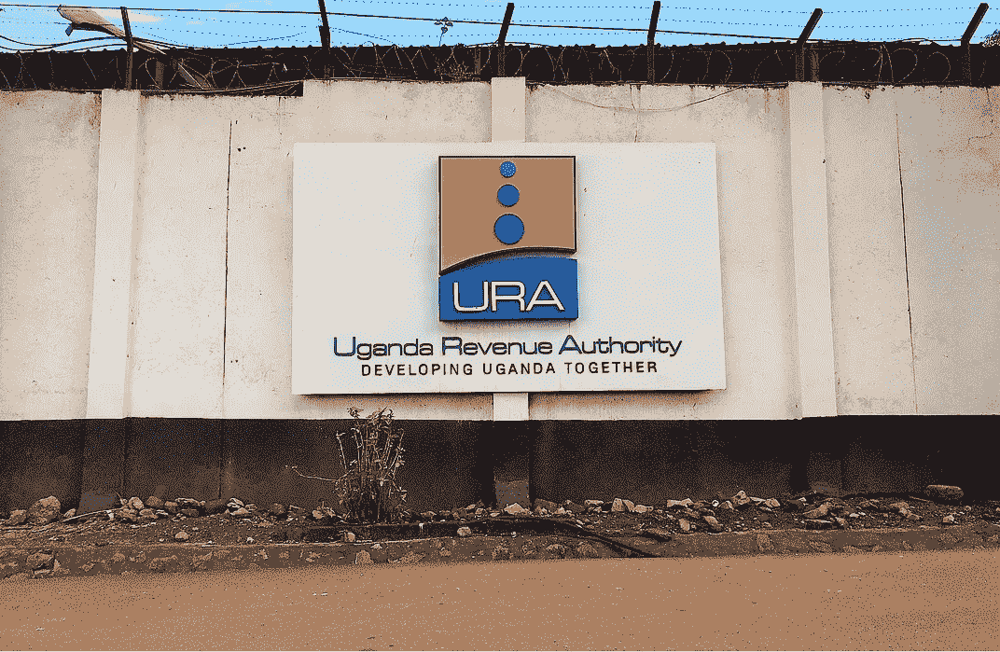
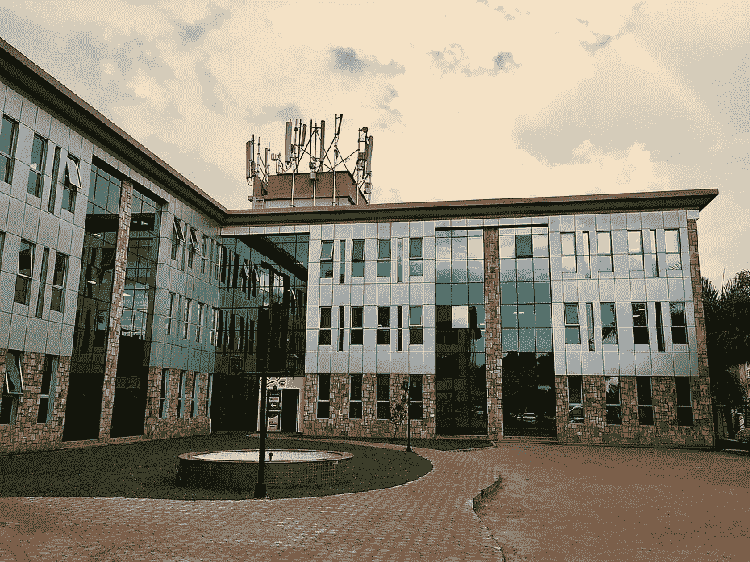

# 优化问题

> 原文：<https://towardsdatascience.com/optimization-problem-5abe4792542c?source=collection_archive---------7----------------------->

最近，通过微软的一项计划，我有机会在乌干达坎帕拉作为一名部署数据科学家呆了两周。整个经历帮助我形成了对志愿者工作的一些看法，我想从我在非洲的时光中获得一些想法和经验。

在过去的一个月里，我收拾行李前往非洲，通过微软的一项名为 [MySkills4Afrika](https://myskills4afrika.cloudapp.net/) 的计划前往坎帕拉，该计划旨在招募非洲缺乏技能的技术人员。我与四个合作伙伴——乌干达政府、乌干达发展金融公司、世纪银行和 MTN——合作，试图帮助他们重塑数据仓库、科学和分析能力。

Four organizations I worked with

起初，我有一个清晰的计划来做这件事。首先，获取他们的数据集，清理，参数化。第二，建立一个清晰的模型，提供一些商业洞察力。最后，共享该模型，以便组织可以复制和定制它。三步走，简单吧？没有那么多——在我来到这个国家的头几天，我很快意识到，我必须大幅改变我的方法。否则，我将成为非洲大陆上无数善意的志愿者中的一员，他们做着工作，但不一定是他们需要的工作。

那么，我要改变什么呢？事实证明，对于我工作过的组织来说，我必须采取一种更加量身定制的方法。每个人都有不同的数据基础架构、数据科学专业知识水平和与我相处的时间。

对于乌干达发展金融公司(DFCU)和世纪银行来说，他们都非常渴望与我会面，但缺乏数据专业知识，也不准备对他们的数据实施机器学习(ML)。因此，关于使用哪种语言、模型或方法的对话并没有特别大的帮助。相反，我花时间与 DFCU 和世纪银行讨论了他们可以采取的未来数据分析能力投资——自动化仪表板，这样员工就不会把所有时间都花在那里，并投资学习 SQL 和 Python，以便他们可以更轻松地挖掘数据。我提供了具体的例子，并向他们指出了他们可以利用的资源。

Isaac Niwamanya (business intelligence specialist at DFCU, left), Kenneth Kyobe (data analyst at Centenary Bank, right) and me

他们的数据科学负责人 MTN 在构建 ML 管道和模型方面经验丰富，因此我提供了实验设置反馈，并对他的代码进行了同行评审。在许多方面，与 MTN 的数据科学领导一起工作非常类似于我在微软与同事之间的互动。最后，对于乌干达税务局来说，他们对数据科学能力感兴趣，但希望获得一个具体的例子，说明如何利用这些能力来具体帮助他们的税收工作。为了给他们提供一些切实的东西，我访问了他们的数据子集，并建立了一个分类器，用于预测哪些地区将无法达到他们在本季度的预计税收目标。

Headquarters of Uganda Revenue Authority and MTN in Kampala

据我所知，每个组织都有这样一套独特的需求。在任何规划文件或旅行前电话中不明显的需求。不同的文化基础和动机。资金和变革意愿的梯度。关于数据对决策的重要性的各种立场。

在我的旅行之前，我已经陷入了许多其他非洲志愿者已经陷入的陷阱，我把乌干达归类为一个单层的国家，我认为一个适合所有人的志愿服务优化方法会有所帮助。甚至在我返回美国时，我发现自己反复被问及我在乌干达的经历，好像我在那里的时间是对整个非洲大陆的精确测量。作为第一代越南裔美国人，我非常清楚被一概而论地强加于你的挫败感。这种情况在世界其他地方已经屡见不鲜，我们不能在非洲继续犯同样的错误。自从我回到西雅图，开始与朋友和同事分享我的经历，我就试图突出乌干达惊人的多样性以及它在非洲大陆上的独特性。非洲的广大组织和人民不会从普遍的帮助中受益；相反，在志愿工作方面，他们应该得到量身定制的独特方法。