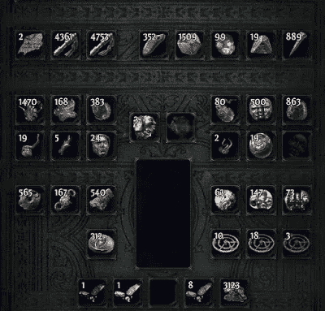

# 混乱中的秩序(球体):流亡者动荡经济之路中的新兴模式

> 原文：<https://towardsdatascience.com/order-within-chaos-orbs-emerging-patterns-in-path-of-exiles-volatile-economy-dfb81c08bd73?source=collection_archive---------24----------------------->


Path Of Exile: Necromancer

你可能听说过流放之路。一款由 Grinding Gear Games 发行的免费动作角色扮演游戏，让你扮演流亡者的角色。一个看似命运多舛的弃儿，因为各种各样的原因被逐出文明，这取决于你的角色的职业。这个游戏的重点是简单地通过世界上所有被称为 Wraeclast 的区域，并参与各种支线剧情(或者我们玩家喜欢称之为“残局”)

在你的 Wraeclast 之旅中，你会遇到数千种类型的战利品。一些物品，一些独特的物品，和许多不同的货币，允许你修改你的物品和技能。



Path of Exile: A few types of currency

《流放之路》的魅力之一就来自于这一大堆战利品，那就是交易。一些玩家投入大量的时间，甚至全部时间来交易。这些交易员怎么可能赚钱？他们如何跟随市场？当每天有成千上万的交易发生，有成千上万不同的商品被买卖时，交易者如何在混乱中找到自己的位置？

当然是数据科学！对于这个特别的项目，我使用了 GGG 的公共 API，做了大量的网络搜集工作。仅货币一项，我总共收集了近 6000 万个数据点。然后，我拿到了我最喜欢的六种货币的分布情况，其中包括令人垂涎的尊贵宝珠。


现在，看着这个分布，被高举的球体立即出现在我眼前，因为它接近于符合钟形曲线。所以我决定先探索一下。我用如下模式将我的数据框架中的所有货币分段

```
standard_league = currency_all.loc[currency_all.League == 'Standard']
abyss_league = currency_all.loc[currency_all.League == 'Abyss']
bestiary_league = currency_all.loc[currency_all.League == 'Bestiary']
delve_league = currency_all.loc[currency_all.League == 'Delve']
harbinger_league = currency_all.loc[currency_all.League == 'Harbinger']
incursion_league = currency_all.loc[currency_all.League == 'Incursion']
```

所以现在我们有了一个包含每个联盟所有货币交易的数据框架。但是我不想要所有的货币，我只想要那个高贵的球体。所以我再一次像这样分割数据帧。

```
exalted_standard = standard_league[standard_league['Buying(1)'] == 'Exalted Orb'].sort_values(by='Date').reset_index(drop=True)exalted_abyss = abyss_league[abyss_league['Buying(1)'] == 'Exalted Orb'].sort_values(by='Date').reset_index(drop=True)exalted_bestiary = bestiary_league[bestiary_league['Buying(1)'] == 'Exalted Orb'].sort_values(by='Date').reset_index(drop=True)exalted_delve = delve_league[delve_league['Buying(1)'] == 'Exalted Orb'].sort_values(by='Date').reset_index(drop=True)exalted_harbinger = harbinger_league[harbinger_league['Buying(1)'] == 'Exalted Orb'].sort_values(by='Date').reset_index(drop=True)exalted_incursion = incursion_league[incursion_league['Buying(1)'] == 'Exalted Orb'].sort_values(by='Date').reset_index(drop=True)
```

现在，我们有了每个联盟的每个尊贵球交易的数据框架。在这一点上，我决定把我的数据制成图表，把日期作为我的 x 轴，把它卖出的混沌球的数量作为我的 y 轴。


从图表上看，每个联盟都出现了一个非常清晰的模式。对于新联盟的前三分之一，尊贵球体的价格急剧上升。对于联盟的其余部分，它开始正常化。这种模式在六个不同的新兴经济体中持续了整整一年。这是一种模式，将继续重复自己，直到崇高的球体变得无关紧要，虽然我没有预见到这种情况会发生。

这种模式不是尊贵的球体独有的。虽然不是所有的货币，但这种现象在许多货币中都存在。这里有另一个货币的例子，你可以在前两周购买/耕种，并获得可观的利润(与其初始联盟价格成比例)。在所有联盟中，它都有一个非常相似的模式。


那么，怎么才能赚钱呢？好吧，如果你只经营高贵的球体，你会在联赛的前两个星期购买高贵的球体，然后在顶峰时卖掉它们。

无论如何，如果你能以少于 120 个混乱之球获得尊贵之球，你将会获利。正如你所看到的，标准联盟，这是持久的，有一个强大的货币基线。你可以对游戏中的任何货币这样做。虽然肯定有一些货币你不会从中获利。

我们可以利用这种知识，这种对模式的认识来将我们的收益资本化，并防止在不正确的时间段买卖货币类型。感谢您的阅读，我们在 Wraeclast 再见！