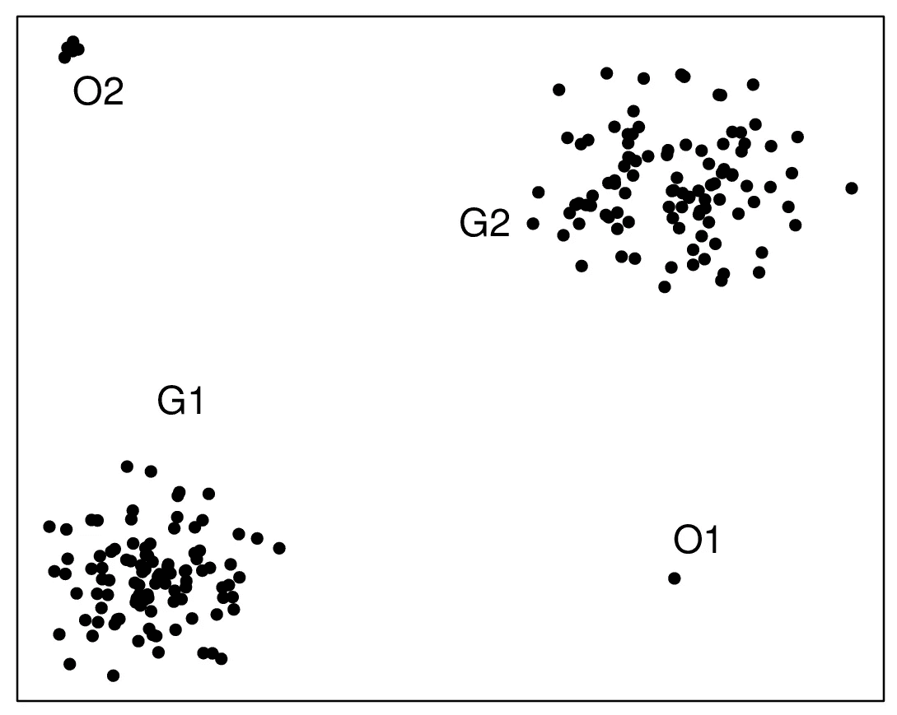

# 我们脆弱的大脑在客观分析方面很糟糕

> 原文：<https://towardsdatascience.com/our-feeble-human-brains-are-terrible-at-objective-analytics-5d882ec858b?source=collection_archive---------18----------------------->

科学家们不时遇到的一个问题是(有意或无意地)将数据引向他们希望的地方，而不是跟随数据走向它实际引导的地方。这不仅仅是因为骗子想出名:我们人类非常善于欺骗自己，以为自己懂得比实际多！

已经有很多关于人类大脑如何天生寻找模式的信息，这在很大程度上是因为我们的祖先需要在野外面对更大、更凶猛的捕食者才能生存。

If you’re alive today it’s because your ancestors were better at pattern recognition than Robert Muldoon

我对此最生动的体验是在大学的电子实验室。我们的任务是建立一个声音信号的光学发射器和接收器，基本上是一个激光收音机。我们根据在不同挑战性环境下接收信号的能力进行评分。

就像这堂课经常发生的情况一样，我和我的实验搭档忙着在不可能的短时间内完成实验，以至于我们有大约两天时间没有回宿舍。这是在每个人口袋里都塞满了音乐的日子之前，所以我们唯一带音频输出端口的测试声音来源是我的索尼 Discman 和它包含的单曲 CD，我当时最喜欢的专辑。

36 hours of one album on loop? Say it ain’t so!

我们不停地努力让我们的仪器工作，努力听毛衣歌曲或任何类似人类制造的噪音，以对抗从我们仪器的微型扬声器中发出的大量白噪声。我们大部分时间都在近乎完全黑暗的环境中工作，因为我们毕竟试图让音乐在闪烁的灯光下传播，而我们在构建音乐方面很糟糕，所以我们需要尽可能地发挥自己的优势。

最后我们听到“…没有人关心我的方式！”静电发出微弱的爆裂声，我们欢欣鼓舞！我们终于可以睡觉，吃饭，洗澡，并重新加入人类。

然后我们的一个朋友走过来，用手遮住了光接收器。我们一直听到这首歌。把他的手拿开，没有变化。挡住了闪烁的小灯。仍然听到这首歌。拔掉了灯。尽管如此，威泽还是滔滔不绝地讲述在车库里的快乐。

我们一直在单个试验板上工作，所以我了解了[接地回路](https://en.wikipedia.org/wiki/Ground_loop_(electricity))(基本上我们的发射器将信号泄漏到为接收器供电的电路中)。

在经历了许多恐慌和亵渎之后，在轮到我们在全班面前演示之前，我们让我们的设备工作了大约 10 分钟(这次是真的，伙计们)。成功！我们拿了 A-/B+，回家洗澡。

筋疲力尽的我脱下已经穿了大约 60 个小时的衣服，站在热水中。听到了。隐隐约约，但非常清楚，在水从淋浴喷头喷出的声音。

“在属于我的车库里…”

I heard Weezer in the shower (and all other white noise) for about a week

在过去的三天里，我基本上是在强烈的感官和睡眠剥夺中度过的，努力从静电的嘶嘶声中提取威泽的声音。我有效地重新编程了我的大脑，让它在噪音的海洋中倾听那个非常特殊的信号。

从那以后我就没听过蓝色专辑了。

在科学中，甚至有一个短语用来描述一个混乱无序的数据集，并试图清理它来描述一个连贯的画面。这被称为“按摩数据”，如果你是一个数据点，这听起来非常放松。

Unless you’re an outlier, in which case you get killed off (image courtesy of [Osrecki](https://commons.wikimedia.org/w/index.php?curid=48650484), CC by SA-4.0)

处理数据实际上也很重要和有用！不一定不诚实。例如，您可以确定实验误差的来源并消除反映该特定误差的点，或者您可以执行其他分析来确定哪些是信号，哪些是噪声，以提高数据集的质量。只要你对你正在做的事情保持透明，并保留完整的、未修改的数据集，就没有问题。

当你最终从整块布中拼凑出一些东西，因为这是你期望看到的，问题就来了。就像听着威泽从莲蓬头里出来一周。

那门课教了我一些电子学、物理学和焊接方面的知识，却没有烧伤你的手指。

它还教会我合理地怀疑自己的感知。仅仅因为我完全确定我以某种方式看到或听到了什么，并不意味着那就是真实发生的事情。仅仅因为我看到了完全支持我的观点的模式，并不意味着它们真的存在，或者不需要或不需要其他观点。

毫无疑问，对于不加批判地相信我们的感官会带来的危险和非常真实的后果，我们可以从中吸取更多的人生教训。

但在当今大数据和分析驱动的商业文化中，还有一个非常特殊的因素。批判性地思考你所看到的模式，以及你认为数据告诉你什么。和其他人谈谈这件事，尤其是那些可能持怀疑态度的人。保持开放的心态，并准备好接受自己是错的。我们在实验室取得了成功，不是因为我们在认为已经完成时坚持己见，而是因为我们听取了我们得到的反馈并解决了真正的问题。

乔纳森是加州大学洛杉矶分校研究信息系统的助理主任。在获得斯坦福大学的物理学学位后，他在信息系统架构、数据驱动的业务流程改进和组织管理领域工作了 10 多年。他还是 [*桃子派应用工作室*](http://www.peachpieapps.com) *的创始人，这是一家专注于为非营利和小型企业构建数据解决方案的公司。*