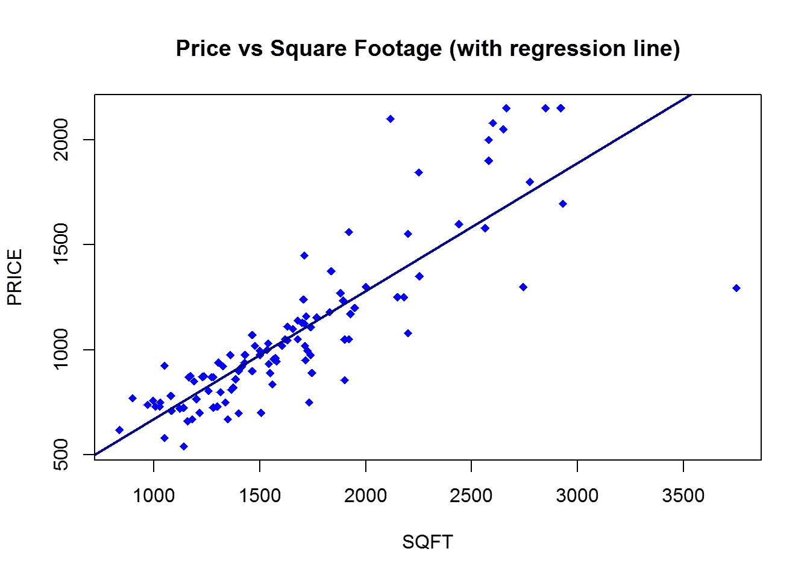
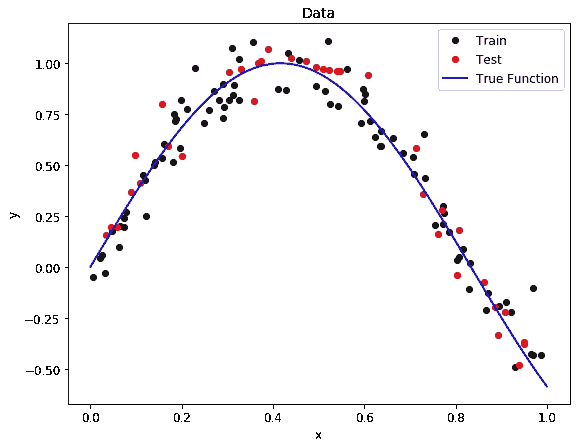
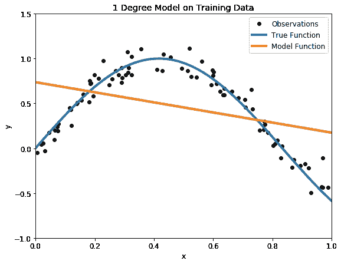
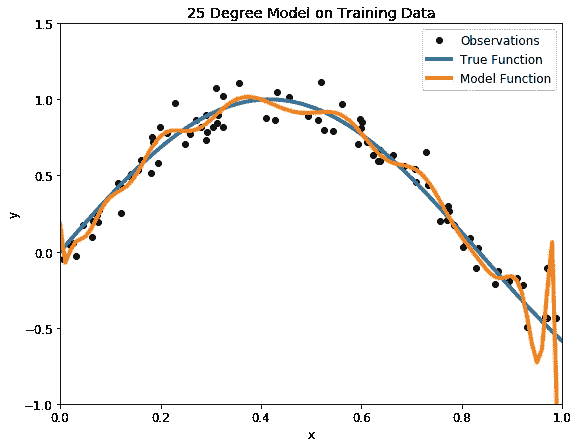
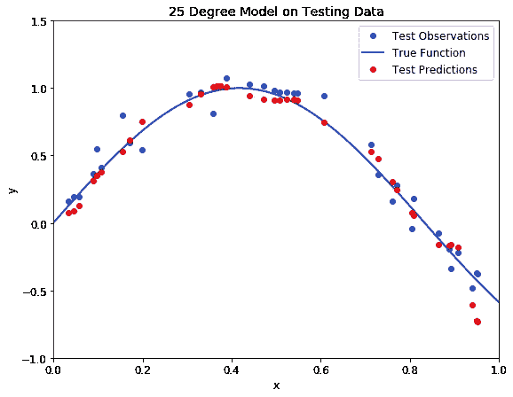
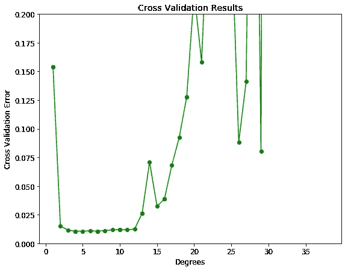
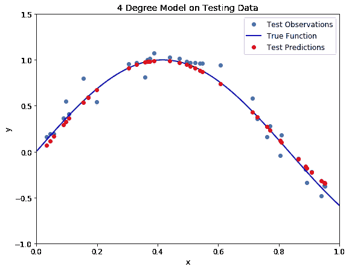
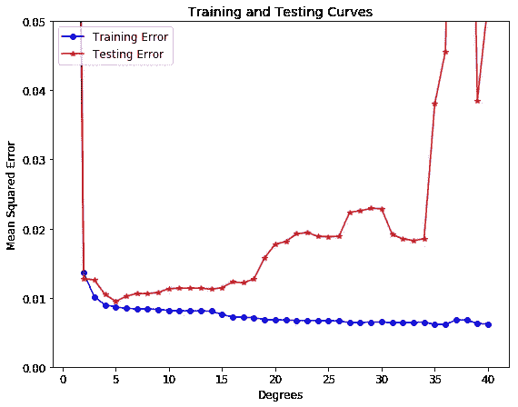

# 过度拟合与欠拟合:一个完整的例子

> 原文：<https://towardsdatascience.com/overfitting-vs-underfitting-a-complete-example-d05dd7e19765?source=collection_archive---------1----------------------->

**探索和解决基础数据科学问题**

当你学习数据科学时，你会意识到没有真正复杂的想法，只是许多简单的积木组合在一起。神经网络可能看起来非常先进，但它实际上只是无数小想法的组合。当您想要开发一个模型时，不要试图一次学习所有的东西，一次完成一个模块会更有效率，也更少令人沮丧。这可以确保你对基本原理有一个坚实的概念，避免许多会阻碍他人的常见错误。此外，每一部分都开辟了新的概念，让你不断积累知识，直到你可以创建一个有用的机器学习系统，同样重要的是，理解它是如何工作的。

Out of simple ideas come powerful systems ([Source](https://medium.com/@ageitgey/machine-learning-is-fun-part-3-deep-learning-and-convolutional-neural-networks-f40359318721))

这篇文章通过一个完整的例子展示了一个基本的数据科学构建模块:欠拟合与过拟合问题。我们将探讨这个问题，然后实现一个叫做交叉验证的解决方案，这是模型开发的另一个重要原则。如果你正在寻找一个关于这个话题的概念框架，[请看我之前的帖子](/overfitting-vs-underfitting-a-conceptual-explanation-d94ee20ca7f9)。这篇文章中生成的所有图表和结果都是用 Python 代码写的，这些代码在 [GitHub](https://github.com/WillKoehrsen/Data-Analysis) 上。我鼓励任何人去检查代码，并做出自己的改变！

# 模型基础

为了讨论欠拟合和过拟合，我们需要从基础开始:什么是模型？模型只是一个将输入映射到输出的系统。例如，如果我们想预测房价，我们可以制作一个模型，它接收房子的平方英尺并输出价格。一个模型代表了一个问题的理论:在平方英尺和价格之间有一些联系，我们制作一个模型来了解这种关系。模型是有用的，因为我们可以使用它们来预测给定输入的新数据点的输出值。

模型从训练数据集中学习输入(称为要素)和输出(称为标注)之间的关系。在训练期间，模型被给予特征和标签，并学习如何将前者映射到后者。训练好的模型在测试集上进行评估，我们只给它特征，它进行预测。我们将预测与测试集的已知标签进行比较，以计算准确性。模型可以采取多种形式，从简单的线性回归到深度神经网络，但所有监督模型都基于从训练数据中学习输入和输出之间关系的基本思想。

# 培训和测试数据

要做一个模型，我们首先需要有底层关系的数据。对于本例，我们将使用 x 值(要素)和 y 值(标注)创建自己的简单数据集。我们数据生成的一个重要部分是给标签添加随机噪声。在任何真实世界的过程中，无论是自然的还是人为的，数据都不完全符合趋势。在我们无法测量的关系中，总是存在噪音或其他变量。在房价的例子中，面积和价格之间的趋势是线性的，但是由于影响房价的其他因素，价格并不完全在一条线上。

Example of a real-world relationship ([Source](https://rstudio-pubs-static.s3.amazonaws.com/64900_3f884598a6e84ea3aacef364cbfc54ba.html))

我们的数据同样具有趋势(我们称之为真实函数)和随机噪声，以使其更加真实。创建数据后，我们将其分成随机的训练集和测试集。该模型将尝试学习训练数据上的关系，并根据测试数据进行评估。在这种情况下，70%的数据用于训练，30%用于测试。下图显示了我们将探究的数据。

Data and True Generating Funtion

我们可以看到，由于我们添加了随机噪声，我们的数据在真实函数(部分正弦波)周围分布有一些变化([详见代码](https://github.com/WillKoehrsen/Data-Analysis/blob/master/over_vs_under/Over%20vs%20Under%20Fitting%20Example.ipynb))。在训练过程中，我们希望我们的模型学习真正的功能，而不会被噪音“分散注意力”。

## **模型建筑**

选择一个模型可能看起来令人生畏，但是一个好的规则是从简单开始，然后逐步建立。最简单的模型是线性回归，其中输出是输入的线性加权组合。在我们的模型中，我们将使用线性回归的[扩展，称为多项式回归](https://onlinecourses.science.psu.edu/stat501/node/324)来了解 x 和 y 之间的关系。多项式回归，其中输入被提升到不同的幂，仍然被认为是“线性”回归的一种形式，即使图形没有形成直线(这一开始也让我很困惑！)多项式的一般方程如下。

这里 y 代表标签，x 代表特征。β项是将在训练期间学习的模型参数，ε是任何模型中存在的误差。一旦模型学习了β值，我们可以插入 x 的任何值，并获得 y 的相应预测。多项式由其阶定义，它是方程中 x 的最高幂。直线是一次多项式，而抛物线是二次多项式。

Polynomials of Varying Degree ([Source](http://brandon.ai/2017/01/27/multivariate-polynomial-regression.html))

# 过度拟合与欠拟合

[过拟合 vs 欠拟合](https://docs.aws.amazon.com/machine-learning/latest/dg/model-fit-underfitting-vs-overfitting.html)的问题终于在我们谈到多项式次数的时候出现了。程度代表模型中的灵活性，较高的能力允许模型自由地触及尽可能多的数据点。拟合不足的模型灵活性较低，并且无法解释数据。理解这个问题的最好方法是看一看展示这两种情况的模型。

首先是一个 1 次多项式拟合的欠拟合模型。在左图中，橙色的模型函数显示在真实函数和训练观测值的顶部。在右侧，显示了测试数据的模型预测与真实功能和测试数据点的比较。

Underfit 1 degree polynomial model on training (left) and testing (right) datasets

我们的模型直接通过训练集，不考虑数据！这是因为欠拟合模型具有低方差和高偏差。方差是指模型对训练数据的依赖程度。对于 1 次多项式的情况，该模型很少依赖于训练数据，因为它几乎不关注点！相反，该模型具有很高的偏差，这意味着它对数据做出了强有力的假设。对于这个例子，假设数据是线性的，这显然是错误的。当模型进行测试预测时，偏差会导致它做出不准确的估计。由于这种偏差，模型无法学习 x 和 y 之间的关系，这是一个明显的拟合不足的例子。

我们看到低学位导致不适合。一个自然的结论是学习训练数据，我们应该只是增加模型的程度来捕捉数据中的每一个变化。然而这不是最好的决定！

Overfit 25 degree polynomial model on training (left) and testing (right) datasets

由于具有如此高的灵活性，该模型尽最大努力考虑每一个训练点。这似乎是个好主意——难道我们不想从数据中学习吗？此外，该模型在训练数据上具有很高的分数，因为它接近所有的点。虽然如果训练观察完美地代表了真实函数，这是可以接受的，但是因为数据中存在噪声，所以我们的模型最终符合噪声。这是一个方差很大的模型，因为它会根据训练数据发生显著变化。测试集上的预测优于 1 度模型，但是 25 度模型仍然不学习关系，因为它本质上记忆训练数据和噪声。

我们的问题是，我们想要一个不是“记忆”训练数据，而是学习实际关系的模型！怎样才能找到一个多项式次数合适的平衡模型？如果我们选择训练集上得分最高的模型，我们将只选择过拟合模型，但这不能很好地推广到测试数据。幸运的是，有一种成熟的数据科学技术来开发最佳模型:验证。

# 确认

我们需要创建一个具有最佳设置(程度)的模型，但我们不想一直经历训练和测试。在我们的例子中，测试性能差并没有什么后果，但是在一个实际的应用程序中，我们可能正在执行一个关键的任务，比如诊断癌症，部署一个有缺陷的模型会有严重的负面影响。我们需要某种预测试来用于模型优化和评估。这种预先测试被称为验证集。

一个基本的方法是除了训练集和测试集之外还使用一个验证集。但是这也带来了一些问题:我们可能会过度适应验证集，并且我们会有更少的训练数据。验证概念的一个更聪明的实现是 k 重交叉验证。

这个想法很简单:我们不使用单独的验证集，而是将训练集分成许多子集，称为折叠。我们以五折为例。我们执行一系列的训练和评估循环，每次我们在 4 个折叠上训练，在第 5 个折叠上测试，称为坚持组。我们重复这个循环 5 次，每次使用不同的折叠进行评估。最后，我们对每个折叠的分数进行平均，以确定给定模型的整体性能。这允许我们在部署之前优化模型，而不必使用额外的数据。

Five-Fold Cross-Validation ([Source](https://stackoverflow.com/questions/31947183/how-to-implement-walk-forward-testing-in-sklearn))

对于我们的问题，我们可以通过创建一系列不同程度的模型，使用交叉验证来选择最佳模型，并使用 5 重交叉验证来评估每个模型。具有最低交叉验证分数的模型将在测试数据上表现最佳，并且将在欠拟合和过拟合之间实现平衡。我选择使用从 1 到 40 度的模型，以覆盖广泛的范围。为了比较模型，我们计算均方误差，即预测值和实际值的平方之间的平均距离。下表显示了按最低误差排序的交叉验证结果，该图显示了 y 轴上有误差的所有结果。

Cross Validation Results

欠拟合和过拟合模型的交叉验证误差超出了图表范围！4 度的模型似乎是最佳的。为了测试结果，我们可以制作一个 4 度模型，并查看训练和测试预测。

Balanced Four degree polynomial model on training (left) and testing (right) datasets

没有比符合数据的模型更美的了！此外，我们知道我们的模型不仅密切跟踪训练数据，它实际上已经了解了 x 和 y 之间的关系。

为了验证我们拥有最佳模型，我们还可以绘制出所谓的训练和测试曲线。这些在 x 轴上显示了我们调整的模型设置，在 y 轴上显示了训练和测试误差。欠拟合的模型将具有高训练和高测试误差，而过拟合的模型将具有极低的训练误差但高测试误差。

Training and Testing Curves

这个图表很好地总结了过度拟合和欠拟合的问题。随着模型灵活性的增加(通过增加多项式次数)，由于灵活性的增加，*训练*误差不断减小。然而，*测试*设置的误差只会随着我们将灵活性增加到一定程度而降低。在这种情况下，这发生在 5 度，当灵活性增加超过该点时，训练误差增加，因为模型已经记忆了训练数据和噪声。交叉验证在这个测试数据上产生了第二好的模型，但是从长远来看，我们期望我们的交叉验证模型表现最好。确切的度量标准取决于测试集，但平均来说，交叉验证的最佳模型将优于所有其他模型。

# 结论

过度拟合和欠拟合是一个基本问题，即使是经验丰富的数据分析师也会犯错误。在我的实验室里，我见过许多研究生用极低的误差拟合他们的数据，然后急切地用结果写一篇论文。他们的模型看起来很棒，但问题是他们甚至从未使用过测试集，更不用说验证集了！该模型只不过是训练数据的过度拟合表示，当其他人试图将他们的模型应用于新数据时，学生很快就会学到这一课。

幸运的是，这是一个我们可以很容易避免的错误，因为我们已经看到了使用交叉验证进行模型评估和优化的重要性。一旦我们理解了数据科学中的基本问题以及如何解决它们，我们就可以自信地建立更复杂的模型，并帮助他人避免错误。这篇文章涵盖了很多主题，但希望你现在对建模的基础、过度拟合与欠拟合、偏差与方差以及交叉验证的模型优化有所了解。数据科学就是要乐于学习，并不断向你的技能组合中添加更多工具。这个领域令人兴奋，因为它潜在的有益影响和不断学习新技术的机会。

我欢迎反馈和建设性的批评。可以在推特上找到我，电话是 [@koehrsen_will](https://twitter.com/koehrsen_will) 。我要感谢 Scikit-Learn 的贡献者，感谢他们在这个主题上的[优秀范例](http://scikit-learn.org/stable/auto_examples/model_selection/plot_underfitting_overfitting.html)。